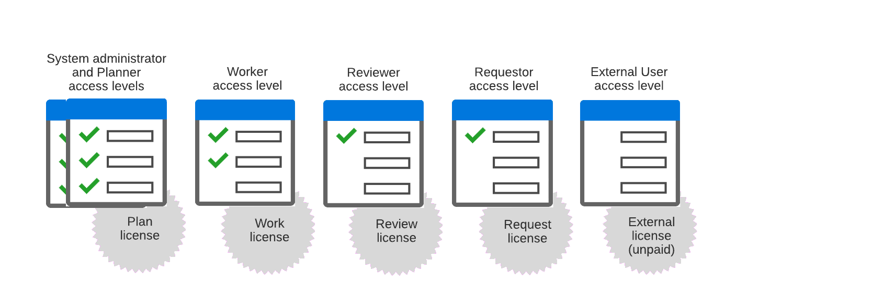

# 访问级别概述

<!-- Audited: 12/2023 -->

作为Adobe Workfront管理员，您可以为用户分配访问级别，以实现以下两种目的：

* 每个用户都必须具有访问级别，才能在Workfront中登录和工作。
* 访问级别控制用户可以查看特定Workfront对象和区域并执行哪些操作。

六个内置访问级别中的每一个都附加到五个Workfront许可证之一：计划、工作、审查、请求和外部。

外部是一个无酬许可证，主要用于与不使用Workfront的协作者共享文档。

有关与访问级别相关的主题的信息，请参阅以下文章：

<table style="table-layout:auto"> 
 <col> 
 <col> 
 <thead> 
  <tr> 
   <th>主题</th> 
   <th>文章</th> 
  </tr> 
 </thead> 
 <tbody> 
  <tr> 
   <td>
<strong>许可证</strong>
</td> 
   <td> 
附加到访问级别的许可证决定了如何配置访问级别。
 
有关更多信息，请参阅 <a href="../../../administration-and-setup/add-users/access-levels-and-object-permissions/wf-licenses.md" class="MCXref xref">许可证概述</a>.
 
<strong>提示</strong>：通过查看用户列表或报告，您可以查看分配给每个用户的访问级别和许可证。 有关说明，请参阅 <a href="../../../administration-and-setup/add-users/access-levels-and-object-permissions/list-access-levels-and-licenses-for-your-users.md" class="MCXref xref">列出用户的访问级别和许可证</a>.
 </td> 
  </tr> 
  <tr> 
   <td><strong>内置访问级别</strong></td> 
   <td> 
有关上图中显示的6个内置访问级别的更多信息，请参阅 <a href="../../../administration-and-setup/add-users/access-levels-and-object-permissions/default-access-levels-in-workfront.md" class="MCXref xref">内置访问级别</a>.
 </td> 
  </tr> 
  <tr> 
   <td><strong>分配访问级别</strong></td> 
   <td> 
有关如何将访问级别分配给用户的说明，请参阅 <a href="../../../administration-and-setup/add-users/create-and-manage-users/edit-a-users-profile.md" class="MCXref xref">编辑用户配置文件</a>.
 </td> 
  </tr> 
  <tr> 
   <td>访问级别标准、轻度、参与者</td> 
   <td> 
如果您在环境中看到这些访问级别，而不是“计划”、“工作”、“审阅”或“请求”，则您的组织将使用新的访问级别模型。 有关新模型的信息，请参见 <a href="../../../administration-and-setup/add-users/how-access-levels-work/access-level-overview.md" class="MCXref xref">新访问级别概述</a>.
 </td> 
  </tr> 
  <!--
  <tr> 
   <td>Access levels and proofing</td> 
   <td> 
Your users' access levels can affect proofing for each permission profile. For more information, see the section in the article .
 </td> 
  </tr> 
  -->
 </tbody> 
</table>
