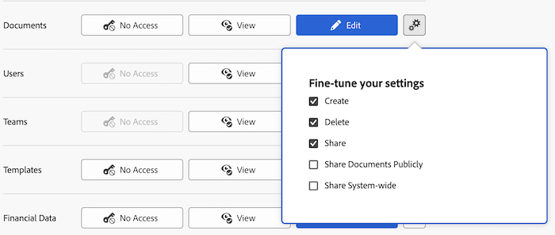

# 授予对文档的访问权限

作为Adobe Workfront管理员，您可以使用访问级别来定义用户对文档的访问权限，如[访问级别概述](../../../administration-and-setup/add-users/access-levels-and-object-permissions/access-levels-overview.md)中所述。

此访问权限也适用于文档文件夹。

有关使用自定义访问级别管理用户对Workfront中其他对象类型的访问的信息，请参阅[创建或修改自定义访问级别](../../../administration-and-setup/add-users/configure-and-grant-access/create-modify-access-levels.md)。

## 访问要求

+++ 展开以查看本文中各项功能的访问要求。

您必须具有以下权限才能执行本文中的步骤：

<table style="table-layout:auto"> 
 <col> 
 <col> 
 <tbody> 
  <tr> 
   <td role="rowheader">Adobe Workfront计划</td> 
   <td>任何</td> 
  </tr> 
  <tr> 
   <td role="rowheader">Adobe Workfront许可证</td> 
   <td>计划</td> 
  </tr> 
  <tr> 
   <td role="rowheader">访问级别配置</td> 
   <td> 
您必须是Workfront管理员。&gt;.
 
<b>注意</b>：如果您仍然没有访问权限，请咨询Workfront管理员是否对您的访问级别设置了其他限制。 有关Workfront管理员如何修改您的访问级别的信息，请参阅<a href="../../../administration-and-setup/add-users/configure-and-grant-access/create-modify-access-levels.md" class="MCXref xref" data-mc-variable-override="">创建或修改自定义访问级别</a>。
 </td> 
  </tr> 
 </tbody> 
</table>

+++

## 使用自定义访问级别配置用户对文档的访问权限

1. 开始创建或编辑访问级别，如[创建或修改自定义访问级别](../../../administration-and-setup/add-users/configure-and-grant-access/create-modify-access-levels.md)中所述。
1. 单击文档右侧&#x200B;**查看**&#x200B;或&#x200B;**编辑**&#x200B;按钮上的齿轮图标，然后在&#x200B;**微调设置**&#x200B;下选择要授予的功能。

   

   您可以允许用户对其有权访问的项目、任务和问题执行以下操作：

   <table style="table-layout:auto"> 
    <col> 
    <col> 
    <tbody> 
     <tr> 
      <td role="rowheader">创建</td> 
      <td>上载文档。</td> 
     </tr> 
     <tr> 
      <td role="rowheader">删除</td> 
      <td> 
移除已上传的文档。
 
启用此选项后，<b>创建</b>选项会自动启用。
 </td> 
     </tr> 
     <tr> 
      <td role="rowheader">共享</td> 
      <td>与特定用户、工作角色和团队共享文档。</td> 
     </tr> 
     <tr> 
      <td role="rowheader">公开共享文档</td> 
      <td>与外部用户共享文档(没有Workfront许可证)。</td> 
     </tr> 
     <tr> 
      <td role="rowheader">在系统范围内共享</td> 
      <td> 
使文档对Workfront实例中的每个人可用。
 
系统中的任何人都可以在以下情况下查看通过这种方式共享的文档：
 
       <ul> 
        <li> 
您向他们发送一个指向文档页面上传位置的链接。
 </li> 
        <li> 
他们在Workfront中搜索它
 </li> 
       </ul> 
启用此选项后，<b>共享</b>选项会自动启用。
 </td> 
     </tr> 
    </tbody> 
   </table>

   >[!NOTE]
   >
   >在为特定类型的对象配置访问级别设置时，该配置不会影响用户对较低排名的对象的访问。 例如，您可以限制用户删除其访问级别的项目，但这不会限制他们删除级别低于项目的文档。有关对象层次结构的详细信息，请参阅[了解Adobe Workfront中的对象](../../../workfront-basics/navigate-workfront/workfront-navigation/understand-objects.md)一文中的[相互依赖性和对象层次结构](../../../workfront-basics/navigate-workfront/workfront-navigation/understand-objects.md#understanding-interdependency-and-hierarchy-of-objects)部分。

1. （可选）要限制从更高层对象继承的文档权限，请单击&#x200B;**设置其他限制**，然后选择&#x200B;**从不从项目、任务、问题等继承文档访问权限**。
1. （可选）要为您正在处理的访问级别中的其他对象和区域配置访问设置，请继续执行[配置对Adobe Workfront的访问权限](../../../administration-and-setup/add-users/configure-and-grant-access/configure-access.md)中列出的文章之一，如[授予对任务的访问权限](../../../administration-and-setup/add-users/configure-and-grant-access/grant-access-tasks.md)和[授予对财务数据的访问权限](../../../administration-and-setup/add-users/configure-and-grant-access/grant-access-financial.md)。
1. 完成后，单击&#x200B;**保存**。

   创建访问级别后，可将其分配给用户。 有关详细信息，请参阅[编辑用户配置文件](../../../administration-and-setup/add-users/create-and-manage-users/edit-a-users-profile.md)。

## 按许可证类型访问文档

有关每个访问级别中的用户可以如何处理文档的更多信息，请参阅[可用于每个对象类型](../../../administration-and-setup/add-users/access-levels-and-object-permissions/functionality-available-for-each-object-type.md)的功能一文中的[文档](../../../administration-and-setup/add-users/access-levels-and-object-permissions/functionality-available-for-each-object-type.md#document)部分。

## 访问共享文档

将文档上传到Workfront后，可以通过授予其他用户权限来与其共享，如[共享文档](../../../workfront-basics/grant-and-request-access-to-objects/document-permissions.md)中所述。

<!--
If you make changes here, make them also in the "Grant access to" articles where this snippet had to be converted to text:
* reports, dashboards, and calendars
* financial data<
* issue
-->

当您与其他用户共享任何对象时，收件人在该对象上的权限由以下两项共同决定：

* 您授予收件人对象的权限
* 收件人针对对象类型的访问级别设置
