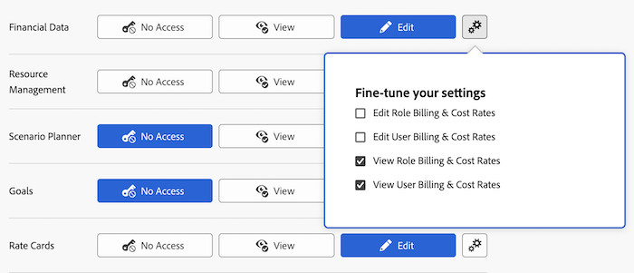

# 授予对财务数据的访问权限

作为Adobe Workfront管理员，您可以通过用户的访问级别定义用户对以下内容的访问权限，如 [访问级别概述](../../../administration-and-setup/add-users/access-levels-and-object-permissions/access-levels-overview.md):

* 关于Workfront项目的财务信息
* 资源计划工具中的资源预算信息

## 访问要求

您必须具有以下访问权限才能执行本文中的步骤：

<table style="table-layout:auto"> 
 <col> 
 <col> 
 <tbody> 
  <tr> 
   <td role="rowheader">Adobe Workfront计划</td> 
   <td>任意</td> 
  </tr> 
  <tr> 
   <td role="rowheader">Adobe Workfront许可证</td> 
   <td>计划</td> 
  </tr> 
  <tr> 
   <td role="rowheader">访问级别配置</td> 
   <td> 
您必须是Workfront管理员。
 
<b>注意</b>:如果您仍然没有访问权限，请咨询Workfront管理员，他们是否在您的访问级别设置了其他限制。 有关Workfront管理员如何修改访问级别的信息，请参阅 <a href="../../../administration-and-setup/add-users/configure-and-grant-access/create-modify-access-levels.md" class="MCXref xref" data-mc-variable-override="">创建或修改自定义访问级别</a>.
 </td> 
  </tr> 
 </tbody> 
</table>

## 授予访问财务数据的注意事项

在授予用户访问Workfront中的财务数据的权限时，请考虑以下事项：

* 访问级别不允许访问金融数据的用户不会为项目带来风险。 有关更多信息，请参阅 [在项目中创建和编辑风险](../../../manage-work/projects/define-a-business-case/create-edit-risks-on-projects.md).
* 您还可以使用访问级别来确定用户在预算或查看资源分配时可以采用的资源管理活动。 有关信息，请参阅 [授予对资源管理的访问权限](../../../administration-and-setup/add-users/configure-and-grant-access/grant-access-resource-management.md).

## 使用自定义访问级别配置用户对金融数据的访问权限

1. 开始创建或编辑访问级别，如 [创建或修改自定义访问级别](../../../administration-and-setup/add-users/configure-and-grant-access/create-modify-access-levels.md).
1. 单击齿轮图标  在 **查看** 或 **编辑** 按钮，然后选择要在 **优化设置**.

   

1. （可选）在 **允许对** 区域，选择以下选项：

   <table style="table-layout:auto"> 
    <col> 
    <col> 
    <tbody> 
     <tr> 
      <td role="rowheader">汇率</td> 
      <td> 
在Workfront中添加新货币。
 
如果没有此访问权限，用户只能将现有货币添加到其创建的项目。
 </td> 
     </tr> 
     <tr> 
      <td role="rowheader">费用</td> 
      <td> 
查看Workfront中对象的所有费用。
 
这不允许用户创建新的费用类型。
 
如果没有此访问权限，用户只能查看以下内容：
 
       <ul> 
        <li>项目、任务或其管理问题的费用</li> 
        <li>自费</li> 
        <li>下属的费用</li> 
       </ul> </td> 
     </tr> 
    </tbody> 
   </table>

1. （可选）要在您正在处理的访问级别中为其他对象和区域配置访问设置，请继续阅读 [配置对Adobe Workfront的访问权限](../../../administration-and-setup/add-users/configure-and-grant-access/configure-access.md) 例如 [授予对任务的访问权限](../../../administration-and-setup/add-users/configure-and-grant-access/grant-access-tasks.md).
1. 完成后，单击 **保存**.

   创建访问级别后，您可以将其分配给用户。 有关更多信息，请参阅 [编辑用户的配置文件](../../../administration-and-setup/add-users/create-and-manage-users/edit-a-users-profile.md).

## 访问共享的财务信息

您可以通过向其他用户授予项目、任务或问题的权限，来与其共享有关项目、任务或问题的财务信息，如 [共享对象的财务权限](../../../workfront-basics/grant-and-request-access-to-objects/share-financial-permissions-object.md).

<!--
If you make changes here, make them also in the "Grant access to" articles where this snippet had to be converted to text:
* reports, dashboards, and calendars
* financial data
* issue
-->

当您与其他用户共享任何对象时，收件人对该对象的权限取决于两件事的组合：

* 您为收件人授予的对象权限
* 对象类型的收件人访问级别设置

## 按许可证类型访问财务信息

有关每个访问级别中的用户可以使用财务信息执行的操作的信息，请参阅部分 [财务数据](../../../administration-and-setup/add-users/access-levels-and-object-permissions/functionality-available-for-each-object-type.md#financia) 在文章中 [可用于每种对象类型的功能](../../../administration-and-setup/add-users/access-levels-and-object-permissions/functionality-available-for-each-object-type.md).

## 通过设置

以下信息可帮助您了解如何使用访问级别设置来控制用户对财务数据的访问。

### 无权访问

无权访问金融数据的用户无权访问以下内容：

* 项目和任务对象下的财务科
* 商业案例
* 计费费率和计费记录
* 根据用户首选项，每小时成本和每小时计费

   您可以使用齿轮图标配置此设置  中的“查看”按钮。

* 职务角色的每小时成本和每小时计费

   您可以使用齿轮图标配置此设置  中的“查看”按钮。

### 查看访问

具有金融数据查看权限的用户可以查看（不能编辑）以下内容：

* 项目和任务对象下的财务科
* 商业案例
* 计费费率和计费记录
* 根据用户首选项，每小时成本和每小时计费

   您可以使用齿轮图标配置此设置  中的“查看”按钮。

* 职务角色的每小时成本和每小时计费

   您可以使用齿轮图标配置此设置  中的“查看”按钮。

### 编辑访问权限

具有金融数据编辑访问权限的用户可以查看和编辑以下内容：

* 项目和任务对象下的财务科
* 商业案例
* 计费费率和计费记录
* 根据用户首选项，每小时成本和每小时计费

   您可以使用齿轮图标配置此设置  中的“编辑”按钮。

* 职务角色的每小时成本和每小时计费

   您可以使用齿轮图标配置此设置  中的“编辑”按钮。
