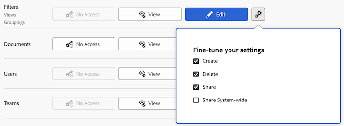

# 授予对筛选器、视图和分组的访问权限

作为Adobe Workfront管理员，您可以使用访问级别来定义用户对列表和报告筛选器、视图和分组控件的访问权限，如[访问级别概述](../../../administration-and-setup/add-users/access-levels-and-object-permissions/access-levels-overview.md)中所述。

有关筛选器、视图和分组控件的信息，请参阅[报告元素：筛选器、视图和分组](../../../reports-and-dashboards/reports/reporting-elements/reporting-elements-filters-views-groupings.md)。

## 访问要求

+++ 展开以查看本文中各项功能的访问要求。

<table style="table-layout:auto"> 
 <col> 
 <col> 
 <tbody> 
  <tr> 
   <td role="rowheader">Adobe Workfront包</td> 
   <td>任何</td> 
  </tr> 
  <tr> 
   <td role="rowheader">Adobe Workfront许可证</td> 
   <td> 
标准

   
规划
</td> 
  </tr> 
  <tr> 
   <td role="rowheader">访问级别配置</td> 
   <td> 
您必须是Workfront管理员。
 </td> 
  </tr> 
 </tbody> 
</table>

有关此表中信息的更多详细信息，请参阅Workfront文档中的[访问要求](/help/quicksilver/administration-and-setup/add-users/access-levels-and-object-permissions/access-level-requirements-in-documentation.md)。

+++

## 使用自定义访问级别配置用户对筛选器、视图和分组的访问权限

1. 开始创建或编辑访问级别，如[创建或修改自定义访问级别](../../../administration-and-setup/add-users/configure-and-grant-access/create-modify-access-levels.md)中所述。
1. 单击筛选器右侧查看&#x200B;**或**&#x200B;编辑&#x200B;**按钮上的齿轮图标**，然后在&#x200B;**微调设置**&#x200B;下选择要授予的功能。

   

   默认情况下，拥有“计划”、“工作”、“审阅者”或“请求”许可证的用户具有完整的“查看”和“编辑”功能。 拥有外部用户许可证的用户无法访问筛选器、视图和分组。

   <!--If this changes, undraft section with table below
   -->

1. （可选）要为您正在处理的访问级别中的其他对象和区域配置访问设置，请继续执行[配置对Adobe Workfront的访问权限](../../../administration-and-setup/add-users/configure-and-grant-access/configure-access.md)中列出的文章之一，如[授予对任务的访问权限](../../../administration-and-setup/add-users/configure-and-grant-access/grant-access-tasks.md)和[授予对财务数据的访问权限](../../../administration-and-setup/add-users/configure-and-grant-access/grant-access-financial.md)。
1. 完成后，单击&#x200B;**保存**。

   创建访问级别后，可将其分配给用户。 有关详细信息，请参阅[编辑用户配置文件](../../../administration-and-setup/add-users/create-and-manage-users/edit-a-users-profile.md)。

<!--## Access to filters, views, and groupings by license type

Drafting out this section for now because the table is redundant since all four license types can do everything.-->

此表列出了Workfront管理员可以允许每种许可证类型的用户使用过滤器、视图和分组执行的操作。 有关Workfront许可证类型的信息，请参阅[Adobe Workfront许可证概述](../../../administration-and-setup/add-users/access-levels-and-object-permissions/wf-licenses.md)。

<table style="table-layout:auto">
<col>
<col>
<col>
<col>
<col>
<thead>
<tr>
<th> 操作 </th>
<th> 规划者 </th>
<th> 员工 </th>
<th> 审阅者 </th>
<th> 请求者 </th>
</tr>
</thead>
<tbody>
<tr>
<td>编辑筛选器、视图和分组</td>
<td>✓</td>
<td>✓</td>
<td>✓</td>
<td>✓</td>
</tr>
<tr>
<td>创建过滤器、视图和分组</td>
<td>✓</td>
<td>✓</td>
<td>✓</td>
<td>✓</td>
</tr>
<tr>
<td>查看筛选器、视图和分组</td>
<td>✓</td>
<td>✓</td>
<td>✓</td>
<td>✓</td>
</tr>
<tr>
<td>删除筛选器、视图和分组</td>
<td>✓</td>
<td>✓</td>
<td>✓</td>
<td>✓</td>
</tr>
<tr>
<td>共享筛选器、视图和分组</td>
<td>✓</td>
<td>✓</td>
<td>✓</td>
<td>✓</td>
</tr>
<tr>
<td>在系统范围内共享筛选器、视图和分组</td>
<td>✓</td>
<td>✓</td>
<td>✓</td>
<td>✓</td>
</tr>
</tbody>
</table>
