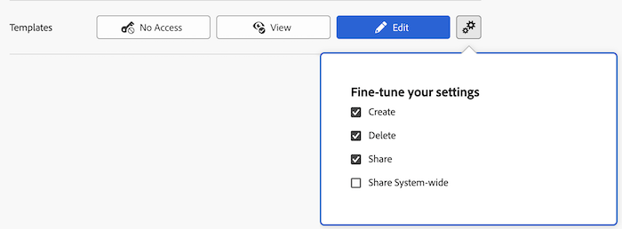

# 授予对模板的访问权限

作为Adobe Workfront管理员，您可以使用访问级别定义用户对模板的访问权限，如 [访问级别概述](../../../administration-and-setup/add-users/access-levels-and-object-permissions/access-levels-overview.md).

只有具有计划许可证的用户才能完全访问模板。

有关使用自定义访问级别管理用户对Workfront中其他对象类型的访问权限的信息，请参阅 [创建或修改自定义访问级别](../../../administration-and-setup/add-users/configure-and-grant-access/create-modify-access-levels.md).

## 访问要求

您必须具有以下访问权限才能执行本文中的步骤：

<table style="table-layout:auto"> 
 <col> 
 <col> 
 <tbody> 
  <tr> 
   <td role="rowheader">Adobe Workfront计划</td> 
   <td>任意</td> 
  </tr> 
  <tr> 
   <td role="rowheader">Adobe Workfront许可证</td> 
   <td>计划</td> 
  </tr> 
  <tr> 
   <td role="rowheader">访问级别配置</td> 
   <td> 
您必须是Workfront管理员。
 
<b>注意</b>:如果您仍然没有访问权限，请咨询Workfront管理员，他们是否在您的访问级别设置了其他限制。 有关Workfront管理员如何修改访问级别的信息，请参阅 <a href="../../../administration-and-setup/add-users/configure-and-grant-access/create-modify-access-levels.md" class="MCXref xref" data-mc-variable-override="">创建或修改自定义访问级别</a>.
 </td> 
  </tr> 
 </tbody> 
</table>

## 使用自定义访问级别配置用户对模板的访问权限

1. 开始创建或编辑访问级别，如 [创建或修改自定义访问级别](../../../administration-and-setup/add-users/configure-and-grant-access/create-modify-access-levels.md).
1. 单击齿轮图标  在 **查看** 或 **编辑** 按钮，然后选择要在 **优化设置**.

   

1. （可选）要在您正在处理的访问级别中为其他对象和区域配置访问设置，请继续阅读 [配置对Adobe Workfront的访问权限](../../../administration-and-setup/add-users/configure-and-grant-access/configure-access.md)，例如 [授予对任务的访问权限](../../../administration-and-setup/add-users/configure-and-grant-access/grant-access-tasks.md) 和 [授予对财务数据的访问权限](../../../administration-and-setup/add-users/configure-and-grant-access/grant-access-financial.md).
1. 完成后，单击 **保存**.

   创建访问级别后，您可以将其分配给用户。 有关更多信息，请参阅 [编辑用户的配置文件](../../../administration-and-setup/add-users/create-and-manage-users/edit-a-users-profile.md).

## 按许可证类型访问模板

有关每个访问级别的用户可以使用模板执行的操作的信息，请参阅部分 [模板](../../../administration-and-setup/add-users/access-levels-and-object-permissions/functionality-available-for-each-object-type.md#template) 在文章中 [可用于每种对象类型的功能](../../../administration-and-setup/add-users/access-levels-and-object-permissions/functionality-available-for-each-object-type.md).

## 访问共享模板

作为问题的所有者或创建者，您可以通过授予其他用户对该问题的权限与其共享，如 [共享模板](../../../workfront-basics/grant-and-request-access-to-objects/share-a-template.md).

<!--
If you make changes here, make them also in the "Grant access to" articles where this snippet had to be converted to text:
* reports, dashboards, and calendars
* financial data
* issue
-->

当您与其他用户共享任何对象时，收件人对该对象的权限取决于两件事的组合：

* 您为收件人授予的对象权限
* 对象类型的收件人访问级别设置
