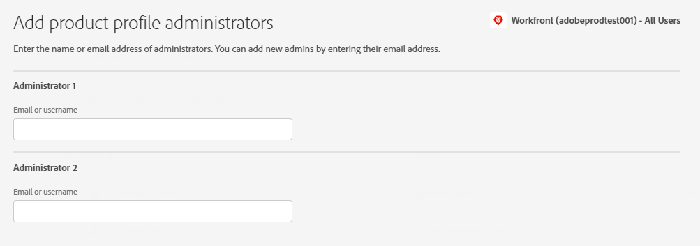

# 在Adobe Admin Console中管理用户

>[!IMPORTANT]
>
>仅当贵组织的Workfront实例已载入Adobe业务平台时，本文中的功能才可用。
>
>有关根据贵组织是否已载入Adobe业务平台而不同的程序列表，请参阅 [基于平台的管理差异(Adobe Workfront/Adobe业务平台)](../../../administration-and-setup/get-started-wf-administration/actions-in-admin-console.md).

作为Adobe管理员，您可以使用Adobe Admin Console创建Adobe Workfront用户和系统管理员。 控制台是管理整个组织中Adobe权限的中心位置。 有关更多信息，请参阅 [Admin Console概述](https://helpx.adobe.com/cn/enterprise/using/admin-console.html).

## 访问要求

您必须具有以下访问权限才能执行本文中的步骤：

<table style="table-layout:auto"> 
 <col> 
 </col> 
 <col> 
 </col> 
 <tbody> 
  <tr> 
   <td role="rowheader">Adobe Workfront计划</td> 
   <td>任意</td> 
  </tr> 
  <tr> 
   <td role="rowheader">Adobe管理员权限</td> 
   <td> 
您必须是贵组织Adobe产品的产品配置管理员
 </td> 
  </tr> 
 </tbody> 
</table>

## 先决条件

在使用WorkfrontAdmin Console之前，您应会收到一封电子邮件，邀请您加入控制台。

1. 如果您是Adobe的新用户，并且收到一封电子邮件告知您您现在拥有管理贵组织Adobe软件和服务的管理权限，请单击电子邮件中的按钮以创建Adobe帐户并打开Admin Console。

   或

   如果您已经拥有Adobe帐户，请转到 [Adobe Admin Console页面](https://adminconsole.adobe.com/).

## 访问您的Workfront生产实例的用户和管理区域 {#access-the-user-and-admin-area-for-your-production-instance-of-workfront}

1. 从 [Adobe Admin Console页面](https://adminconsole.adobe.com/)，选择 **产品** ，然后选择 **Workfront** 产品区块。

   

1. 在显示的列表中，选择顶部的链接。

   这是您的用户工作的生产实例。

   

   >[!TIP]
   >
   >您的预览实例（列表中的第二个链接）是一个测试环境，可复制您的实时生产环境。 有关更多信息，请参阅 [Adobe Workfront预览沙盒环境](../../../administration-and-setup/set-up-workfront/workfront-testing-environments/wf-preview-sandbox-environment.md).
   >
   >
   >您还可以在列表中看到指向沙盒环境的链接。 有关更多信息，请参阅 [Adobe Workfront预览沙盒环境](../../../administration-and-setup/set-up-workfront/workfront-testing-environments/wf-preview-sandbox-environment.md).

1. 在显示的列表中，使用 **产品配置文件** 选项卡，单击Workfront产品配置文件链接的名称。

   

   此列表包含已分配给您的Workfront生产实例的所有用户。

   >[!IMPORTANT]
   >
   >请勿对产品配置文件本身进行任何更改。

1. 继续阅读本文的以下章节之一：

   * [在Workfront中使用Adobe Admin Console创建用户](#create-users-in-workfront-with-the-adobe-admin-console)
   * [在Workfront中使用Adobe Admin Console创建系统管理员](#create-system-administrators-in-workfront-with-the-adobe-admin-console)

## 在Workfront中使用Adobe Admin Console创建用户 {#create-users-in-workfront-with-the-adobe-admin-console}

1. 转到Admin Console中的用户和管理区域，如 [访问您的Workfront生产实例的用户和管理区域](#access-the-user-and-admin-area-for-your-production-instance-of-workfront) 在本文中。
1. 使用 **用户** 选项卡，选择 **添加用户**.
1. 在 **将用户添加到此产品配置文件** 框中，输入要添加的用户的电子邮件地址或名称，然后选择 **保存**.

   在Workfront中创建具有请求者访问级别的用户。

   >[!IMPORTANT]
   >
   >请勿对产品配置文件本身进行任何更改。

1. 在Workfront中，更改用户的访问级别。

   有关Workfront管理员如何更改用户访问级别的说明，请参阅 [编辑用户的配置文件](../../../administration-and-setup/add-users/create-and-manage-users/edit-a-users-profile.md).

1. 重复步骤3和4以添加更多用户。

   >[!NOTE]
   >
   >对于新的Adobe用户，Admin Console会发送一封电子邮件，邀请他们完成注册流程。 所有用户必须完成注册过程才能访问任何Adobe系统。
   >
   >对于现有Adobe用户，用户可能会（也可能不会）收到有关Workfront可用的电子邮件。 这是由Adobe管理员控制的产品首选项。

## 在Workfront中使用Adobe Admin Console创建系统管理员 {#create-system-administrators-in-workfront-with-the-adobe-admin-console}

系统管理员访问权限级别仅在Adobe Admin Console上授予。 您无法在Workfront中授予或删除管理员访问权限。

必须先将用户添加到Workfront的生产实例中，然后才能将该用户设为Workfront系统管理员。 有关说明，请参阅 [在Workfront中使用Adobe Admin Console创建用户](#create-users-in-workfront-with-the-adobe-admin-console) 在本文中。

1. 转到Admin Console中的用户和管理区域，如 [访问您的Workfront生产实例的用户和管理区域](#access-the-user-and-admin-area-for-your-production-instance-of-workfront) 在本文中。
1. 选择 **管理员** 选项卡。
1. 选择 **添加管理员**.
1. 在 **添加产品配置文件管理员** 框中，输入要添加的管理员的电子邮件地址或名称，然后选择 **保存**.

   

   系统管理员在Workfront中创建。

   >[!IMPORTANT]
   >
   >请勿对产品配置文件本身进行任何更改。

## 有关Adobe Admin Console的其他详细信息：

* Workfront系统管理员可以在Workfront中停用Workfront用户，但不会停用Admin Console中的用户。

   <!--
  
For information about deactivating a user in Workfront, see 

  -->

* 用户 **主页组** 取决于创建用户。 当前无法从Admin Console中自定义该设置。
* 只能从Workfront中编辑Adobe Admin Console系统管理员访问级别。

   <!--
  DRAFTED IN FLARE:
  How is this done?
  
  -->

* 必须首先通过Admin Console来编辑用户（该用户是任何其他访问级别的系统管理员）。

   <!--
   This is not clear
  -->

* 要从Workfront中的用户删除系统管理员访问权限，您需要使用Adobe Admin Console以产品配置文件管理员身份删除该用户。 这会将用户的Workfront访问级别从系统管理员更改为请求者。

   >[!IMPORTANT]
   >
   >请勿对产品配置文件本身进行任何更改。

<!--

&nbsp;

&nbsp;

&nbsp;

You can create Adobe Workfront users and system administrators with the <a href="https://adminconsole.adobe.com/" alt="Admin Console link">Adobe Admin Console</a>. The console is a central location for managing the Adobe entitlements across your organization. For more information, see the <a href="https://helpx.adobe.com/enterprise/using/admin-console.html" alt="Admin Console Overview">Admin Console Overview</a>.

Before using the Admin Console for Workfront, you should receive a receive an email inviting you to the console. Click in the invitation to accept it and create an account. You can also use an existing account, if already available.

<h2>Create users</h2>

Create users in WF with the Adobe admin console

-->

<!--

May need to add something about oging throug WF -- check with Jonah

To create users in Workfront with the Admin Console:

<ol>
<li value="1"> 
From the <a href="https://adminconsole.adobe.com/">Admin Console page</a>, select the <b>Products</b> tab and then select the <b>Workfront</b> product tile.
 </li>
<li value="2"> 
Select the link to the Workfront instance you want to change.
 </li>
<li value="3"> 
Select the Product profile link. This shows a list of the currently-assigned users. If the list is very long, you can also search for users in the search field above the list.
 </li>
<li value="4"> 
Select the <b>Add User</b> button.
 </li>
<li value="5"> 
In the <b>Add users</b> box, enter the email address or name of the user you want to add. Select <b>Save</b>. The administrator is created in Workfront with <b>Requestor</b> access level.
 </li>
</ol>
<h2>Create system administrators</h2>

To create system administrators:

<ol>
<li value="1"> 
Make product profile assignments first. To be a Workfront System Administrator, the user must be assigned the Workfront product profile and be an admin for that product profile.
 </li>
<li value="2"> 
From the console, select the <b>Products</b> tab and then select the <b>Admins</b> tab. 
 </li>
<li value="3"> 
Select <b>Add Admin</b>.
 </li>
<li value="4"> 
In the <b>Add product profile administrators</b> box, enter the email address or name of the administrator you want to add. Select <b>Save</b>. The user is created in Workfront with <b>Requestor</b> access level.
 </li>
</ol>
<h2>Additional details for the Admin Console</h2>
<ul>
<li> 
System Administrator access level is granted only on the Admin Console. You cannot grant or remove admin access from within Workfront.
 </li>
</ul>
<ul>
<li> 
Creating and deleting users inside Workfront is only possible through the Admin Console.
 </li>
<li> 
Workfront System Administrators can deactivate Workfront users from within Workfront, but this does not deactivate the user in the Admin Console.
 </li>
<li> 
All new users are are assigned <b>Requestor</b> access level upon creation. Also, the user <b>Home Group</b> is determined based on the user who created them. This is currently not customizable from within the Admin Console.
 </li>
<li> 
The Workfront System Administrator access level can only be edited from within the Adobe Admin Console.
 </li>
<li> 
Editing a user who is a system admin to any other access level must be done through the Admin Console first.
 </li>
<li> 
To remove Workfront system admin access, remove users as Product Profile Administrators. This action changes the user access level in Workfront from a system admin to a <b>Requestor</b>.
 </li>
</ul>

-->
