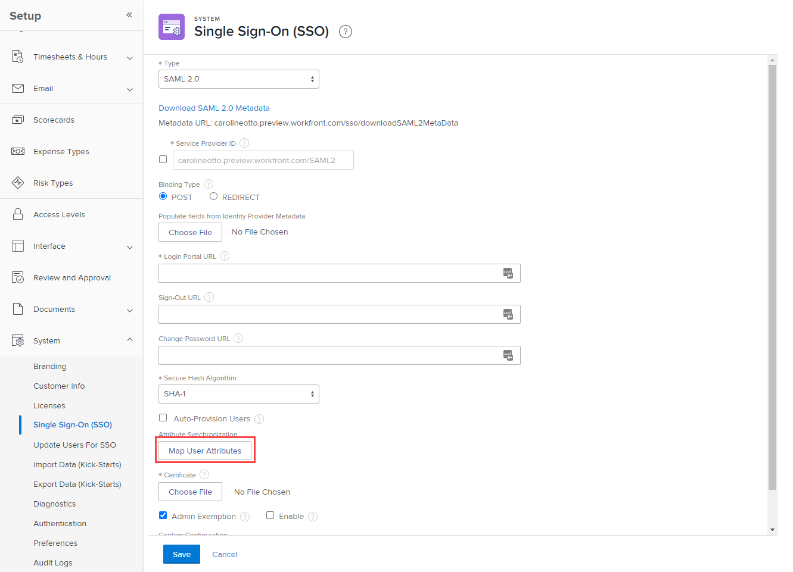

# 映射用户属性

<!--Audited 2/2024-->

使用单点登录(SSO)，您可以将身份提供程序的Active Directory中的属性传递给Adobe Workfront用户。

## 访问要求

+++ 展开以查看本文中各项功能的访问要求。

您必须具有以下权限才能执行本文中的步骤：

<table style="table-layout:auto"> 
 <col> 
 <col> 
 <tbody> 
  <tr> 
   <td role="rowheader">Adobe Workfront计划</td> 
   <td>任何</td> 
  </tr> 
  <tr> 
   <td role="rowheader">Adobe Workfront许可证</td> 
   <td>
新增：标准

或

当前：计划
</td> 
  </tr> 
  <tr> 
   <td role="rowheader">访问级别配置</td> 
   <td> 
您必须是Workfront管理员。
 </td> 
  </tr> 
 </tbody> 
</table>

有关此表中信息的更多详细信息，请参见 [Workfront文档中的访问要求](/help/quicksilver/administration-and-setup/add-users/access-levels-and-object-permissions/access-level-requirements-in-documentation.md).

+++

## 映射属性的提示

映射属性时，请牢记以下几点：

* 始终在预览Sandbox或客户刷新(CR)Sandbox中测试。
* 使用管理员帐户和非管理员帐户进行测试，以确认您正确映射了属性。
* 用户每次通过单点登录登录时都会应用映射的属性。

  示例：如果您在Workfront中映射“姓氏”并更新其名称，而不更新其身份提供程序中的值，则下次用户登录时，姓氏将被覆盖，以匹配身份提供程序中任何位置的值。

## 为您的组织映射用户属性

根据您的组织是否使用Adobe统一体验，映射属性的过程会有所不同。

要确定贵组织是否使用Adobe统一体验，请检查用于访问Workfront的URL。

| URL | Adobe体验 |
|---|---|
| （公司名称）.my.workfront.com | 经典体验 |
| experience.adobe.com | Adobe统一体验 |

* [在经典体验中映射用户属性](#map-user-attributes-in-the-classic-experience)
* [在Adobe统一体验中映射用户属性](#map-user-attributes-in-the-adobe-unified-experience)

### 在经典体验中映射用户属性

1. 单击 **主菜单** 图标  (在Adobe Workfront的右上角)，然后单击 **设置** .

1. 单击 **系统** > **单点登录(SSO)**.

1. 在 **类型** 下拉列表，单击 **SAML 2.0**.

1. 单击 **映射用户属性**.

   

1. 在显示的选项行中，映射Workfront用户所需的属性。

   您可以映射地址、经理、工作角色、主组等属性。

   属性映射采用1:1的比率。 例如，您不能设置用户所属的每个组；您只能为每个用户设置一个。

   >[!IMPORTANT]
   >
   >我们不建议在属性映射中映射访问级别。 如果这样做，则在设置默认值时要小心，以确保不会无意中移除管理员访问权限。

   下表说明了可用于映射属性的字段：

   <table style="table-layout:auto"> 
    <col data-mc-conditions=""> 
    <col data-mc-conditions=""> 
    <tbody> 
     <tr> 
      <td role="rowheader">Workfront 用户属性</td> 
      <td>选择要映射的属性的名称</td> 
     </tr> 
     <tr> 
      <td role="rowheader">目录属性</td> 
      <td>键入要使用的SSO属性标签。</td> 
     </tr> 
     <tr> 
      <td role="rowheader">默认值</td> 
      <td> 
选择Workfront用户属性后，如果在连接期间该值为空，则此字段将用系统中相应的默认值填充。 仅当计划应用属性映射规则时，才在此处键入值（请参阅步骤7）。 默认值作为这些规则的例外。</td> 
     </tr> 
    </tbody> 
   </table>

1. （可选）单击 **规则** 将规则添加到属性中。

   1. 在下拉列表中，选择要使用的属性修饰符。
   1. 在右侧的2个字段中，键入目录属性值以及要替换它的值。

      

   您可以单击 **添加规则** 以向属性添加更多规则。

1. （可选）要映射更多用户属性，请单击 **添加映射** 并重复步骤6至7。
1. 单击&#x200B;**保存**。

### 在Adobe统一体验中映射用户属性

1. 单击 **主菜单** 图标  (位于Adobe Workfront左上角)，然后单击 **设置** .

1. 单击 **系统** > **单点登录(SSO)**.

1. 选择 **Adobe** 选项卡。

1. （可选且视情况而定）如果您的组织在经典Experience中配置了属性映射，并且您希望将该属性映射复制到Adobe统一体验，请单击 **迁移映射**. 然后，您可以放弃、删除或编辑这些映射。

   >[!NOTE]
   >
   >我们建议您在首次在AdobeUnified Experience中配置映射时迁移映射。 以后再迁移它们没有坏处，但不需要多次迁移。

1. 要创建新的属性映射，请单击 **添加映射**.

1. 单击Workfront字段名称旁边的箭头，然后选择 [!DNL Workfront] 要映射到的字段。

1. （可选）如果要为给定字段创建多个规则，请单击 **始终** 并选择您希望规则使用的运算符。

1. （视情况而定）如果在始终之外选择了运算符，请选择该运算符适用的Workfront字段和值。

   >[!NOTE]
   >
   >运算符 `Is Truthy` 和 `Is Falsy` 不需要值。

1. 选择是要将Identity Manager中的属性值应用到Workfront字段，还是要应用特定的常量值。

1. 输入要应用的identity manager字段的名称，或输入要应用的常量值的文本。

1. （可选）要为同一Workfront字段添加更多规则，请单击 **添加新规则**，并按照步骤4 - 9执行操作。

   >[!IMPORTANT]
   >
   > * Always规则下的任何规则都将被忽略。 如果您有Always规则，则必须将其移动到规则列表的底部。 您可以通过单击规则右侧的三个点菜单来移动列表中的规则，并向上或向下移动规则。
   > * 要在列表中间创建规则，请单击要位于新规则上方或下方的规则旁边的三个圆点菜单，然后选择 **添加以上规则** 或 **在下面添加规则**.

1. 要删除规则，请单击要删除的规则旁边的三个圆点菜单，然后选择 **删除**.
1. 要删除映射，请单击 **删除** 卡上用于该映射的图标。

1. 要保存，请滚动到页面顶部并单击 **保存**.

