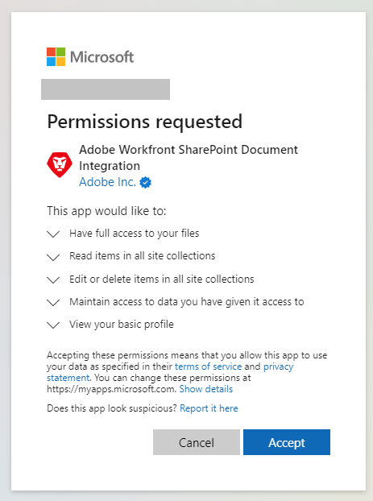
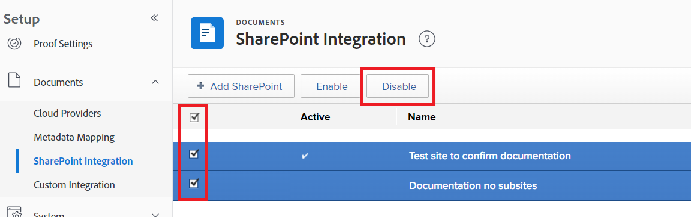

# 配置 [!DNL SharePoint] 集成

<!--Audited: 12/2023-->

<!--
<p data-mc-conditions="QuicksilverOrClassic.Draft mode">**DON'T DELETE, DRAFT OR HIDE THIS ARTICLE. IT IS LINKED TO THE PRODUCT, THROUGH THE CONTEXT SENSITIVE HELP LINKS. **</p>
-->

>[!IMPORTANT]
>
>新 [!DNL SharePoint] 集成已在22.3版本（2022年7月）中发布到生产环境。 尽管您的用户仍然可以访问通过旧版链接的文档 [!DNL SharePoint] 集成，他们必须使用 [!DNL SharePoint] 集成以链接来自SharePoint的文档。
>
>* 新的SharePoint集成不需要管理员进行配置，并且可以由个人用户进行设置。 但是，要确保顺利过渡到新的SharePoint集成，Workfront管理员必须在Workfront设置区域中进行一些细微的设置更改。
>
>    有关信息和说明，请参阅 [配置旧版SharePoint集成以继续访问文档](#configure-the-legacy-sharepoint-integration-for-continued-access-to-documents) 本文章中。
>    
>* 我们建议用户链接当前通过旧版链接的文档 [!DNL SharePoint] 通过新集成进行集成。
>    
>    有关链接文档的说明，请参阅 [链接来自外部应用程序的文档](../../documents/adding-documents-to-workfront/link-documents-from-external-apps.md).

您可以集成 [!DNL Workfront] 替换为 [!DNL SharePoint Online]，使用户能够导航到、链接和添加 [!DNL SharePoint] Workfront中的文档。 提供的功能与其他功能类似 [!DNL Workfront] 集成，例如 [!DNL Google Drive]， [!DNL Box]、和 [!DNL Dropbox].

此集成仅与兼容 [!DNL SharePoint Online]. 的内部部署实例 [!DNL SharePoint] 不受支持。

## 访问要求

您必须具备以下条件才能执行本文中的步骤：

<table style="table-layout:auto"> 
 <col> 
 <col> 
 <tbody> 
  <tr> 
   <td role="rowheader">[!DNL Adobe Workfront] 计划</td> 
   <td>任何</td> 
  </tr> 
  <tr> 
   <td role="rowheader">[!DNL Adobe Workfront] 许可证</td> 
   <td>新增：标准 <p>或</p><p>当前：计划</p></td> 
  </tr> 
  <tr> 
   <td role="rowheader">访问级别配置*</td> 
   <td>您必须是 [!DNL Workfront] 管理员。 有关的信息 [!DNL Workfront] 管理员，请参阅 <a href="../../administration-and-setup/add-users/configure-and-grant-access/grant-a-user-full-administrative-access.md" class="MCXref xref">授予用户完全管理权限</a>. </td> 
  </tr> 
 </tbody> 
</table>

&#42;要了解您拥有的计划、许可证类型或访问权限，请联系贵机构的 [!DNL Workfront] 管理员。

## 先决条件

您必须拥有中任何必要的访问权限或 [!DNL SharePoint] 要修改或配置 [!DNL SharePoint] 集成。

## 通过新的SharePoint集成链接文档

个人用户可以通过新页面链接文档 [!DNL SharePoint] 集成。 集成不需要管理员配置。 相反，用户登录到他们的 [!DNL Microsoft] 关联文档时所用的帐户，这使集成能够访问用户界面中提供的文档 [!DNL SharePoint].

用户第一次连接 [!DNL Workfront] [!DNL SharePoint] 集成到其 [!DNL SharePoint] 帐户，他们将看到并同意以下权限的所有项 [!DNL Workfront] 与以下对象交互时使用 [!UICONTROL SharePoint] 帐户。 读取权限允许 [!DNL Workfront] 查看并访问文件 [!DNL SharePoint]、和写入权限允许用户将文件上传到 [!DNL SharePoint].



有关通过新的链接文档的说明 [!DNL SharePoint] 集成，请参阅 [将外部文档链接到 [!DNL Workfront]](../../documents/adding-documents-to-workfront/link-documents-from-external-apps.md#link-an-external-document-to-workfront)

>[!NOTE]
>
>* A [!DNL SharePoint] 集成可以连接到单个 [!DNL SharePoint] 实例。 因此，用户可以为其设置集成 [!DNL SharePoint]，但无法设置与秒的集成 [!DNL SharePoint]，即使他们有权访问和第二个页面上的和文档 [!DNL SharePoint].
>
>* 用户可通过访问相同的站点、收藏集、文件夹、子文件夹和文件 [!DNL Workfront] [!DNL SharePoint] 集成，就像他们在 [!DNL SharePoint] 帐户。

### 从SharePoint链接文档

有关从SharePoint通过新页面链接文档的说明 [!DNL SharePoint] 集成，请参阅 [将外部文档链接到 [!DNL Workfront]](../../documents/adding-documents-to-workfront/link-documents-from-external-apps.md#link-an-external-document-to-workfront).

### 将文档发送到SharePoint

要将文档发送到SharePoint，请执行以下操作：

1. 单击 **发送至** 图标  并选择SharePoint (Graph API)。
1. （可选）在搜索栏中搜索要发送文档的站点或文件夹。
1. 从列表中选择站点或文件夹。

   * 站点已标记为 .

   * 文件夹标有 .

   * 文件未使用图标进行标记。

1. 单击&#x200B;**保存**。


## 的安全性、访问和授权信息 [!DNL SharePoint] 集成

### 身份验证和授权

[!DNL Workfront] 使用OAuth2检索访问令牌和刷新令牌。 此访问令牌用于向所有 [!DNL SharePoint] 区域。

### 访问和权限

用户首次将文档添加到时 [!DNL Workfront] 从 [!DNL SharePoint]时，会将用户定向到请求以下权限的屏幕：

| 访问权限 | 原因 |
|---|---|
| 拥有对文件的完全访问权限 | 允许 [!DNL Workfront] 访问用户的文件以链接资产。 在发送文档时 [!DNL Workfront] 到 [!DNL SharePoint]， [!DNL Workfront] 需要创建资产的权限。 |
| 读取所有网站集中的项目 | 允许 [!DNL Workfront] 以读取资产并启用用户导航。 |
| 编辑或删除所有网站集中的项目 | 允许 [!DNL Workfront] 在站点和站点集合中创建资产。 仅在链接尝试失败后进行清理时使用“删除”。 |
| 维护对您已授予其访问权限的数据的访问权限 | 允许 [!DNL Workfront] 以生成刷新令牌。 |
| 登录并读取用户配置文件 | 允许 [!DNL Workfront] 通过OAuth2登录流程，使用访问令牌代表用户行事。 |

* 此访问权限在用户首次使用集成时授予，并可随时撤销。
* 为此集成请求的权限为 **已委派** 权限。
* [!DNL Workfront] 请求在集成中执行操作所需的最低访问权限。
* 查看、编辑或删除 [!DNL Adobe Workfront] 文档链接到 [!DNL SharePoint] 基于用户在中的访问权限 [!DNL Workfront]. 但是，任何导航、下载或编辑 [!DNL SharePoint] 文件或文件夹需要访问 [!DNL SharePoint]，对这些操作的访问权限由控制 [!DNL SharePoint].
* 用户可以查看缩略图并预览源自 [!DNL SharePoint]，并且可以在以下位置查看文件和文件夹名称： [!DNL SharePoint]，无需登录 [!DNL SharePoint].
* 仅当用户处于脱机状态且另一个用户查看链接到的文件夹的内容时，才会使用用户的访问令牌 [!DNL Workfront]. 访问令牌用于发现文件夹中的任何文档是否已添加、删除或编辑。

### 安全性

之间的所有通信 [!DNL Workfront] 和 [!DNL SharePoint] 通过HTTPS执行，这将加密信息。

[!DNL Workfront] 不存储、复制或复制来自的数据 [!DNL SharePoint]. 唯一的例外是 [!DNL Workfront] 存储缩略图来源 [!DNL SharePoint] 以在列表视图和预览中显示。

如果资产首次上传到 [!DNL Workfront]，然后发送到 [!DNL SharePoint]， [!DNL Workfront] 保留第一个文件的数据，因为用户可以下载先前版本的 [!DNL Workfront] 文档。 如果文档是在中创建的 [!DNL SharePoint]， [!DNL Workfront] 不会存储文件数据。

## 配置旧版 [!DNL SharePoint] 集成以便继续访问文档

为了确保您的用户能够继续访问通过旧版链接到Workfront的文档 [!DNL SharePoint] 集成，您必须重新配置对旧版的访问权限 [!DNL SharePoint] 集成并使SharePoint客户端密钥保持最新。

* [重新配置对旧版的访问权限 [!DNL SharePoint] 集成](#reconfigure-access-to-the-legacy-sharepoint-integration)
* [配置客户端密钥以继续访问旧版 [!DNL SharePoint] 集成](#configure-the-client-secret-for-continued-access-to-the-legacy-sharepoint-integration)

### 重新配置对旧版的访问权限 [!DNL SharePoint] 集成

重新配置旧版 [!DNL SharePoint] 通过集成，您的用户可访问通过旧版链接的文档 [!DNL SharePoint] 集成，同时确保您的用户无法通过该集成链接新文档。

>[!NOTE]
>
> * 旧版 [!DNL SharePoint] 集成被标记为“[!DNL SharePoint]“
> * 新 [!DNL SharePoint] 集成被标记为“[!UICONTROL [!DNL SharePoint] （图形API）]“

1. 单击 **[!UICONTROL 主菜单]** 图标  单击Adobe Workfront右上角的或者（如果可用）单击 **[!UICONTROL 主菜单]** 图标  图标，然后单击 **[!UICONTROL 设置]** .
1. 选择 **[!UICONTROL 文档]** 在左侧导航中，然后选择 **[!UICONTROL 云提供商]**.
1. 确保 **[!DNL SharePoint]** 期权及 **[!UICONTROL [!DNL SharePoint]（图形API）]** 选项均已启用。
1. 单击&#x200B;**[!UICONTROL 保存]**。
1. 选择 **[!UICONTROL 文档]** 在左侧导航中，然后选择 **[!UICONTROL [!DNL SharePoint]集成]**.
1. 选中列表左侧的复选标记可显示所有现有集成，然后选择 **[!UICONTROL 禁用]**.
   


### 配置客户端密钥以继续访问旧版 [!DNL SharePoint] 集成

您的 [!DNL SharePoint] 客户端密钥每年过期一次。 为了确保能够继续访问旧版中的文档 [!DNL SharePoint] 集成，您必须保留其 [!DNL SharePoint] 客户端密钥为最新。

>[!IMPORTANT]
>
> 因为 [!DNL SharePoint] 客户端密钥由处理 [!DNL Microsoft]，客户端密钥功能和过程可能会因对的更新而更改 [!DNL SharePoint] 创建者 [!DNL Microsoft]. 始终检查 [!DNL Microsoft] 文档以了解有关中的过程和功能的最新信息 [!DNL SharePoint].

<!--1. Go to the site that your [!DNL SharePoint] integration uses. This may be a site that you created when setting up the integrations, or it may be your organization's root site.

1. Add `/_layouts/15/appregnew.aspx` to the end of the URL in the search bar at the top of your browser window.-->

1. 生成新的客户端密码，如中所述 [在中替换过期的客户端密码 [!DNL SharePoint] 加载项](https://docs.microsoft.com/en-us/sharepoint/dev/sp-add-ins/replace-an-expiring-client-secret-in-a-sharepoint-add-in#generate-a-new-secret).
1. 将此客户端密钥复制到安全位置。
1. 登录 [!DNL Workfront] 作为管理员。
1. 在Workfront中，单击 **[!UICONTROL 主菜单]** 图标  单击Adobe Workfront右上角的或者（如果可用）单击 **[!UICONTROL 主菜单]** 图标  图标，然后单击 **[!UICONTROL 设置]** .
1. 在左侧面板中，单击 **[!UICONTROL 文档]** > **[!UICONTROL [!DNL SharePoint]集成]**.
1. 单击 [!DNL SharePoint] 要更新的集成，然后单击 **[!UICONTROL 编辑]**.
1. 找到 **连接信息** 部分，然后将新的客户端密钥输入到 **[!UICONTROL SharePoint客户端密码]** 字段。
1. 单击&#x200B;**[!UICONTROL 保存]**。

<!--

## Instructions for setting up the legacy SharePoint integration

>[!IMPORTANT]
>
>This integration has been deprecated. The instructions here are for information only and will be removed in the near future.


Workfront connects to [!DNL SharePoint] Online using OAuth 2.0, a standard used by most web-based integrations for the authentication and authorization of users.

To configure OAuth, you need to create a [!DNL SharePoint] site and a Site App within [!DNL SharePoint]. This process is described in the following sections.

For more information about OAuth, see [http://oauth.net](http://oauth.net/).

>[!TIP]
>
>To make it easy to copy and paste information between [!DNL Workfront] and [!DNL SharePoint] in these steps, we recommend keeping both applications open in separate tabs.

* [Create and configure a [!DNL SharePoint] site](#create-and-configure-a-sharepoint-site) 
* [Grant write permissions to the site app](#grant-write-permissions-to-the-site-app) 
* [Create a [!DNL Workfront] [!DNL SharePoint] integration instance](#create-a-workfront-sharepoint-integration-instance) 
* [Complete your integration](#complete-your-integration) 
* [Add documents](#add-documents)

### Create and configure a [!DNL SharePoint] site  {#create-and-configure-a-sharepoint-site}

In order for [!DNL Workfront] to authenticate with [!DNL SharePoint], [!DNL Workfront] ca use a master site where users have the [!UICONTROL Full Control] permission level or specific Manage permissions. This master site acts as an Authentication Entry Point for [!DNL Workfront].

To create and configure a [!DNL SharePoint] Site:

1. (Optional) If you do not want to use your organization's root site, you can create a master site in [!DNL SharePoint].

   For instructions, visit [Create a site](https://docs.microsoft.com/en-us/sharepoint/create-site-collection) in the [!DNL Microsoft] Documentation.

   * Select the **[!UICONTROL Team Site]** option when creating the site.

1. (Conditional) If you created a site in step 1, go to the site you just created.

   Or

   If you did not create a site in step 1, go to your organization's root site.

1. Add `/_layouts/15/appregnew.aspx` to the end of the URL in the search bar at the top of your browser window.
1. Configure the following fields:

   <table style="table-layout:auto"> 
    <col> 
    <col> 
    <tbody> 
     <tr> 
      <td role="rowheader"> <p>[!UICONTROL Client ID]</p> </td> 
      <td> <p>Click <strong>[!UICONTROL Generate]</strong> to generate a Client ID. Copy this ID to a secure location. You will use it later when you set up the [!DNL SharePoint] integration in [!DNL Workfront].</p> </td> 
     </tr> 
     <tr> 
      <td role="rowheader"> <p>[!UICONTROL Client Secret]</p> </td> 
      <td> <p>Click <strong>[!UICONTROL Generate]</strong> to generate a Client Secret. Copy this Secret to a secure location. You will use it later when you set up the [!DNL SharePoint] integration in [!DNL Workfront].</p> </td> 
     </tr> 
     <tr> 
      <td role="rowheader"> <p>Title</p> </td> 
      <td> <p>Enter a title, such as [!DNL Workfront] Site App. Users see this title when adding documents..</p> </td> 
     </tr> 
     <tr> 
      <td role="rowheader"> <p>[!UICONTROL App Domain]</p> </td> 
      <td> <p><code>my.workfront.com</code> </p> </td> 
     </tr> 
     <tr> 
      <td role="rowheader"> <p>[!UICONTROL Redirect URI]</p> </td> 
      <td> <p><code>https://oauth.my.workfront.com/oauth2/redirect</code> </p> </td> 
     </tr> 
    </tbody> 
   </table>

1. Click **[!UICONTROL Create]**
1. Continue to [Grant write permissions to the site app](#grant-write-permissions-to-the-site-app).

### Grant write permissions to the site app  {#grant-write-permissions-to-the-site-app}

At this point, you have successfully created a Site App and registered it within [!DNL Workfront]. This site app is also known as an app principal in [!DNL SharePoint]. It resides within your tenant. New site apps do not automatically have access to site collections within the tenant. Permissions must be granted explicitly, for each site collection. The steps below will show you how to grant Write permission to the new Site App a site collection. Repeat these steps for each of the site collections you added under [!UICONTROL Visible Site Collections] in the steps above.

This site app must have [!UICONTROL Write] permission to any site collections that users need to access through [!DNL Workfront].

1. Add '/_layouts/15/appinv.aspx' to the URL in [!DNL Sharepoint].

   **Example:**

   ```
   https://mycompany.sharepoint.com/sites/mysite/_layouts/15/appinv.aspx
   ```

1. Configure the following fields

   <table style="table-layout:auto"> 
    <col> 
    <col> 
    <tbody> 
     <tr> 
      <td role="rowheader">[!UICONTROL App ID]</td> 
      <td> <p>Add the Client ID that you created in <a href="#create-and-configure-a-sharepoint-site" class="MCXref xref">Create and configure a [!DNL SharePoint] site </a>and click <strong>[!UICONTROL Lookup]</strong>.</p> </td> 
     </tr> 
     <tr> 
      <td role="rowheader"> <p>[!UICONTROL Client] / [!UICONTROL App Domain] / [!UICONTROL Redirect URL]</p> </td> 
      <td> <p>These automatically fill when you click [!UICONTROL Lookup].</p> </td> 
     </tr> 
     <tr> 
      <td role="rowheader">[!UICONTROL Permission Request XML]</td> 
      <td> <p>Copy the following XML to the [!UICONTROL Permission Request XML] field. Make sure that it is added exactly as shown without additional spaces etc. in order to avoid errors.</p> 
      <div></a> 
      <div style="mc-code-lang: XML;" class="codeSnippetBody" data-mc-continue="False" data-mc-line-number-start="1" data-mc-use-line-numbers="False"> 
       <pre><code><span style="color: #63a35c; ">&lt;AppPermissionRequests&gt;</span><br><span style="color: #63a35c; ">&lt;AppPermissionRequest <span style="color: #795da3; ">Scope</span><span style="color: #df5000; ">="http://sharepoint/content/sitecollection/web"</span> <span style="color: #795da3; ">Right</span><span style="color: #df5000; ">="Write"</span>/&gt;</span><br><span style="color: #63a35c; ">&lt;/AppPermissionRequests&gt;</span></code></pre> 
      </div> 
      </div> </td> 
     </tr> 
    </tbody> 
   </table>

1. Click **[!UICONTROL Create]**. 
1. In the dialog that appears, click **[!UICONTROL Trust it]**.
1. Verify that the site app has access to the site collection by clicking the **[!UICONTROL Site collection app permissions]** link in [!UICONTROL Site Settings].
1. Repeat the steps above for the remaining site collections, then continue with [Create a [!DNL Workfront] [!DNL SharePoint] integration instance](#create-a-workfront-sharepoint-integration-instance).

### Create a [!DNL Workfront] [!DNL SharePoint] integration instance {#create-a-workfront-sharepoint-integration-instance}

When you have created a site app in [!DNL SharePoint], you can now copy information from the site app into [!DNL Workfront]. The site app is an app principal and acts as the conduit through which OAuth requests are made to access documents within site collections.

1. Log into [!DNL Workfront] as an administrator.
1. Click the **[!UICONTROL Main Menu]** icon  in the upper-right corner of Adobe Workfront, then click **[!UICONTROL Setup]** .

1. In the left panel, click **[!UICONTROL Documents]** > **[!UICONTROL [!DNL SharePoint] Integration]**.
1. Click **[!UICONTROL Add [!DNL SharePoint]]**.
1. Configure the following fields:

   <table style="table-layout:auto"> 
    <col> 
    <col> 
    <tbody> 
     <tr> 
      <td role="rowheader"> <p>[!UICONTROL Name]</p> </td> 
      <td> <p>Enter a name for the [!DNL SharePoint] integration. Users see this name when they click [!UICONTROL Add] &gt; [!UICONTROL From] 'name of integration'. </p> </td> 
     </tr> 
     <tr> 
      <td role="rowheader"> <p>[!UICONTROL [!DNL SharePoint] Host Instance]</p> </td> 
      <td> <p><code>&lt;YourDomain&gt;.sharepoint.com</code> </p> </td> 
     </tr> 
     <tr> 
      <td role="rowheader"> <p>[!UICONTROL [!DNL Azure] Access Domain]</p> </td> 
      <td> <p><code>&lt;YourDomain&gt;.onmicrosoft.com</code> </p> <p>This refers to the Master Site that users will use to authenticate through. It is likely the same domain as the [!UICONTROL [!DNL SharePoint] Host Instance].</p> </td> 
     </tr> 
     <tr> 
      <td role="rowheader"> <p>
      </p> </td> 
      <td> <b>Important</b> Site collections are used only in the Legacy [!DNL SharePoint] Integration.
       <ul> 
        <li> <p><b>If you are using your organization's root site</b><b>:</b> </p> <p>Enter <code>/</code></p> </li> 
        <li> <p><b>If you are using a master site and subsites:</b> </p> <p><b>IMPORTANT</b>: [!DNL Microsoft SharePoint] no longer recommends the use of subsites.</p> <p>Enter the URL stem for the site collection that you created in the section above.</p> <p>This is the section of the URL after .com.</p> <p>Example: for the URL <code>https://mycompany.sharepoint.com/sites/mysite</code>, the stem would be <code>/sites/mysite</code>.</p> </li> 
       </ul> </td> 
     </tr> 
     <tr> 
      <td role="rowheader">[!UICONTROL [!DNL SharePoint] Client ID]</td> 
      <td>Enter the Client ID that you generated in <a href="#create-and-configure-a-sharepoint-site" class="MCXref xref">Create and configure a [!DNL SharePoint] site </a>.</td> 
     </tr> 
     <tr> 
      <td role="rowheader">[!UICONTROL [!DNL SharePoint] Client Secret]</td> 
      <td>Enter the Client Secret that you generated in <a href="#create-and-configure-a-sharepoint-site" class="MCXref xref">Create and configure a [!DNL SharePoint] site </a>.</td> 
     </tr> 
     <tr> 
      <td role="rowheader">[!UICONTROL Visible Site Collections]</td> 
      <td> <b>Important</b> Site collections are used only in the Legacy [!DNL SharePoint] integration.
       <ul> 
        <li> <p><b> If you are using your organization's root site</b><b>:</b> </p> <p>Enter <code>/</code></p> </li> 
        <li> <p><b>If you are using a master site and subsites:</b> </p> <p><b>IMPORTANT</b>: [!DNL Microsoft SharePoint] no longer recommends the use of subsites.</p> <p>For each subsite you want to add to your [!DNL SharePoint] integration, enter the stem of the subsite.</p> <p>Example: for the URL<code>https://mycompany.sharepoint.com/sites/mysite/mysubsite</code>, the stem would be <code>/sites/mysite/mysubsite</code>.</p> <p><b>NOTE</b>:   <p>If you want to test your configuration only (no subsites), enter the stem of the master site. </p> <p>Example: for the URL <code> https://mycompany.sharepoint.com/sites/mysite</code>, the stem would be <code>/sites/mysite</code>.</p> <p>When you have tested your configuration as described in <a href="#complete-your-integration" class="MCXref xref">Complete your integration</a>, you must remove the master site and enter the subsites.</p> 
          <ol> 
           <li value="1">Click the <strong>[!UICONTROL Main Menu]</strong> icon  in the upper-right corner of [!DNL Adobe Workfront], then click <strong>[!UICONTROL Setup]</strong> .<li><p>In the left panel, click <strong>[!UICONTROL Documents]</strong> &gt; <strong>[!UICONTROL [!DNL SharePoint] Integration]</strong>.</p></li><li><p>Click the [!DNL SharePoint] integration you are setting up, then click Edit.</p></li><li><p>Delete the stem for the master site from the [!UICONTROL Visible Site Collections] field.</p></li><li><p>For each subsite you want to add to your [!DNL SharePoint] integration, enter the stem of the subsite.</p></li><p>Example: for the URL<code>https://mycompany.sharepoint.com/sites/mysite/mysubsite</code>, the stem would be <code>/sites/mysite/mysubsite</code>.</p></li> 
          </ol> </p> </li> 
       </ul> <p> </p> <p> </p> </td> 
     </tr> 
    </tbody> 
   </table>

1. Click **[!UICONTROL Save]**
1. Continue to [Complete your integration](#complete-your-integration).

### Complete your integration {#complete-your-integration}

The basic configuration is almost complete.

1. In Workfront, Click the **[!UICONTROL Main Menu]** icon  in the upper-right corner of Adobe Workfront, then click **[!UICONTROL Documents]** .
1. Click **[!UICONTROL Add new]**.
1. Click **[!UICONTROL From] `<title of your [!DNL SharePoint] site>`** in the dropdown.

   A dialog that invites you to Trust this site appears.

   >[!NOTE]
   >
   >If this dialog does not appear, your [!DNL SharePoint] integration is not configured correctly.

1. Click **[!UICONTROL Trust it]**.

### Add documents {#add-documents}

You can now add documents from your [!DNL SharePoint] site.

For instructions, see [Link an external document to [!DNL Workfront]](../../documents/adding-documents-to-workfront/link-documents-from-external-apps.md#linking-existing-documents) in [Link documents from external applications](../../documents/adding-documents-to-workfront/link-documents-from-external-apps.md)

>[!IMPORTANT]
>
>If the user who linked a folder no longer has access to the external application, [!DNL Workfront] can no longer access the contents of the folder. This may happen, for example, if the user who originally linked the folder leaves the company. To ensure continued access, a user with access to the folder must re-link the folder.
> 

-->

## 故障排除

* [问题：用户在使用时遇到基于身份验证的错误 [!DNL SharePoint] 集成。](#problem-users-experience-authentication-based-errors-when-using-the-sharepoint-integration)
* [问题：尝试浏览时 [!DNL SharePoint] 中的文件 [!DNL Workfront]，我没有看到任何或所有网站集。](#problem-when-attempting-to-browse-sharepoint-files-in-workfront-i-do-not-see-any-or-all-of-my-site-collections)
* [问题：我无法访问中以前链接的文件夹和文档 [!DNL SharePoint].](#problem-i-cannot-access-previously-linked-folders-and-documents-in-sharepoint)

### 问题：用户在使用时遇到基于身份验证的错误 [!DNL SharePoint] 集成。 {#problem-users-experience-authentication-based-errors-when-using-the-sharepoint-integration}

解决方案：

用户必须对 [!DNL SharePoint] 站点。

用户具有 [!UICONTROL 完全控制] 拥有您的的所有必要权限 [!DNL SharePoint] 集成。 如果不希望向用户授予完全控制访问权限，则必须授予以下权限：

<table style="table-layout:auto"> 
 <col> 
 <col> 
 <tbody> 
  <tr> 
   <td role="rowheader"> <p>[！UICONTROL设计]</p> </td> 
   <td> <p>可以查看、添加、更新、删除、批准和自定义</p> </td> 
  </tr> 
  <tr> 
   <td role="rowheader"> <p>[！UICONTROL编辑]</p> </td> 
   <td> <p>可以添加、编辑和删除列表；可以查看、添加、更新和删除列表项和文档</p> </td> 
  </tr> 
  <tr> 
   <td role="rowheader"> <p>[！UICONTROL Contribute]</p> </td> 
   <td> <p>可以查看、添加、更新和删除列表项和文档</p> </td> 
  </tr> 
  <tr> 
   <td role="rowheader"> <p>[！UICONTROL仅视图]</p> </td> 
   <td> <p>可以查看页面、列表项和文档（具有服务器端文件处理程序的文档类型可以在浏览器中查看，但不能下载）</p> </td> 
  </tr> 
 </tbody> 
</table>

有关创建和编辑权限级别的说明，请参阅 [如何创建和编辑权限级别](https://docs.microsoft.com/en-us/sharepoint/how-to-create-and-edit-permission-levels) 请参阅Microsoft文档。

<!--

### Problem: As a [!DNL Workfront] user, I am unable to provision a new [!DNL SharePoint] instance. When I attempt to do I see an error. {#problem-as-a-workfront-user-i-am-unable-to-provision-a-new-sharepoint-instance-when-i-attempt-to-do-i-see-an-error}

Solutions:

This can be caused by a number of things, originating in either [!DNL Workfront] or [!DNL SharePoint]'s configuration. Verify that:

* The Client ID, Client Secret, return URL and other configuration fields are correctly mapped between the [!DNL Workfront] [!DNL SharePoint] Integration instance and the [!DNL SharePoint] Site App.
* The user has [!UICONTROL Full Control] permission to the Site Collection used for authentication.
* The Site App is listed under [!UICONTROL Site App Permissions] for the [!UICONTROL Site Collection] used for authentication.

-->

### 问题：尝试浏览时 [!DNL SharePoint] 中的文件 [!DNL Workfront]，我没有看到任何或所有网站集。 {#problem-when-attempting-to-browse-sharepoint-files-in-workfront-i-do-not-see-any-or-all-of-my-site-collections}

解决方案：

在中查看网站集 [!DNL Workfront]时，必须满足以下条件：

<!--

* The site collection must be registered in the [!DNL Workfront] [!DNL SharePoint] Integration instance.

  To verify this in [!DNL Workfront]:

   1. Go to [!UICONTROL Setup] > [!UICONTROL Documents] > [!UICONTROL [!DNL SharePoint] Integration].
   1. Edit the [!DNL SharePoint] Integration instance information.
   1. Verify that the site collection is listed under [!UICONTROL Visible Site Collections].
   -->

* 用户必须具有对网站集的查看权限，该网站集位于 [!DNL SharePoint].

  在中验证此内容 [!DNL SharePoint]中，检查SharePoint中网站集的权限。

<!--* The [!DNL SharePoint] Site App must have access to the site collection.

  To verify this in [!DNL SharePoint]:

   1. Go to the site collection > [!UICONTROL Settings] > [!UICONTROL Site app permissions].
   1. Ensure that the [!UICONTROL Site App] used by [!DNL Workfront] is listed here.
   1. (Conditional) If the Site App is not listed, add to the site collection using _layouts/15/appinv.aspx.

      For information about adding the site collection, see Granting Write Permissions To The Site App.
      
-->

### 问题：我无法访问中以前链接的文件夹和文档 [!DNL SharePoint]. {#problem-i-cannot-access-previously-linked-folders-and-documents-in-sharepoint}

解决方案：

如果链接了用户 [!DNL SharePoint] 文件夹无法再进行身份验证， [!DNL Workfront] 无法再访问该文件夹的内容。 例如，如果最初链接文件夹的用户离开公司，则可能会发生这种情况。

为确保继续访问，对该文件夹具有访问权限的用户必须重新链接该文件夹。

有关从外部提供程序链接文件夹的信息，请参阅 [链接来自外部应用程序的文档](../../documents/adding-documents-to-workfront/link-documents-from-external-apps.md).

<!--

### Problem: I see a "404 not found" error when attempting to add a document from [!DNL Sharepoint]

#### Solution:

This error might occur if one of the sites configured in the [!UICONTROL Visible Site Collections] list has been deleted in Sharepoint. Check the [!UICONTROL Visible Site Collections] list, and remove any sites that have been deleted in Sharepoint.-->