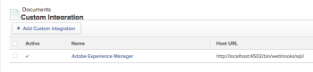
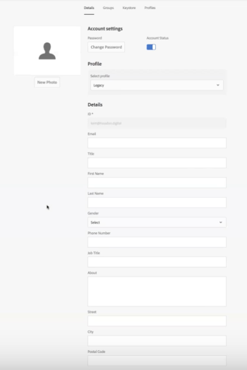

# 使用[!DNL Workfront]旧连接器配置[!DNL Adobe Experience Manager]

<!-- Audited: 4/2025 -->

作为[!DNL Adobe Workfront]管理员，您可以将[!DNL Workfront]与[!UICONTROL Adobe Experience Manager (AEM) Assets]集成，并为您的组织提供用于在工作流中创建、共享和维护资源的全面内容管理解决方案。

## 访问要求

+++ 展开以查看本文中各项功能的访问要求。

<table>
  <tr>
   <td>Adobe Workfront包
   </td>
   <td> <p>Prime或Ultimate</p>
    <p>工作流 Ultimate</p>
   </td>
  </tr>
  <tr>
   <td>Adobe Workfront许可证
   </td>
   <td><p>标准</p>
   <p>规划</p>
   </td>
  </tr>
   <tr>
   <td>访问级别配置
   </td>
   <td>您必须是[!DNL Workfront]管理员。
   </td>
  </tr>
</table>

有关信息，请参阅Workfront文档中的[访问要求](/help/quicksilver/administration-and-setup/add-users/access-levels-and-object-permissions/access-level-requirements-in-documentation.md)。

## [!DNL Workfront for AEM Assets]

[!DNL Workfront for AEM Assets connector]允许您的组织执行以下操作：

* 通过将AEM资源和文件夹链接到[!DNL Workfront]中的项目、任务、问题和请求，协作和管理创意内容。

  有关配置与第三方应用程序的文档集成的详细信息，请参阅[配置文档集成](../../administration-and-setup/configure-integrations/configure-document-integrations.md)。

* 与[!DNL AEM Digital Asset Managemen]t (DAM)存储库集成，允许您使用[!DNL Workfront]管理和共享存储在DAM中的数字资产。

  有关链接文档和资产文件夹的详细信息，请参阅   [链接来自外部应用程序的文档](../../documents/adding-documents-to-workfront/link-documents-from-external-apps.md)。

* 将来自两个应用程序的元数据合并应用到资源。
* 查看资源的包含所有内容的通信流。 对[!DNL Workfront]或[!UICONTROL AEM Assets]中的资源所做的更新和评论将同步到另一个应用程序，从而建立对该资源进行的通信的完整历史记录。

  有关在[!DNL Workfront]中发表评论的更多信息，请参阅[向文档添加更新](../../documents/managing-documents/add-update-documents.md)。

## 安装[!DNL AEM Assets]连接器的先决条件

在安装[!DNL Workfront]AEM Assets[!UICONTROL 的]连接器之前，请确保满足以下先决条件：

* [!UICONTROL AEM Assets]已安装和配置，版本6.5或更高版本。 有关安装[!UICONTROL AEM Assets]的信息，请参阅[[!DNL Adobe Experience Manager] 文档](https://experienceleague.adobe.com/en/docs/experience-manager)。
* （视情况而定）如果防火墙规则不允许按预期发送流量，请将群集的IP地址和/或域添加到列入允许列表中。 有关详细信息，请参阅[配置防火墙的允许列表](../../administration-and-setup/get-started-wf-administration/configure-your-firewall.md)。

## 安装[!DNL Workfront for AEM Assets]连接器包 {#install-the-workfront-for-aem-assets-connector-package}

>[!IMPORTANT]
>
>以下说明适用于[!DNL Workfront with AEM Assets]旧连接器，该连接器已被[[!DNL Workfront for Experience Manager] 增强型连接器](../../documents/workfront-and-experience-manager-integrations/workfront-for-experience-manager-enhanced-connector/workfront-for-aem-enhanced-connector.md)取代。 有关更多信息，请联系您的客户代表。

要安装[!DNL Workfront for AEM Assets]连接器，必须使用[!UICONTROL AEM包管理器]将该连接器作为包导入CRX。

1. 在已安装AEM的工作站上，下载[!DNL Workfront for AEM Assets]连接器安装文件。

   您可以从[!DNL Workfront for AEM Assets]代表处获取[!DNL Workfront]连接器。

1. 使用管理员帐户登录AEM。
1. 单击&#x200B;**[!UICONTROL 工具]** > **[!UICONTROL 部署]** > **[!UICONTROL 包]**。 将打开[!UICONTROL CRX包管理器]。

1. 单击&#x200B;**[!UICONTROL 上传包].**

1. 在&#x200B;**[!UICONTROL 上传包]**&#x200B;对话框中，浏览并选择&#x200B;**[!UICONTROL Workfront连接器]**&#x200B;包，然后单击&#x200B;**[!UICONTROL 确定]**。 包显示在[!UICONTROL CRX包管理器]中。

1. 单击&#x200B;**[!UICONTROL 安装].**

1. 在&#x200B;**[!UICONTROL 包]**&#x200B;对话框中，忽略高级设置，然后单击&#x200B;**[!UICONTROL 安装]**。
1. （可选）要确认连接器已成功安装，请确保[!UICONTROL 活动日志]中显示以下语句：

   ```
   Package installed in <time>
   ```

1. 关闭[!UICONTROL CRX包管理器]。 连接器已安装，您现在可以将[!DNL AEM Assets]配置为与[!DNL Workfront]集成。

1. 继续进行[配置 [!DNL AEM Assets] 以与 [!DNL Workfront]](#configure-aem-assets-to-integrate-with-workfront)集成。

## 配置[!DNL AEM Assets]以与[!DNL Workfront]集成 {#configure-aem-assets-to-integrate-with-workfront}

安装连接器后，将连接器包导入AEM并将AEM配置为与[!DNL Workfront]中的文档链接。

有关安装连接器的信息，请参阅[安装 [!DNL Workfront for AEM Assets] 连接器软件包](#install-the-workfront-for-aem-assets-connector-package)。

* [先决条件](#prerequisites)
* [将AEM与 [!DNL Workfront]集成](#integrate-aem-with-workfront)
* [配置[!UICONTROL AEM外部化器]](#configure-the-aem-externalizer)

### 先决条件 {#prerequisites}

在开始之前，必须启用workfront-service的权限：

1. 在AEM中，转到&#x200B;**[!UICONTROL 工具]** > **[!UICONTROL 安全性]** > **[!UICONTROL 权限]**。
1. 在左上角，从下拉菜单中选择&#x200B;**[!UICONTROL 用户]**&#x200B;，然后在&#x200B;*[!UICONTROL 搜索]*&#x200B;字段中输入&#x200B;**[!UICONTROL workfront-service{3&#x200B;}。]**&#x200B;选择[!UICONTROL workfront-service]用户。
1. 在屏幕右侧，选择&#x200B;**[!UICONTROL 添加ACE]**&#x200B;以创建新条目。
1. 在{&#x200B;0}添加新条目&#x200B;**[!UICONTROL 窗口&#x200B;中，选中]**&#x200B;路径&#x200B;**[!UICONTROL 字段中的复选框图标，&#x200B;然后选择文件夹：]**/conf **
1. 在&#x200B;**权限**&#x200B;字段中，输入： *jcr:read*
1. 选择右上角的&#x200B;**添加**。
1. （可选）重复上述步骤以创建更多条目。

### 将AEM与[!DNL Workfront]集成 {#integrate-aem-with-workfront}

1. 以管理员身份登录到AEM Assets。
1. 单击&#x200B;**[!UICONTROL 工具]** > **[!UICONTROL Cloud Services]** > **[!UICONTROL Workfront集成配置]** > **[!UICONTROL Global-Workfront]。**&#x200B;**{&#x200B;10}**

1. （视情况而定）如果您尚未这样做，请创建[!DNL Workfront]云配置文件：

   1. 在[!DNL Global-Workfront]页面的右上角，单击&#x200B;**[!UICONTROL 创建]**。
   1. 在&#x200B;**[!UICONTROL Workfront URL]**&#x200B;框中，指定[!DNL Workfront]实例的URL。

      例如，[!DNL https]：//`<account>`.my.workfront.com，其中`<account>`是您用于与AEM集成的帐户。

   1. 在{&#x200B;0}基本文件夹&#x200B;**[!UICONTROL 字段中，选中复选框图标。]**
   1. 在下拉菜单中，选择链接到[!DNL Workfront]对象的文档的存储路径。
   1. 在显示的AEM模式窗口中，将包含连接到[!DNL Workfront]对象的文档的文件夹路径置于之后。 选择文件夹，然后按右上角的&#x200B;**[!UICONTROL &#x200B;选择]**。

      您可以链接到根/content/dam/下的任何文件夹。

   1. 在&#x200B;**[!UICONTROL Workfront API密钥]**&#x200B;框中，指定您的[!UICONTROL Workfront] API密钥。

      要检索[!DNL Workfront] API密钥，请执行以下操作：

      1. 打开浏览器选项卡，并以[!DNL Workfront]管理员身份登录到您的[!DNL Workfront]帐户。

      {{step-1-to-setup}}

      1. 单击&#x200B;**[!UICONTROL 系统]** > **[!UICONTROL 客户信息]**。

         如果您已生成API密钥，则[!DNL Workfront] API密钥将显示在&#x200B;**您用户的API密钥**&#x200B;标签下。

      1. （视情况而定）如果您尚未生成API密钥，则需要生成一个：

         1. 在&#x200B;**[!UICONTROL API密钥设置]**&#x200B;部分中，确保&#x200B;**[!UICONTROL 创建后，API密钥在]**&#x200B;内到期选项设置为&#x200B;**无**。

            如果选择过期时间，则连接器将在API密钥过期后停止工作。 然后，您需要重新生成API密钥并更新[!DNL Workfront]配置。

         1. 在&#x200B;**[!UICONTROL 您用户的API密钥]**&#x200B;标签下，单击&#x200B;**[!UICONTROL 生成API密钥]**。 [!DNL Workfront]的API密钥生成并显示。
      1. 将API密钥复制到剪贴板。
      1. 打开AEM Connector的浏览器选项卡，并在&#x200B;**[!DNL Workfront API Key]**&#x200B;框中粘贴您复制的API密钥。
   1. （视情况而定）单击&#x200B;**[!UICONTROL 集成配置]**&#x200B;页面左上角的[!UICONTROL [!DNL Workfront]高级]选项卡，然后选择以下选项（如果适用）：

      **[!UICONTROL 允许收藏集浏览]：**&#x200B;如果您的组织允许[!DNL Workfront]用户将AEM Assets收藏集链接到[!DNL Workfront]对象，请选择此选项。

      **[!UICONTROL 用户Federated ID]：**&#x200B;如果您的组织在登录Workfront时使用Federated ID或单点登录(SSO)，请选择此选项。

      **[!UICONTROL 忽略电子邮件域]：**&#x200B;如果您的AEM用户未在其用户ID中使用域名，请选择此选项。

      列入允许列表 **[!UICONTROL 限制访问]：**&#x200B;选择此选项可指定需要添加到的适当[!DNL Workfront] IP地址。 有关允许列表的详细信息，请参阅[配置防火墙的允许列表](../../administration-and-setup/get-started-wf-administration/configure-your-firewall.md)。

   1. 在“Workfront集成配置”页面的左上角，单击&#x200B;**[!UICONTROL Basic]**&#x200B;选项卡，然后单击&#x200B;**[!UICONTROL 连接]**。

      >[!NOTE]
      >
      >应用更改可能需要一些时间。 重新启动捆绑包可能会加快该过程。


1. （视情况而定）如果您已创建[!DNL Workfront]云配置文件，请选择&#x200B;**[!UICONTROL 全局 —[!DNL Workfront]]**，然后在左上角单击&#x200B;**[!UICONTROL 属性]**。

1. 通过单击&#x200B;**[!UICONTROL 生成密钥]，**&#x200B;生成AEM API密钥，然后将AEM API密钥复制到剪贴板。

   稍后当您配置[!UICONTROL Workfront]以便与[!UICONTROL AEM Assets]集成时，将需要AEM API密钥。 有关详细信息，请参阅[配置Workfront以与AEM资源集成](#configure-workfront-to-integrate-with-aem-assets)。

1. 单击右上角的&#x200B;**[!UICONTROL 保存]**。 将显示[!UICONTROL Global-[!DNL Workfront]]窗口。

   

1. （可选）同步AEM和[!DNL Workfront]之间的双向通信：

   1. 单击&#x200B;**[!UICONTROL 全局 — [!DNL Workfront]].**
   1. 在窗口的左上角，单击&#x200B;**[!UICONTROL 属性]**。 此时将显示&#x200B;**[!UICONTROL [!DNL Workfront]集成配置]**&#x200B;页。

      

   1. （可选）若要在[!UICONTROL AEM Assets]和[!DNL Workfront]之间启用注释同步，请单击&#x200B;**[!UICONTROL 启用注释同步]**。

      >[!IMPORTANT]
      >
      >必须启用[!UICONTROL 文档同步]才能同步资产。

   1. （可选）要关闭评论同步，请单击&#x200B;**[!UICONTROL 禁用评论同步]。**

      或

      删除注册到AEM实例的[!UICONTROL NOTE CREATE]事件订阅。

      有关事件订阅的信息，请参阅[事件订阅API](../../wf-api/general/event-subs-api.md)。

1. 继续[配置[!UICONTROL AEM外部化器]](#configure-the-aem-externalizer)。

### 配置[!UICONTROL AEM外部化器] {#configure-the-aem-externalizer}

[!UICONTROL AEM外部化器]允许AEM以可在[!DNL Workfront]中使用的格式传递URL。 如果未正确配置，[!DNL Workfront]将无法调用AEM API，并且在Workfront中关联AEM文档的URL将无法正常工作。

1. 在AEM中，单击&#x200B;**[!UICONTROL 工具]** > **[!UICONTROL 操作]** > **[!UICONTROL Web控制台]**。

1. 单击&#x200B;**[!UICONTROL OSGI]**，然后在下拉菜单中单击&#x200B;**[!UICONTROL 配置]**。

1. 在配置列表中，选择&#x200B;**[!UICONTROL Day CQ Link Externalizer]。**&#x200B;显示&#x200B;**[!UICONTROL 外部化器]**&#x200B;页。

1. 在&#x200B;**[!UICONTROL 域]**&#x200B;部分中，确保&#x200B;**[!UICONTROL 作者]**&#x200B;字段中列出的域是AEM用户可从外部访问的域名。

   [!UICONTROL 作者]字段中的域名应与AEM实例的URL行中列出的域相匹配。

   ![[!DNL Extenalizer].png](assets/extenalizer-350x128.png)

1. （视情况而定）如有必要，请更新&#x200B;**[!UICONTROL 作者]**&#x200B;字段中的域。
1. 单击 **[!UICONTROL Save]**。[!UICONTROL AEM Assets]现已配置为将文档与[!DNL Workfront]链接。

1. 继续进行[配置 [!DNL Workfront] 以与 [!DNL AEM assets]](#configure-workfront-to-integrate-with-aem-assets)集成。

## 配置[!DNL Workfront]以与[!DNL AEM assets]集成 {#configure-workfront-to-integrate-with-aem-assets}

在安装[!UICONTROL Workfront for AEM Assets]连接器(如[安装[!UICONTROL Workfront for AEM Assets]连接器包](#install-the-workfront-for-aem-assets-connector-package)中所述)并配置[!UICONTROL AEM Assets]&#x200B;(如[配置[!UICONTROL  AEM Assets]以与 [!DNL Workfront]](#configure-aem-assets-to-integrate-with-workfront)集成)之后，您需要配置[!DNL Workfront]以链接介于[!DNL Workfront]和[!DNL AEM Assets]之间的文档。

1. 以管理员身份登录到Workfront。

   >[!TIP]
   >
   >[!UICONTROL Workfront]建议创建一个[!UICONTROL Workfront]管理员，专门用于您的AEM集成。 有关将[!UICONTROL Workfront]管理员访问权限级别分配给用户的详细信息，请参阅[授予用户对特定区域的管理访问权限](../../administration-and-setup/add-users/configure-and-grant-access/grant-users-admin-access-certain-areas.md)。

{{step-1-to-setup}}

1. 单击&#x200B;**[!UICONTROL 文档]** > **[!UICONTROL 自定义集成]。**

1. 单击&#x200B;**[!UICONTROL 添加自定义集成]**。
1. 在&#x200B;**[!UICONTROL 名称]**&#x200B;框中，输入自定义集成的名称。

   这是用户在[!UICONTROL Workfront]中使用集成时看到的名称。

1. 在&#x200B;**[!UICONTROL 基本API URL]**&#x200B;框中，输入AEM实例的URL。

   基本API URL由AEM实例的URL组成，后跟路径：/bin/webhooks/api/

   

1. 在&#x200B;**[!UICONTROL 身份验证类型]**&#x200B;下拉菜单中，选择&#x200B;**[!UICONTROL ApiKey].**

1. 在{&#x200B;0}API密钥&#x200B;**[!UICONTROL 框中，粘贴您配置]** AEM Assets[!UICONTROL 时复制的AEM API密钥。]
1. 单击&#x200B;**[!UICONTROL 保存]**。
1. （可选）确保集成标记为[!UICONTROL 活动]。\
   

   [!DNL Workfront]现已配置为与[!DNL AEM Assets]配合使用。

   要在AEM中访问资源，必须将需要使用该连接器的每个[!DNL Workfront]用户设置为AEM中的用户。 有关创建用户的信息，请参阅[设置用户以使用连接器](#set-up-users-to-use-the-connector)。

## 设置用户以使用连接器 {#set-up-users-to-use-the-connector}

为了使用户能够访问连接器，他们必须在AEM中具有用户配置文件，并且属于[!DNL Workfront]组，该组的访问级别包括[!UICONTROL 创建]和[!UICONTROL 删除]权限。

有关[!DNL Workfront]权限的详细信息，请参阅[创建或修改自定义访问级别](../../administration-and-setup/add-users/configure-and-grant-access/create-modify-access-levels.md)。

* [在 [!DNL AEM assets]中设置用户](#set-up-users-in-aem-assets)

### 在[!DNL AEM assets]中设置用户 {#set-up-users-in-aem-assets}

1. 以Workfront管理员身份登录到[!DNL AEM Assets]。
1. 单击&#x200B;**[!UICONTROL 工具]** > **{3&#x200B;}{&#x200B;4}安全性** > **[!UICONTROL 用户]**。****

1. （视情况而定）如果用户在AEM中没有用户配置文件，请创建AEM用户配置文件。

   1. 单击&#x200B;**[!UICONTROL 创建用户]。**
   1. 输入用户的个人信息。

      

      唯一必填字段是&#x200B;**ID**&#x200B;字段。 用户的AEM ID必须与其[!DNL Workfront] ID（用户的[!DNL Workfront]电子邮件地址）匹配。

      如果您在将AEM配置为与&#x200B;**[!UICONTROL 集成时选择了]**&#x200B;忽略电子邮件域[!DNL Workfront]选项，则AEM ID将与[!DNL Workfront]电子邮件地址不匹配。

1. （视情况而定）如果用户具有AEM配置文件，请打开用户的AEM配置文件：

   1. 单击&#x200B;**[!UICONTROL 用户]**。 此时将显示&#x200B;**[!UICONTROL 用户管理]**&#x200B;页。

   1. 单击要添加的用户，然后单击&#x200B;**[!UICONTROL 属性]**。 此时将显示用户的设置页面。

1. 单击&#x200B;**[!UICONTROL 组]**&#x200B;选项卡。

   

1. 确保用户至少属于一个访问级别包括[!DNL Workfront]创建&#x200B;**[!UICONTROL 和]**&#x200B;删除&#x200B;**[!UICONTROL 权限的]**&#x200B;组。

   1. 要将用户添加到现有组，请在&#x200B;**[!UICONTROL 键入组名]**&#x200B;框中开始键入组名，然后在该组出现在下拉菜单中时选择该组。

      或

      要选择用户是其成员的组，请在&#x200B;**[!UICONTROL 组中选择此用户是]**&#x200B;部分成员的组。

1. 单击&#x200B;**[!UICONTROL 保存]。**
