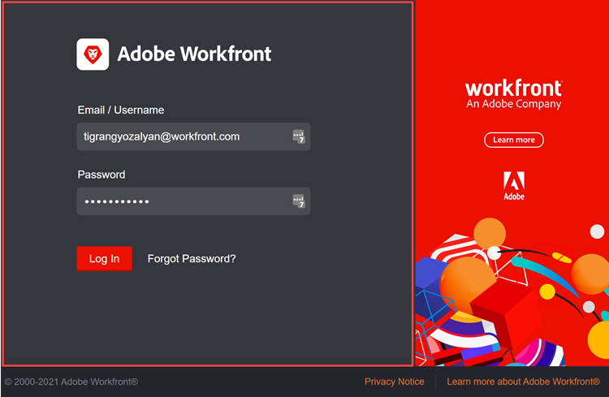

# 打造您的Adobe Workfront实例

<!--
**DON'T DELETE, DRAFT OR HIDE THIS ARTICLE. IT IS LINKED TO THE PRODUCT, THROUGH THE CONTEXT SENSITIVE HELP LINKS. **
-->

>[!IMPORTANT]
>
>此页面上描述的过程仅适用于尚未载入[!DNL Adobe Experience Cloud]的组织。
>
> 如果您的组织已登记到[!DNL Adobe Experience Cloud]，则品牌推广不可用。

作为Workfront管理员，您可以将Workfront与以下位置的徽标标标记为相同：

* “登录”屏幕

  

* 顶部导航区域

  

* 主菜单

  

您还可以更改登录屏幕的背景图像和颜色：

>[!NOTE]
>
>* 如果您组织的Workfront实例使用自定义SSO门户，则更改登录背景图像和颜色将不可用。 如果需要更多信息，请咨询您的网络或IT管理员。
><!--
>or is enabled with Adobe IMS  >
>  >
>-->
>
>* Workfront管理员或组管理员还可以使用布局模板为某些组和用户设置Workfront品牌。 布局模板中的品牌策略会覆盖本文中介绍的系统级品牌策略。 有关在布局模板中进行品牌化的说明，请参阅[使用布局模板创建Adobe Workfront](../../../administration-and-setup/customize-workfront/use-layout-templates/brand-wf-using-a-layout-template.md)。

## 访问要求

您必须具有以下权限才能执行本文中的步骤：

<table style="table-layout:auto"> 
 <col> 
 <col> 
 <tbody> 
  <tr> 
   <td role="rowheader">Adobe Workfront计划</td> 
   <td>任何</td> 
  </tr> 
  <tr> 
   <td role="rowheader">Adobe Workfront许可证</td> 
   <td>计划</td> 
  </tr> 
  <tr> 
   <td role="rowheader">访问级别配置</td> 
   <td> 
您必须是Workfront管理员。
 
<b>注意</b>：如果您仍然没有访问权限，请咨询Workfront管理员是否对您的访问级别设置了其他限制。 有关Workfront管理员如何修改您的访问级别的信息，请参阅<a href="../../../administration-and-setup/add-users/configure-and-grant-access/create-modify-access-levels.md" class="MCXref xref">创建或修改自定义访问级别</a>。
 </td> 
  </tr> 
 </tbody> 
</table>

## 标记登录屏幕

1. 单击Adobe Workfront右上角的&#x200B;**主菜单**&#x200B;图标，然后单击&#x200B;**设置** 。

1. 单击&#x200B;**系统** > **品牌**。

1. 进行以下任何更改，以使用您的品牌图像自定义Workfront。

   <table style="table-layout:auto"> 
    <col> 
    <col> 
    <tbody> 
     <tr> 
      <td role="rowheader"> 
标记主页图标（显示在顶部导航区域的最左侧）
 </td> 
      <td> 
在<strong>顶部导航区域</strong>部分的<strong>主页图标</strong>下，单击框中的任意位置，然后查找并选择您的徽标图像。 或将图像拖到框中。
 
要裁切图像，请使用滚动控件并将图像拖动到指定空间内所需的位置。
 
我们建议使用120 x 120图像。 它可以采用以下任意格式：GIF、JPG、PNG、SVG。
 
此图标还会显示在用户导出为PDF文件的报表、列表、功能板和已传送报表中。
 </td> 
     </tr> 
     <tr> 
      <td role="rowheader"> 
标记主菜单徽标（显示在主菜单的右上角）
 </td> 
      <td> 
在<strong>顶部导航区域</strong>部分的<strong>主菜单徽标</strong>下，单击框中的任意位置，然后查找并选择您的徽标图像。 或将图像拖到框中。
 
要裁切图像，请使用滚动控件并将图像拖动到指定空间内所需的位置。
 
我们建议使用300 x 120像素的图像。 它可以采用以下任意格式：GIF、JPG、PNG、SVG。
 </td> 
     </tr> 
     <tr> 
      <td role="rowheader">将登录屏幕徽标品牌化（显示在用户键入登录凭据的框的左上方）</td> 
      <td> 
在<strong>登录屏幕</strong>下，单击框中的任意位置，然后查找并选择您的徽标图像。 要裁切图像，请使用滚动控件并将图像拖动到指定空间内所需的位置。
 
我们建议使用300 x 120像素的图像。 它可以采用以下任意格式：GIF、JPG、PNG、SVG。
 </td> 
     </tr> 
     <tr> 
      <td role="rowheader">将登录屏幕背景颜色标记为（显示在用户键入登录凭据的框后）</td> 
      <td> 
在<strong>登录屏幕</strong>下，设置<strong>背景颜色</strong>。 
 
可以使用RGB或十六进制颜色代码。
 
仅当登录屏幕背景大于登录屏幕背景图像（请参阅此表中的下一行）或图像中存在任何透明度时，背景颜色才可见。
 </td> 
     </tr> 
     <tr> 
      <td role="rowheader">标记登录屏幕背景图像（显示在用户键入其登录凭据的框后）</td> 
      <td> 
       <ol style="list-style-type: lower-alpha;"> 
        <li value="1"> 
 在<strong>登录屏幕</strong>区域的<strong>背景图像</strong>下，单击该框，然后查找并选择您的JPG或PNG图像或图像（最多20张）。 
 
多个背景图像以随机顺序显示，每次用户刷新其登录页面时都会发生更改。 我们建议图像不要大于2 MB。
 </li> 
        <li value="2"> 
将鼠标悬停在上传的每个背景图像上，单击“设置”（齿轮）图标，然后使用以下任一选项来指定希望图像在登录屏幕背景中的显示位置和方式：
 
         <ul> 
          <li> 
<strong>填充屏幕</strong>：使图像适合登录屏幕背景，这样可能会放大图像。 使用高分辨率图像（最大2 MB）以获得最佳结果。
 
使用此选项时，无法自定义的Workfront横幅会遮蔽部分图像。
 </li> 
          <li> 
<strong>平铺</strong>：将图像平铺到登录屏幕背景区域，以原始大小显示。 这对于创建阵列非常有用。 选择一个蓝色对齐选项，从背景区域的左上角、中上角或右上角开始平铺。
 </li> 
          <li> 
<strong>位置</strong>：使用其中一个蓝色对齐选项（登录屏幕背景区域的左上角、中上角或右上角），将图像按原始大小放置到您选择的位置。
 
背景颜色填充登录屏幕背景区域的其余部分。 有关背景颜色的详细信息，请参阅此表的前一行。
 </li> 
         </ul> </li> 
       </ol> </td> 
     </tr> 
     <tr> 
      <td role="rowheader">重置为默认品牌</td> 
      <td> 
重置为默认品牌会删除您上传的所有照片和图像。
 
单击屏幕右下角的<strong>将所有品牌设置重置为Workfront默认值</strong>，然后单击<strong>是</strong>。
 </td> 
     </tr> 
    </tbody> 
   </table>

   >[!NOTE]
   >
   >如果您组织的Workfront实例使用自定义SSO门户，则此项不可用。
   ><!--   >
   >or is enabled with Adobe IMS   >
   >   >
   >-->
   >
   >如果需要更多信息，请咨询您的网络或IT管理员。

1. 单击&#x200B;**保存**。
