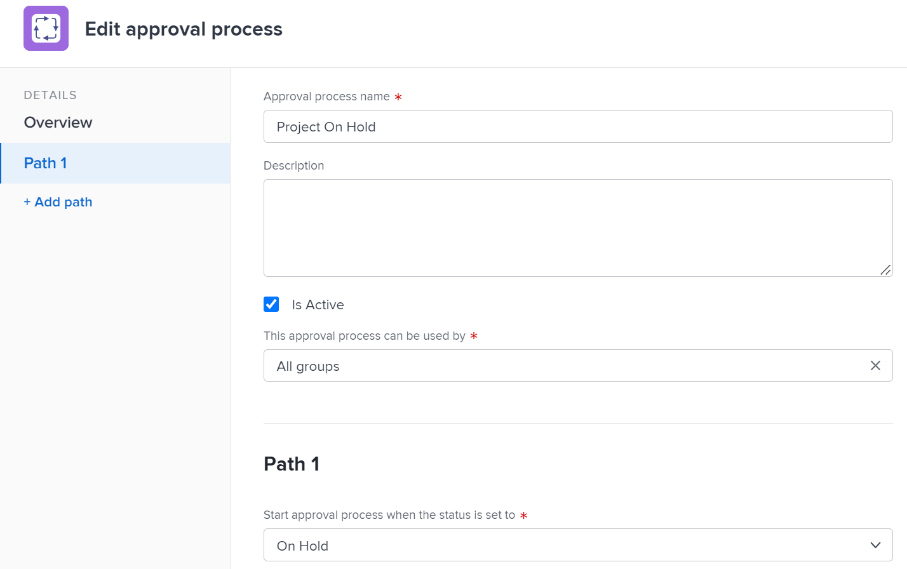

# 编辑审批流程

如果您是Adobe Workfront管理员，或者您对审批流程具有管理访问权限，则可以查看和编辑系统中的所有审批流程。

如果您是组管理员，则可以查看和编辑与所管理的一个或多个组关联的批准流程。

有关创建审批流程的信息，请参阅 [为工作项创建批准流程](../../../administration-and-setup/customize-workfront/configure-approval-milestone-processes/create-approval-processes.md).

>[!NOTE]
>
>* 编辑已使用的全局审批流程时，所做的更改会影响系统中已与其关联的所有对象。
>* 如果在对象上已启动的批准流程上将新批准者添加到当前阶段，则该对象的流程会重置，批准者必须重新开始。
>
>  但是，如果在已启动对象的审批流程中进行以下更改，则该流程会持续进行，而不会中断：
>
>* 添加当前阶段以外的阶段
>* 在当前阶段之前添加其他审批者

## 访问要求

您必须具备以下条件：

<table style="table-layout:auto"> 
 <col> 
 <col> 
 <tbody> 
  <tr> 
   <td role="rowheader">Adobe Workfront计划*</td> 
   <td>任意</td> 
  </tr> 
  <tr> 
   <td role="rowheader">Adobe Workfront许可证*</td> 
   <td>计划</td> 
  </tr> 
  <tr> 
   <td role="rowheader">访问级别配置*</td> 
   <td> 
对审批流程的管理访问权限（如果您不是系统管理员）
 
<b>注意</b>：如果您仍然没有访问权限，请咨询Workfront管理员是否对您的访问级别设置了其他限制。 有关Workfront管理员如何修改您的访问级别的信息，请参阅 <a href="../../../administration-and-setup/add-users/configure-and-grant-access/create-modify-access-levels.md" class="MCXref xref">创建或修改自定义访问级别</a>.
 </td> 
  </tr> 
 </tbody> 
</table>

&#42;要了解您拥有什么计划、许可证类型或访问权限，请联系您的Workfront管理员。

## 编辑现有审批流程

1. 单击 **主菜单** 图标  (在Adobe Workfront的右上角)，然后单击 **设置** .
1. （视情况而定）如果您正在编辑系统级别的批准流程，请单击 **进程** > **审批** （在左侧面板中）。

   或

   如果您正在编辑组级别的批准流程，请执行以下操作：

   1. 在左侧面板中，单击 **组** .
   1. 单击要列出或管理组审批流程的组的名称。
   1. 在左侧面板中，单击 **审批**. 您可能需要单击 **显示更多** 首先。

1. 单击 **项目审批**， **任务审批**，或 **问题审批** 选项卡，具体取决于要编辑的审批流程类型。

1. 选择要编辑的批准流程，然后单击 **编辑** 位于列表顶部。 此时将显示编辑批准流程框。

   

1. 在显示的框中指定以下信息：

   <table style="table-layout:auto"> 
    <col> 
    <col> 
    <tbody> 
     <tr> 
      <td role="rowheader">批准流程名称</td> 
      <td>键入审批流程的描述性名称。 用户在将审批流程应用于对象时可以看到此名称，如中所述 <a href="../../../review-and-approve-work/manage-approvals/associate-approval-with-work.md" class="MCXref xref">将新的或现有的审批流程与工作关联</a>.</td> 
     </tr> 
     <tr> 
      <td role="rowheader">描述</td> 
      <td>键入审批流程的描述。 这会显示在 <b>审批</b> 中的部分 <b>设置</b> 批准流程名称旁边的区域。</td> 
     </tr> 
     <tr> 
      <td role="rowheader">活动</td> 
      <td> 
如果您希望其他用户能够将审批流程附加到他们创建的项目、任务和问题，请保持启用此选项。 
 
此选项默认处于启用状态。
 
提示：当您的组织不再需要使用审批流程，但希望保留有关其使用的历史信息时，将审批流程标记为不活动会很有用。
 </td> 
     </tr> 
     <tr data-mc-conditions=""> 
      <td role="rowheader">此批准流程的使用者可以为 </td> 
      <td> 
如果您希望审批流程仅对属于特定组的项目、任务、问题和模板可用，请开始键入组的名称，然后在组出现时选择该名称：
 
       <ul> 
        <li>如果您是系统管理员或对审批流程具有管理访问权限，则在键入组名时，可以在系统中看到任何组。 <b>所有组</b> 默认情况下处于选中状态。 </li> 
        <li>如果您是组管理员，对审批流程没有管理权限，则可以在键入审批流程名称时将审批流程分配给您管理的任何组。 此 <b>所有组</b> 选项不可用。</li> 
       </ul> 
此选项不适用于一次性审批流程。
 
<b>警告</b>：当您更改特定于组的审批流程时，已关联到工作项的现有审批流程可能会更改。 有关这些更改的信息，请参阅 <a href="../../../administration-and-setup/customize-workfront/configure-approval-milestone-processes/how-changes-affect-group-approvals.md" class="MCXref xref">组和审批流程更改如何影响分配的审批流程</a>.
 
有关从组的页面列出和管理组的审批流程的信息，请参阅 <a href="../../../administration-and-setup/manage-groups/work-with-group-objects/create-and-modify-groups-approval-processes.md" class="MCXref xref">组级别审批流程</a>. 
 
有关对审批流程的管理访问权限的信息，请参阅 <a href="../../../administration-and-setup/add-users/configure-and-grant-access/grant-users-admin-access-certain-areas.md" class="MCXref xref">授予用户对特定区域的管理访问权限</a>.
 </td> 
     </tr> 
    </tbody> 
   </table>

1. 使用以下选项配置批准流程的路径。

   您可在路径中指定批准流程中需要执行的操作。 可在路径中创建阶段，以指示需要谁按什么顺序进行批准工作。

   <table style="table-layout:auto"> 
    <col> 
    <col> 
    <tbody> 
     <tr> 
      <td role="rowheader"> 
启动审批流程（当状态设置为
 </td> 
      <td> 
选择将触发工作项审批流程的状态。 当有人将工作项更新为此状态时，将开始其审批流程。 
 
无法为多个审批流程路径选择相同的状态。
 
可用的状态取决于在选项下选择的内容 <b>此批准的使用者可以是</b> （见上表）：
 
      <ul> 
      <li> 如果 <b>所有组</b> 选中时，只有系统范围的锁定状态可用。 <!--Remove "locked" when story about using an unlocked status in approval processes goes to preview-->
      </li> 
      <li> 
如果选择特定组，则只有该组的可用状态可用
 </li> 
      </ul> 
有关审批流程如何处理状态的信息，请参阅部分 <a href="../../../review-and-approve-work/manage-approvals/approval-process-in-workfront.md#how2" class="MCXref xref">审批流程如何依赖状态</a> 在文章中 <a href="../../../review-and-approve-work/manage-approvals/approval-process-in-workfront.md" class="MCXref xref">审批流程概述</a>.
 </td> 
     </tr> 
     <tr> 
      <td role="rowheader">阶段名称</td> 
      <td>（可选）键入描述路径第一阶段的名称。 如果不指定阶段名称，则默认名称为 <b>阶段1</b>.</td> 
     </tr> 
     <tr> 
      <td role="rowheader">审批者</td> 
      <td> 
开始键入要指定为此阶段的批准者的用户、团队或工作角色的名称，然后在名称出现在下拉列表中时单击该名称。 您只能添加活动用户、工作角色和团队。 

   
<b>笔尖</b>：

   
将用户添加为审批者时，请注意头像、用户的主要角色或其电子邮件地址，以区分具有相同名称的用户。 用户必须与至少一个工作角色关联，才能在添加时查看该角色。

      
您必须在访问级别中启用“查看联系人信息”设置，用户才能查看用户的电子邮件。 有关信息，请参阅 <a href="../../add-users/configure-and-grant-access/grant-access-other-users.md">授予用户访问权限</a>
。

   
<b>注释</b>:

   将用户、团队或角色添加为批准者不会自动授予他们与该批准相关联的对象的权限。 他们会在触发审批步骤时获得对对象的权限。 否则，必须先与他们共享对象，然后才能作出批准决定。 

   
也可以通过指定个人的角色来指定个人作为批准者。 例如，您可以将项目所有者、项目发起人、Portfolio所有者、项目群所有者或经理分配为批准者。 当您开始键入内容时，这些选项会自动显示。
 
      
<b>重要</b>：  
      <ul> 
      <li> 如果您将审批分配给项目发起人，并且没有指定任何人为项目发起人，则审批将重新分配给项目所有者。 如果没有指定任何人为项目的所有者，则会将审批分配给Workfront管理员。 </li> 
      <li> 将批准分配给角色和选项时 <b>项目团队中不需要有审批者</b> 已禁用，但项目团队中没有与审批角色匹配的角色，审批被重新分配给项目所有者。 有关审批设置的信息，请参阅 <a href="../../../administration-and-setup/customize-workfront/configure-approval-milestone-processes/establish-approval-settings.md" class="MCXref xref">配置全局审批设置</a>.
      </li> 
      <li>如果将审批分配给项目责任人，并且没有指定任何人员作为项目责任人，则会将审批重新分配给主要Workfront管理员，如设置区域的客户信息部分所述。 有关信息，请参阅 <a href="../../../administration-and-setup/get-started-wf-administration/configure-basic-info.md" class="MCXref xref">配置系统的基本信息</a>.</li> 
      

 
      <li>
将工作角色指定为批准者时，与该工作角色关联、也位于项目团队中的所有用户都可以就批准做出决定。 
 
      
将团队分配为批准者时，该团队中的任何用户都可以就批准做出决定。 
 
      
有关项目团队的详细信息，请参阅 <a href="../../../manage-work/projects/planning-a-project/project-team-overview.md" class="MCXref xref">项目团队概述</a>. 有关批准工作的更多信息，请参阅 <a href="../../../review-and-approve-work/manage-approvals/approving-work.md" class="MCXref xref">审批工作 </a>.

      </li>
      </ul>  
      </td> 
   </tr> 
     <tr> 
      <td role="rowheader">只需一个决策</td> 
      <td>（仅当向阶段添加多个批准者时显示）如果阶段上的任何批准者在此阶段可以批准或拒绝工作项，请选择此选项。 此操作允许工作项离开阶段。  
      
如果未选择此选项，则在项目离开阶段之前，所有已识别的批准者必须批准或拒绝阶段（按任何顺序）。 如果任何一位批准者拒绝该阶段，该进程将中断并重新开始，以便进行所需的更改。 然后审批者可以再次批准或拒绝该阶段。
 
      
当团队被指定为批准者时，团队的任何成员都可以授予或拒绝阶段。
 
      </td> 
     </tr> 
     <tr> 
      <td role="rowheader"> 
添加阶段
 </td> 
      <td>（可选）使用上面三行中说明的选项，向路径中添加另一个阶段。 您可以根据需要向路径添加任意数量的阶段。</td> 
     </tr>
     <tr> 
      <td role="rowheader"> 选择批准被拒绝时会发生的情况</td> 
      <td> 
选择当工作项在路径的任何阶段被拒绝时要执行的操作：
 
      <ul> <li><strong>创建问题</strong>：（仅适用于项目和任务审批流程）在运行审批流程的项目或任务中创建问题。 任务的默认已分配资源，或项目所有者已分配给问题。 默认情况下，创建的问题名称为 <strong>批准被拒绝（项目或任务名称）</strong>. 这是拒绝问题，在任务或项目下输入，具体取决于发生拒绝的审批流程。</li> 
      <li> 
<strong>将状态设置为</strong>：选择以下选项之一：
 
      <ul> <li><strong>以前的状态</strong>：被拒绝的项目、任务或问题恢复到激活审批流程状态之前的状态。</li> 
      <li> 
<strong>列表中的任何其他状态</strong>：被拒绝的对象将移动到您选择的状态，例如已搁置。 您可以选择默认状态之一，也可以选择添加到Workfront系统中的自定义状态。
 
如果您选择与审批流程关联的状态作为审批路径的拒绝状态，则被拒绝的对象将移动到选定状态，并将标记为“待批准”。 

      
例如，如果您选择已搁置作为拒绝状态，并且该已搁置状态与审批流程相关联，被拒绝的对象置于“已搁置 – 待审批”状态，需要审批。
    
对于系统范围的审批流程，只有系统范围的状态可用。
 
对于特定于组的批准流程，所有组状态都可用。 这包括组管理员专门为组创建的任何自定义状态，以及任何系统范围的状态。 
 
有关审批流程如何处理状态的信息，请参阅部分 <a href="../../../review-and-approve-work/manage-approvals/approval-process-in-workfront.md#how2" class="MCXref xref">审批流程如何依赖状态</a> 在文章中 <a href="../../../review-and-approve-work/manage-approvals/approval-process-in-workfront.md" class="MCXref xref">审批流程概述</a>.
 </li>
      </ul> 
     </tr> 
    </tbody> 
   </table>

1. （可选）单击 **添加路径** 向审批流程添加其他路径，请参阅上一步骤中的选项列表。

   新路径必须与其他状态关联。 更新项目以显示此状态时会触发该路径。 对于同一状态，不能有两个路径。

1. 单击&#x200B;**保存**。
1. （可选）执行以下任一操作：

   * 将审批流程与系统中的特定项目、任务或问题相关联，如中所述 [将新的或现有的审批流程与工作关联](../../../review-and-approve-work/manage-approvals/associate-approval-with-work.md).
   * 在Workfront之外，通知用户有审批流程可供他们关联其项目、任务或问题，如中所述 [将新的或现有的审批流程与工作关联](../../../review-and-approve-work/manage-approvals/associate-approval-with-work.md).
   * 创建另一个审批流程，如果此审批流程被拒绝并且项目处于其他状态，则会触发该审批流程。 这为您提供了一种将批准流程链接在一起的方法。
