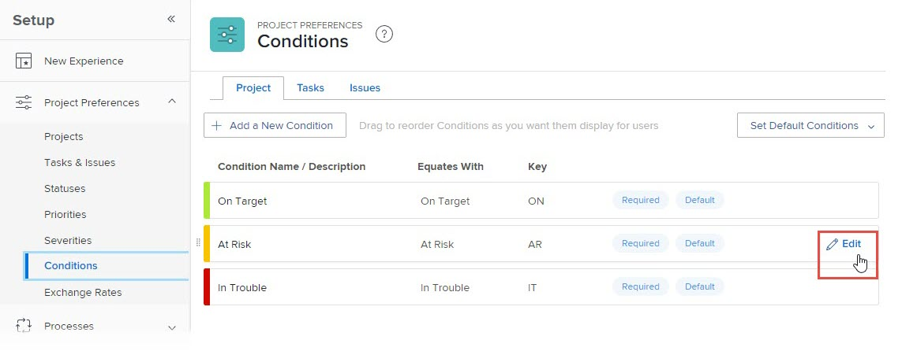

# 创建或编辑自定义条件

作为Adobe Workfront管理员，您可以为项目、任务和问题创建或编辑自定义条件，以满足贵组织的需求。

## 访问要求

+++ 展开以查看本文中各项功能的访问要求。

您必须具有以下权限才能执行本文中的步骤：

<table style="table-layout:auto"> 
 <col> 
 <col> 
 <tbody> 
  <tr> 
   <td>Adobe Workfront计划</td> 
   <td>任何</td> 
  </tr> 
  <tr> 
   <td>Adobe Workfront许可证</td> 
   <td>计划</td> 
  </tr> 
  <tr> 
   <td>访问级别配置</td> 
   <td> 
您必须是Workfront管理员。
 
<b>注意</b>：如果您仍然没有访问权限，请咨询Workfront管理员是否对您的访问级别设置了其他限制。 有关Workfront管理员如何修改您的访问级别的信息，请参阅<a href="../../../administration-and-setup/add-users/configure-and-grant-access/create-modify-access-levels.md" class="MCXref xref">创建或修改自定义访问级别</a>。
 </td> 
  </tr> 
 </tbody> 
</table>

+++

## 创建或编辑自定义条件

{{step-1-to-setup}}

1. 单击&#x200B;**项目首选项** > **条件**。

1. 单击要与条件关联的对象类型（**项目**、**任务**&#x200B;或&#x200B;**问题**）的选项卡。

1. 要创建新条件，请单击&#x200B;**添加新条件**。

   或

   要编辑现有条件，请将鼠标悬停在要编辑的条件上，然后单击最右侧显示的&#x200B;**编辑**&#x200B;图标。

   

1. 使用以下选项配置自定义条件：

   <table style="table-layout:auto"> 
    <col> 
    <col> 
    <tbody> 
     <tr> 
      <td>完成情况名称</td> 
      <td>（必需）键入条件的描述性名称。</td> 
     </tr> 
     <tr> 
      <td>描述</td> 
      <td>（可选）为将使用该条件的用户键入条件用途的描述。</td> 
     </tr> 
     <tr> 
      <td>颜色</td> 
      <td>（可选）单击颜色图标，然后为条件在项目、任务或问题中显示时选择所需的颜色。 您还可以键入十六进制数。</td> 
     </tr> 
     <tr> 
      <td>等于 </td> 
      <td>
（必需，仅适用于项目）单击下拉列表中的选项，该选项最能描述新条件的功能。 例如，对于名为Tracking Well的条件，您可以单击Target。 这决定了默认条件的工作方式。 您创建的每个条件都必须与下拉菜单中的某个选项相同。

      
有关默认条件的信息，请参阅<a href="../../../administration-and-setup/customize-workfront/create-manage-custom-conditions/set-custom-condition-default-projects.md" class="MCXref xref">将自定义条件设置为项目的默认值</a>和<a href="../../../administration-and-setup/customize-workfront/create-manage-custom-conditions/set-custom-condition-default-tasks-issues.md" class="MCXref xref">将自定义条件设置为任务和问题的默认值</a>。

      
完成创建条件后，无法修改此选项。
</td> 
     </tr> 
     <tr> 
      <td>键</td> 
      <td>
（必需）对于项目完成情况，键入用户能够识别的字母数字缩写。 对于任务或问题条件，请键入从01到99的两位数字代码。 

      
此密钥在API中使用并可用于报表目的，对于每个对象必须是唯一的。

      
保存条件后，无法更改条件的键。 
</td> 
     </tr> 
     <tr> 
      <td>隐藏完成情况</td> 
      <td>
（可选）此选项适用于您不再希望用户使用，但由于历史原因而希望保留的自定义条件。 

      
如果隐藏已用于工作项的自定义条件，则在隐藏该条件后，它将继续显示在那些工作项中。 
</td> 
     </tr> 
    </tbody> 
   </table>

   >[!TIP]
   >
   >您可以跨所有三种对象类型标准化条件术语和颜色。 为此，请将条件Name和颜色十六进制代码从一个选项卡（项目、任务、问题）复制到其他两个选项卡上的相应条件。

1. （可选）将任何条件拖到新位置以重新排序列表。

   这会更改条件在项目、任务和问题中的显示顺序：

   * 当用户编辑项目时

     

   * 当用户在“更新”选项卡上更改任务或问题的条件时：

     

   * 当用户更改列表视图中任务或问题的条件时：

     

1. 单击&#x200B;**保存**。

您可以将自定义条件设置为项目或任务和问题的默认条件。 有关详细信息，请参阅[将自定义条件设置为项目的默认值](../../../administration-and-setup/customize-workfront/create-manage-custom-conditions/set-custom-condition-default-projects.md)和[将自定义条件设置为任务和问题的默认值](../../../administration-and-setup/customize-workfront/create-manage-custom-conditions/set-custom-condition-default-tasks-issues.md)。

有关自定义条件的详细信息，请参阅[自定义条件](../../../administration-and-setup/customize-workfront/create-manage-custom-conditions/custom-conditions.md)。
