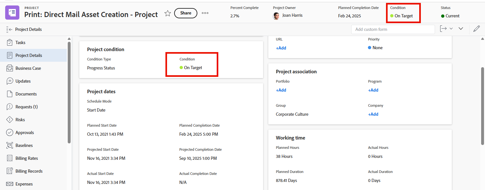

# 将自定义条件设置为项目的默认值

如果项目的完成情况类型设置为“进度状态”而不是“手动”，Adobe Workfront会在项目进行时自动显示三个内置默认完成情况之一（“准时”、“处于风险中”或“存在问题”），如[项目完成情况和完成情况类型概述](../../../manage-work/projects/manage-projects/project-condition-and-condition-type.md)中所述。

您可以将自定义条件设置为默认条件，而不是使用这三个内置的默认条件。 例如，您可以更改“按目标”默认条件，使其在所有项目中均显示为跟踪良好。

## 访问要求

+++ 展开以查看本文中各项功能的访问要求。

您必须具有以下权限才能执行本文中的步骤：

<table style="table-layout:auto"> 
 <col> 
 <col> 
 <tbody> 
  <tr> 
   <td role="rowheader">Adobe Workfront计划</td> 
   <td>任何</td> 
  </tr> 
  <tr> 
  <tr> 
   <td role="rowheader">Adobe Workfront许可证</td> 
   <td>
新增：标准

       
或

       
当前：计划
</td>
  </tr> 
  </tr> 
  <tr> 
   <td role="rowheader">访问级别配置</td> 
   <td>[！UICONTROL系统管理员]</td>
  </tr> 
 </tbody> 
</table>

有关此表中信息的更多详细信息，请参阅Workfront文档中的[访问要求](/help/quicksilver/administration-and-setup/add-users/access-levels-and-object-permissions/access-level-requirements-in-documentation.md)。

+++

## 将自定义条件设置为所有项目的默认条件：

{{step-1-to-setup}}

1. 单击&#x200B;**项目首选项** > **条件**。

1. 单击&#x200B;**项目**&#x200B;选项卡。
1. 单击&#x200B;**设置默认条件**。
1. 在要更改的默认条件的下拉菜单中，单击要改用的自定义条件。
1. 对要更改的任何其他默认条件重复上一步骤。
1. 单击&#x200B;**保存**。

有关将自定义条件设置为任务和问题的默认条件的信息，请参阅[将自定义条件设置为任务和问题的默认值](../../../administration-and-setup/customize-workfront/create-manage-custom-conditions/set-custom-condition-default-tasks-issues.md)。

有关设置项目以便用户可以手动更新其条件的信息，请参阅[任务和问题的更新条件](../../../manage-work/projects/updating-work-in-a-project/update-condition-for-tasks-and-issues.md)。
