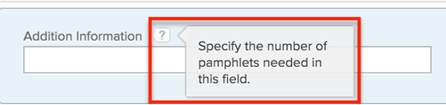

# 使用旧版表单生成器将自定义字段添加到自定义表单

<!-- Audited: 02/2024 -->

{{form-designer-default}}

处理自定义表单时，您可以创建新的自定义字段并将其添加到自定义表单。

您还可以添加已添加到其他自定义表单的自定义字段。 有关说明，请参阅[在自定义表单中重复使用自定义字段或小组件](../../../administration-and-setup/customize-workfront/create-manage-custom-forms/reuse-an-existing-field.md)。

有关将资产小组件添加到自定义表单（与添加自定义字段类似）的信息，请参阅[在自定义表单中添加或编辑资产小组件](../../../administration-and-setup/customize-workfront/create-manage-custom-forms/add-widget-or-edit-its-properties-in-a-custom-form.md)。

>[!NOTE]
>
>在包含大量自定义字段或在自定义字段中包含大量多选选项的自定义表单中，用户在添加或更改这些字段中的值时可能会遇到性能变慢的问题。 例如，包含100个自定义字段或具有超过200个选项的多选自定义字段的表单，在用户与其交互时速度可能会较慢。

## 访问要求

+++ 展开以查看本文中各项功能的访问要求。

您必须具备以下条件才能执行本文中的步骤：

<table style="table-layout:auto"> 
 <col> 
 <col> 
 <tbody> 
  <tr data-mc-conditions=""> 
   <td role="rowheader"> 
Adobe Workfront计划
 </td> 
   <td>任何</td> 
  </tr> 
  <tr> 
   <td role="rowheader">Adobe Workfront许可证</td> 
   <td>
   
新增：标准

   
或

   
当前：计划
</td> 
  </tr> 
  <tr data-mc-conditions=""> 
   <td role="rowheader">访问级别配置</td> 
   <td>对自定义表单的管理访问权限 </td> 
  </tr>  
 </tbody> 
</table>

有关此表中信息的更多详细信息，请参阅Workfront文档中的[访问要求](/help/quicksilver/administration-and-setup/add-users/access-levels-and-object-permissions/access-level-requirements-in-documentation.md)。

+++

## 将自定义字段添加到自定义表单 {#add-custom-field-to-custom-form}

1. 开始创建或编辑自定义表单，如[创建或编辑自定义表单](../../../administration-and-setup/customize-workfront/create-manage-custom-forms/create-or-edit-a-custom-form.md)中所述。
1. 选择&#x200B;**添加字段**&#x200B;选项卡。

   

1. 选择&#x200B;**新字段** 后，选择以下字段类型之一：

   <table style="table-layout:auto"> 
    <col> 
    </col> 
    <col> 
    </col> 
    <tbody> 
     <tr> 
      <td role="rowheader">单行文本字段</td> 
      <td>允许用户在字段中键入单行文本。</td> 
     </tr> 
     <tr> 
      <td role="rowheader">段落文本字段</td> 
      <td>允许用户在字段中键入多行文本。</td> 
     </tr> 
     <tr data-mc-conditions=""> 
      <td role="rowheader">带格式的文本字段</td> 
      <td>允许用户在字段中键入多行文本，并用粗体、斜体、下划线、项目符号、编号、超链接和块引号设置文本的格式。 这在Workfront对象的主页、更新区域、列表和详细信息区域中可用。 15,000个字符的限制允许使用大量文本和格式。
 
列表和报告上的过滤器不支持此自定义字段类型。
 
有关通过API访问此字段的信息，请参阅API中的<a href="../../../administration-and-setup/customize-workfront/create-manage-custom-forms/rich-text-field-storage-in-the-api.md" class="MCXref xref">富文本字段存储</a>。
 
<b>注意</b>：带格式的文本字段不适用于Workfront移动设备应用程序。 
 </td> 
     </tr> 
     <tr> 
      <td role="rowheader">下拉</td> 
      <td>提供下拉选项列表。</td> 
     </tr> 
     <tr> 
      <td role="rowheader">键盘缓冲 </td> 
      <td>允许用户键入Workfront中存在的对象的名称。 用户开始键入内容时，将显示建议列表。
      此字段类型支持以下对象：
      <ul><li>用户</li>
      <li>组</li>
      <li>工作角色</li>
      <li>项目组合</li>
      <li>项目群</li>
      <li>项目</li>
      <li>团队</li>
      <li>模板</li>
      <li>公司</li>
      </ul>      
      </td> 
     </tr> 
     <tr> 
      <td role="rowheader">已计算</td> 
      <td>允许您定义表达式并在自定义表单上显示结果。 有关详细信息，请参阅<a href="../../../administration-and-setup/customize-workfront/create-manage-custom-forms/add-calculated-data-to-custom-form.md" class="MCXref xref">将计算的数据添加到自定义表单</a>。</td> 
     </tr> 
     <tr> 
      <td role="rowheader">日期</td> 
      <td>显示一个日历，用户可以在其中选择日期和时间。</td> 
     </tr> 
     <tr> 
      <td role="rowheader">复选框</td> 
      <td>允许用户选择多个选项。</td> 
     </tr> 
     <tr> 
      <td role="rowheader">单选按钮</td> 
      <td>要求用户仅选择一个选项。</td> 
     </tr> 
     <tr> 
      <td role="rowheader">说明文本</td> 
      <td>允许您包含相关说明，并包含指向Workfront外部页面的链接。</td> 
     </tr> 
     <tr> 
      <td role="rowheader">分节符</td> 
      <td>分区界限实际上不是字段。 您可以使用分区界限将自定义字段和小组件组织到分区中，并在必要时为每个分区配置不同的查看和编辑权限。 有关添加和配置分区界限的信息，请参阅<a href="../../../administration-and-setup/customize-workfront/create-manage-custom-forms/add-a-section-break-to-a-custom-form.md" class="MCXref xref">将分区界限添加到自定义表单</a>。</td> 
     </tr> 
    </tbody> 
   </table>

   >[!NOTE]
   >
   >允许进行多项选择的字段，例如复选框和下拉列表，很难在报告中进行图表和分组。 为了更便于在报告中使用图表和进行分组，您可以为每个选择创建单独的字段（例如，单行文本字段）。

1. 在&#x200B;**字段设置**&#x200B;选项卡上，配置可用于要添加的自定义字段类型的选项：

   <table style="table-layout:auto"> 
    <col> 
    </col> 
    <col> 
    </col> 
    <tbody> 
     <tr> 
      <td role="rowheader">标签</td> 
      <td> 
（必需）键入要显示在自定义字段上方的描述性标签。 您可以随时更改标签。
 
<b>重要提示</b>：请避免在此标签中使用特殊字符。 它们在报表中无法正确显示。
 </td> 
     </tr> 
     <tr> 
      <td role="rowheader">名称</td> 
      <td> 
（必需）此名称是向Workfront中的各个区域（如报表、主页和API交互）添加自定义字段时，系统识别该字段的方式。
 
首次配置自定义字段并键入标签时，会自动填充名称字段以匹配它。 但是“标签”和“名称”字段不同步，这使您能够自由更改用户看到的标签，而无需更改系统看到的名称。
 
      
<b>重要信息</b>：   
      <ul> 
      <li>虽然可以这样做，但我们建议，在您或其他用户开始使用Workfront中的自定义表单后，不要更改此名称。 如果这样做，系统将不再能够识别Workfront其他区域中现在可能引用该字段的自定义字段。 
例如，如果您将自定义字段添加到报表后更改其名称，Workfront将无法识别该字段在报表中的名称，并且除非您使用新名称将其重新添加到报表，否则该字段将在报表中停止正常工作。
 </li>
      <li> 
我们建议您不要键入已用于内置Workfront字段的名称。
 </li>
      <li>
我们建议您在自定义字段名称中不要使用句点/点字符，以防止在Workfront的不同区域使用字段时出错。
</li>
      </ul> 
每个自定义字段名称在贵组织的Workfront实例中必须唯一。 这样，您就可以重复使用已经为其他自定义表单创建的表单。 有关详细信息，请参阅本文中的<a href="#add-a-custom-field-to-a-custom-form">将自定义字段添加到自定义表单</a>。
 </td>
     </tr> 
     <tr> 
      <td role="rowheader">说明</td> 
      <td> 
键入有关自定义字段的任何其他信息。 当用户填写自定义表单时，可以将光标悬停在问号图标上，以查看包含您在此处键入的信息的工具提示。
 
      
  

      </td> 
     </tr> 
     <tr> 
      <td role="rowheader">格式</td> 
      <td> 
选择将在自定义字段中捕获的数据类型。 您可以在保存表单后更改格式选择，但新格式必须支持输入的值。

   
<strong>示例：</strong>如果至少在一个对象上保存了采用“文本”格式的字段的数值，以后又将该格式更改为“数字”或“货币”，则不会遇到错误。 

      
但是，如果在至少一个对象上使用“文本”格式在字段中保存字母数字值，然后尝试将格式更改为“数字”或“货币”，则将遇到错误，因为保存的字母数字值与数字或货币格式不兼容。 

   
<strong>注意：</strong>数字字段的字符限制为16。 您还可以使用文本字段输入数字并避免限制。

   </td> 
     </tr> 
     <tr> 
      <td role="rowheader">显示类型</td> 
      <td>（仅下拉列表、复选框和单选按钮）切换字段所需的选项选择类型。</td> 
     </tr> 
     <tr> 
      <td role="rowheader">大小</td> 
      <td>（仅限文本字段）选择字段的宽度。</td> 
     </tr> 
     <tr> 
      <td role="rowheader">显示当日时间</td> 
      <td>（仅限日期字段）如果要在字段中显示一天中的时间和日期，请选择此选项。</td> 
     </tr> 
     <tr> 
      <td role="rowheader">参考对象类型</td> 
      <td> 
（仅限预输入字段）选择要与字段关联的对象类型。
 
单击“应用”或“保存+关闭”后，将无法更改该字段的对象类型。
 
<b>注释</b>：   
        <ul> 
         <li>如果您的Workfront管理员在Workfront用户界面中为Portfolio、程序或项目自定义了名称，则该对象的默认Workfront名称将显示在此下拉列表中，而不是自定义名称中。 如果您需要此方面的帮助，请咨询您的Workfront管理员。 </li> 
         <li>iOS和Android Workfront Mobile应用程序支持以下对象类型：用户、公司、组、工作角色、Portfolio、项目、项目和模板。</li> 
        </ul> 
 </td> 
     </tr> 
     <tr data-mc-conditions=""> 
      <td role="rowheader">添加筛选器</td> 
      <td> 
（仅限预输入字段）为对象类型添加过滤器，以限制用户在使用该字段时可以选择的对象。 
 
例如，您可以限制一个字段，这样只有当用户名满足以下条件时才可以选择用户名：
 
       <ul> 
        <li>它们属于您指定的一个或多个组</li> 
        <li>它们与您指定的角色或职称相关联</li> 
        <li>他们与使用字段的人属于同一组</li> 
       </ul> 
必须使用文本模式语法为所选对象类型定义过滤器。 有关使用文本模式创建过滤器的信息，请参阅<a href="/help/quicksilver/reports-and-dashboards/reports/text-mode/edit-text-mode-in-filter.md" class="MCXref xref">使用文本模式编辑过滤器</a>。

       
<b>注释</b>：   
        <ul> 
         <li>如果您正在编辑现有的自定义表单，则将过滤器添加到“预输入”字段不会移除用户已使用该字段添加的任何对象（在过滤器的范围外）。</li> 
         <li>此筛选器在移动设备上不可用。 如果您将过滤器用于“预输入”字段，则该字段将显示在不受过滤器影响的用户移动设备上。</li> 
        </ul> 
 </td> 
     </tr> 
     <tr> 
      <td role="rowheader">说明文本</td> 
      <td>（仅限描述性文本字段）键入要显示的文本，以便在自定义表单上提供说明或链接。 </td> 
     </tr> 
     <tr> 
      <td role="rowheader">超链接</td> 
      <td>（仅限描述性文本字段）如果要将超链接应用于已键入的描述性文本，请在此处添加该超链接。</td> 
     </tr> 
     <tr> 
      <td role="rowheader">制作一个必填字段</td> 
      <td>如果希望该字段是用户完成自定义表单所必需的，请选择此选项。 </td> 
     </tr> 
     <tr> 
      <td role="rowheader">在更新提要中跟踪字段变化</td> 
      <td>
单击下拉列表，然后选择要自动跟踪字段值更改的对象类型。
 
      
<b>注意</b>：此选项不适用于以下项目：
 
      <ul> 
      <li>与以下对象类型关联的自定义表单：费用、公司、迭代、记帐记录、文档和组。</li> 
      <li>以下字段类型：计算值、描述性文本和分节符</li> 
      </ul>
      
<b>重要信息</b>：在此处选择或取消选择对象类型会影响与所选对象类型关联且包含此字段的所有自定义表单。 例如，如果在此取消选择某个对象类型并保存该自定义表单，则在包含该字段的任何自定义表单中，将不再跟踪该对象类型的字段值更改。

       
在此处为字段选择对象类型并保存自定义表单后，该字段会显示在“设置”的“更新馈送”区域的“自定义字段”选项卡上。
 
       
反之，如果在“设置”的“更新源”区域中删除了此字段，则会在所有与该对象类型关联且包含此字段的自定义表单上取消选择此设置的对象类型。
 
       
有关详细信息，请参阅<a href="/help/quicksilver/administration-and-setup/set-up-workfront/system-tracked-update-feeds/configure-system-updates.md">配置系统更新</a>一文中的<a href="/help/quicksilver/administration-and-setup/set-up-workfront/system-tracked-update-feeds/configure-system-updates.md#add-fields-you-want-workfront-to-track">添加您希望Workfront跟踪的字段</a>部分。
 </td> 
     </tr> 
     <tr> 
      <td role="rowheader">添加逻辑</td>
      <td>根据用户在现有字段中所做的选择，指定应在表单上显示的字段。 有关详细信息，请参阅<a href="../../../administration-and-setup/customize-workfront/create-manage-custom-forms/display-or-skip-logic-custom-form.md" class="MCXref xref">将显示逻辑和跳过逻辑添加到自定义表单</a>。</td> 
     </tr> 
     <tr> 
      <td role="rowheader">选项 </td> 
      <td> 
（仅限下拉列表、复选框或单选按钮；可选）
 
       <ol> 
        <li> 
单击<b>选项</b>，然后启用以下任一选项：
 
           <ul> 
            <li><strong>显示值</strong>：显示字段中每个选择的值。 默认情况下，将显示每个选项的标签。</li> 
            <li><strong>选择排序A-Z</strong>：按字母顺序对您在字段中添加的选择进行排序。</li> 
           </ul> 
        </li> 
        <li> 
对于您为用户添加的每个选项，单击齿轮图标，然后选择以下选项之一：
 
           <ul> 
            <li><strong>默认选择</strong>：在字段中选择默认选择。</li> 
            <li> 
<strong>隐藏选择</strong>：隐藏字段中的选择。 隐藏选项在报表中仍可访问。
 </li> 
            <li> 
<strong>删除选择</strong>：从字段中删除选择。
 
<b>警告</b>：如果当前对象使用此选项，请不要将其从字段中移除。 删除它将会导致历史数据丢失。 相反，选择选项可隐藏它，这会阻止用户将来选择它。
 </li> 
           </ul> 
        </li> 
       </ol> </td> 
     </tr> 
    </tbody> 
   </table>

1. （视情况而定）要更改自定义表单中字段的显示类型，请单击&#x200B;**显示类型**&#x200B;下拉菜单，然后单击所需的类型。

   您可以在以下字段显示类型之间切换：

   * **选择类型字段**：复选框、下拉列表、单选按钮。
   * **文本类型字段**：单行文本字段、段落文本字段。 (不能将带格式的文本字段切换到其他显示类型。 但是，您可以删除它并添加其他类型的字段。)

   例如，如果您已创建复选框字段，则可以将其更改为下拉列表字段或单选按钮字段。 或者，如果您已创建单行文本字段，则可以将其更改为段落文本字段。

   >[!NOTE]
   >
   >当您想要将字段的显示类型从复选框字段或多选下拉字段（允许选择多个选项的下拉字段）更改为单选字段类型时，请考虑以下事项：
   >
   >* 如果更改为单选按钮，Workfront会保留用户可能在字段中输入的任何多选值，直到用户更改并将数据保存到表单的任何部分为止。 此时，使用“多选类型”字段选择的任何值都将被选定的“单选按钮”值替换。
   >* 如果更改为单选下拉列表，Workfront会保留用户可能在字段中输入的任何多选值，直到用户更改并保存该字段中的值为止。 此时，使用多选类型字段选择的任何值都将被所选的下拉值替换。

1. （可选）重复步骤3至5以添加更多自定义字段。

   或

   添加已经为您的组织创建的字段，如[在自定义表单中重复使用自定义字段或小组件](../../../administration-and-setup/customize-workfront/create-manage-custom-forms/reuse-an-existing-field.md)中所述。

   >[!NOTE]
   >
   >您最多可以在单个自定义表单上添加500个字段和小部件。 但是，当表单中存在超过100个时，可能会发生性能下降，具体取决于表单的复杂性。 复杂表单的示例包括带有层叠参数的表单、计算的自定义数据字段以及单个字段中的多个值选项。

1. 单击&#x200B;**应用**。
1. 如果要继续以其他方式构建自定义表单，请继续阅读以下文章之一：

   * [在自定义表单中放置自定义字段和小部件](../../../administration-and-setup/customize-workfront/create-manage-custom-forms/position-fields-in-a-custom-form.md)
   * [在自定义表单中添加或编辑资源小组件](../../../administration-and-setup/customize-workfront/create-manage-custom-forms/add-widget-or-edit-its-properties-in-a-custom-form.md)
   * [将计算的数据添加到自定义表单](../../../administration-and-setup/customize-workfront/create-manage-custom-forms/add-calculated-data-to-custom-form.md)
   * [向自定义表单添加分区界限](../../../administration-and-setup/customize-workfront/create-manage-custom-forms/add-a-section-break-to-a-custom-form.md)
   * [在自定义表单中重用现有的计算自定义字段](../../../administration-and-setup/customize-workfront/create-manage-custom-forms/use-existing-calc-field-new-custom-form.md)
   * [将显示逻辑和跳过逻辑添加到自定义表单](../../../administration-and-setup/customize-workfront/create-manage-custom-forms/display-or-skip-logic-custom-form.md)
   * [预览并完成自定义表单](../../../administration-and-setup/customize-workfront/create-manage-custom-forms/preview-and-complete-a-custom-form.md)
