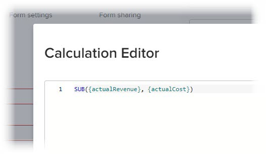

# 将计算数据添加到自定义表单

在自定义表单中，您可以添加一个计算量度的自定义字段，该字段在自定义表单附加到对象后，会使用现有数据生成新数据。

计算的自定义字段可以包含：

* 对单个内置字段的简单引用。

   >[!INFO]
   >
   > **示例：** 要计算由项目和任务生成的收入，您可以创建一个包含内置字段“实际收入”的计算自定义字段。 当某人将自定义表单附加到项目或任务时，该项目或任务的收入将显示在字段中。

* 引用一个或多个字段的表达式。 这些字段可以是自定义字段、其他计算的自定义字段和内置字段。

   >[!INFO]
   >
   >**示例：** 要计算项目和任务产生的利润，您可以创建一个名为“利润”的计算自定义字段，其中包含从收入中减去成本的数学表达式。
   >
   >为此，您可以将数学表达式SUB（减）与内置的Workfront字段“实际成本”和“实际收入”一起使用。
   >
   >在以下步骤中，您可以看到如何执行此示例。

有关为组织创建自定义表单以及了解可与其关联的字段类型的信息，请参阅 [创建或编辑自定义表单](../../../administration-and-setup/customize-workfront/create-manage-custom-forms/create-or-edit-a-custom-form.md).

## 访问要求

您必须具备以下条件才能执行本文中的步骤：

<table style="table-layout:auto"> 
 <col> 
 <col> 
 <tbody> 
  <tr data-mc-conditions=""> 
   <td role="rowheader"> 
Adobe Workfront计划*
 </td> 
   <td>任意</td> 
  </tr> 
  <tr> 
   <td role="rowheader">Adobe Workfront许可证*</td> 
   <td>计划</td> 
  </tr> 
  <tr data-mc-conditions=""> 
   <td role="rowheader">访问级别配置*</td> 
   <td> 
对自定义表单的管理访问权限
 
有关Workfront管理员如何授予此访问权限的信息，请参阅 <a href="../../../administration-and-setup/add-users/configure-and-grant-access/grant-users-admin-access-certain-areas.md" class="MCXref xref">授予用户对特定区域的管理访问权限</a>.
 </td> 
  </tr>  
 </tbody> 
</table>

&#42;要了解您拥有的计划、许可证类型或访问级别配置，请联系您的Workfront管理员。

## 向自定义表单中添加计算字段 {#add-a-calculated-field-to-a-custom-form}

您可以使用内置的Workfront字段和已创建的自定义字段。

>[!IMPORTANT]
>
>在创建新的计算自定义字段之前，请确定要包含的现有字段，以确保计算所需的数据存在于Workfront中。

1. 开始创建或编辑自定义表单，如 [创建或编辑自定义表单](../../../administration-and-setup/customize-workfront/create-manage-custom-forms/create-or-edit-a-custom-form.md).

1. 在 **添加字段** ，单击 **已计算**.

   在右侧的显示区域中，显示字段 *12345*. 这只是一个指示器，用于在您创建或编辑自定义表单时提醒您该字段是计算的自定义字段。 当表单附加到某个对象并且用户正在填写该对象时，他们会在字段中看到计算结果，而不是 *12345* 指标。

1. 为计算字段指定以下信息：

   <table style="table-layout:auto"> 
    <col> 
    </col> 
    <col> 
    </col> 
    <tbody> 
     <tr> 
      <td role="rowheader">标签</td> 
      <td>键入字段的标签。 这是用户在使用自定义表单时将看到的内容。 字段 <b>名称</b>,Workfront会在报表中引用自动填充的。</td> 
     </tr> 
     <tr> 
      <td role="rowheader" id="instructions">说明</td> 
      <td> 默认情况下，您为字段创建的公式会存储在此处。 您可以添加文本，以提供有关字段及其公式的其他信息。 这在以下两种方面非常有用： 
       <ul> 
        <li> 
提醒我们这个公式是什么，它是如何运作的。 如果您计划在多个表单上使用此计算量度的自定义字段，此功能会特别有用。
 </li> 
        <li> 
当用户将鼠标悬停在字段上时，可以看到工具提示。 您可以在此处添加希望在工具提示中看到的任何文本。
 
如果您不希望他们在工具提示中看到公式（可能会令他们感到困惑），可以将其隐藏。 有关说明，请参阅部分中的表格行“在说明中显示公式” <a href="#build-the-calculation-for-your-calculated-custom-field" class="MCXref xref">为计算的自定义字段生成计算</a> 在本文中。
 </li> 
       </ul> 
有关在新表单上使用相同计算量度的自定义字段的信息，请参阅 <a href="../../../administration-and-setup/customize-workfront/create-manage-custom-forms/use-existing-calc-field-new-custom-form.md#using-an-existing-calculated-custom-field-on-a-new-form" class="MCXref xref">在自定义表单中重复使用现有的计算自定义字段</a>.
 </td> 
     </tr> 
     <tr> 
      <td role="rowheader">格式</td> 
      <td> 
您希望存储和显示字段结果的格式。
 
如果在数学计算中将使用字段，请始终使用 <strong>数值</strong> 或 <strong>货币</strong> 格式。 选择“数字”或“货币”时，系统会自动截断以0开头的数字。
 
      
<b>重要信息</b>:在选择格式之前，请考虑新字段的正确格式。 保存自定义表单后，无法编辑格式字段。 而选择错误的格式可能会影响报表和列表分组中未来的计算和聚合值。
 </td> 
     </tr> 
    </tbody> 
   </table>

1. 继续 [为计算的自定义字段生成计算](#build-the-calculation-for-your-calculated-custom-field) 在本文中。

## 为计算的自定义字段生成计算 {#build-the-calculation-for-your-calculated-custom-field}

1. 开始创建计算的自定义字段，如 [向自定义表单中添加计算字段](#add-a-calculated-field-to-a-custom-form) 在本文中。

1. 单击 **最大化** 打开 **计算编辑器** 然后计算。

   >[!INFO]
   >
   >**示例：** 通过本文简介中的示例，您可以在自定义表单中为项目和任务创建一个名为Profit的计算自定义字段。 此字段可包含显示实际收入与实际成本之差的计算：
   >
   >`SUB({actualRevenue},{actualCost})`
   >
   >在本例中， `SUB` 是表达式，引用的字段为 `actualRevenue` 和 `actualCost`.

   计算通常以表达式开头，后跟括号，其中包含在自定义表单附加到对象时要引用的字段。 有关可用表达式的信息，请参阅 [计算数据表达式](../../../reports-and-dashboards/reports/calc-cstm-data-reports/calculated-data-expressions.md).

   每个字段都必须用大括号括起来，如 [计算自定义字段中所需的语法](#syntax-required-in-calculated-custom-fields) 在本文中。 当您开始键入字段名称时，系统会提供建议，您可以选择一个字段以将其插入到计算中。

   在计算中可以引用任何类型的自定义字段，但以下两种情况除外：具有格式类型的文本字段和描述性文本。 有关自定义字段类型的信息，请参阅 [将自定义字段添加到自定义表单](../../../administration-and-setup/customize-workfront/create-manage-custom-forms/add-a-custom-field-to-a-custom-form.md)

1. 单击大文本框，然后单击 **表达式** 和 **字段** ，以将其添加到计算中。

   您还可以在大型文本框中开始键入表达式或字段，然后在显示时将其选中。 每个项目都显示“F”作为字段，“E”作为表达式。

   如果键入左圆括号，则会自动添加右圆括号。

   >[!TIP]
   >
   >您可以执行以下任一操作来获取有关计算的帮助：
   > 
   >* 将鼠标悬停在计算中的表达式上可查看描述、显示如何使用该表达式的示例，以及指向文章中更多信息的“了解更多”链接 [计算数据表达式](../../../reports-and-dashboards/reports/calc-cstm-data-reports/calculated-data-expressions.md).
      >  
   >* 使用颜色编码标识已添加的组件。 表达式以蓝色显示，字段以绿色显示。
      >  
   >* 查找计算错误，并在您转到时以粉红色突出显示。 您可以将鼠标悬停在突出显示的错误上，以显示其原因的简要描述。
      >  
   >* 在计算下方的区域中，预览现有Workfront对象的结果。

   ><!--or by providing test values (NOT READY YET; CHANGE THIS SCREENSHOT WHEN IT IS)-->
   >  
   >* 使用左侧显示的行号在长计算中引用表达式。

1. 单击 **最小化** 完成计算的自定义字段的计算时。

   >[!NOTE]
   >
   >在右侧的显示区域中，显示字段 *12345。* 这只是一个指示器，用于在您创建或编辑自定义表单时提醒您该字段是计算的自定义字段。 当表单附加到某个对象并且用户正在填写该对象时，他们会在字段中看到计算结果，而不是 *12345* 指标。

1. （可选）使用以下任意选项进一步配置计算的自定义字段：

   <table style="table-layout:auto"> 
    <col> 
    <col> 
    <tbody> 
     <tr> 
      <td role="rowheader">添加逻辑</td> 
      <td>您可以添加显示逻辑，以根据用户在填写表单时在前多个选择字段（下拉列表、复选框或单选按钮）中至少做出的一项选择来确定是否显示计算字段。 有关更多信息，请参阅 <a href="../../../administration-and-setup/customize-workfront/create-manage-custom-forms/display-or-skip-logic-custom-form.md" class="MCXref xref">向自定义表单添加显示逻辑和跳过逻辑</a>. 
仅当表单上计算的自定义字段之前至少有一个复选框、单选按钮或下拉字段时，才可使用此选项。 
 
跳过逻辑对于计算的自定义字段不可用。
 </td> 
     </tr> 
     <tr> 
      <td role="rowheader">更新以前的计算</td> 
      <td>编辑现有的计算自定义字段时，您可以选择此选项以在保存自定义表单时触发计算中的更新。 仅在保存自定义表单时发生一次。 在执行此操作后，选项会返回到其禁用状态。</td> 
     </tr> 
     <tr> 
      <td role="rowheader">在说明中显示公式</td> 
      <td>如果希望填写自定义表单的用户在将鼠标悬停在字段上时查看字段的公式，请启用此选项。 有关更多信息，请参阅 <a href="#instructions" class="MCXref xref">说明</a> 在此表格的前面。</td> 
     </tr> 
    </tbody> 
   </table>

1. 单击 **完成** 在计算的自定义字段中完成所有更改时。

   或者，单击 **应用** 以便在表单中继续添加自定义字段时，将所做更改应用到表单。

   或者，单击 **保存并关闭** 在自定义表单上完成所有更改时。
1. 要验证计算的自定义字段是否正常工作，请将自定义表单附加到对象，然后在计算的自定义字段中查看结果。

   有关附加自定义表单的说明，请参阅 [将自定义表单添加到对象](../../../workfront-basics/work-with-custom-forms/add-a-custom-form-to-an-object.md).

   如果您希望通过其他方式继续构建自定义表单，则可以继续阅读以下文章之一：

   * [将自定义字段添加到自定义表单](../../../administration-and-setup/customize-workfront/create-manage-custom-forms/add-a-custom-field-to-a-custom-form.md)
   * [在自定义表单中放置自定义字段和小组件](../../../administration-and-setup/customize-workfront/create-manage-custom-forms/position-fields-in-a-custom-form.md)
   * [在自定义表单中添加或编辑资产小组件](../../../administration-and-setup/customize-workfront/create-manage-custom-forms/add-widget-or-edit-its-properties-in-a-custom-form.md)
   * [在自定义表单中重复使用现有的计算自定义字段](../../../administration-and-setup/customize-workfront/create-manage-custom-forms/use-existing-calc-field-new-custom-form.md)
   * [向自定义表单添加显示逻辑和跳过逻辑](../../../administration-and-setup/customize-workfront/create-manage-custom-forms/display-or-skip-logic-custom-form.md)
   * [预览并完成自定义表单](../../../administration-and-setup/customize-workfront/create-manage-custom-forms/preview-and-complete-a-custom-form.md)

## 计算自定义字段中所需的语法

每个字段必须使用下面介绍的语法，并在每个字段名称周围带有大括号。 当您开始键入字段名称时，系统会提供建议，您可以选择一个字段以将其插入到计算中。 如果您在计算中输入的数据不正确，系统会发出警告消息，提醒您。 除非编辑计算以包含有效字段和有效的计算表达式，否则无法保存表单。

>[!NOTE]
>
>目前，仅当您开始键入要在自定义表单将附加到的对象上引用的字段名称时，系统才会提出建议，而不是在对象的父级上。

### 用大括号括住字段名称

* 如果希望计算引用内置字段，则字段的名称必须用大括号括起来。

例如： `{actualRevenue}`

字段名称区分大小写，且必须准确显示在Workfront系统中的显示方式，才能在计算中显示。

* 如果希望计算引用自定义字段，则字段名称必须用大括号括起来，并在前面加上 `DE:` 括号内。

例如： `{DE:Profit}`

系统会列出您在键入时可以从中选择的所有自定义字段 `DE:`.

* 如果希望计算引用将从 *父项* 对象在自定义表单附加到对象后，必须在字段名称前面加上父对象的对象类型，也以花括号括起来。

   例如，如果自定义表单配置为处理任务，并且您希望字段在表单附加到任务时计算父对象的实际收入，则需要指示 `Project` 作为字段的对象类型：

   `{project}.{actualRevenue}`

   或者，如果是自定义字段：

   `{project}.{DE:profit}`

   如果您不确定父对象的对象类型是什么，因为为的自定义配置了多个对象类型，则可以使用通配符过滤器变量 `$$OBJCODE` 以允许计算适用于每种可能的类型。 有关更多信息，请参阅 [多对象自定义表单中的计算自定义字段](#calculated-custom-fields-in-multi-object-custom-forms) 在本文中。

### 使用句点分隔项目

在计算的自定义字段中引用相关对象时，必须使用句点来分隔对象名称和属性。

例如，在任务类型自定义表单中，要在计算的自定义字段中显示Portfolio所有者的名称，您应键入以下内容：

`{project}.{porfolio}.{owner}`

这将确定以下内容：从自定义表单（任务）的对象中，可以访问与任务（项目）相关的下一个对象。 从此处，您可以访问项目的下一个相关对象（项目组合），然后访问项目组合的下一个相关对象（所有者）。

### 用于引用自定义字段的名称语法

在计算的自定义字段中引用其他自定义字段时，您需要输入该字段在Workfront用户界面中显示的名称。

例如，要在标有执行赞助商的自定义字段中引用所选选项，您应键入以下内容：

`{DE:Executive sponsor}`

>[!NOTE]
>
>typeahead字段的语法与其他类型字段的语法略有不同，因为您需要添加 `:name` 最后。
>
>例如，要引用名为“执行赞助商”的自定义类型前导字段中的选定选项，您需要键入：
>
>`{DE:Executive sponsor:name}`

## 多对象自定义表单中的计算自定义字段 {#calculated-custom-fields-in-multi-object-custom-forms}

在多对象自定义表单中，所选对象类型必须与表单的计算自定义字段中引用的所有字段兼容。 如果出现不兼容的情况，系统会显示一条消息，提醒您进行调整。

>[!INFO]
>
>**示例:**
>
>在配置为与任务对象类型一起使用的自定义表单中，您可以创建一个名为“负责”的计算自定义字段。 您可以将其配置为引用内置字段，以便在表单附加到任务时，它可以显示主要负责人的名称：
>
>`{assignedTo}.{name}`
>
>稍后，您将Project对象类型添加到自定义表单中。 出现警告消息，告知您Project对象类型与计算的自定义字段不兼容。

发生此情况时，您可以执行以下操作之一：

* 从自定义表单中删除两个不兼容的项目之一 — 对象类型或引用的计算自定义字段。
* 保留两个项目并使用通配符过滤器变量 `$$OBJCODE` 作为IF表达式中的一个条件，以创建“主管”字段的两个不同版本。 这样，无论表单附加到哪种类型的对象，字段都可以成功运行。

>[!INFO]
>
>**示例：** 尽管没有分配给：项目中的“名称”字段中有一个内置的“所有者”字段（除非有人手动更改此字段，否则将自动填写创建项目的人员的姓名）。
>
>因此，在您的自定义“主管”字段中，您可以使用 `$$OBJCODE` 如下所示，在将自定义表单附加到项目时引用“所有者”字段，并且指定给：表单附加到任务时的“名称”字段：
>
>`IF($$OBJCODE="PROJ",{owner}.{name},{assignedTo}.{name})`

有关变量(如 `$$OBJCODE,` 请参阅 [通配符过滤器变量](../../../reports-and-dashboards/reports/reporting-elements/understand-wildcard-filter-variables.md).

## 自动更新计算的自定义字段

发生以下情况时，对象上的计算自定义字段会自动重新计算：

* 对象上的某些内容会发生更改，例如每日时间轴计算。
* 某人编辑了对象上计算自定义字段引用的其他字段。
* 计算表达式为空，且字段包含值 — 这会将值设置为null。

   >[!NOTE]
   >
   >
在附加到对象的自定义表单中，计算的自定义字段中的日期和时间语句由协调通用时间(UTC)计算和保存，而不是由为组织实例和用户配置文件设置的时区配置来计算和保存。 自定义表单中的计算会根据每个用户的各个时区生成。

