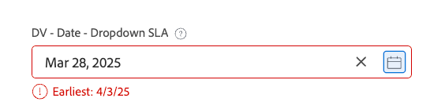
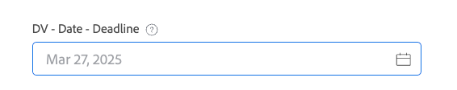

# 自定义表单中的高级逻辑示例

利用逻辑规则，可进一步自定义自定义表单上的字段。

本文提供用于在自定义字段中构建高级逻辑的表达式示例。

有关将逻辑添加到自定义表单的详细信息，请参阅[将逻辑规则添加到自定义表单和字段](/help/quicksilver/administration-and-setup/customize-workfront/create-manage-custom-forms/form-designer/design-a-form/display-skip-logic-form-designer.md)。

## 访问要求

+++ 展开以查看本文中各项功能的访问要求。

<table style="table-layout:auto"> 
 <col> 
 <col> 
 <tbody> 
  <tr> 
   <td>Adobe Workfront包</td> 
   <td><p>任何</p></td> 
  </tr> 
  <tr> 
   <td>Adobe Workfront许可证</td> 
   <td><p>标准</p>
       <p>规划</p></td>
  </tr> 
  <tr> 
   <td>访问级别配置</td> 
   <td> <p>对自定义表单的管理访问权限</p> </td> 
  </tr>  
 </tbody> 
</table>

有关信息，请参阅Workfront文档中的[访问要求](/help/quicksilver/administration-and-setup/add-users/access-levels-and-object-permissions/access-level-requirements-in-documentation.md)。

+++

## 验证逻辑示例

验证逻辑是使用公式构建的，您可以根据需要使逻辑简单或复杂。 验证可以基于其他字段的值或对象的状态，并且您可以在验证失败时提供错误消息。

如果用户填写自定义表单时，如果应用了逻辑的字段满足定义的验证条件，则该字段会高亮显示并显示错误消息。

您可以将验证逻辑应用于以下字段类型：单行文本、段落、单选下拉列表、多选下拉列表、外部查找、预输入、日期、复选框组和单选按钮。

### 仅允许项目所有者选择“Rush”SLA

在此示例中，单选下拉字段可以选择“标准”SLA - 14天、“优先级 — 7天”和“匆忙 — 2天”。

验证表达式：

```
IF({ownerID}!=$$USER&&{DE:DV - Dropdown - Control Dates}="2",CONCAT("Only ",{owner}.{name}," may select X Rush"))
```

当任何非项目所有者（包括系统管理员）尝试选择&#x200B;**X Rush**&#x200B;时，会显示错误：


### 基于上一字段中的选择的日期验证

继续以SLA为例，您可以添加根据上一个下拉字段中的设置进行验证的日期字段。

验证表达式：

```
IF({DE:DV - Date - Dropdown SLA}<ADDDAYS($$TODAY,{DE:DV - Dropdown - Control Dates}),CONCAT("Earliest: ",ADDDAYS($$TODAY,{DE:DV - Dropdown - Control Dates})))
```

如果用户选择的日期早于允许的日期，则消息将显示用户可以选择的最早日期：



### 包含要覆盖的选项的最小字符数

在此示例中，对文本字段强制实施最小字符计数，并显示字符计数。 此外，还会设置一个单独的复选框来禁用字符数验证。

验证表达式：

```
IF({DE:DV - Override}!="Disable Validation"&&LEN({DE:DV - Text - Min Length})<"7",CONCAT(LEN({DE:DV - Text - Min Length})," characters / ",("7"-LEN({DE:DV - Text - Min Length}))," remaining"))
```

可以通过选中以下复选框来覆盖验证的实施：


文本字段中包含正在运行的字符计数：


### 锁定字段，以便只有所有者可以编辑它

在此示例中，字段只能由项目所有者编辑。 即使系统管理员也无法编辑该字段。

验证表达式：

```
IF({ownerID}!=$$USER,IF(ISBLANK({ownerID}),"Project Owner will provide this.",CONCAT("Only ",{owner}.{name}," can edit this.")))
```

如果非项目所有者用户尝试在字段中键入，他们会看到一条消息，说明只有项目所有者才能编辑该字段。


### 预输入根据其他字段值允许或拒绝值

在此示例中，预输入字段根据在表单上的其他字段中输入的值，动态允许或拒绝值。

验证表达式：

```
IF({DE:DV - Text - Budget}>"10000",
   IF({DE:DV - TA User - by Budget}.{role}!="Director","Requires Director Approver")
)
```

如果预算字段中的值超过$10,000，那么即使预输入配置上未启用角色过滤器，也只能从预输入中选择具有Director角色的用户。


### 不允许输入日期起不到10天的值

在此示例中，验证仅允许输入日期起未来10天的值。 公式中还包括覆盖验证的选项（在单独的复选框字段中），并允许日期字段为空。

验证表达式：

```
IF({DE:DV - Override}!="Disable Validation"&&ISBLANK({DE:DV - Date - Deadline})!="true"&&{DE:DV - Date - Deadline}<ADDDAYS({entryDate},"10"),CONCAT("Earliest: ",ADDDAYS({entryDate},"10")))
```

任何自输入日期起不到10天的值都会触发验证：


空值不会触发验证消息：

的值为空

### 在多选字段中强制实施精确/最小/最大选择

在此示例中，复选框组等多选字段要求用户选择特定数量的选项。

验证表达式（只选取两个）：

```
IF({DE:DV - Override}!="Disable Validation"&&ARRAYLENGTH(ARRAY({DE:DV - Checkbox - Pick exactly 2},","))!="2","Pick Exactly 2 Options")
```

验证表达式（至少选取两个）：

```
IF({DE:DV - Override}!="Disable Validation"&&ARRAYLENGTH(ARRAY({DE:DV - Checkbox - Pick at least 2},","))<"2","Pick at least 2 choices")
```

验证表达式（选取的不超过两个）：

```
IF({DE:DV - Override}!="Disable Validation"&&ARRAYLENGTH(ARRAY({DE:DV - Checkbox - Pick no more than 2},","))>"2","Pick no more than 2 choices")
```

如果用户未选择正确数量的选项，则会看到验证错误。


