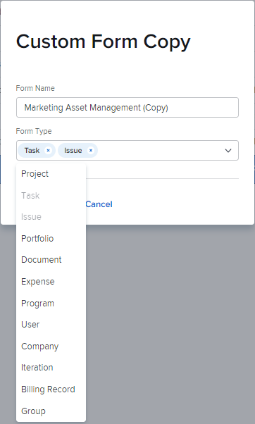

# 使用表单设计器从副本设计表单

您可以基于现有表单设计新的自定义表单。 您可以将自定义表单附加到不同的Workfront对象，以捕获有关这些对象的数据。

## 访问要求

您必须具备以下条件才能执行本文中的步骤：

<table style="table-layout:auto"> 
 <col> 
 <col> 
 <tbody> 
  <tr data-mc-conditions=""> 
   <td role="rowheader"> 
Adobe Workfront计划*
 </td> 
   <td>任意</td> 
  </tr> 
  <tr> 
   <td role="rowheader">Adobe Workfront许可证*</td> 
   <td>
   
当前计划：标准

   
或

   
旧版计划：计划
</td> 
  </tr> 
  <tr data-mc-conditions=""> 
   <td role="rowheader">访问级别配置*</td> 
   <td> 
对自定义表单的管理访问权限
 
有关Workfront管理员如何授予此访问权限的信息，请参阅 <a href="/help/quicksilver/administration-and-setup/add-users/configure-and-grant-access/grant-users-admin-access-certain-areas.md" class="MCXref xref">授予用户对特定区域的管理访问权限</a>.
 </td> 
  </tr>  
 </tbody> 
</table>

&#42;要了解您拥有的计划、许可证类型或访问级别配置，请联系您的Workfront管理员。

## 复制自定义表单以创建新表单

1. 单击 **主菜单** 图标  在Adobe Workfront的右上角，单击 **设置** .

1. 单击 **自定义Forms。**
1. 选择要用作新自定义表单基础的自定义表单，然后单击 **复制**.
1. 在 **自定义表单副本** 框中，键入以下信息：

   <table style="table-layout:auto"> 
    <col> 
    <col> 
    <tbody> 
     <tr> 
      <td role="rowheader">表单名称</td> 
      <td>键入复制的表单的名称。</td> 
     </tr> 
     <tr> 
      <td role="rowheader"> 
表单类型 
 </td> 
      <td> 
在 <b>表单类型</b> 框中，选择您希望自定义表单处理的对象类型，然后单击要删除的任何类型旁边的X。 与表单关联的类型在列表中处于禁用状态。
 
      

 
      
表单必须与至少一个对象类型关联。
 
      </td> 
     </tr> 
    </tbody> 
   </table>

1. 单击 **复制表单**.

   在原始表单中，如果计算字段引用的字段与您添加到新表单的对象类型不兼容，则会出现一条消息，提示您更改这些字段中的计算。

   同样，如果原始表单上某个节中断的访问选项与您添加到新表单中的对象类型不兼容，则会出现一条消息，提示您调整选项。

1. 选择您刚才复制的表单，然后单击 **编辑**.
1. 对表单进行任何更改，如 [设计表单](/help/quicksilver/administration-and-setup/customize-workfront/create-manage-custom-forms/form-designer/design-a-form/design-a-form.md) 文章：

* [重复使用已在其他自定义表单中使用的现有字段或小组件](/help/quicksilver/administration-and-setup/customize-workfront/create-manage-custom-forms/form-designer/design-a-form/design-a-form.md#reuse-an-existing-field-or-widget-already-used-in-another-custom-form)
   * [添加文本字段](/help/quicksilver/administration-and-setup/customize-workfront/create-manage-custom-forms/form-designer/design-a-form/design-a-form.md#add-text-fields)
   * [添加计算字段](/help/quicksilver/administration-and-setup/customize-workfront/create-manage-custom-forms/form-designer/design-a-form/design-a-form.md#add-calculated-fields)
   * [添加单选按钮、复选框组和下拉列表](/help/quicksilver/administration-and-setup/customize-workfront/create-manage-custom-forms/form-designer/design-a-form/design-a-form.md#add-radio-buttons-checkboxes-and-dropdowns)
   * [添加提前类型和日期字段](/help/quicksilver/administration-and-setup/customize-workfront/create-manage-custom-forms/form-designer/design-a-form/design-a-form.md#add-typeahead-and-date-fields)
   * [添加图像、PDF和视频](/help/quicksilver/administration-and-setup/customize-workfront/create-manage-custom-forms/form-designer/design-a-form/design-a-form.md#add-images-pdfs-and-videos)
   * [添加Adobe XD文件](/help/quicksilver/administration-and-setup/customize-workfront/create-manage-custom-forms/form-designer/design-a-form/design-a-form.md#add-adobe-xd-files)

1. （可选）在您单击 **保存并关闭**，将表单附加到要使用该表单的对象，如 [将自定义表单添加到对象](/help/quicksilver/workfront-basics/work-with-custom-forms/add-a-custom-form-to-an-object.md).