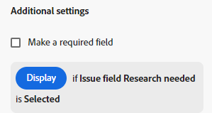

# 向表单添加显示逻辑和跳过逻辑

您可以根据用户在填写自定义表单时所做的选择，决定应显示或跳过自定义表单的哪些部分。

>[!NOTE]
>
>逻辑仅适用于一个表单，且不能基于从其他表单中选择的内容。

## 访问要求

+++ 展开以查看本文中各项功能的访问要求。

您必须具有以下权限才能执行本文中的步骤：

<table style="table-layout:auto"> 
 <col> 
 <col> 
 <tbody> 
  <tr data-mc-conditions=""> 
   <td role="rowheader">Adobe Workfront计划 </td> 
   <td>任何</td> 
  </tr> 
  <tr> 
   <td role="rowheader">Adobe Workfront许可证</td> 
   <td>
   
新增：标准

   
或

   
当前：计划
</td> 
  </tr> 
  <tr data-mc-conditions=""> 
   <td role="rowheader">访问级别配置</td> 
   <td>对自定义表单的管理访问权限 </td> 
  </tr>  
 </tbody> 
</table>

有关此表中信息的更多详细信息，请参阅Workfront文档中的[访问要求](/help/quicksilver/administration-and-setup/add-users/access-levels-and-object-permissions/access-level-requirements-in-documentation.md)。

+++

## 显示和跳过逻辑图标

自定义表单显示图标以指示将哪个逻辑应用于某些字段。 表单设计器中字段上的图标指示逻辑应用于该字段。

| 图标 | 表单设计器中的字段上的位置 | 条件 |
|--- |--- |--- |
|  | 左下 | 该字段是用于显示逻辑的目标字段。 如果对表单进行了特定选择，则会显示此字段。 |
|  | 右下 | 字段定义显示逻辑。 此字段上的特定选择或值将显示目标字段。 |
|  | 左下 | 该字段是跳过逻辑的目标字段。 如果对表单进行了特定选择，则表单会跳过此字段并隐藏其中的字段。 |
|  | 右下 | 字段定义跳过逻辑。 此字段上的特定选择或值会跳过其他字段并直接转到目标字段。 |

选择一个应用了逻辑的字段，以在字段设置中显示现有逻辑规则。

## 使用显示逻辑和跳过逻辑的注意事项

* 要在自定义字段、小组件或分区界限中添加显示逻辑，必须在表单上至少一个多选字段（单选按钮、下拉列表或复选框）之前放置。
有关自定义表单中的自定义字段和小部件的信息，请参阅[创建自定义表单](/help/quicksilver/administration-and-setup/customize-workfront/create-manage-custom-forms/form-designer/design-a-form/design-a-form.md)。
* 无法将跳过逻辑添加到构件或分区界限中。 您只能将其添加到多选字段（单选按钮、下拉列表或复选框）。
* 不能应用显示或跳过逻辑来显示或隐藏多选项字段的选择。 例如，不能根据其他字段的显示或跳过逻辑限制为下拉列表、复选框组或单选按钮字段显示的选项。
* 如果自定义字段的以下情况全部属实，则您可以将显示逻辑和跳过逻辑添加到自定义字段中：

   * 它是一个多选字段（单选按钮、下拉列表或复选框）
   * 它前面有一个多选字段
   * 后跟另一个自定义字段

* 复制具有显示逻辑或跳过逻辑的表单时，该逻辑将复制到新的自定义表单中。
* 批量编辑对象时，所有自定义字段都会显示在“编辑对象”框中，包括跳过或隐藏的字段。
* 为自定义表单创建显示逻辑规则时，请牢记以下几点：

   * 默认情况下，显示逻辑语句中未包含的自定义字段会显示在自定义表单中。
   * 您可以创建多字段显示逻辑语句。
   * 如果分区界限下的所有字段都应用了显示逻辑，并且它们都因该逻辑而隐藏，则整个分区将在自定义表单上隐藏。

## 向自定义表单添加显示逻辑

显示逻辑定义当用户在多选字段中选择特定值时，要在表单上显示的自定义字段。 该逻辑将添加到目标字段，该字段仅在选择值时显示。

{{step-1-to-setup}}

1. 单击&#x200B;**自定义Forms**。
1. 创建新的自定义表单或打开现有表单。 有关详细信息，请参阅[创建自定义表单](/help/quicksilver/administration-and-setup/customize-workfront/create-manage-custom-forms/form-designer/design-a-form/design-a-form.md)。
1. 根据需要向表单添加字段。 必须在要显示的目标字段之前放置至少一个多选字段（单选按钮、下拉列表或复选框）。
1. 选择目标字段并单击屏幕左下角的&#x200B;**添加逻辑**。
1. 选择&#x200B;**显示逻辑**&#x200B;选项卡。
1. 在逻辑生成器上单击&#x200B;**添加显示规则**。

   

1. 按照以下生成器中的步骤创建逻辑语句。

   1. 第一个选项是选择定义字段。 这是带有显示目标的选择值的字段。 必须为多选字段。
   1. 第二个选项是选择选择值。 只有已为该字段定义的值可用。
   1. 第三个选项是&#x200B;**已选择**&#x200B;或&#x200B;**未选择**。 选择&#x200B;**已选定**&#x200B;表示在选择该值时，将显示目标字段。 选择&#x200B;**未选择**&#x200B;表示在定义字段中选择任何其他值时，将显示目标字段。
   1. 要将&#x200B;**And**&#x200B;规则添加到逻辑语句中，请在刚刚创建的规则下单击&#x200B;**添加规则**。 按照相同的提示构建规则。 必须满足所有和规则才能显示目标字段。

      

   1. 要将&#x200B;**Or**&#x200B;规则添加到逻辑语句中，请单击逻辑生成器底部附近的&#x200B;**添加规则**。 然后，单击Or区域中的&#x200B;**添加规则**，并按照相同的提示生成规则。 满足一个Or规则时，将显示目标字段。

1. 完成生成逻辑语句后，单击&#x200B;**保存**。

   显示逻辑图标将添加到表单设计器的目标字段和定义字段中。

## 将跳过逻辑添加到自定义表单

跳过逻辑定义用户在多选字段中选择特定值时跳过的自定义表单字段。 跳过的字段在表单上隐藏。 该逻辑将应用于在其中进行了选择的定义字段，而不是跳过的字段。

{{step-1-to-setup}}

1. 单击&#x200B;**自定义Forms**。
1. 创建新的自定义表单或打开现有表单。 有关详细信息，请参阅[创建自定义表单](/help/quicksilver/administration-and-setup/customize-workfront/create-manage-custom-forms/form-designer/design-a-form/design-a-form.md)。
1. 根据需要向表单添加字段。 跳过逻辑的定义字段必须是多选字段（单选按钮、下拉列表或复选框）。
1. 选择定义字段，然后单击屏幕左下角的&#x200B;**添加逻辑**。
1. 选择&#x200B;**跳过逻辑**&#x200B;选项卡。
1. 在逻辑生成器上单击&#x200B;**添加跳过规则**。

   

1. 按照以下生成器中的步骤创建逻辑语句。

   1. 定义字段显示在生成器中。 这是您选择将跳过逻辑应用到的字段。
   1. 第一个选项是选择选择值。 只有已为该字段定义的值可用。
   1. 第二个选项是&#x200B;**已选择**&#x200B;或&#x200B;**未选择**。 选择&#x200B;**选定**&#x200B;意味着在选择该值时，将显示目标字段并跳过其中的字段。 选择&#x200B;**未选择**&#x200B;表示在定义字段中选择任何其他值时，将显示目标字段并跳过其中的字段。
   1. 第三个选项是目标字段，或跳至的位置。 选择字段名称或&#x200B;**表单**&#x200B;的结尾。 您可能需要先单击“空”一词，然后再选择一个选项。

      

   1. 要将&#x200B;**Or**&#x200B;规则添加到逻辑语句中，请单击逻辑生成器底部附近的&#x200B;**添加规则**。 然后，根据相同的提示选择相应的选项来构建规则。 当满足一个&#x200B;**或**&#x200B;规则时，将显示目标字段。

1. 完成生成逻辑语句后，单击&#x200B;**保存**。

   跳过逻辑图标会添加到表单设计器的目标字段和定义字段中。

