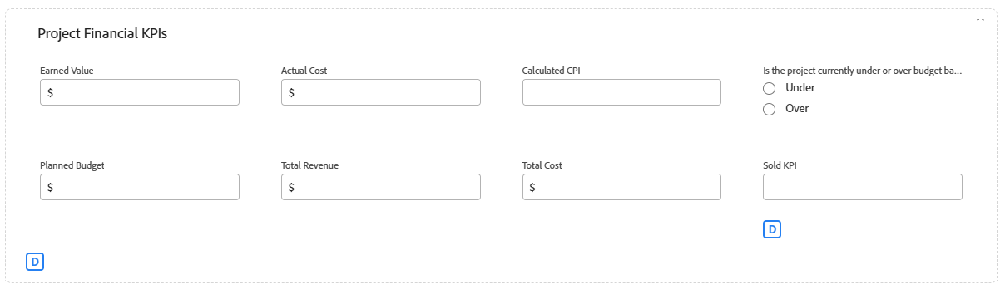

# 向自定义表单和字段添加逻辑规则

{{highlighted-preview}}

利用逻辑规则，可进一步自定义表单上的字段。

例如，您可以根据用户在填写自定义表单时所做的选择，显示或跳过该表单中的字段或章节。

>[!NOTE]
>
>逻辑仅适用于一个表单，且不能基于从其他表单中选择的内容。

## 访问要求

+++ 展开以查看本文中各项功能的访问要求。

您必须具有以下权限才能执行本文中的步骤：

<table style="table-layout:auto"> 
 <col> 
 <col> 
 <tbody> 
  <tr data-mc-conditions=""> 
   <td role="rowheader">Adobe Workfront计划 </td> 
   <td>任何</td> 
  </tr> 
  <tr> 
   <td role="rowheader">Adobe Workfront许可证</td> 
   <td>
   <p>新增：标准</p>
   <p>或</p>
   <p>当前：计划</p></td> 
  </tr> 
  <tr data-mc-conditions=""> 
   <td role="rowheader">访问级别配置</td> 
   <td>对自定义表单的管理访问权限 </td> 
  </tr>  
 </tbody> 
</table>

有关此表中信息的更多详细信息，请参阅Workfront文档中的[访问要求](/help/quicksilver/administration-and-setup/add-users/access-levels-and-object-permissions/access-level-requirements-in-documentation.md)。

+++

## 显示和跳过逻辑图标

自定义表单显示图标以指示何时将显示或跳过逻辑应用于某些字段。 表单设计器中字段上的图标指示逻辑应用于该字段。

| 图标 | 表单设计器中的字段上的位置 | 定义 |
|--- |--- |--- |
|  | 左下 | 该字段是用于显示逻辑的目标字段。 如果对表单进行了特定选择，则会显示此字段。 |
|  | 右下 | 字段定义显示逻辑。 此字段上的特定选择或值将显示目标字段。 |
|  | 左下 | 该字段是跳过逻辑的目标字段。 如果对表单进行了特定选择，则表单会跳过此字段并隐藏其中的字段。 |
|  | 右下 | 字段定义跳过逻辑。 此字段上的特定选择或值会跳过其他字段并直接转到目标字段。 |


选择一个应用了逻辑的字段，以在字段设置中显示现有逻辑规则。


## 使用显示逻辑和跳过逻辑的注意事项

* 要在自定义字段、小组件或分区界限中添加显示逻辑，必须在表单上至少一个多选字段（单选按钮、下拉列表或复选框）之前放置。
有关自定义表单中的自定义字段和小部件的信息，请参阅[创建自定义表单](/help/quicksilver/administration-and-setup/customize-workfront/create-manage-custom-forms/form-designer/design-a-form/design-a-form.md)。
* 无法将跳过逻辑添加到构件或分区界限中。 您只能将其添加到多选字段（单选按钮、下拉列表或复选框）。
* 不能应用显示或跳过逻辑来显示或隐藏多选项字段的选择。 例如，不能根据其他字段的显示或跳过逻辑限制为下拉列表、复选框组或单选按钮字段显示的选项。
* 如果自定义字段的以下情况全部属实，则您可以将显示逻辑和跳过逻辑添加到自定义字段中：

   * 它是一个多选字段（单选按钮、下拉列表或复选框）
   * 它前面有一个多选字段
   * 后跟另一个自定义字段

* 复制具有显示逻辑或跳过逻辑的表单时，该逻辑将复制到新的自定义表单中。
* 批量编辑对象时，所有自定义字段都会显示在“编辑对象”框中，包括跳过或隐藏的字段。
* 为自定义表单创建显示逻辑规则时，请牢记以下几点：

   * 默认情况下，显示逻辑语句中未包含的自定义字段会显示在自定义表单中。
   * 您可以创建多字段显示逻辑语句。
   * 如果分区界限下的所有字段都应用了显示逻辑，并且它们都因该逻辑而隐藏，则整个分区将在自定义表单上隐藏。

## 向自定义表单添加显示逻辑

显示逻辑定义当用户在多选字段中选择特定值时，要在表单上显示的自定义字段。 该逻辑将添加到目标字段，该字段仅在选择值时显示。

<!--
>[!NOTE]
>
><span class="preview">This procedure describes the basic mode for display logic. Advanced display logic is also available. For more information, see [Add advanced display logic to a custom form](#add-advanced-display-logic-to-a-custom-form), in this article.</span>
-->

{{step-1-to-setup}}

1. 单击&#x200B;**自定义Forms**。
1. 创建新的自定义表单或打开现有表单。 有关详细信息，请参阅[创建自定义表单](/help/quicksilver/administration-and-setup/customize-workfront/create-manage-custom-forms/form-designer/design-a-form/design-a-form.md)。
1. 根据需要向表单添加字段。 必须在要显示的目标字段之前放置至少一个多选字段（单选按钮、下拉列表或复选框）。
1. 选择目标字段并单击&#x200B;**添加逻辑**。
1. 选择逻辑生成器上的&#x200B;**显示**&#x200B;选项卡。
1. 单击&#x200B;**添加显示规则**。

   <span class="preview">预览环境中的示例图像：</span>

   

   生产环境中的示例图像：

   

1. 执行以下步骤，在生成器中创建逻辑语句。

   1. 第一个选项是选择定义字段。 这是带有显示目标的选择值的字段。 必须为多选字段。
   1. 第二个选项是选择选择值。 只有已为该字段定义的值可用。
   1. 第三个选项是&#x200B;**已选择**&#x200B;或&#x200B;**未选择**。 选择&#x200B;**已选定**&#x200B;表示在选择该值时，将显示目标字段。 选择&#x200B;**未选择**&#x200B;表示在定义字段中选择任何其他值时，将显示目标字段。
   1. 要将&#x200B;**And**&#x200B;规则添加到逻辑语句中，请在刚刚创建的规则下单击&#x200B;**添加规则**。 按照相同的提示构建规则。 必须满足所有和规则才能显示目标字段。

      <span class="preview">预览环境中的示例图像：</span>

      

      生产环境中的示例图像：

      

   1. 要将&#x200B;**Or**&#x200B;规则添加到逻辑语句中，请单击逻辑生成器底部附近的&#x200B;**添加规则**。 然后，单击Or区域中的&#x200B;**添加规则**，并按照相同的提示生成规则。 满足一个Or规则时，将显示目标字段。

1. 完成生成逻辑语句后，单击&#x200B;**保存** <span class="preview">或&#x200B;**应用**</span>。

   显示逻辑图标将添加到表单设计器的目标字段和定义字段中。

<!--
<div class="preview">

## Add advanced display logic to a custom form

The advanced display logic for custom form fields allows you to build complex logic using formulas. You can apply this logic to the following field types: drop-down, radio button, checkbox, typeahead, single line text, paragraph text, date field, text with formatting, and calculated fields.

### Examples

You can use advanced display logic to control the visibility of custom form sections based on user roles and the visibility of a field based on another field's status.

No logic is applied to the default section on the form, so it is always visible to all users.

Using the following condition, the Resources Required section is only displayed when a user with the job role of Resource Manager views the form.

```IF($$USER.{roleID}="123abc", true)```

Note that ```123abc``` represents the role ID of the Resource Manager.


The same condition with a different role ID is applied to the Project Financial KPIs section to define that  only the Financial Advisor role can view the section.

Using the following condition, the Sold KPI field only becomes visible when the project is complete. This logic is applied directly to the field instead of to a form section. There is no need to specify which role can view the field, because that is already defined in the section that the field is in.

```IF({status}="CPL", true)```



### Define advanced display logic

{{step-1-to-setup}}

1. Click **Custom Forms**.
1. Create a new custom form or open an existing form. See [Create a custom form](/help/quicksilver/administration-and-setup/customize-workfront/create-manage-custom-forms/form-designer/design-a-form/design-a-form.md) for details.
1. Add fields to the form as needed.
1. Select the field to apply logic to, and click **Add Logic**.
1. Select the **Display** tab on the logic builder.
1. Turn on **Advanced mode**.
   
   This option might be turned on automatically, for fields that do not support the simple mode of display logic.

   

1. Build the display condition in the editor.

   For more information about calculations and expressions, see [Add calculated fields to a form](/help/quicksilver/administration-and-setup/customize-workfront/create-manage-custom-forms/form-designer/design-a-form/add-a-calculated-field.md) and [Overview of calculated data expressions](/help/quicksilver/reports-and-dashboards/reports/calc-cstm-data-reports/calculated-data-expressions.md).

1. Click **Apply**.
   
   The logic is applied to the field and the display logic icon is added in the form designer.

</div>
-->

## 将跳过逻辑添加到自定义表单

跳过逻辑定义用户在多选字段中选择特定值时跳过的自定义表单字段。 跳过的字段在表单上隐藏。 该逻辑将应用于在其中进行了选择的定义字段，而不是跳过的字段。

{{step-1-to-setup}}

1. 单击&#x200B;**自定义Forms**。
1. 创建新的自定义表单或打开现有表单。 有关详细信息，请参阅[创建自定义表单](/help/quicksilver/administration-and-setup/customize-workfront/create-manage-custom-forms/form-designer/design-a-form/design-a-form.md)。
1. 根据需要向表单添加字段。 跳过逻辑的定义字段必须是多选字段（单选按钮、下拉列表或复选框）。
1. 选择定义字段，然后单击屏幕左下角的&#x200B;**添加逻辑**。
1. 选择逻辑生成器上的&#x200B;**跳过**&#x200B;选项卡。
1. 单击&#x200B;**添加跳过规则**。


   <span class="preview">预览环境中的示例图像：</span>

   

   生产环境中的示例图像：

   

1. 执行以下步骤，在生成器中创建逻辑语句。

   1. 定义字段显示在生成器中。 这是您选择将跳过逻辑应用到的字段。
   1. 第一个选项是选择选择值。 只有已为该字段定义的值可用。
   1. 第二个选项是&#x200B;**已选择**&#x200B;或&#x200B;**未选择**。 选择&#x200B;**选定**&#x200B;意味着在选择该值时，将显示目标字段并跳过其中的字段。 选择&#x200B;**未选择**&#x200B;表示在定义字段中选择任何其他值时，将显示目标字段并跳过其中的字段。
   1. 第三个选项是目标字段，或跳至的位置。 选择字段名称或&#x200B;**表单**&#x200B;的结尾。 您可能需要先单击“空”一词，然后再选择一个选项。

      <span class="preview">预览环境中的示例图像：</span>

      

      生产环境中的示例图像：

      

   1. 要将&#x200B;**Or**&#x200B;规则添加到逻辑语句中，请单击逻辑生成器底部附近的&#x200B;**添加规则**。 然后，根据相同的提示选择相应的选项来构建规则。 当满足一个&#x200B;**或**&#x200B;规则时，将显示目标字段。

1. 完成生成逻辑语句后，单击&#x200B;**保存** <span class="preview">或&#x200B;**应用**</span>。

   跳过逻辑图标会添加到表单设计器的目标字段和定义字段中。

<div class="preview">

## 向自定义表单添加验证逻辑

验证逻辑是使用公式构建的，您可以根据需要使逻辑简单或复杂。 验证可以基于其他字段的值或对象的状态，并且您可以在验证失败时提供错误消息。

如果用户填写自定义表单时，如果应用了逻辑的字段满足定义的验证条件，则该字段会高亮显示并显示错误消息。

您可以将验证逻辑应用于以下字段类型：下拉列表、单选按钮、复选框、预输入、单行文本、段落文本、日期字段、带格式的文本以及计算字段。

### 示例

如果满足以下条件，当用户输入触发消息的值时，“预算”字段会在字段下方显示消息。 例如，如果输入的值为负，则显示第一条消息。 如果用户在输入预算值之前尝试将项目状态更改为当前，则会显示第二条消息。

```
IF({DE:Budget Field} < 0,
     "Budget cannot be negative",
     IF({DE:Budget Field} == 0 && {status} == "CUR", "Budget must be specified before moving to Current status")
)
```

另一个简单示例是，电话号码字段必须包含特定的有效位数。

基于其他字段进行验证的另一个示例是会议室大小（小、中或大）字段和会议出席者人数的单独字段。 每个房间大小的人员数会写入验证公式中。 如果用户输入的与会者人数太多，则显示错误消息。

### 定义验证逻辑

{{step-1-to-setup}}

1. 单击&#x200B;**自定义Forms**。
1. 创建新的自定义表单或打开现有表单。 有关详细信息，请参阅[创建自定义表单](/help/quicksilver/administration-and-setup/customize-workfront/create-manage-custom-forms/form-designer/design-a-form/design-a-form.md)。
1. 根据需要向表单添加字段。
1. 选择要应用逻辑的字段，然后单击&#x200B;**添加逻辑**。
1. 选择逻辑生成器上的&#x200B;**验证**&#x200B;选项卡。

   

1. 在编辑器中构建验证条件，包括不符合验证条件时显示的错误消息。

   有关计算和表达式的详细信息，请参阅[将计算字段添加到表单](/help/quicksilver/administration-and-setup/customize-workfront/create-manage-custom-forms/form-designer/design-a-form/add-a-calculated-field.md)和[计算数据表达式的概述](/help/quicksilver/reports-and-dashboards/reports/calc-cstm-data-reports/calculated-data-expressions.md)。

1. 单击&#x200B;**应用**。

   该逻辑将应用于表单设计器中的字段。

</div>

<!--
<div class="preview">

## Add formatting logic to a custom form

Formatting logic highlights a field value when it meets the defined conditions. You can apply formatting logic to all field types, and it will work on multiple fields at once.

Formatting applied to custom forms is separate from formatting applied to lists and reports. For information on report formatting, see [Use conditional formatting in views](/help/quicksilver/reports-and-dashboards/reports/reporting-elements/use-conditional-formatting-views.md).

### Example

Using the following condition, the Budget field appears red when the user enters a value of 1000 or more. The field appears yellow when the user enters a value of 500 or more.

To add a hover-over definition of the formatting, use the Instructions field in the custom form. For example, a message on the Budget field could say "Please enter a budget within a reasonable range. Values over 500 are a warning notice, and above 1000 is considered too high."

```
IF(
     {DE:Budget Field} >=1000,
     FORMAT($$NEGATIVE),
     IF({DE:Budget Field} >= 500, FORMAT($$NOTICE))
)
```

### Define formatting logic

{{step-1-to-setup}}

1. Click **Custom Forms**.
1. Create a new custom form or open an existing form. See [Create a custom form](/help/quicksilver/administration-and-setup/customize-workfront/create-manage-custom-forms/form-designer/design-a-form/design-a-form.md) for details.
1. Add fields to the form as needed.
1. Select the field to apply logic to, and click **Add Logic**.
1. Select the **Formatting** tab on the logic builder.

   

1. Build the formatting condition in the editor.

   You can add up to five formatting rules per field.

   The field highlighting color options are:

   * `$$POSITIVE (green)`
   * `$$INFORMATIVE (blue)`
   * `$$NEGATIVE (red)`
   * `$$NOTICE (orange)`
   
   The text formatting options are:
   
   * `$$BOLD`
   * `$$ITALIC`
   * `$$UNDERLINE`

   Only one color option may be used per function, along with up to three additional text formatting options. If no color option is specified, the system's default color is applied.

   For more information about calculations and expressions, see [Add calculated fields to a form](/help/quicksilver/administration-and-setup/customize-workfront/create-manage-custom-forms/form-designer/design-a-form/add-a-calculated-field.md) and [Overview of calculated data expressions](/help/quicksilver/reports-and-dashboards/reports/calc-cstm-data-reports/calculated-data-expressions.md).

1. Click **Apply**.
   
   The logic is applied to the field in the form designer.

</div>
-->
