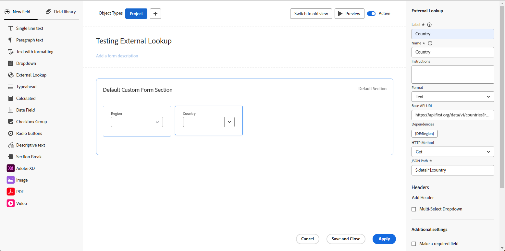

# 自定义表单中的外部查找字段示例

自定义表单中的外部查找字段调用外部API，并在下拉字段中作为选项返回值。 使用自定义表单附加到的对象的用户可以从下拉菜单中选择一个或多个选项。

本文提供了使用外部查找字段调用Workfront或公共API的相同实例的示例。 您还可以使用外部查找与外部系统（如Jira、Salesforce或ServiceNow）通信。

有关将外部查找字段添加到自定义表单以及外部查找组件的其他定义的详细信息，请参阅[使用表单设计器设计表单](/help/quicksilver/administration-and-setup/customize-workfront/create-manage-custom-forms/form-designer/design-a-form/design-a-form.md)。

## 为同一Workfront实例设置外部查找字段

您可以使用外部查找将Workfront实例中的数据纳入自定义表单。

### 在外部查找中使用本机Workfront字段值

此示例说明如何调用Workfront API，并将现有“状态查询”字段中的数据引入外部查找字段。

1. 打开自定义表单。
1. 在屏幕左侧，找到&#x200B;**外部查找**&#x200B;并将其拖动到画布上的某个部分。
1. 输入字段的&#x200B;**标签**&#x200B;和&#x200B;**名称**。
1. 为字段选择&#x200B;**格式**。
1. 在&#x200B;**基本API URL**&#x200B;字段中输入API URL调用。

   * 您可以添加$$HOST以引用同一实例。
   * 可添加$$QUERY以根据查询其他字段来筛选结果。

   **示例**
   `$$HOST/attask/api/v15.0/project/search?status={DE:StatusQuery}&$$QUERY`

1. 查看&#x200B;**依赖项**，了解此查找字段在API中引用的字段。

   依赖项字段可以是对象详细信息页面中存在的任何自定义或本机字段。

   在此示例中，`{DE:StatusQuery}`将替换为StatusQuery自定义字段的值。

1. 选择&#x200B;**HTTP方法**。

   这很可能是&#x200B;**Get**。

1. 输入&#x200B;**JSON路径**&#x200B;以获取API调用结果。

   **示例**
   `$.data[*].name`

   >[!NOTE]
   >
   >调用同一Workfront实例不需要&#x200B;**标头**&#x200B;信息。

1. 单击&#x200B;**应用**。

   

   将自定义表单添加到Workfront对象（在本例中是项目）时，它类似于此。

   

   

### 在外部查找中使用自定义字段值

此示例说明如何调用Workfront API，并将自定义字段中的数据引入外部查找字段。 该示例自定义字段称为“自定义颜色”。

1. 打开自定义表单。
1. 在屏幕左侧，找到&#x200B;**外部查找**&#x200B;并将其拖动到画布上的某个部分。
1. 输入字段的&#x200B;**标签**&#x200B;和&#x200B;**名称**。
1. 为字段选择&#x200B;**格式**。
1. 在&#x200B;**基本API URL**&#x200B;字段中输入API URL调用。

   **示例**
   `$$HOST/attask/api/v18.0/PORT/search?ID={portfolioID}&fields=parameterValues`

1. 查看&#x200B;**依赖项**，了解此查找字段在API中引用的字段。

   依赖项字段可以是对象详细信息页面中存在的任何自定义或本机字段。

1. 选择&#x200B;**HTTP方法**。

   这很可能是&#x200B;**Get**。

1. 输入&#x200B;**JSON路径**&#x200B;以获取API调用结果。

   **示例**
   `$.data[*].parameterValues.["DE:Combo Colors"]`

   * “parameterValues”是指Workfront中您所在对象的任何自定义字段。
   * 在本例中，“DE：组合颜色”是包含要检索的值的特定自定义字段。

   >[!NOTE]
   >
   >调用同一Workfront实例不需要&#x200B;**标头**&#x200B;信息。

1. 单击&#x200B;**应用**。

   将自定义表单添加到Workfront对象后，“组合颜色”字段中的所有值都会显示在外部查找字段下拉列表中。

## 为公共API设置外部查找字段

您可以使用外部查找来调用外部公共API并检索数据。

此示例说明如何调用国家/地区的API（如<https://api.first.org/data/v1/countries>），以便您不必在下拉选项中对所有国家/地区名称进行硬编码。

1. 打开自定义表单。
1. 在屏幕左侧，找到&#x200B;**外部查找**&#x200B;并将其拖动到画布上的某个部分。
1. 输入字段的&#x200B;**标签**&#x200B;和&#x200B;**名称**。
1. 为字段选择&#x200B;**格式**。
1. 在&#x200B;**基本API URL**&#x200B;字段中输入API URL调用。

   * 您可以添加$$QUERY来实施最终用户的查询筛选。

   **示例**
列出所有国家/地区： <https://api.first.org/data/v1/countries>

   允许用户在下拉字段中搜索任何国家/地区： <https://api.first.org/data/v1/countries?q=$$QUERY>

   允许用户搜索区域中的国家/地区： <https://api.first.org/data/v1/countries?region={DE:Region}&q=$$QUERY>

   * 可用的区域在Workfront中的单独自定义字段中定义。
   * 当用户在表单上选择区域时，外部查找字段仅显示该区域中的国家（API中定义了该区域的国家/地区）。 用户还可以在所选区域中搜索国家/地区。

1. 查看&#x200B;**依赖项**，了解此查找字段在API中引用的字段。

   依赖项字段可以是对象详细信息页面中存在的任何自定义或本机字段。

   在此示例中，`{DE:Region}`将被替换为区域自定义字段的值。

1. 选择&#x200B;**HTTP方法**。

   这很可能是&#x200B;**Get**。

1. 输入&#x200B;**JSON路径**&#x200B;以获取API调用结果。

   此选项允许从API URL返回的JSON中提取数据。 它提供了一种方法，用于选择哪些值将从JSON内部显示在下拉选项中。

   **示例**
   `$.data[*].country`

1. （可选）单击&#x200B;**添加标头**，然后键入或粘贴使用API进行身份验证所需的密钥值对。

   >[!NOTE]
   >
   >标头字段不是存储凭据的安全位置，您应该小心输入和保存的内容。

1. （可选）选择&#x200B;**多选下拉列表**&#x200B;以允许用户在下拉列表中选择多个值。

1. 单击&#x200B;**应用**。

   

   将自定义表单添加到Workfront对象（在本例中是项目）时，它类似于此。

   

   根据地区

## 外部查找字段的其他用例

创建外部查找还有许多其他用例。

**用例：**替换预输入字段，因为它们可能导致报告问题。
**解决方案：**&#x200B;使用对系统中现有对象的API调用。

模板的基本API URL示例，用于替换预输入字段：
`$$HOST/attask/api/v17.0/tmpl/search?isActive=true&name_Sort=asc`

**用例：**创建包含更多功能的下拉字段（例如，外部eokup字段中有换行符）。
**解决方案：**&#x200B;使用对系统中现有对象的API调用，或者创建新对象并使用对此对象的API调用。

**用例：**为用户定义在自定义表单区域外维护他们自己的字段的方法。 设置“外部查找”字段，您可以将用户提供给组成该字段的对象。 此选项适合高维护性字段和团队。
**解决方案：**&#x200B;创建新对象并使用对此对象的API调用。

**用例：**与Workfront之外的对象集成。 例如，访问另一个系统以获取每个用户的名称，而不是被限制在预输入字段中。
**解决方案：** Webhook/Fusion自动化以连接到其他系统。

