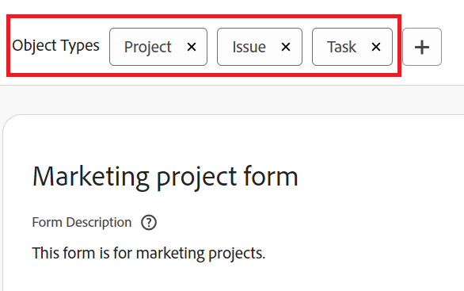

# 使用表单设计器在现有自定义表单中添加或删除对象类型

您可以使用表单设计器在现有自定义表单中添加或删除对象类型。

## 访问要求

您必须具备以下条件才能执行本文中的步骤：

<table style="table-layout:auto"> 
 <col> 
 <col> 
 <tbody> 
  <tr data-mc-conditions=""> 
   <td role="rowheader"> 
Adobe Workfront计划*
 </td> 
   <td>任意</td> 
  </tr> 
  <tr> 
   <td role="rowheader">Adobe Workfront许可证*</td> 
   <td>
   
当前计划：标准

   
或

   
旧版计划：计划
</td> 
  </tr> 
  <tr data-mc-conditions=""> 
   <td role="rowheader">访问级别配置*</td> 
   <td>
对自定义表单的管理访问权限
 
有关Workfront管理员如何授予此访问权限的信息，请参阅 <a href="/help/quicksilver/administration-and-setup/add-users/configure-and-grant-access/grant-users-admin-access-certain-areas.md" class="MCXref xref">授予用户对特定区域的管理访问权限</a>.
</td> 
  </tr>  
 </tbody> 
</table>

&#42;要了解您拥有的计划、许可证类型或访问级别配置，请联系您的Workfront管理员。

## 将对象类型添加到现有的自定义表单

您可以向表单中添加其他对象类型，以便将其附加到多个对象。

>[!NOTE]
>
>区域划分权限可能会受对象类型的影响。 自定义表单部分中断的“有限编辑”权限仅适用于项目、任务、问题和用户对象类型。
>
>有关更多信息，请参阅 [多种对象类型如何影响节划分权限](/help/quicksilver/administration-and-setup/customize-workfront/create-manage-custom-forms/form-designer/design-a-form/organize-a-form.md#how-multiple-object-types-can-affect-section-break-permissions).

1. 单击 **主菜单** 图标  在Adobe Workfront的右上角，单击 **设置** .

1. 单击 **自定义Forms** 中。

   在显示的视图中，您可以查看为贵组织创建的所有自定义表单。 您还可以查看谁创建了每个表单、它与哪种对象类型一起使用，以及它是否处于活动状态。

1. 选择要向其添加其他对象类型的自定义表单，然后单击 **编辑**.

1. 单击表单顶部的加号+之后 **对象类型**，然后在显示的菜单中选择所需的类型。 您可以重复此操作以添加所需数量的对象类型。

   

1. 单击 **保存并关闭**.

   >[!TIP]
   >
   >您可以单击 **应用** 创建自定义表单以保存所做更改并保持表单打开时，随时可以执行此操作。

## 删除自定义表单中的对象类型

您可以从现有自定义表单中删除对象类型。 自定义表单必须至少具有一个对象类型。

>[!CAUTION]
>
>如果用户已将自定义表单附加到要删除的类型对象并向其添加数据，则当您在表单上删除该对象类型时，该数据将被永久删除。 其中可能包含用户以后需要的历史信息。
>
>通常，我们建议最大限度地减少您编辑已在使用的自定义表单的次数。 没有通知系统可提醒使用自定义表单的人员您所做的更改。

要删除对象类型，请执行以下操作：

1. 单击 **主菜单** 图标  在Adobe Workfront的右上角，单击 **设置** .

1. 单击 **自定义Forms** 中。
1. 选择要编辑的自定义表单，然后单击 **编辑**.
1. 单击 **对象类型** 要从表单中删除的内容，然后单击 **删除** 显示的警告消息上。

   

1. （可选）对要从表单中删除的任何其他对象类型重复上一步。
1. 单击 **完成**，然后单击 **关闭并保存**.
