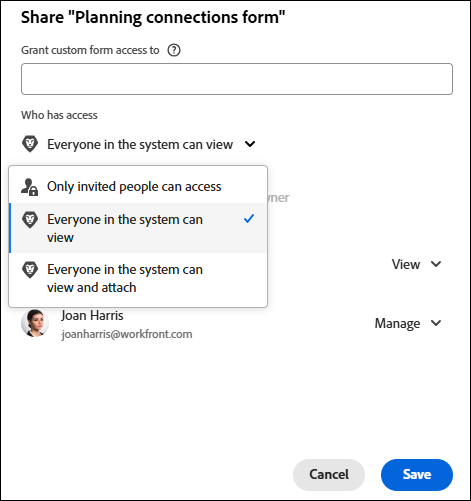
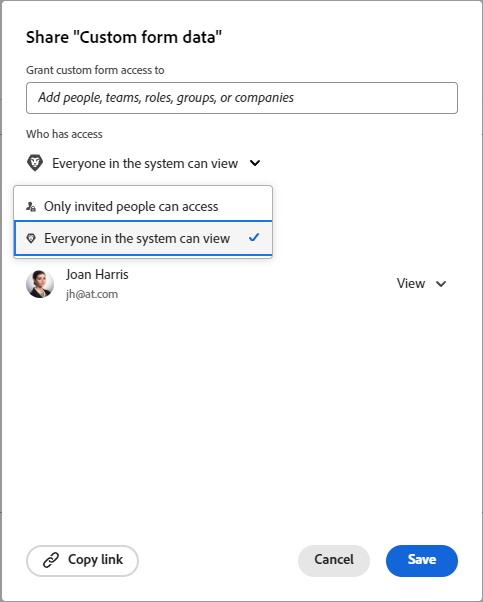

# 共享自定义表单

{#preview-fast-release-general}

您可以配置自定义表单的访问权限，以控制哪些人员（人员、角色、组、团队、公司、业务配置文件）可以查看、共享和编辑它。

## 访问权限要求

+++ 展开可查看本文所述功能的访问权限要求。

<table style="table-layout:auto"> 
 <col> 
 <col> 
 <tbody> 
  <tr> 
   <td>Adobe Workfront 包</td> 
   <td>
“任一”
</td> 
  </tr> 
  <tr> 
   <td>Adobe Workfront许可证</td> 
   <td>
标准

       
规划
</td>
  </tr> 
  <tr> 
   <td>访问级别配置</td> 
   <td> 
对自定义表单的管理访问权限
 </td> 
  </tr>  
 </tbody> 
</table>

有关信息，请参阅Workfront文档中的[访问要求](/help/quicksilver/administration-and-setup/add-users/access-levels-and-object-permissions/access-level-requirements-in-documentation.md)。

+++

## 访问自定义表单 {#access-to-custom-forms}

默认情况下，当您创建新的自定义表单并且有人将其附加到对象时，分配给该对象的任何用户都可以查看和填写表单。 这包括拥有参与者或请求许可证的用户以及外部用户。

但是，在尚未附加自定义表单的对象上，用户（即使他们具有Planner访问级别）无法从“自定义Forms”下拉菜单附加它，除非满足以下条件之一：

* 有人共享了自定义表单，因为“系统中的每个人都可以查看和附加”
* 有人将自定义表单与用户共享，或与他们的团队、工作角色、组、公司或业务配置文件共享，该用户配置文件至少会授予选中“附加到自定义数据”的“查看”权限
* 用户拥有标准或计划许可证，其访问级别允许对自定义表单的管理访问权限

<!--

## Share a custom form from the list of forms

Rather than leaving a custom form in the default sharing state (described in [Access to custom forms](#access-to-custom-forms) in this article), you can configure specific levels of access to the form for certain users, job roles, groups, teams, and companies.

{{step-1-to-setup}}

1. In the left panel, click **Custom Forms**.
1. Select the custom form, then click .
1. In the box that displays, under **Give custom form access to**, start typing the name of the user, team, job role, group, company, or business profile you want to share the custom form with, then press **Enter** when the name displays.
1. To adjust access for the user, team, job role, group, company, or business profile you just added, click the drop-down menu to the right of the name, then configure one of the following available options and any of its advanced settings:

   <table style="table-layout:auto"> 
    <col> 
    <col> 
    <tbody> 
     <tr> 
      <td role="rowheader">View it</td> 
      <td> 
This option provides the ability to view and fill out the custom form on objects. At the object level, users must also have at least Contribute access with the <strong>Edit custom form</strong> advanced setting enabled. For example, if the form is attached to a project, users must have Contribute access to that project, or they will not be able to fill out the form.

      
      
<b>NOTE</b>: For users with Light and Contributor licenses (or Work, Review, and Request licenses), this is the highest available option.

      
      
Click <strong>Advanced Settings</strong> to specify whether you want to allow the following:
 
       <ul> 
        <li><strong>Attach to custom data</strong>: Ability to attach the custom form to projects, tasks, and issues for which they have Manage access</li> 
        <li> 
<strong>Share</strong>: Ability to share the custom form with others in the system
 
Users with a Light or Contributor license (or Work, Review, or Request license) can share a custom form only through the API or a custom forms report.
 </li>
       </ul> </td> 
     </tr> 
     <tr> 
      <td role="rowheader">Manage it</td> 
      <td> 
This option available only for users with a Standard or Plan license. 
 
In addition to being able to add the form to objects they have access to edit, users can also fully edit the custom form, including adding, editing, and deleting fields.
 
Click <strong>Advanced Settings</strong> to specify whether you want to allow following:
 
       <ul> 
        <li> 
<strong>Attach to custom data</strong>: Ability to attach the custom form to projects, tasks, and issues for which they have Manage access
 </li> 
        <li><strong>Delete</strong>: Delete the custom form from the system</li> 
        <li><strong>Share</strong>: Share the custom form with others in the system</li> 
       </ul> </td> 
     </tr> 
    </tbody> 
   </table>

1. (Optional) Repeat Steps 4-5 to add other names to the list and configure their options.
1. (Optional) If you want to limit access to the custom form (on objects where it's attached) to those you have specified in the previous steps, click the gear icon  in the upper right corner of the sharing box, then click **Remove system-wide access**.

   If you change your mind, you can click **Make this visible system-wide** (the default option).

   >[!NOTE]
   >
   >* When you make a custom form visible system-wide, you allow users only to see and fill it out on objects they are assigned to, not to attach it to other objects. You can grant the ability to attach the custom form to objects using the option "Attach to custom data" explained under step 5.
   >* Most organizations want to ensure that everyone in the system can fill out a custom form when it's attached to objects they work on and view its data in reports. If this is true for your organization, we recommend that you use **Make this visible system-wide**. When the option is configured this way, "Visible System-Wide" displays in the dialog box:
   >   
   >
   >   
   >If you are concerned about a custom form where users might enter sensitive data when it is attached to certain objects, limiting sharing for those *objects* might be better rather than limiting access to the form itself.

1. Click **Save**.

-->

## 共享自定义表单

您可以为某些用户、工作角色、组、团队、公司和业务配置文件配置特定级别的表单访问权限，而不是将自定义表单保留在默认共享状态（如本文中[对自定义表单的访问权限](#access-to-custom-forms)中所述）。

{{step-1-to-setup}}

1. 在左侧面板中，单击&#x200B;**自定义Forms**。
1. 在列表中选择自定义表单，然后单击。

   或

   打开自定义表单或创建新的自定义表单。 然后，单击表单设计器右上角的&#x200B;**共享**。

1. 在共享框中，在&#x200B;**将自定义表单访问权限授予**&#x200B;下，开始键入要与其共享自定义表单的用户、团队、工作角色、组、公司或业务配置文件的名称，然后在名称显示时按&#x200B;**Enter**。
1. 要调整您刚刚添加的用户、团队、工作角色、组、公司或业务配置文件的访问权限，请单击名称右侧的下拉菜单，然后配置以下任一可用选项及其任何高级设置：

   <table style="table-layout:auto"> 
    <col> 
    <col> 
    <tbody> 
     <tr> 
      <td role="rowheader">视图</td> 
      <td> 
利用此选项，可查看和填写对象上的自定义表单。 在对象级别，启用<strong>编辑自定义表单</strong>高级设置后，用户还必须至少具有Contribute访问权限。 例如，如果表单附加到项目，则用户必须具有该项目的Contribute访问权限，否则将无法填写表单。

   
<b>注意</b>：对于拥有轻量级和参与者许可证（或工作、查看和请求许可证）的用户，这是可用的最高选项。
 
单击<strong>高级设置</strong>以指定是否允许以下设置：
 
       <ul> 
        <li><strong>附加到自定义数据</strong>：能够将自定义表单附加到其拥有管理访问权限的项目、任务和问题</li> 
        <li> 
<strong>共享</strong>：能够与系统中的其他人共享自定义表单
 
拥有简易或参与者许可证（或工作、审核或请求许可证）的用户只能通过API或自定义表单报表共享自定义表单。
 </li>
       </ul> </td> 
     </tr> 
     <tr> 
      <td role="rowheader">管理</td> 
      <td> 
此选项仅适用于具有Standard或Plan许可证的用户。 
 
除了能够将表单添加到他们有权编辑的对象中，用户还可以完全编辑自定义表单，包括添加、编辑和删除字段。
 
单击<strong>高级设置</strong>以指定是否允许以下设置：
 
       <ul> 
        <li> 
<strong>附加到自定义数据</strong>：能够将自定义表单附加到其拥有管理访问权限的项目、任务和问题
 </li> 
        <li><strong>删除</strong>：从系统中删除自定义表单</li> 
        <li><strong>共享</strong>：与系统中的其他人共享自定义表单</li> 
       </ul> </td> 
     </tr> 
    </tbody> 
   </table>

1. （可选）重复步骤5-6以向列表中添加其他名称并配置其选项。
1. （可选）如果要将自定义表单（在其附加的对象上）的访问权限限制为您在前面的步骤中指定的那些表单，请单击&#x200B;**谁具有访问权限**&#x200B;下的下拉箭头，然后选择&#x200B;**只有受邀人员才能访问**。

   如果您改变主意，可以选择&#x200B;**系统中的每个人都可以查看**。

   >[!NOTE]
   >
   >* 当您将自定义表单设置为在系统范围内可见时，您仅允许用户在分配给他们的对象上查看和填写该表单，而不允许将该表单附加到其他对象。 您可以使用步骤6中介绍的“附加到自定义数据”选项，授予将自定义表单附加到对象的功能。
   >* 大多数组织都希望确保系统中的每个人都可以填写自定义表单，将其附加到他们处理的对象上，并在报表中查看其数据。 如果您的组织确实如此，我们建议您使用&#x200B;**系统中的每个人都可以查看**。
   >* 如果选择&#x200B;**系统中的每个人都可以查看和附加**，则所有用户都可以将表单附加到其他对象。
   >
   >预览环境中的示例图像：
   >
   >   
   >生产环境中的示例图像：
   >
   >   
   >如果您担心某个自定义表单在附加到某些对象时用户可能会输入敏感数据，则限制对这些&#x200B;*对象的共享*&#x200B;可能比限制对表单本身的访问更有效。

1. 单击&#x200B;**保存**。

## 删除对自定义表单的访问权限

{{step-1-to-setup}}

1. 在左侧面板中，单击&#x200B;**自定义Forms**。
1. 在列表中选择自定义表单，然后单击。
1. 在共享框中，单击您不再希望对该表单具有特殊访问权限的用户、团队、角色、组、公司或业务配置文件名称右侧的下拉菜单，然后选择&#x200B;**删除**。
1. （可选）对要删除的其他名称重复上一步骤。
1. 单击&#x200B;**保存**。
