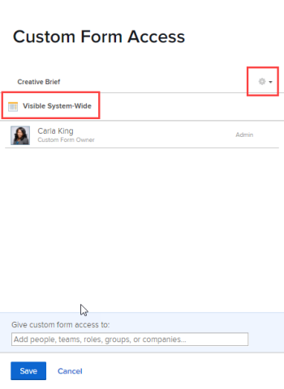

# 共享自定义表单

您可以配置自定义表单的访问权限，以控制谁（人员、角色、组、团队、公司）可以查看、共享和编辑表单。

## 访问要求

您必须具备以下条件才能执行本文中的步骤：

<table style="table-layout:auto"> 
 <col> 
 <col> 
 <tbody> 
  <tr data-mc-conditions=""> 
   <td role="rowheader"> 
Adobe Workfront计划*
 </td> 
   <td>任意</td> 
  </tr> 
  <tr> 
   <td role="rowheader">Adobe Workfront许可证*</td> 
   <td>计划</td> 
  </tr> 
  <tr data-mc-conditions=""> 
   <td role="rowheader">访问级别配置*</td> 
   <td> 
对自定义表单的管理访问权限
 
有关Workfront管理员如何授予此访问权限的信息，请参阅 <a href="../../../administration-and-setup/add-users/configure-and-grant-access/grant-users-admin-access-certain-areas.md" class="MCXref xref" data-mc-variable-override="">授予用户对特定区域的管理访问权限</a>.
 </td> 
  </tr> 
 </tbody> 
</table>

&#42;要了解您拥有的计划、许可证类型或访问级别配置，请联系您的Workfront管理员。

## 访问自定义表单 {#access-to-custom-forms}

默认情况下，当您创建新的自定义表单并有人将其附加到对象时，分配给该对象的任何用户都可以查看和填写表单。 这包括具有请求许可证的用户和外部用户。

但是，对于尚未附加自定义表单的对象，用户（即使他们具有计划员访问级别）无法从“自定义Forms”下拉菜单中附加该表单，除非满足以下条件之一：

* 某人与用户或其团队、工作角色、组或公司共享了自定义表单，并至少授予了“附加到自定义数据”选项的“查看”权限
* 用户拥有计划许可证，其访问级别允许对自定义表单进行管理访问

## 共享自定义表单

而不是将自定义表单保留为默认共享状态(如 [访问自定义表单](#access-to-custom-forms) 在本文中)，您可以为特定用户、工作角色、组、小组和公司配置特定级别的表单访问权限。

1. 单击 **主菜单** 图标  在Adobe Workfront的右上角，单击 **设置** .

1. 在左侧面板中，单击 **自定义Forms**.
1. 选择自定义表单，然后单击 **共享**.
1. 在显示的框中，在 **授予自定义表单访问权限**，开始键入要与其共享自定义表单的用户、团队、职务角色、组或公司的名称，然后按 **输入** 显示名称时。
1. 要调整您刚才添加的用户、团队、工作角色、组或公司的访问权限，请单击名称右侧的下拉菜单，然后配置以下可用选项之一及其任何高级设置：

   <table style="table-layout:auto"> 
    <col> 
    <col> 
    <tbody> 
     <tr> 
      <td role="rowheader">查看它</td> 
      <td> 
能够查看和填写对象上的自定义表单。
 
<b>注意</b>:对于具有工作、审阅和请求许可证的用户，这是可用的最高选项。
 
单击 <strong>高级设置</strong> 要指定是否允许执行以下操作：
 
       <ul> 
        <li><strong>附加到自定义数据</strong>:能够将自定义表单附加到他们具有“管理”访问权限的项目、任务和问题</li> 
        <li> 
<strong>共享</strong>:能够与系统中的其他人共享自定义表单
 
拥有作品、审阅或请求许可证的用户只能通过API或自定义表单报表共享自定义表单。 有关更多信息，请参阅。
 </li> 
       </ul> </td> 
     </tr> 
     <tr> 
      <td role="rowheader">管理它</td> 
      <td> 
仅适用于具有计划许可证的用户。 
 
除了能够将表单添加到他们有权编辑的对象之外，用户还可以完全编辑自定义表单，包括添加、编辑和删除字段。
 
单击 <strong>高级设置</strong> 要指定是否允许执行以下操作：
 
       <ul> 
        <li> 
<strong>附加到自定义数据</strong>:能够将自定义表单附加到他们具有“管理”访问权限的项目、任务和问题
 </li> 
        <li><strong>删除</strong>:从系统中删除自定义表单</li> 
        <li><strong>共享</strong>:与系统中的其他人共享自定义表单</li> 
       </ul> </td> 
     </tr> 
    </tbody> 
   </table>

1. （可选）重复步骤4-5以向列表添加其他名称并配置其选项。
1. （可选）如果要将对自定义表单（对于附加表单的对象）的访问限制为您在上一步中指定的表单，请单击齿轮图标  ，然后单击 **删除系统范围的访问**.

   如果您改变主意，可以单击 **在系统范围内使此可见** （默认选项）。

   >[!NOTE]
   >
   >* 在系统范围内显示自定义表单时，您仅允许用户查看和填写他们分配到的对象，而不是将其附加到其他对象。 您可以使用步骤5中介绍的“附加到自定义数据”选项，授予将自定义表单附加到对象的能力。
   >* 大多数组织都希望确保系统中的每个人都能够填写一个自定义表单，该表单附加到他们处理的对象上，并在报表中查看其数据。 如果贵组织的情况为true，我们建议您使用“**在系统范围内使此可见**.&quot; 以这种方式配置选项后，对话框中会显示“可见的系统范围”：

   >   
   >
   >   
   >如果您担心自定义表单，在该表单中，用户可能会在将敏感数据附加到某些对象时输入敏感数据，这将限制这些对象的共享 *对象* 可能比限制对表单本身的访问更好。

1. 单击&#x200B;**保存**。

## 删除对自定义表单的访问权限

1. 单击 **主菜单** 图标  在Adobe Workfront的右上角，单击 **设置** .

1. 在左侧面板中，单击 **自定义Forms**.
1. 选择自定义表单，然后单击 **共享**.
1. 在显示的框中，单击用户、团队、角色、组或公司名称右侧的X，您不再希望对表单拥有特殊访问权限。
1. （可选）对于要删除的其他名称，请重复上一步。
1. 单击&#x200B;**保存**。
