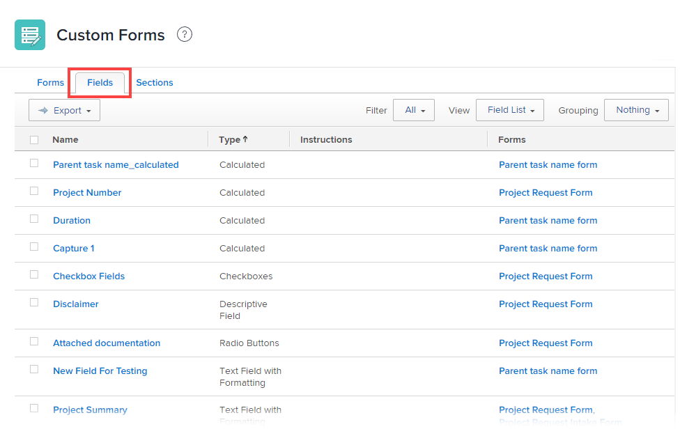

# 查看使用特定自定义字段或小组件的所有报表

您可以在“自定义Forms”区域添加自定义视图，以显示哪些报表使用特定的自定义字段或小组件。 当您需要编辑或删除字段或小组件时，此功能非常有用，因为它可能已在一个或多个报表中实施。 必须评估这些报告是否需要调整才能继续正常工作。

有关自定义表单中的自定义字段和小组件的信息，请参阅 [将自定义字段添加到自定义表单](../../../administration-and-setup/customize-workfront/create-manage-custom-forms/add-a-custom-field-to-a-custom-form.md) 和 [在自定义表单中添加或编辑资产小组件](../../../administration-and-setup/customize-workfront/create-manage-custom-forms/add-widget-or-edit-its-properties-in-a-custom-form.md).

## 访问要求

您必须具备以下条件才能执行本文中的步骤：

<table style="table-layout:auto"> 
 <col> 
 <col> 
 <tbody> 
  <tr data-mc-conditions=""> 
   <td role="rowheader"> 
Adobe Workfront计划*
 </td> 
   <td>任意</td> 
  </tr> 
  <tr> 
   <td role="rowheader">Adobe Workfront许可证*</td> 
   <td>计划</td> 
  </tr> 
  <tr data-mc-conditions=""> 
   <td role="rowheader">访问级别配置*</td> 
   <td> 
对自定义表单的管理访问权限
 
有关Workfront管理员如何授予此访问权限的信息，请参阅 <a href="../../../administration-and-setup/add-users/configure-and-grant-access/grant-users-admin-access-certain-areas.md" class="MCXref xref">授予用户对特定区域的管理访问权限</a>.
 </td> 
  </tr> 
 </tbody> 
</table>

&#42;要了解您拥有的计划、许可证类型或访问级别配置，请联系您的Workfront管理员。

## 列出使用特定自定义字段或小组件的报表

1. 单击 **主菜单** 图标  在Adobe Workfront的右上角，单击 **设置** .

1. 在左侧面板中，单击 **自定义Forms**.
1. 打开 **字段** 选项卡，以显示列出Workfront实例中所有自定义字段和小组件的报表。

   

1. 单击 **查看** 下拉菜单（位于列表顶部的标题中），然后检查列表中是否包含 **报表** 列（此选项卡上不是默认列）。

   在“报表”列中，您可以查看哪些报表使用了每个自定义字段和小组件，这些小组件已添加到系统中的自定义表单中。 可能有人已创建包含 **报表** 列。

1. 如果您看不到包含 **报表** 列中，创建包含该视图的新视图：

   1. 单击 **查看** 下拉菜单，然后单击 **新建视图**.

   1. 在 **新建视图** 在左上角附近的框中，替换 **新建参数视图** ，例如 *字段和小组件*.

   1. 单击 **添加列** 在右下角附近。
   1. 在 **在此列中显示** 框，开始键入 *报告*，然后选择 **报表** 当它出现在框下方的列表中时。

   1. （视情况而定）如果要将 **报表** 添加到其他水平位置的列，将其标题拖动到 **列预览** 区域。

   1. 单击 **完成**，然后单击 **保存视图**.

1. 单击 **查看** 下拉菜单中，然后选择您刚刚创建的自定义视图的名称。
1. 在 **名称** 列中，找到您计划编辑或删除的自定义字段或小组件，然后查看 **报表** 列来查看使用该报表的报表（如果有）。

   要查找此列的信息，Workfront会搜索所有报表过滤器、视图、分组中的自定义字段和小组件。

   如果您看到加号，则可以单击该行文本以显示一个框，其中列出了使用该字段或小组件的所有其他报表。

   >[!NOTE]
   >
   >此工具的初始加载时间可能需要10秒到2.5分钟，具体时间取决于系统中的数据量。

   >[!TIP]
   >
   >如果您没有时间调查使用自定义字段或小组件的报表，则可以单击“导出”以创建列出这些字段或小组件的文件。 您可以与拥有使用字段或小组件的报表的任何人共享此文件，并讨论需要进行的更改、它可能对报表的影响，以及需要采取哪些措施来确保报表继续正常运行。
   >
   >此视图也可在参数报表中使用：
   >      
   > 1. 在主菜单中，单击 **报表**.
   > 1. 在左上角附近，单击 **新建报表**，然后单击 **参数** 在显示的列表中。
   > 1. 单击 **添加列** 在右下角附近。
   > 1. 在 **在此列中显示** 框，开始键入 *报告*，然后选择 **报表** 当它出现在框下方的列表中时。
   > 1. （视情况而定）如果要将 **报表** 添加到其他水平位置的列，将其标题拖动到 **列预览** 区域。
   > 1. 单击 **完成**，然后单击 **保存并关闭**.
   > 1. 为报表键入一个描述性名称，如 *字段和小组件*.

