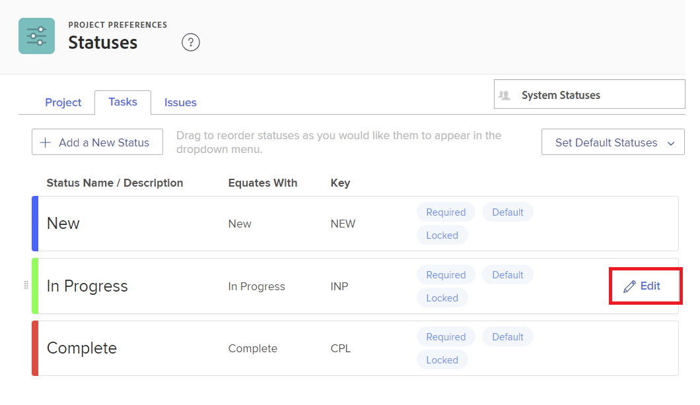
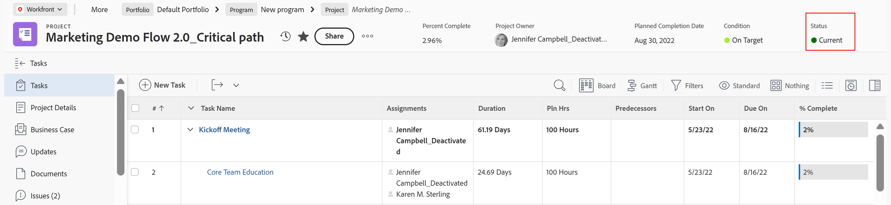

# 创建或编辑状态

<!-- Audited: 1/2024 -->

<!--DON'T DELETE, DRAFT OR HIDE THIS ARTICLE. IT IS LINKED TO THE PRODUCT THROUGH CONTEXT SENSITIVE HELP LINKS.-->

作为Adobe Workfront管理员，您可以为项目、任务和问题创建自定义状态。 这些权限适用于整个Workfront系统内的用户，或者特定组或子组。 有关状态的详细信息，请参阅[状态概述](../../../administration-and-setup/customize-workfront/creating-custom-status-and-priority-labels/statuses-overview.md)。

>[!NOTE]
>
>组管理员还可以创建自己的组状态，仅供其组使用。 有关详细信息，请参阅[创建或编辑组状态](../../../administration-and-setup/manage-groups/manage-group-statuses/create-or-edit-a-group-status.md)。

## 访问要求

+++ 展开以查看本文中各项功能的访问要求。

您必须具有以下权限才能执行本文中的步骤：

<table style="table-layout:auto"> 
 <col> 
 <col> 
 <tbody> 
  <tr> 
   <td role="rowheader">Adobe Workfront计划</td> 
   <td>任何</td> 
  </tr> 
  <tr> 
   <td role="rowheader">Adobe Workfront许可证</td> 
   <td>
     
新增：标准

     
或

     
当前：计划

   </td> 
  </tr> 
  <tr> 
   <td role="rowheader">访问级别配置</td> 
   <td> 
您必须是Workfront管理员。
  </td> 
  </tr> 
 </tbody> 
</table>

有关此表中信息的更多详细信息，请参阅Workfront文档中的[访问要求](/help/quicksilver/administration-and-setup/add-users/access-levels-and-object-permissions/access-level-requirements-in-documentation.md)。

+++

## 创建或编辑自定义状态

您可以添加自定义状态，以供整个组织或单个组使用。

在为整个组织创建自定义状态时，您可以对其进行配置，以便系统中的所有组都可以使用它而无需对其进行编辑。 或者，您可以对其进行配置，以便组管理员可以为其组修改它，如[创建或编辑组状态](../../../administration-and-setup/manage-groups/manage-group-statuses/create-or-edit-a-group-status.md)中所述。

{{step-1-to-setup}}

1. 在左侧面板中，单击&#x200B;**项目首选项** > **状态**。

1. （视情况而定）如果要创建或编辑用于系统范围的状态，请确保在右上角的框中选择&#x200B;**系统状态**。

   

   或

   如果状态为组或子组，请在右上角开始键入组的名称，然后在该组出现时将其选定。

   

1. 选择要与状态关联的对象类型（**项目**、**任务**&#x200B;或&#x200B;**问题**）的选项卡。

1. 如果您正在创建新状态，请单击&#x200B;**添加新状态**。

   或

   如果您正在编辑现有状态，请将鼠标悬停在该状态上，然后单击最右侧显示的&#x200B;**编辑**&#x200B;图标。

   

1. 使用以下选项配置状态：

   <table style="table-layout:auto"> 
    <col> 
    <col> 
    <tbody> 
     <tr> 
      <td role="rowheader">状态名称</td> 
      <td> 
键入状态的名称。 这是必填字段。
 
创建状态名称时，请注意，系统中的其他人可以创建具有相同名称的状态。 我们建议使用唯一的名称，以避免在Workfront中选择状态时产生混淆。
 </td> 
     </tr> 
     <tr> 
      <td role="rowheader">描述</td> 
      <td>（可选）键入状态的描述。 这会向使用的人传达其目的。</td> 
     </tr> 
     <tr> 
      <td role="rowheader">颜色</td> 
      <td> 
通过单击颜色字段并从样本面板中选择一种颜色，自定义状态的颜色。 您还可以在字段中输入十六进制数字。
 
当用户查看对象时，状态颜色显示在Workfront的右上角。
  
 </td> 
     </tr> 
     <tr> 
      <td role="rowheader">等于</td> 
      <td> 
从列表中选择最能描述状态功能的选项之一。 例如，如果状态名称为Done，则其对应的选项应为Complete。
 
每个状态都必须等同于这些选项之一，因为这决定了状态的运行方式。
 
创建状态后无法修改此选项。
 </td> 
     </tr> 
     <tr> 
      <td role="rowheader">键</td> 
      <td> 
如果要创建新状态，请键入该状态的代码或缩写，或使用为您生成的代码或缩写。 此键在Workfront中必须唯一，因为它可用于报表目的。 如果尝试指定系统中已使用的键，该字段将变为红色。
 
使用将使用该缩写的用户可识别的缩写可能很有用。
 
创建状态后无法修改此选项。
 
您不能更改Planning、Current和Complete状态的键代码。 如果您以文本模式构建报表，这一点很重要。
 </td> 
     </tr> 
     <tr> 
      <td role="rowheader">隐藏状态</td> 
      <td> 
（仅限项目和任务状态）
 
如果您希望向用户隐藏状态，请启用此选项。 禁用此选项（默认设置）时，系统中的所有用户都可以使用状态。
 
您可以对所有4种问题类型（错误报告、更改顺序、问题、请求）禁用此选项，以隐藏问题状态。
 </td> 
     </tr> 
     <tr> 
      <td role="rowheader">锁定所有群组</td> 
      <td>
       
当状态被锁定时，系统中的用户可以查看并使用它，组管理员无法为其组自定义它。
 
       
当状态被解锁时，组管理员可以为其各个组自定义状态。

   

       
您可以在系统审批流程中使用锁定和未锁定状态。 如果您创建的系统审批流程具有未锁定的系统状态，则系统中的用户可以将审批流程附加到系统中的任何项目、任务或问题。

       
 在以下场景中，显示警告消息以帮助您和您的用户了解解锁状态的结果：

       <ul>
       <li>管理员可解锁在审批流程中使用的系统级状态。 一条消息警告，可能会删除其组的解锁状态，这将阻止组成员正确使用该审批流程处理分配给其组的对象。</li>
       <li>用户开始编辑使用解锁状态的审批流程。 一条消息会向用户发出有关已解锁状态的警报，以便他们能够评估重新锁定还是替换该消息是否合适。</li>
       <li>具有解锁状态的系统级审批流程被附加到对象上，并且分配给该对象的组的状态被删除。 当组成员转至对象的“批准”部分时，将显示一条消息，说明无法为该对象启动批准流程。</li>
       </ul>
       
有关锁定状态的详细信息，请参阅<a href="../../../administration-and-setup/customize-workfront/creating-custom-status-and-priority-labels/lock-or-unlock-a-custom-system-level-status.md" class="MCXref xref">锁定和未锁定的系统级别状态</a>。

       

      </td>
     </tr> 
    </tbody> 
   </table>

1. 单击&#x200B;**保存**。

   有关将此状态设为默认状态的说明，请参阅[将自定义状态用作默认状态](../../../administration-and-setup/customize-workfront/creating-custom-status-and-priority-labels/use-custom-statuses-as-default-statuses.md)。

有关重新排序组状态的信息，请参阅[重新排序系统级别和组状态](../../../administration-and-setup/customize-workfront/creating-custom-status-and-priority-labels/reorder-system-statuses.md)。
