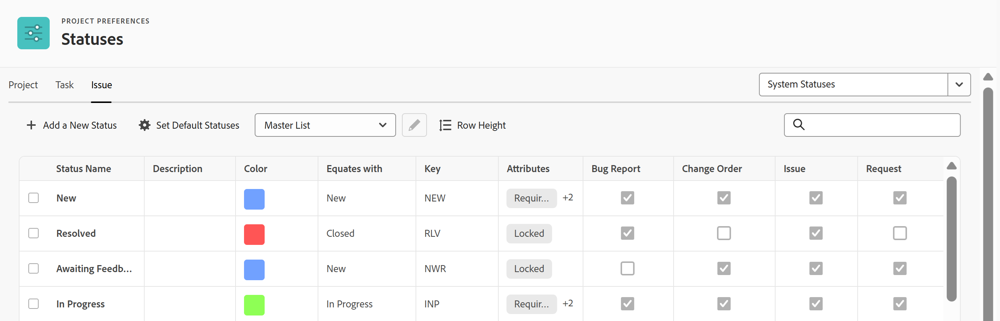

# 访问系统问题状态的列表

您可以使用问题的状态向系统中的用户显示问题在给定时间处于哪个开发阶段。

## 访问要求

+++ 展开以查看本文中各项功能的访问要求。

<table style="table-layout:auto"> 
 <col> 
 <col> 
 <tbody> 
  <tr> 
   <td>Adobe Workfront包</td> 
   <td>
任何
</td> 
  </tr> 
  <tr> 
   <td>Adobe Workfront许可证</td> 
   <td>
标准

       
规划
</td>
  </tr> 
  <tr> 
   <td>访问级别配置</td> 
   <td>系统管理员</td> 
  </tr> 
 </tbody> 
</table>

有关信息，请参阅Workfront文档中的[访问要求](/help/quicksilver/administration-and-setup/add-users/access-levels-and-object-permissions/access-level-requirements-in-documentation.md)。

+++

## 访问问题状态

您可以访问和修改系统级别的问题状态。 您可以编辑一些有关默认系统状态的信息，也可以创建新的自定义状态。 有关创建自定义状态或编辑系统状态的详细信息，请参阅[创建或编辑状态](../../../administration-and-setup/customize-workfront/creating-custom-status-and-priority-labels/create-or-edit-a-status.md)。

要访问系统级问题状态，请执行以下操作：

{{step-1-to-setup}}

1. 单击&#x200B;**项目首选项** > **状态**。

1. 单击&#x200B;**问题**&#x200B;选项卡以查看Workfront中可用的问题状态。

   

## 系统问题状态

Workfront附带10个原始问题状态。 下表中的前4个是必需的，这意味着您可以解锁、重命名和重新排序它们，但无法隐藏或删除它们。

您可以添加自定义问题状态以匹配组织中的需求。 有关详细信息，请参阅[创建或编辑状态](../../../administration-and-setup/customize-workfront/creating-custom-status-and-priority-labels/create-or-edit-a-status.md)。

对于用户，更改问题的状态通常是手动过程。 但是，在某些情况下，问题的状态会根据系统中发生的其他因素自动变化（如下表中所述）。

您的Workfront实例提供了以下问题状态：

<table style="table-layout:auto"> 
 <col> 
 <col> 
 <col> 
 <thead> 
  <tr> 
   <th>系统问题状态</th> 
   <th>如何使用状态</th> 
   <th>状态中发生的情况</th> 
  </tr> 
 </thead> 
 <tbody> 
  <tr> 
   <td>新建（必需状态）</td> 
   <td>这是每个新创建问题的默认状态。</td> 
   <td>如果问题出现在状态为“当前”的项目上，则问题会显示在分配给该问题的用户的工作请求选项卡中。 用户现在可以开始解决此问题。</td> 
  </tr> 
  <tr> 
   <td>进行中（必需状态）</td> 
   <td> 
您可以将问题置于此状态，以表明已启动针对该问题的工作。
 
如果问题的解决方法连接到另一个对象（任务、项目或其他问题），则当您将解决对象的状态更改为进行中时，问题状态会自动更改为进行中。 
 
有关解析对象的详细信息，请参阅<a href="../../../manage-work/issues/convert-issues/resolving-and-resolvable-objects.md" class="MCXref xref">解析和可解析对象概述</a>。
 </td> 
   <td> 
如果问题出现在状态为“当前”的项目上，则问题显示在分配给该问题的用户的处理选项卡中。
 
当问题正在进行时，问题显示实际开始日期的值。
 
 
 </td> 
  </tr> 
  <tr> 
   <td>已关闭（必需状态）</td> 
   <td> 
当问题的工作完成时，您可以手动将问题标记为已关闭。 
 
如果问题的解决方法连接到另一个对象（任务、项目或其他问题），则当您将解决对象的状态更改为“已关闭”时，问题状态会自动更改为“已关闭”。
 
有关解析对象的详细信息，请参阅<a href="../../../manage-work/issues/convert-issues/resolving-and-resolvable-objects.md" class="MCXref xref">解析和可解析对象概述</a>。
 </td> 
   <td> 
问题解决后，该问题将从被分派人的工作清单中移除。 在本例中，问题显示实际完成日期的值。 
 
当项目中的所有任务都完成并关闭问题时，项目就能完成。
 </td> 
  </tr> 
  <tr> 
   <td>保持（必需状态）</td> 
   <td> 
您可以手动将问题标记为“已搁置”，以指示完成问题时出现延迟。 
 </td> 
   <td> 
如果问题出现在状态为“当前”的项目上，则问题显示在分配给该问题的用户的处理选项卡中。 
 
当项目中的所有任务都已完成，但项目至少有一个已搁置问题时，项目无法完成。 
 </td> 
  </tr> 
  <tr> 
   <td>重新打开（等于进行中）</td> 
   <td> 
您可以将问题置于此状态，以指示该问题上的工作尚未在问题之前关闭时完全完成，需要重新打开才能完成工作。
 </td> 
   <td> 
如果问题出现在状态为“当前”的项目上，则问题会显示在分配给该问题的用户的工作请求选项卡中。 用户现在可以开始解决此问题。
 
此状态在报表中非常重要，用于区分首次打开的问题（通常在新状态下）和在关闭之前打开的问题（通常在重新打开状态）。 
 </td> 
  </tr> 
  <tr> 
   <td>等待反馈（相当于已搁置）</td> 
   <td>您可以将问题置于此状态，以表明您正在等待反馈（通常来自主要联系人），然后才能继续处理问题。 </td> 
   <td> 
如果问题出现在状态为“当前”的项目上，则问题显示在分配给该问题的用户的处理选项卡中。
 
如果问题正在等待反馈，则无法完成项目。
 
此状态在报告中很重要，用于区分当前未完成但正在处理的问题（通常处于正在进行状态）和当前未完成但尚未处理的问题，因为需要更多反馈才能完成它们（通常处于等待反馈状态）。
 </td> 
  </tr> 
  <tr> 
   <td>无法复制（等于已关闭）</td> 
   <td>您可以将问题置于此状态以指示您正在关闭问题，但看不到触发打开问题的问题。 问题可能仍然存在，但无法在给定时间复制它。 </td> 
   <td> 
此状态在报告中很重要，用于区分已完成的问题及其问题已得到解决的问题（通常在“已关闭”状态）和问题在给定时间不可见的问题（通常在“无法复制”状态）。
 
当问题被标记为无法复制时，该问题将从被分派人的工作清单中移除。 在本例中，该问题显示了Actual CompletionDate的值。
 
如果项目上的所有任务已完成，并且某些问题处于无法复制状态，则项目可以完成。
 </td> 
  </tr> 
  <tr> 
   <td>已解决（等于已关闭）</td> 
   <td>您可以将问题置于此状态，以表明您正在关闭问题且创建该问题的问题实际上已得到解决。</td> 
   <td> 
此状态在报表中非常重要，用于区分已关闭且无解决方案的问题（通常处于“已关闭”状态）和使用实际解决方案关闭的问题（通常处于“已解决”状态）。
 
当问题标记为“已解决”时，该问题将从被分派人的工作清单中移除。 在本例中，问题显示实际完成日期的值。
 
如果项目上的所有任务已完成，并且至少一个问题处于“已解决”状态，则可以完成项目。 
 </td> 
  </tr> 
  <tr> 
   <td>已验证完成（相当于已关闭）</td> 
   <td>您可以将问题置于此状态，以表明您正在关闭问题，并且已验证导致问题的问题已得到解决。</td> 
   <td> 
当问题被标记为“已验证完成”时，该问题将从被分配人的“工作”列表中删除。 在本例中，问题显示实际完成日期的值。
 
如果项目上的所有任务已完成，并且某些问题处于验证完成状态，则项目可以完成。
 </td> 
  </tr> 
  <tr> 
   <td>不会解析（等于已关闭）</td> 
   <td>您可以将问题置于此状态以指示您正在关闭问题，但无法解决导致该问题的问题。</td> 
   <td> 
此状态在报表中非常重要，用于区分已关闭且无解决方案的问题（通常处于“已关闭”状态）和未实际解决方案关闭的问题（通常处于“无法解决”状态）。
 
当问题被标记为无法解决时，该问题将从被分配人的“工作”列表中删除。 在本例中，问题显示实际完成日期的值。
 
如果项目上的所有任务已完成，并且至少一个问题处于无法解决状态，则项目可以完成。
 </td> 
  </tr> 
 </tbody> 
</table>

## 自定义问题状态

Workfront管理员可以向Workfront添加系统级别和组级别的问题状态，并更改用户查看这些问题的顺序。 有关详细信息，请参阅[创建或编辑状态](../../../administration-and-setup/customize-workfront/creating-custom-status-and-priority-labels/create-or-edit-a-status.md)。

组管理员可以添加特定于某个组的自定义状态。 有关详细信息，请参阅[创建或编辑组状态](../../../administration-and-setup/manage-groups/manage-group-statuses/create-or-edit-a-group-status.md)。
