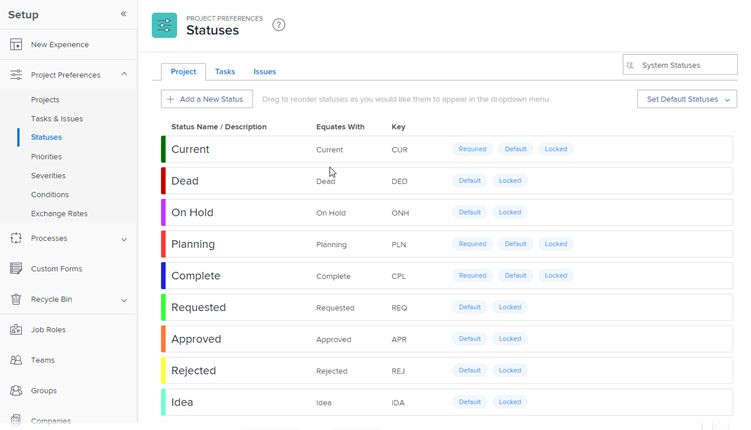

# 访问系统项目状态的列表

用户可以指定项目的状态，以便其他用户可以在给定时间查看项目的当前开发阶段。

Workfront附带9个系统项目状态。 您可以更改这些状态的名称，但无法删除它们。

您还可以添加自定义项目状态以匹配组织中的需求。

作为Workfront管理员，您可以为系统中的所有新项目配置默认状态。 有关说明，请参阅[配置系统范围的项目首选项](../../../administration-and-setup/set-up-workfront/configure-system-defaults/set-project-preferences.md)。

## 访问要求

+++ 展开以查看本文中各项功能的访问要求。

您必须具有以下权限才能执行本文中的步骤：

<table style="table-layout:auto"> 
 <col> 
 <col> 
 <tbody> 
  <tr> 
   <td role="rowheader">Adobe Workfront计划</td> 
   <td>任何</td> 
  </tr> 
  <tr> 
   <td role="rowheader">Adobe Workfront许可证</td> 
   <td>计划</td> 
  </tr> 
  <tr> 
   <td role="rowheader">访问级别配置</td> 
   <td> 
您必须是Workfront管理员。
 
<b>注意</b>：如果您仍然没有访问权限，请咨询Workfront管理员是否对您的访问级别设置了其他限制。 有关Workfront管理员如何修改您的访问级别的信息，请参阅<a href="../../../administration-and-setup/add-users/configure-and-grant-access/create-modify-access-levels.md" class="MCXref xref">创建或修改自定义访问级别</a>。
 </td> 
  </tr> 
 </tbody> 
</table>

+++

## 访问项目状态

作为Workfront管理员，您可以访问系统级别项目状态的列表。

有关编辑系统状态和创建自定义状态的信息，请参阅[创建或编辑状态](../../../administration-and-setup/customize-workfront/creating-custom-status-and-priority-labels/create-or-edit-a-status.md)。

{{step-1-to-setup}}

1. 单击&#x200B;**项目首选项** > **状态**。

1. 单击&#x200B;**项目**&#x200B;选项卡。

   此选项卡上列出了Workfront中可用的项目状态。

   

   有关每个内置系统项目状态的详细信息，请参阅[系统项目状态概述](../../../administration-and-setup/customize-workfront/creating-custom-status-and-priority-labels/system-project-statuses.md)。

## 创建自定义项目状态和自定义系统状态

作为Workfront管理员，您可以将系统项目状态添加到Workfront。 作为组所有者，您可以添加特定于某个组的自定义状态。 有关创建自定义状态或编辑系统状态的详细信息，请参阅[创建或编辑状态](../../../administration-and-setup/customize-workfront/creating-custom-status-and-priority-labels/create-or-edit-a-status.md)。

创建自定义项目状态时，必须始终将新状态与现有系统状态等同。 您必须了解系统状态的行为，才能知道哪个状态适合将您的自定义状态与等同。 选择平等状态后，无法更改此选择。 有关系统项目状态的详细信息，请参阅[系统项目状态概述](../../../administration-and-setup/customize-workfront/creating-custom-status-and-priority-labels/system-project-statuses.md)。
