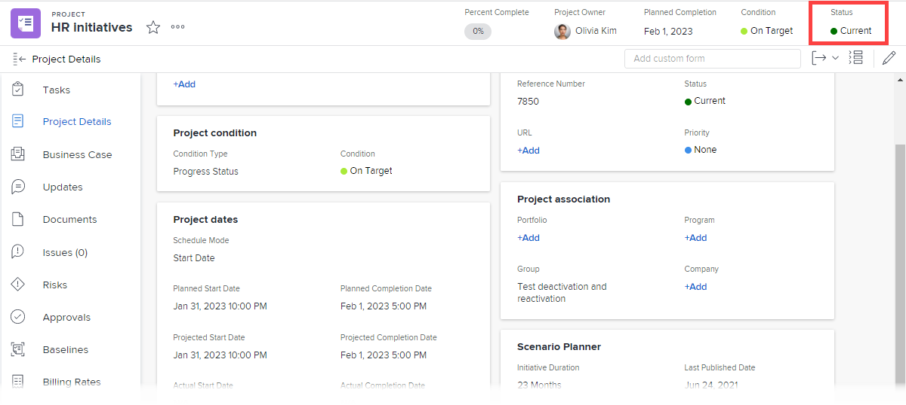

# 状态概述

<!-- Audited: 01/2024 -->

要了解项目、任务或问题的当前开发状态，用户可以查看其状态。

例如，在此项目中，状态“计划”表示项目经理当前正在计划项目的各个方面，如时间线、任务分配和批准。

更改项目、任务或问题的状态通常是手动过程。 但是，有时候，问题的状态会根据系统中发生的其他因素自动更改。

Adobe Workfront提供了9个项目状态、3个任务状态和10个问题状态。 有关这些内容的详细信息，请参阅以下文章：

* [访问系统项目状态的列表](../../../administration-and-setup/customize-workfront/creating-custom-status-and-priority-labels/project-statuses.md)
* [访问系统任务状态的列表](../../../administration-and-setup/customize-workfront/creating-custom-status-and-priority-labels/task-statuses.md)
* [访问系统问题状态的列表](../../../administration-and-setup/customize-workfront/creating-custom-status-and-priority-labels/issue-statuses.md)

## 自定义状态

除了Workfront提供的默认状态之外，Workfront管理员还可以添加自定义项目、任务和问题状态以满足您组织中的需求。 您可以创建Workfront实例中的每个人使用的系统级别状态，或仅供某些组使用的组级别状态。 有关更多信息，请参阅 [创建或编辑状态](../../../administration-and-setup/customize-workfront/creating-custom-status-and-priority-labels/create-or-edit-a-status.md).

## 组状态

组管理员可以创建组级别的自定义状态，以满足其组的需求。 有关更多信息，请参阅 [管理组状态](../../../administration-and-setup/manage-groups/manage-group-statuses/manage-group-statuses.md).
