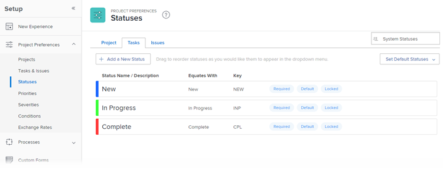

# 访问系统任务状态的列表

您可以使用任务的状态向用户显示任务在给定时间处于哪个开发阶段。

## 访问要求

+++ 展开以查看本文中各项功能的访问要求。

<table style="table-layout:auto"> 
 <col> 
 <col> 
 <tbody> 
  <tr> 
   <td>Adobe Workfront包</td> 
   <td>
任何
</td> 
  </tr> 
  <tr> 
   <td>Adobe Workfront许可证</td> 
   <td>
标准

       
规划
</td>
  </tr> 
  <tr> 
   <td>访问级别配置</td> 
   <td>系统管理员</td> 
  </tr> 
 </tbody> 
</table>

有关信息，请参阅Workfront文档中的[访问要求](/help/quicksilver/administration-and-setup/add-users/access-levels-and-object-permissions/access-level-requirements-in-documentation.md)。

+++

## 访问任务状态

有关编辑系统状态或创建新自定义状态的信息，请参阅[创建或编辑状态](../../../administration-and-setup/customize-workfront/creating-custom-status-and-priority-labels/create-or-edit-a-status.md)。

{{step-1-to-setup}}

1. 单击&#x200B;**项目首选项** > **状态**。

1. 单击&#x200B;**任务**&#x200B;选项卡。

   此选项卡上列出了Workfront中可用的任务状态。

   

   有关每个内置系统任务状态的详细信息，请参阅[系统任务状态](../../../administration-and-setup/customize-workfront/creating-custom-status-and-priority-labels/system-task-statuses.md)。

## 关于创建自定义任务状态

作为Workfront管理员，您可以向Workfront添加自定义系统任务状态。

作为组所有者，您可以为组添加自定义任务状态。

在创建自定义任务状态时，必须始终将新状态与现有系统状态等同。 您必须了解系统状态的行为，才能知道哪个状态适合将您的自定义状态与等同。 选择相等状态后，无法更改此选择。

有关创建自定义状态、编辑系统状态或为任务选择新默认状态的详细信息，请参阅[创建或编辑状态](../../../administration-and-setup/customize-workfront/creating-custom-status-and-priority-labels/create-or-edit-a-status.md)。
