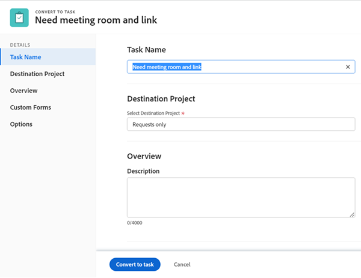

# 使用布局模板自定义详细信息视图

<!--The highlighted information on this page refers to functionality not yet generally available. It is available for all customers in the Preview environment and for a select group of customers in the Production environment.-->

作为Adobe Workfront管理员，您可以使用布局模板来确定当用户查看任务、问题、文档、项目群或项目组合时单击左侧面板中的“详细信息”图标时将显示哪些信息。

<!--
or billing record
-->

您还可以更改此信息出现的顺序。 例如，对于用户看到的所有任务，对于用户看到的所有任务，您可以将自定义Forms信息移动到详细信息视图的顶部。

有关创建布局模板的信息，请参阅[创建和管理布局模板](../use-layout-templates/create-and-manage-layout-templates.md)。

有关组的布局模板的信息，请参阅[创建和修改组的布局模板](../../../administration-and-setup/manage-groups/work-with-group-objects/create-and-modify-a-groups-layout-templates.md)。

配置布局模板后，必须将其分配给用户，以使您所做的更改对其他人可见。 有关将布局模板分配给用户的信息，请参阅[将用户分配给布局模板](../use-layout-templates/assign-users-to-layout-template.md)。

您对对象的“详细信息”视图所做的更改还决定了用户在以下区域看到的字段的可用性和顺序：

* “创建对象”框，如“创建任务”

  

* 编辑对象时显示“编辑对象”屏幕，例如“编辑任务”、“编辑问题”和“编辑项目”

  

* 批量编辑对象时显示“编辑对象”屏幕。 当前支持批量编辑项目。

  

* 任务和问题列表的摘要面板

  

  >[!NOTE]
  >
  >对布局模板所做的更改只会影响分配给登录用户的任务和问题在“摘要”面板中字段的顺序和可用性。

* “转化”框，如“将问题转化为任务”或“将问题转化为项目”框。

  

有关组的布局模板的信息，请参阅[创建和修改组的布局模板](../../../administration-and-setup/manage-groups/work-with-group-objects/create-and-modify-a-groups-layout-templates.md)。

## 访问要求

您必须具有以下权限才能执行本文中的步骤：

<table style="table-layout:auto"> 
 <col> 
 <col> 
 <tbody> 
  <tr> 
   <td role="rowheader">Adobe Workfront计划</td> 
   <td>任何</td> 
  </tr> 
  <tr> 
   <td role="rowheader">Adobe Workfront许可证</td> 
   <td>计划</td> 
  </tr> 
  <tr> 
   <td role="rowheader">访问级别配置</td> 
   <td> 
要在系统级别执行这些步骤，您需要系统管理员访问级别。
要为组执行这些操作，您必须是该组的经理
 
<b>注意</b>：如果您仍然没有访问权限，请咨询Workfront管理员是否对您的访问级别设置了其他限制。 有关Workfront管理员如何修改您的访问级别的信息，请参阅<a href="../../../administration-and-setup/add-users/configure-and-grant-access/create-modify-access-levels.md" class="MCXref xref">创建或修改自定义访问级别</a>。
 </td> 
  </tr> 
 </tbody> 
</table>

## 自定义用户在详细信息视图中看到的内容

1. 开始处理布局模板，如[创建和管理布局模板](../../../administration-and-setup/customize-workfront/use-layout-templates/create-and-manage-layout-templates.md)中所述。
1. 单击&#x200B;**自定义用户看到的内容**&#x200B;下的向下箭头，然后单击&#x200B;**项目**、**任务**、**问题**、**项目**&#x200B;或&#x200B;**Portfolio。**
<!--
, or billing record
-->

1. 在&#x200B;**详细信息**&#x200B;部分中，执行以下任一操作以自定义用户在“详细信息”视图中看到的内容：

   * 拖动任何节标题以更改其顺序。
   * 启用或禁用&#x200B;**概述**&#x200B;和&#x200B;**自定义Forms**&#x200B;下的选项以显示或隐藏它们。

     如果隐藏其中一个部分中的所有字段，则会隐藏整个部分。

     所有字段默认处于启用状态。

1. 继续自定义布局模板。

   或

   如果您已完成自定义，请单击&#x200B;**保存**。

   >[!TIP]
   >
   >您可以随时单击保存以保存进度，然后继续修改模板。
