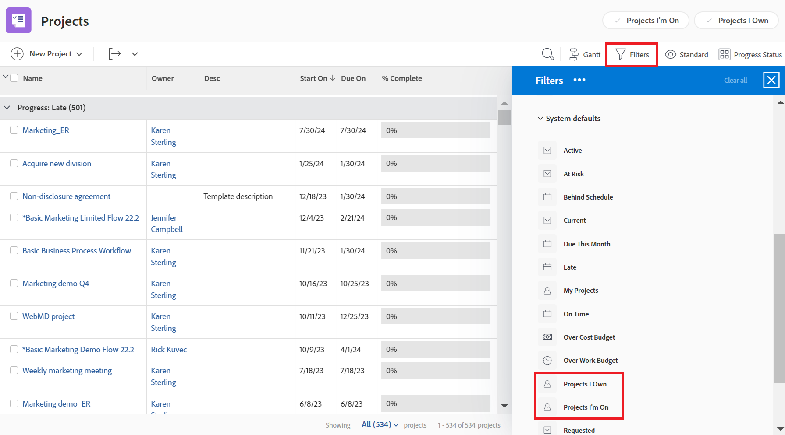
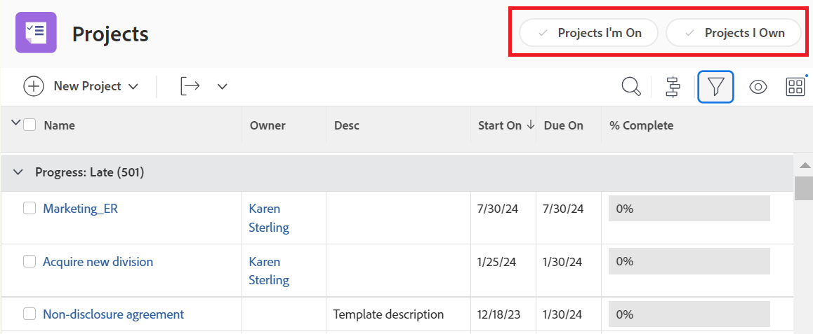

# 使用布局模板自定义筛选器、视图和分组

作为Adobe Workfront管理员，您可以使用布局模板来指定在筛选器、视图和分组下拉菜单中显示的列表控件。 这些菜单出现在整个Workfront的上方列表中，例如项目的任务列表：

有关布局模板的详细信息，请参阅 [创建和管理布局模板](../../../administration-and-setup/customize-workfront/use-layout-templates/create-and-manage-layout-templates.md).

有关组的布局模板的信息，请参阅 [创建和修改组的布局模板](../../../administration-and-setup/manage-groups/work-with-group-objects/create-and-modify-a-groups-layout-templates.md).

配置布局模板后，必须将其分配给用户，以使您所做的更改对其他人可见。 有关将布局模板分配给用户的信息，请参阅 [将用户分配给布局模板](../use-layout-templates/assign-users-to-layout-template.md).

## 访问要求

您必须具有以下权限才能执行本文中的步骤：

<table style="table-layout:auto"> 
 <col> 
 <col> 
 <tbody> 
  <tr> 
   <td role="rowheader">Adobe Workfront计划</td> 
   <td>任意</td> 
  </tr> 
  <tr> 
   <td role="rowheader">Adobe Workfront许可证</td> 
   <td>计划</td> 
  </tr> 
  <tr> 
   <td role="rowheader">访问级别配置</td> 
   <td> 
要在系统级别执行这些步骤，您需要系统管理员访问级别。
要为组执行这些操作，您必须是该组的经理。
 
<b>注意</b>：如果您仍然没有访问权限，请咨询Workfront管理员是否对您的访问级别设置了其他限制。 有关Workfront管理员如何修改您的访问级别的信息，请参阅 <a href="../../../administration-and-setup/add-users/configure-and-grant-access/create-modify-access-levels.md" class="MCXref xref">创建或修改自定义访问级别</a>.
 </td> 
  </tr> 
 </tbody> 
</table>

## 自定义筛选器、视图和分组列表控件：

1. 开始使用布局模板，如中所述 [创建和管理布局模板](../../../administration-and-setup/customize-workfront/use-layout-templates/create-and-manage-layout-templates.md).
1. 单击向下箭头  下 **自定义用户看到的内容**，然后单击 **列表** （在显示的下拉菜单中）。

   

1. 单击向下箭头  下 **选择要自定义的列表**，然后选择要为其自定义筛选器、视图和分组列表控件的Workfront对象类型。

   

   >[!NOTE]
   >
   >如果您选择项目作为要自定义的列表，然后在筛选条件部分中禁用我所在的项目或我拥有的项目，则用户将无法再看到或无法使用该筛选条件：
   >
   >* 在单击过滤器图标时显示的过滤器列表中  列表上方：
   >   
   >  
   >   
   >* 在项目区域标题的标题中：
   >   
   >  

1. （可选）如果要更改布局模板的默认筛选器、视图或分组，请将鼠标悬停在筛选器、视图或分组上，然后单击 **设置为默认值**.

   您选择的默认值决定了分配版面模板后，用户在整个Workfront的列表中将看到的筛选器、视图和分组用户。 如果不更改这些默认值，用户将按如下方式查看所有列表：

   * **筛选器**：全部
   * **视图**：标准（如果适用，某些列表没有此视图）
   * **分组**：无

   选择不同的默认值（请参阅步骤5）后，您可以隐藏“全部”、“标准”和“无”选项，但无法删除这些选项。

   您可以删除用作默认值的任何其他选项，但必须先选择其他默认选项。

   有关删除筛选器、视图和分组的信息，请参阅 [创建、编辑和共享默认筛选器、视图和分组](../../../administration-and-setup/set-up-workfront/configure-system-defaults/create-and-share-default-fvgs.md).

1. 按如下方式隐藏和添加列表控件：

   <table style="table-layout:auto"> 
    <col> 
    <col> 
    <tbody> 
     <tr> 
      <td role="rowheader">隐藏列表控件</td> 
      <td> 
清除或选中要隐藏或显示的列表控件旁边的框。
 
如果复选框灰显，则无法隐藏该列表控件。 默认  由于无法隐藏当前配置为默认值的设置，因此每个列表控件的设置都呈灰显状态。
 </td> 
     </tr> 
     <tr> 
      <td role="rowheader">添加自定义列表控件</td> 
      <td> 
 
        <ol> 
         <li value="1"> 单击 <strong>添加筛选器</strong>， <strong>添加视图</strong>，或 <strong>添加分组</strong> “筛选器”、“视图”或“分组”列表底部。 在显示的框中，开始键入先前为您的组织创建的现有自定义列表控件的名称，然后单击该名称出现的时间。</li> 
         <li value="2"> 如果您希望将新的自定义列表控件设置为布局模板的默认筛选器、视图或分组，请单击 <strong>设置为默认值</strong>. </li> 
         <li value="3"> 
单击 <strong>添加</strong> 等你完事了。
 
<b>注释</b>: 
用户可以将自定义列表控件添加到自己的列表。 如果在布局模板中添加自定义列表控件，则会添加列表控件并将其移动到面板底部；您的列表控件不会替换其列表控件。
 
如果您将用户分配到具有自定义列表控件的新布局模板，也是如此。 
 
有关自定义列表控件的信息，请参阅 <a href="../../../reports-and-dashboards/reports/reporting-elements/filters-overview.md" class="MCXref xref">Adobe Workfront中的过滤器概述</a>， <a href="../../../reports-and-dashboards/reports/reporting-elements/views-overview.md" class="MCXref xref">Adobe Workfront中的视图概述</a>、和 <a href="../../../reports-and-dashboards/reports/reporting-elements/groupings-overview.md" class="MCXref xref">Adobe Workfront中的分组概述</a>.
 
 </li> 
        </ol> 
 </td> 
     </tr> 
    </tbody> 
   </table>

1. 继续自定义布局模板。

   或

   如果您已完成自定义，请单击 **保存**.

   >[!TIP]
   >
   >您可以随时单击保存以保存进度，然后稍后继续修改模板。
