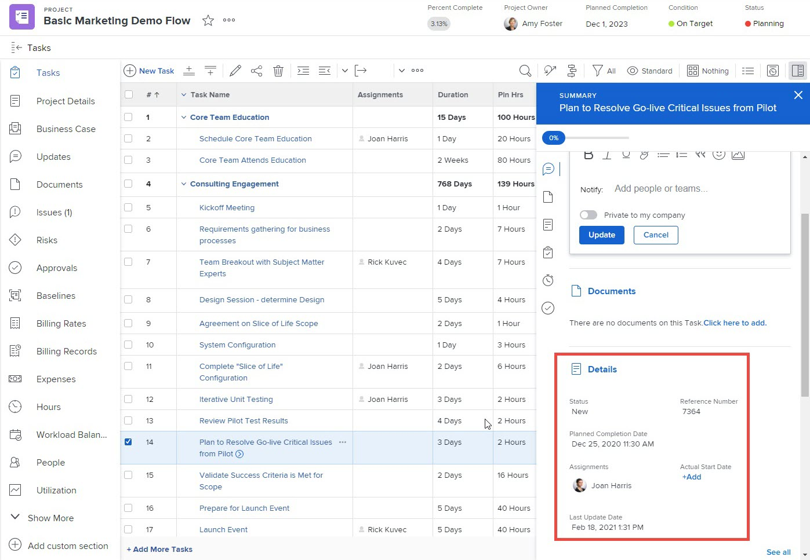

# 使用布局模板自定义主页和摘要

您可以使用布局模板配置用户在单击主页和摘要中的任务或问题时看到的内容。 您使用以下步骤进行的每个配置都会以相同的方式影响“主页”区域和“摘要”面板。 这些自定义不适用于“文档摘要”面板。

您可以配置：

* 在详细信息区域为任务或问题显示哪些字段，以及按什么顺序
* 是否显示选定任务或问题的更新、记录时间、附加文档和时间戳

您还可以自定义当用户单击分配给他们的项目审批、文档审批或文档版本审批时，用户在“主页”区域看到的字段。

有关“主页”区域的信息，请参阅 [使用“主页”区域](../../../workfront-basics/using-home/using-the-home-area/use-the-home-area.md). 有关“摘要”面板的信息，请参阅 [摘要概述](../../../workfront-basics/the-new-workfront-experience/summary-overview.md).

有关创建布局模板的信息，请参阅 [创建和管理布局模板](../use-layout-templates/create-and-manage-layout-templates.md).

有关组布局模板的信息，请参阅 [创建和修改组的布局模板](../../../administration-and-setup/manage-groups/work-with-group-objects/create-and-modify-a-groups-layout-templates.md).

配置布局模板后，必须将其分配给用户，以使您所做的更改对其他人可见。 有关为用户分配布局模板的信息，请参阅 [将用户分配给布局模板](../use-layout-templates/assign-users-to-layout-template.md).

## 访问要求

您必须具有以下权限才能执行本文中的步骤：

<table style="table-layout:auto"> 
 <col> 
 <col> 
 <tbody> 
  <tr> 
   <td role="rowheader">Adobe Workfront计划</td> 
   <td>任何</td> 
  </tr> 
  <tr> 
   <td role="rowheader">Adobe Workfront许可证</td> 
   <td>计划</td> 
  </tr> 
  <tr> 
   <td role="rowheader">访问级别配置</td> 
   <td> 
要在系统级别执行这些步骤，您需要系统管理员访问级别。
要为组执行这些操作，您必须是该组的经理。
 
<b>注意</b>：如果您仍然没有访问权限，请咨询Workfront管理员是否对您的访问级别设置了其他限制。 有关Workfront管理员如何修改您的访问级别的信息，请参阅 <a href="../../../administration-and-setup/add-users/configure-and-grant-access/create-modify-access-levels.md" class="MCXref xref">创建或修改自定义访问级别</a>.
 </td> 
  </tr> 
 </tbody> 
</table>

## 使用布局模板自定义主页和摘要

1. 开始使用布局模板，如中所述 [创建和管理布局模板](../../../administration-and-setup/customize-workfront/use-layout-templates/create-and-manage-layout-templates.md).

1. 单击向下箭头  下 **自定义用户查看内容**，然后单击 **主页和摘要**.

1. 在左侧显示的列表中，单击对象类型(**任务**， **问题**， **项目**， **文档**，或 **文档版本**)，以便在主页和摘要中进行自定义。

   <table style="table-layout:auto"> 
    <col> 
    <col> 
    <tbody> 
     <tr> 
      <td role="rowheader">任务</td> 
      <td> 
在主页中，您对此设置的配置会影响用户单击任务时任务右侧的区域。 在任务列表中，当用户选择任务，然后单击打开摘要图标时，它会影响页面右侧显示的摘要面板 .
 
例如，当用户在主页中选择任务时，您可以确定用户在详细信息区域查看哪些字段：
 

 
当他们在摘要中选择任务时：
 
  
 </td> 
     </tr> 
     <tr> 
      <td role="rowheader">问题</td> 
      <td> 
在主页中，您针对此设置的配置会影响用户单击问题时问题右侧的区域。
 
在问题列表中，此设置会影响用户选择问题，然后单击打开摘要图标时显示在页面右侧的“摘要”面板 .
 </td> 
     </tr> 
     <tr> 
      <td role="rowheader">项目</td> 
      <td>在主页中，当用户单击分配给他们的项目审批时，您对此设置的配置会影响审批右侧的区域。</td> 
     </tr> 
     <tr> 
      <td role="rowheader">文档</td> 
      <td>在主页中，当用户单击分配给他们的文档审批时，您对此设置的配置会影响审批右侧的区域。</td> 
     </tr> 
     <tr> 
      <td role="rowheader">文档版本</td> 
      <td>在主页中，当用户单击针对文档的特定版本分配给他们的批准时，您对此设置的配置会影响批准右侧的区域。</td> 
     </tr> 
    </tbody> 
   </table>

   >[!IMPORTANT]
   >
   >如果任务未分配，则分配到布局模板的用户将看不到摘要中的字段自定义设置。

1. （视情况而定）如果您在上一步中单击了任务或问题，请选择要自定义的任务或问题类别。

   

1. （视情况而定）如果 **设置主要操作按钮** 出现下拉菜单(如果选择 **任务** 或 **问题** 在左侧的列表中)，单击主要操作(**完成** 或 **状态**)，您希望用户在查看任务或问题时，可以在主页区域和摘要面板中使用该选项。

   

1. 添加  或隐藏  所选对象类型的字段。

   

1. 重复步骤3 - 6以自定义任何其他对象类型的“主页”区域和“摘要”面板。
1. 单击 **全局设置**，然后启用或禁用与主页和摘要中的Adobe Workfront对象相关的以下任何选项：

   <table style="table-layout:auto"> 
    <col> 
    <col> 
    <tbody> 
     <tr> 
      <td role="rowheader">显示工作更新</td> 
      <td>在主页或摘要中显示对选定任务或问题所做的任何更新。 这包括系统更新和用户进行的更新。 用户仍然可以过滤掉系统更新，如中所述 <a href="../../../workfront-basics/updating-work-items-and-viewing-updates/update-work.md#enable" class="MCXref xref">启用或禁用系统更新</a> 在 <a href="../../../workfront-basics/updating-work-items-and-viewing-updates/update-work.md" class="MCXref xref">更新工作</a>.</td> 
     </tr> 
     <tr> 
      <td role="rowheader">工作时的记录时间</td> 
      <td>选择任务或问题时显示“记录工作时间”选项，允许用户直接从“主页”和“摘要”区域记录工作项的时间。</td> 
     </tr> 
     <tr> 
      <td role="rowheader">查看与工作关联的文档</td> 
      <td>选择任务或问题时在“主页”和“摘要”中显示“文档”区域，列出附加到任务或问题的任何文档。 用户可以单击文档以在预览窗口中查看文档。</td> 
     </tr> 
     <tr> 
      <td role="rowheader">隐藏时间戳</td> 
      <td>在“主页”和“摘要”中隐藏以下日期字段的时间戳：
       <ul>
        <li>规划完成日期</li>
        <li>承诺日期</li>
        <li>提交日期</li>
       </ul>
<b>注意</b>：启用此选项后，过期的工作项仅根据日期而不是时间移至主页工作列表中的“延迟”分组。
</td> 
     </tr> 
    </tbody> 
   </table>

1. 继续自定义布局模板。

   或

   如果您已完成自定义，请单击 **保存**.

有关布局模板的详细信息，请参阅 [创建和管理布局模板](../../../administration-and-setup/customize-workfront/use-layout-templates/create-and-manage-layout-templates.md).
