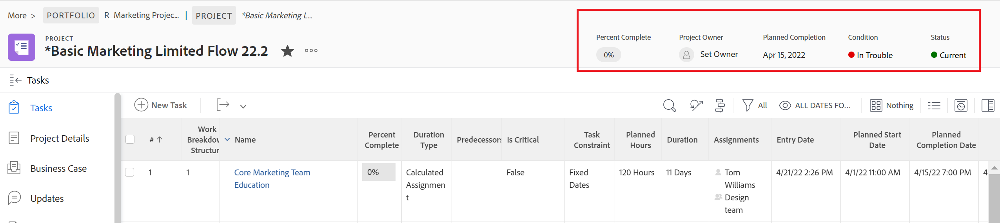

# 使用布局模板自定义对象标题

作为Adobe Workfront管理员或组管理员，您可以使用布局模板配置用户在打开对象页面时显示在对象标题中的字段。

>[!IMPORTANT]
>
>当前可用于项目、任务和问题的自定义对象标题。

有关创建布局模板的信息，请参阅[创建和管理布局模板](../use-layout-templates/create-and-manage-layout-templates.md)。

有关组的布局模板的信息，请参阅[创建和修改组的布局模板](../../../administration-and-setup/manage-groups/work-with-group-objects/create-and-modify-a-groups-layout-templates.md)。

配置布局模板后，必须将其分配给用户，以使您所做的更改对其他人可见。 有关将布局模板分配给用户的信息，请参阅[将用户分配给布局模板](../use-layout-templates/assign-users-to-layout-template.md)。

## 访问要求

您必须具有以下权限才能执行本文中的步骤：

<table>
  <tr>
   <td><strong>Adobe Workfront计划</strong>
   </td>
   <td>任何
   </td>
  </tr>
  <tr>
   <td><strong>Adobe Workfront许可证</strong>
   </td>
   <td>计划
   </td>
  </tr>
  <tr>
   <td><strong>访问级别配置</strong>
   </td>
   <td>您必须是Workfront或组管理员。

   </td>
  </tr>
</table>

如果您仍然没有访问权限，请咨询Workfront管理员是否对您的访问级别设置了其他限制。 有关Workfront管理员如何修改您的访问级别的信息，请参阅[创建或修改自定义访问级别](../../add-users/configure-and-grant-access/create-modify-access-levels.md)。

## 自定义对象标题

1. 开始处理布局模板，如[创建和管理布局模板](../../customize-workfront/use-layout-templates/create-and-manage-layout-templates.md)中所述。
1. 在&#x200B;**自定义用户看到的内容**&#x200B;下拉菜单中，选择&#x200B;**项目**、**任务**&#x200B;或&#x200B;**问题**。

   <!--when this will be possible for more than 3 objects, at production, make this more general: update the sentence above to say "select an object you want to customize in the Customize what users see drop-down menu). -->

1. 在[!UICONTROL 标题字段]部分中，将鼠标悬停在显示的字段上并执行以下操作之一：
   * 单击&#x200B;**x**&#x200B;图标可删除字段

     或

   * 单击并按住&#x200B;**抓取**&#x200B;图标以将字段拖放到新位置。

   <!--(NOTE: make sure the default names of these fields have not changed; otherwise, update screen shot)-->

   

1. 一个对象的标题中最多可以有五个字段。
如果已选择五个字段，则必须先移除一个字段，然后才能添加新字段。
1. 在&#x200B;**添加字段**&#x200B;框中，开始键入要添加的不可编辑的Workfront字段的名称，然后当该字段显示在列表中时将其选定。 该字段即被添加到“添加字段”框的右侧，并将作为第一个字段显示在对象标题的左上角。

   >[!TIP]
   >
   >* 您只能添加显示在对象详细信息部分的概述区域中且不可编辑的字段。 不可编辑字段是用户无法手动编辑的字段。 它们由Workfront自动计算。
   >
   >* 您可以添加已是默认标题一部分的可编辑字段（例如，项目所有者、状态、完成百分比、分配）。
   >
   >* 将“解决者”字段添加到问题的标题时，如果存在与问题关联的解决对象，则该字段将更改为“解决问题、任务或项目”。

   

1. （可选）拖放以不同顺序添加的字段。

1. 继续自定义布局模板。

   或

   如果您已完成自定义，请单击&#x200B;**保存**。

   >[!TIP]
   >
   >您可以随时单击保存以保存进度，然后继续修改模板。
