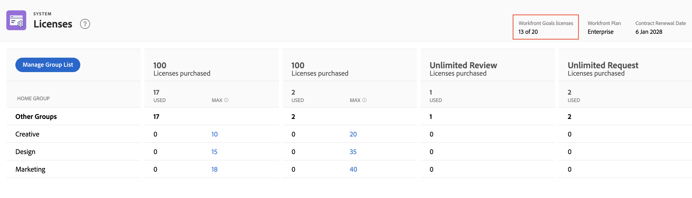

# 管理系统中的可用许可证

<!-- Audited: 12/2023 -->

作为Adobe Workfront管理员，您可以访问有关您的Workfront帐户的信息，包括为您的组织购买的许可证数量，以及当前正在使用的许可证数量。

## 访问权限要求

+++ 展开可查看本文所述功能的访问权限要求。

<table style="table-layout:auto"> 
 <col> 
 <col> 
 <tbody> 
  <tr> 
   <td role="rowheader">Workfront包</td> 
   <td>
“任一”
</td> 
  </tr> 
  <tr> 
   <td role="rowheader">Adobe Workfront许可证</td> 
   <td>
标准
 
规划
</td> 
  </tr> 
  <tr> 
   <td role="rowheader">访问级别配置</td> 
   <td>您必须是Workfront管理员。 </td> 
  </tr> 
 </tbody> 
</table>

有关信息，请参阅Workfront文档中的[访问要求](/help/quicksilver/administration-and-setup/add-users/access-levels-and-object-permissions/access-level-requirements-in-documentation.md)。

>[!NOTE]
>
>以下语句适用于Select、Prime和Ultimate包。
>
>对于Select包：
>
>1. 系统管理员无法设置主组的限制。
>2. 系统管理员只能看到所有主组使用的许可证总数。
>3. 组管理员根本无法访问许可证页面。
>
>For the Prime and Ultimate packages:
>
>1. System administrators can add Home Groups to the Licenses page to view the utilization of licenses in those groups, and they can also set license limits.
>2. 组管理员可以访问“许可证”页面，并查看他们管理的组中系统管理员添加到“许可证”页面中的许可证的使用情况。
>3. 组管理员无法查看其他主组的信息或添加最大值。

+++

## 查看您组织的许可证

当您向添加到Workfront的用户分配访问级别时，会自动更新正在使用的许可证数量。 有关详细信息，请参阅[添加用户](../../administration-and-setup/add-users/create-and-manage-users/add-users.md)。

要查看系统中的许可证信息，请执行以下操作：

{{step-1-to-setup}}

1. 在左面板底部，单击&#x200B;**系统** > **许可证**。

   有关此页面上列出的许可证的详细信息，请参阅[许可证概述](../../administration-and-setup/add-users/access-levels-and-object-permissions/wf-licenses.md)。

   >[!NOTE]
   >
   >验证许可证仅适用于除购买Workfront许可证外还购买付费Workfront Proof加载项的客户。 有关此加载项的信息，请参阅[Workfront Proof：文章索引](../../workfront-proof/workfront-proof.md)。

1. （视情况而定）如果看到消息&#x200B;**要设置最大数，则必须添加主组**，按照本文中[在许可证页](#add-or-remove-a-home-group-to-the-licenses-page)中添加或删除主组部分中的说明在系统中添加主组。

   >[!NOTE]
   >
   >对于新计划，Select计划不允许管理员按主组查看许可证。 您只能看到已使用的许可证的总数。 The Prime and Ultimate plans provide the ability to set the maximum count of licenses per Home Group.

## View information about licenses for Workfront add-ons

如果您的组织具有付费的Workfront Proof加载项，则会显示已使用的许可证数量和可用的许可证数量。 例如，10个验证许可证中的&#x200B;**5个许可证**&#x200B;指示组织当前正在使用他们购买的10个Workfront Proof许可证中的5个。

Workfront加载项的

如果您的组织已购买Workfront Goals，则此产品的许可证信息也会显示在此处。 在这种情况下，您可以查看以下信息：

* 贵公司已购买的Workfront目标许可证总数
* The number of Workfront Goals licenses associated with users. This is the number of users to whom to have granted at least View access to Goals in their access level.

For information about Workfront Goals, see [Adobe Workfront Goals overview](../../workfront-goals/goal-management/wf-goals-overview.md). For information about access to Workfront Goals, see [Grant access to Adobe Workfront Goals](../../administration-and-setup/add-users/configure-and-grant-access/grant-access-goals.md).

>[!NOTE]
>
>Workfront allows you to assign more Workfront Goals licenses that you have purchased. However, when you assign more licenses than what your Workfront Goals contract allows, a Workfront account manager will contact you to let you know that you have exceeded your contractual number.
>

<!--
If an organization has other paid add-on products, their license information also displays here. If the organization doesn't have any paid add-on products, nothing displays here. (Drafted this because not sure this is accurate: Scenario Planner is an add-on product and its licenses are not displayed there.)
-->

>[!TIP]
>
>没有管理权限的用户可以使用组报告查看许可证计数。 在报告选项卡中，创建新的组报告并添加以下列：
>
>* 许可证类型限制：工作人员限制
>* 许可证类型限制：规划者限制
>
>要了解有关创建报告的详细信息，请参阅[创建自定义报告](../../reports-and-dashboards/reports/creating-and-managing-reports/create-custom-report.md)。

## 查看有关每月验证和文档决策拨款的信息

>[!IMPORTANT]
>
>Proof and document decision limits apply only to users on the new licenses. For more information, see [New licenses overview](/help/quicksilver/administration-and-setup/add-users/how-access-levels-work/licenses-overview.md).

Proof and document decisions are limited for all non-paid Workfront licenses. Limits reset on a per-user basis each month.

The decision limits for each license differ depending on the plan you&#39;re on. 您可以在“设置”>“许可证”中查看每月分配。

有关验证和文档决策限制的更多信息，请参阅[非付费用户的有限文档和验证决策概述](/help/quicksilver/review-and-approve-work/proof-doc-decision-limits.md)。

## 在“许可证”页面中添加或删除主组 {#add-or-remove-a-home-group-to-the-licenses-page}

每个用户只能分配给一个主组。 Workfront通过计算每个主组中分配和当前使用的许可证数，提供了面向组的许可证计数。

如果看到消息&#x200B;**要设置最大数量，必须在“许可证”页面上添加主组**，则需要在“许可证”页面上至少添加一个主组。

>[!IMPORTANT]
>
>* To effectively manage licenses with home groups, we recommend setting up specific Home Groups for business units before updating the max license count. 有关详细信息，请参阅[主组概述](../../administration-and-setup/manage-groups/groups-overview/home-groups.md)。
>* 您只能将顶级组添加为主组，而不能添加子组。 如果用户将子组指定为主组，则其许可证将添加到该子组上方的顶级组的许可证计数中。
>

要在许可证页面中添加或删除主组，请执行以下操作：

{{step-1-to-setup}}

1. 在左面板底部，单击&#x200B;**系统** > **许可证**。

1. 单击&#x200B;**管理组列表**。
1. 在&#x200B;**主页组**&#x200B;框中开始键入顶级组的名称。
1. 要添加组，请在组出现时单击其名称。

   或

   要删除该组，请单击其名称右侧的X图标。

1. 单击&#x200B;**保存**。

作为Workfront管理员，您可以设置主组的最大许可证计数，以防止业务部门使用为其他业务部门购买的Workfront许可证。 For instructions, see [Set the maximum license count for a Home Group](#set-the-maximum-license-count-for-a-home-group) in this article.

## Set the maximum license count for a Home Group {#set-the-maximum-license-count-for-a-home-group}

As a Workfront administrator, you can set maximum license counts for the top-level Home Groups in your system. This allows you to prevent a business unit from using Workfront licenses purchased for other business units within your organization.

默认情况下，许可证最大数量设置为N/A，这意味着没有限制。

组管理员可以查看他们管理的主组中分配和使用的许可证数量。 有关详细信息，请参阅[查看群组中已分配和使用许可证的数量](../../administration-and-setup/manage-groups/create-and-manage-groups/view-number-licenses-allocated-used-group.md)。

设置主组的最大许可证数：

{{step-1-to-setup}}

1. 在左面板底部，单击&#x200B;**系统** > **许可证**。

1. 在列表中找到主组。
1. In the **Max** column of the group, click the value that you want to set a maximum for.
1. Type the maximum number, then press Enter.

   的最大许可证

   >[!NOTE]
   >
   >要将组的最大许可证值设置为默认值，请不要键入0。 请改为删除框中的数字。 将最大许可证值设置为0表示没有分配给该组的许可证。
