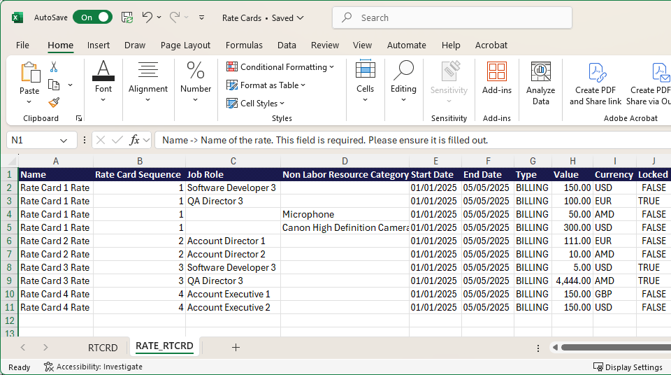

# 从模板导入费率卡

您可以使用模板文件在Excel中构建费率卡并将其导入Adobe Workfront，而不是手动添加所有工作角色和费率。

要查看本文中描述的费率卡示例，请下载[示例文件](assets/rate-cards-sample.zip)。

有关费率卡的详细信息，请参阅[管理费率卡](/help/quicksilver/administration-and-setup/manage-enterprise-operations/manage-rate-cards.md)。

## 使用模板文件的重要规则

* 输入工作职责或非人工资源类别，但不能同时输入两者。
* RATE_RTCRD选项卡上的费率卡顺序必须与RTCRD选项卡上的费率卡顺序匹配（1表示第一个，2表示第二个等等）。
* 开始日期和结束日期必须遵循允许的格式。
* 费率卡可以导入而不使用费率，并稍后更新。
* 自定义属性（代理、成本中心等） 可能有所不同。 请与系统管理员联系，了解确切的要求。
* 在模板中删除的行将不会删除系统中的现有记录。

## 访问权限要求

+++ 展开可查看本文所述功能的访问权限要求。

<table style="table-layout:auto"> 
 <col> 
 <col> 
 <tbody> 
  <tr> 
   <td>[!DNL Adobe Workfront] 包</td> 
   <td>工作流 Ultimate</td> 
  </tr> 
  <tr> 
   <td>[!DNL Adobe Workfront] 许可证</td> 
   <td>[!UICONTROL 标准版]</td> 
  </tr> 
  <tr> 
   <td>访问级别配置</td> 
   <td>编辑对[!UICONTROL 费率卡]的访问权限</td> 
  </tr> 
 </tbody> 
</table>

有关信息，请参阅Workfront文档中的[访问要求](/help/quicksilver/administration-and-setup/add-users/access-levels-and-object-permissions/access-level-requirements-in-documentation.md)。

+++

## 填写模板文件

{{step-1-to-setup}}

1. 在左侧面板中，单击&#x200B;[!UICONTROL **费率卡**]。
1. 单击&#x200B;**新建费率卡**，然后单击&#x200B;**下载Excel模板**。
1. 按照浏览器提示将模板文件保存到计算机。
1. 在Excel中打开模板文件。

   >[!TIP]
   >
   > 如果要保留空模板文件，请使用新名称保存该文件，稍后再次使用。

   模板有两个选项卡。 两个选项卡都必须具有正确的信息才能成功导入费率卡。

   * RTCRD：定义费率卡（基本信息）
   * RATE_RTCRD：定义与每个费率卡关联的详细费率

### 填写RTCRD（费率卡设置）选项卡

创建并列出此选项卡上的所有费率卡。 每一行表示一张费率卡。

费率卡导入模板文件上的

1. 在每行中输入费率卡的信息：

   * **名称**（必需）：费率卡的名称，如“Global Billing 2025”。

     此名称是费率卡的主要标识符。 每个费率卡必须具有唯一的名称。

   * **描述**（可选）：费率卡的自由格式文本描述。 使用它描述目的、范围或有效性，例如“适用于北美项目”。
   * **公司**（可选）：这可以是公司名称或公司ID。 导入操作会识别这两者。

     示例： Coffesta或&#x200B;_68c0234e00000541dd8c0757723daa68_

   * **组** （可选）：这可以是组名或组ID。 导入操作会识别这两者。

     示例：营销或&#x200B;_68c0234e00000541dd8c0757723daa68_

   * **自定义字段**（可选）：如果您的环境有特定要求，则可以添加具有自定义字段名称的其他列。

   >[!NOTE]
   >
   >* 您必须至少为每个费率卡输入名称。
   >* 每个费率卡会根据其行位置自动指定一个序列号。 例如，您定义的第一个费率卡（在行2中）是序列1，下一个是序列2，依此类推。 这些序列号在RATE_RTCRD标签中用于附加费率。

### 填写RATE_RTCRD（汇率设置）选项卡

在此标签上定义属于费率卡的所有费率。

选项卡上的每一行定义一个特定速率。 您可以通过重复费率卡序列，在同一费率卡下创建多个费率。

请确保日期不会重叠，除非这是预期行为。

费率卡导入模板文件上的

1. 在每一行中输入费率信息：

   * **名称**（必需）：费率行的标签。

     为清楚起见，最佳实践是重复使用费率卡名称，如“全球计费2025 — 开发人员费率”。

   * **费率卡引用**（必需）：此费率所属的费率卡的序列号。

     如果费率卡是您在RTCRD选项卡（第2行）中列出的第一个费率卡，请输入1。 如果是第二个，则输入2，依此类推。

   * **工作角色**（如果未使用非人工资源类别，则为必需）：比率适用的工作角色。 这可以是工作角色名称或工作角色ID。 导入操作会识别这两者。

     示例： Designer或&#x200B;_68c0234e00000541dd8c0757723daa68_

   * **非人工资源类别**（如果未使用工作角色，则必需）：比率适用的非人工资源类别。 这可以是类别名称或类别ID。 导入操作会识别这两者。

     示例：相机或&#x200B;_68c0234e00000541dd8c0757723daa68_

     >[!IMPORTANT]
     >
     >您不能同时在&#x200B;**工作角色**&#x200B;和&#x200B;**非人工资源类别**&#x200B;列中输入数据。 需要一个。

   * **开始日期**（可选）：费率生效的日期。

     日期必须遵循支持的格式之一（取决于您的位置）：MM/dd/yyyy、dd/MM/yyyy、MM/DD/YY、DD/MM/YY、M/d/yy、d/M/yy、yyyy/MM/dd、yyyy/dd/mm、yyyy-MM-dd、yyyy-MM-dd、yyyyy-dd-MM

     示例： 01/01/2025

     有关详细信息，请参阅下面的[日期格式要求](#date-formatting-requirements)。

   * **结束日期**（可选）：费率停止生效的日期。

     此日期必须遵循与开始日期相同的受支持格式。

     有关详细信息，请参阅下面的[日期格式要求](#date-formatting-requirements)。

   * **值**（可选）：数字比率值，例如150。 默认值为 0。
   * **货币**（可选）：汇率的货币，例如USD、EUR、GBP。 默认值为系统货币。
   * **已锁定**（可选）：指示速率是否已锁定。 有效值为True或False。
   * **属性**（可选/自定义）：最后一列（代理、位置、成本中心等） 是因客户配置而异的费率属性。 这些是可自定义的字段，可能因客户环境而异。

     实例：机构=“1：机构”，地点=“芝加哥”，成本中心=“22：成本中心”

### 填写RSALS（费率卡别名）选项卡

创建并列出此选项卡上的所有别名。 每一行表示一个别名。

将费率卡附加到项目时，别名会出现在占位符分配、费用和报表等信息中，而不是内部工作角色名称中。 在单个速率卡中，每个工作角色和属性组合只能有一个别名。

别名会添加到系统中，但不会根据此选项卡上的信息连接到工作角色。

1. 在每一行中输入别名的名称。

   每行只输入一个别名：工作角色别名、非人工资源类别别名或费用类型别名。

### 填写RCRMET_RTCRD_RSALS（费率卡元数据）选项卡

在此选项卡上，您可以定义资源与特定费率卡别名之间的连接。

1. 在每行中输入信息：

   * **费率卡**（必需）：资源和别名所属的费率卡的名称或序列号。 费率卡必须列在RTCRD选项卡上。

     对于序列号：如果费率卡是您在RTCRD标签中列出的第一个费率卡（行2），请输入1。 如果是第二个，则输入2，依此类推。

   * **工作角色** （如果未使用费用类型和非人工资源类别，则为必需）：别名所连接的工作角色。 这可以是工作角色名称或工作角色ID。 导入操作会识别这两者。

     示例： Designer或&#x200B;_68c0234e00000541dd8c0757723daa68_

   * **费用类型** （如果未使用工作角色和非人工资源类别，则必需）：别名所连接的费用类型。 这可以是费用类型名称或费用类型ID。 导入操作会识别这两者。

     示例： Travel或&#x200B;_68c0234e00000541dd8c0757723daa68_

   * **非人工资源类别**（如果未使用工作角色和费用类型，则必需）：别名连接到的非人工资源类别。 这可以是类别名称或类别ID。 导入操作会识别这两者。

     示例：相机或&#x200B;_68c0234e00000541dd8c0757723daa68_

     >[!IMPORTANT]
     >
     >您无法输入&#x200B;**工作角色**、**费用类型**&#x200B;和&#x200B;**非人工资源类别**&#x200B;列中的全部三个。 需要一个。

   * **资源别名**：在RSALS选项卡上输入的别名。

### 日期格式要求

在准备要导入的费率卡数据时，必须确保日期列的格式为&#x200B;**常规**，而不是&#x200B;**日期**。

如果列设置为日期格式，则系统在导入过程中可能会错误解释值，从而导致错误或上传失败。 使用常规格式会保留日期的原始数字或文本表示形式，使系统能够正确验证和应用值。

遵循这些步骤将防止出现不必要的问题，并确保顺利而准确地导入汇率数据。

1. 在保存或上传文件之前，选择电子表格中的日期列。
1. 将列格式更改为&#x200B;**常规**。
1. 验证值是否仍正确显示（例如，01/01/2025或2025-01-01）。

## 导入模板文件

{{step-1-to-setup}}

1. 在左侧面板中，单击&#x200B;[!UICONTROL **费率卡**]。
1. 单击&#x200B;**新费率卡**，然后单击&#x200B;**导入新费率卡**。
1. 将文件拖放到对话框中，或单击&#x200B;**选择Excel文件**&#x200B;以浏览计算机上的文件。
1. 单击&#x200B;**开始导入**。

   如果文件没有问题，将显示一条确认消息，并在列表中显示新的费率卡。

1. 如果文件包含问题，则会显示错误消息。 单击&#x200B;**查看问题**&#x200B;可在单独的屏幕上查看问题。

   您必须更正Excel文件中的问题并再次导入它，然后费率卡才会存在于Workfront中。

## 更新现有费率卡

您可以使用相同的Excel模板更新现有费率卡中的费率，并将这些更改上传到Workfront。

更新现有汇率只需要RATE_RTCRD（汇率设置）标签。

>[!NOTE]
>
>上传现有费率卡的费率会覆盖费率卡上的所有当前工作角色和费率。
>
>例如，如果您有5个职位角色且现有费率卡上具有费率，而Excel文件有1个职位角色，则上传后的费率卡将有1个职位角色。 要将其他5个工作角色及其费率保留在费率卡上，您必须将其包含在Excel文件中。

要更新现有费率卡，请执行以下操作：

{{step-1-to-setup}}

1. 在左侧面板中，单击&#x200B;[!UICONTROL **费率卡**]。
1. 单击&#x200B;**新建费率卡**，然后单击&#x200B;**导入费率卡更新**。
1. 将文件拖放到对话框中，或单击&#x200B;**选择Excel文件**&#x200B;以浏览计算机上的文件。
1. 单击&#x200B;**开始导入**。

   如果文件没有问题，将显示一条确认消息，并在列表中显示新的费率卡。

1. 如果文件包含问题，则会显示错误消息。 单击&#x200B;**查看问题**&#x200B;可在单独的屏幕上查看问题。

   您必须更正Excel文件中的问题并再次导入它，然后才能在Workfront中存在费率卡更新。

