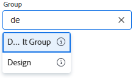

# 创建子组

您可以在管理的组下创建子组，以组织用户和项目并在Adobe Workfront中分配访问权限。

如果您管理的组之上有任何组，则其管理员也可以为您的组执行此操作。 Workfront管理员也是如此（适用于任何组）。

但是，通常组管理员管理组和子组。 他们可以使用组页面在一个位置管理其组和子组。 有关组和子组如何在Workfront中工作的信息，请参阅[组概述](../../../administration-and-setup/manage-groups/groups-overview/groups.md)和[子组概述](../../../administration-and-setup/manage-groups/groups-overview/subgroups.md)。

## 访问要求

+++ 展开以查看本文中各项功能的访问要求。

您必须具有以下权限才能执行本文中的步骤：

<table style="table-layout:auto"> 
 <col> 
 <col> 
 <tbody> 
  <tr> 
   <td role="rowheader">Adobe Workfront计划</td> 
   <td>任何</td> 
  </tr> 
  <tr> 
  <tr> 
   <td role="rowheader">Adobe Workfront许可证</td> 
   <td>
新增：标准

       
或

       
当前：计划
</td>
  </tr> 
  </tr> 
  <tr> 
   <td role="rowheader">访问级别配置</td> 
   <td>您必须是组的组管理员或系统管理员。</td>
  </tr> 
 </tbody> 
</table>

有关此表中信息的更多详细信息，请参阅Workfront文档中的[访问要求](/help/quicksilver/administration-and-setup/add-users/access-levels-and-object-permissions/access-level-requirements-in-documentation.md)。

+++

## 添加子组

{{step-1-to-setup}}

1. 单击&#x200B;**组**。

   在显示的列表中，您可以看到您管理的组以及它们具有的任何子组。 Adobe Workfront管理员可以查看所有组。

1. 选择要添加新子组的现有组或子组。
1. 单击&#x200B;**新建子组**。
1. 在出现的&#x200B;**新建子组**&#x200B;框中，键入该子组的&#x200B;**组名**。
1. （可选）输入以下任何信息：

   * **描述**：键入子组的描述。 最多可键入512个字符。
   * **处于活动状态**：此选项默认处于启用状态，并使该组在您的Workfront实例中处于活动状态。

     在类似下面所示的预输入字段中，当常规用户搜索组以将其附加到对象或与其共享对象时，列表中只会显示活动组。

     群组

     若要简化用户的这项操作，您可以对当前未使用的组禁用&#x200B;**处于活动状态**&#x200B;选项。

     使用此字段，您可以轻松地根据活动或非活动状态查看、筛选和分组组列表。 有关在列表中使用视图、筛选器和分组的信息，请参阅[报告元素：筛选器、视图和分组](/help/quicksilver/reports-and-dashboards/reports/reporting-elements/reporting-elements-filters-views-groupings.md)。

   * **业务负责人**：您可以为管理的子组指定一个用户作为业务负责人。 业务负责人是为子组制定业务决策的人员。 有关详细信息，请参阅[业务负责人概述](/help/quicksilver/administration-and-setup/manage-groups/group-roles/business-leader-overview.md)。

     如果人员还不是子组的成员，则将其姓名添加到此字段也会将其添加到组中。

     >[!NOTE]
     >
     >* 您必须先从“业务领导者”字段中移除“业务领导者”名称，然后才能从子组中移除“业务领导者”。
     >* 如果从“业务领导者”字段中移除该名称，则该用户仍然是子组的成员，除非将其从中移除。 有关从组中删除某人的说明，请参阅[查看和管理组的成员资格](/help/quicksilver/administration-and-setup/manage-groups/create-and-manage-groups/view-and-manage-a-groups-memberships.md)。

   * **组成员及组管理员**：若要将用户和组添加为子组的成员，请开始键入要添加的现有用户或组的名称，然后在其出现时选择该名称。

     您添加的用户和组可以访问与该组共享的所有对象。

     子组继承其上方的组的组管理员，因此指定用户作为子组的组管理员是可选的。 您可以使用用户名右侧的下拉菜单将组成员指定为组的管理员。

   * **搜索列表中的人员和组**：如果您需要查找已分配给此子组的用户或组，可以在此处键入其名称，并在其出现时将其选定。

1. 单击&#x200B;**保存。**
