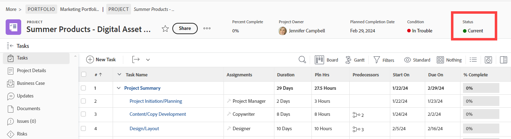

# 创建或编辑组状态

作为组管理员，您可以为管理的组创建自定义状态。 这有助于消除对数十种公司范围的自定义状态的需要，并允许您的组层次结构具有更多自主权。

如果Workfront管理员已解锁您管理的组的状态，则您还可以编辑该组的系统级状态。 有关详细信息，请参阅[已锁定和未锁定的系统级别状态](../../../administration-and-setup/customize-workfront/creating-custom-status-and-priority-labels/lock-or-unlock-a-custom-system-level-status.md)。

如果您的组之上存在任何组，则其管理员还可以为您的组执行这些操作。 Workfront管理员也是如此（适用于任何组）。

>[!NOTE]
>
>在敏捷视图中查看项目时，无法对项目显示自定义组状态。 在敏捷视图中查看项目时，仅默认锁定状态和自定义锁定状态可见。 有关为项目自定义Agile视图的信息，请参阅[在Adobe Workfront中创建或编辑视图](/help/quicksilver/reports-and-dashboards/reports/reporting-elements/create-edit-views.md)一文中的[创建或自定义Agile视图](/help/quicksilver/reports-and-dashboards/reports/reporting-elements/create-edit-views.md#create-or-customize-an-agile-view)部分。

有关状态的一般信息，请参阅[状态概述](../../../administration-and-setup/customize-workfront/creating-custom-status-and-priority-labels/statuses-overview.md)。

## 访问要求

+++ 展开以查看本文中各项功能的访问要求。

您必须具有以下权限才能执行本文中的步骤：

<table style="table-layout:auto"> 
 <col> 
 <col> 
 <tbody> 
  <tr> 
   <td role="rowheader">Adobe Workfront计划</td> 
   <td>任何</td> 
  </tr> 
  <tr> 
  <tr> 
   <td role="rowheader">Adobe Workfront许可证</td> 
   <td>
新增：标准

       
或

       
当前：计划
</td>
  </tr> 
  </tr> 
  <tr> 
   <td role="rowheader">访问级别配置</td> 
   <td>您必须是组的组管理员或系统管理员。</td>
  </tr> 
 </tbody> 
</table>

有关此表中信息的更多详细信息，请参阅Workfront文档中的[访问要求](/help/quicksilver/administration-and-setup/add-users/access-levels-and-object-permissions/access-level-requirements-in-documentation.md)。

+++

## 创建或编辑组的状态

{{step-1-to-setup}}

1. 在左侧面板中，单击&#x200B;**组** 。

1. 单击要创建或自定义状态的组的名称。
1. 在左侧面板中，单击&#x200B;**状态**。

   如果您查看的组是顶层组，则显示的列表包括以下内容：

   * 系统级锁定状态。
   * 已为组创建自定义状态。

   此外，如果您正在查看的组是子组，则该列表还包括：

   * 属于子组上方组的锁定状态。
   * 创建子组时属于该子组上方组的解锁状态。

     创建子组后，在上面的组中创建的解锁状态不包括在子组的状态列表中。 但是，如果某个用户稍后锁定了其中一个子组，则该子组随后会包含在子组的状态列表中。 有关详细信息，请参阅[组如何继承状态](../../../administration-and-setup/manage-groups/manage-group-statuses/how-groups-inherit-statuses.md)。

1. 选择要与状态关联的对象类型（**项目**、**任务**&#x200B;或&#x200B;**问题**）的选项卡。

1. （视情况而定）如果状态为问题状态，请确保选择&#x200B;**主列表**。

   

   有关自定义其他问题类型（错误报告、更改顺序、问题、请求）的信息，请参阅[自定义默认问题类型](../../../administration-and-setup/set-up-workfront/configure-system-defaults/customize-default-issue-types.md)。

1. （视情况而定）要创建新状态，请单击&#x200B;**添加新状态**。

   或

   要编辑现有状态，请将鼠标悬停在要编辑的状态上，然后单击最右侧显示的&#x200B;**编辑**&#x200B;选项。

   

   >[!NOTE]
   >仅当满足以下条件时，才能编辑组的状态：
   >      
   >* 您管理为其创建状态的组
   >* Workfront管理员在系统级别上解锁了状态
   >* 您组上方的组的组管理员已解锁状态
   >      
   >      
   >编辑现有状态时，只能更改其名称、说明和颜色。
   >
   >编辑锁定状态时，更改将影响从组继承该状态的所有子组。
   >   
   >相反，编辑已解锁状态不会影响从组继承该状态的子组。

1. 指定以下信息。

   如果您正在编辑状态，则只能更改前3个设置。

   <table style="table-layout:auto"> 
    <col> 
    <col> 
    <tbody> 
     <tr> 
      <td role="rowheader">状态名称</td> 
      <td> 
键入状态的名称。 这是必填字段。
 
创建状态名称时，请注意，系统中的其他人可以创建具有相同名称的状态。 我们建议使用唯一的名称，以避免在Workfront中选择状态时产生混淆。

如果存在重复状态，组管理员应更新名称以区分它们。 系统中的唯一性指示符是状态键。
 </td> 
     </tr> 
     <tr> 
      <td role="rowheader">描述</td> 
      <td>（可选）键入状态的描述。 这会向使用的人传达其目的。</td> 
     </tr> 
     <tr> 
      <td role="rowheader">颜色</td> 
      <td> 
通过单击颜色字段并从样本面板中选择一种颜色，自定义状态的颜色。 您还可以在字段中输入十六进制数字。
 
当用户查看对象时，状态颜色显示在Workfront的右上角。
 
  
 </td> 
     </tr> 
     <tr> 
      <td role="rowheader">等于</td> 
      <td> 
从列表中选择最能描述状态功能的选项之一。 例如，如果状态名称为Done，则其对应的选项应为Complete。
 
每个状态都必须等同于这些选项之一，因为这决定了状态的运行方式。
 
创建状态后无法修改此选项。
 </td> 
     </tr> 
     <tr> 
      <td role="rowheader">键</td> 
      <td> 
如果要创建新状态，请键入该状态的代码或缩写，或使用为您生成的代码或缩写。 此键在Workfront中必须唯一，因为它可用于报表目的。 如果尝试指定系统中已使用的键，该字段将变为红色。
 
使用将使用该缩写的用户可识别的缩写可能很有用。
 
创建状态后无法修改此选项。
 
您不能更改Planning、Current和Complete状态的键代码。 如果您以文本模式构建报表，这一点很重要。
 </td> 
     </tr> 
     <tr> 
      <td role="rowheader">隐藏状态</td> 
      <td> 
（仅限项目和任务状态）
 
如果您希望向用户隐藏状态，请启用此选项。 禁用后（默认设置），该组下的所有子组都可以使用状态。
 
提示：您可以通过禁用所有4种问题类型（错误报告、更改顺序、问题、请求）来隐藏问题状态。
 </td> 
     </tr> 
     <tr> 
      <td role="rowheader">锁定所有群组</td> 
      <td> 
       
如果保持启用此选项，则您的组及其子组中的用户可以查看和使用状态，并且组管理员无法对较低级别的子组自定义它。
 
       
禁用此选项后，组管理员可以自定义较低子组的状态。
 
       
<b>注意</b>：您可以在组审批流程中使用锁定和未锁定状态。 如果您创建的组审批流程具有未锁定的组状态，则用户可以将审批流程附加到与组关联的任何项目、任务或问题。
 
       
有关锁定状态的详细信息，请参阅<a href="../../../administration-and-setup/manage-groups/manage-group-statuses/lock-or-unlock-a-custom-group-status.md" class="MCXref xref">锁定和未锁定的组状态</a>。
 
       </td> 
     </tr>
    </tbody> 
   </table>

1. 单击&#x200B;**保存**。

   该状态现在适用于与您的组或子组关联的所有项目。 如果将其锁定，则可由任何较低级别的子组使用。

   您可以将状态配置为组的默认状态。 有关详细信息，请参阅[将自定义状态用作组](../../../administration-and-setup/manage-groups/manage-group-statuses/use-custom-statuses-as-default-statuses-group.md)的默认状态。

## 为多个组创建自定义状态

如果您是Workfront管理员，则可以通过创建系统范围状态，然后对任何不需要该状态的组隐藏该状态，来为多个组创建自定义状态。

如果您是组管理员(或Workfront管理员)，则可以为您管理的组层次结构中的多个子组创建自定义状态，方法是为更高级别的组创建状态，然后对任何不需要该状态的较低级别子组隐藏该状态。

1. 如果您是Workfront管理员，请按照[创建或编辑状态](../../../administration-and-setup/customize-workfront/creating-custom-status-and-priority-labels/create-or-edit-a-status.md)中的说明创建系统范围的解锁状态。
1. 在右上角的框中，删除&#x200B;**系统状态**，开始键入要隐藏状态的组名称，然后在名称出现时单击该名称。
1. 将鼠标悬停在要从组隐藏的状态上，然后在组出现时单击&#x200B;**编辑**。

   

1. 启用显示的&#x200B;**隐藏状态**&#x200B;选项。

   

1. 单击&#x200B;**保存**。

   该状态呈灰显状态，不再对该组中的所有用户可见。

1. 重复步骤3至5，对不需要自定义状态的任何其他组隐藏自定义状态。

