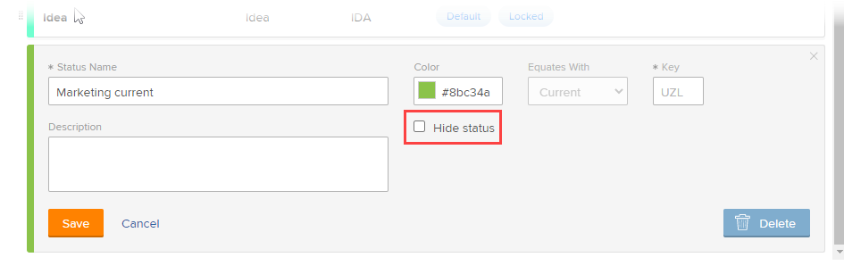

# 创建或编辑群组状态

作为群组管理员，您可以为所管理的群组创建自定义状态。 这有助于消除对公司范围内数十种自定义状态的需求，并允许在组层次结构中实现更多自主性。

如果Workfront管理员已解锁该状态，则还可以编辑您管理的组的系统级别状态。 有关更多信息，请参阅 [锁定和解锁的系统级别状态](../../../administration-and-setup/customize-workfront/creating-custom-status-and-priority-labels/lock-or-unlock-a-custom-system-level-status.md).

如果您的组上有任何组，则其管理员也可以为您的组执行这些操作。 Workfront管理员（对于任何组）也是如此。

>[!NOTE]
>
>在敏捷视图中查看项目时，无法在项目上显示自定义组状态。 在敏捷视图中查看项目时，只显示默认和自定义锁定状态。 有关为项目自定义敏捷视图的信息，请参阅部分 [创建或自定义敏捷视图](../../../reports-and-dashboards/reports/reporting-elements/views-overview.md#customizing-an-agile-view) 在文章中 [视图Adobe Workfront概述](../../../reports-and-dashboards/reports/reporting-elements/views-overview.md).

有关状态的常规信息，请参阅 [状态概述](../../../administration-and-setup/customize-workfront/creating-custom-status-and-priority-labels/statuses-overview.md).

## 访问要求

您必须具备以下条件才能执行本文中的步骤：

<table style="table-layout:auto"> 
 <col> 
 <col> 
 <tbody> 
  <tr> 
   <td role="rowheader">Workfront计划*</td> 
   <td>任意</td> 
  </tr> 
  <tr> 
   <td role="rowheader">Adobe Workfront许可证*</td> 
   <td> 
计划 
 
您必须是组的组管理员或Workfront管理员。 有关更多信息，请参阅 <a href="../../../administration-and-setup/manage-groups/group-roles/group-administrators.md" class="MCXref xref">组管理员</a> 和 <a href="../../../administration-and-setup/add-users/configure-and-grant-access/grant-a-user-full-administrative-access.md" class="MCXref xref">授予用户完全管理访问权限</a>.
 </td> 
  </tr> 
 </tbody> 
</table>

&#42;如果您需要了解您拥有的计划或许可证类型，请联系您的Workfront管理员。

## 创建或编辑群组的状态

1. 单击 **主菜单** 图标  在Adobe Workfront的右上角，单击 **设置** .

1. 在左侧面板中，单击 **群组** .

1. 单击要创建或自定义状态的组名称。
1. 在左侧面板中，单击 **状态**.

   如果您查看的群组是顶级群组，则显示的列表包括以下内容：

   * 系统级别锁定状态。
   * 已为群组创建自定义状态。

   此外，如果您正在查看的组是子组，则列表还包括：

   * 属于子组上方组的锁定状态。
   * 创建时属于子组上方组的已解锁状态。

      创建子组后，在其上方的组中创建的已解锁状态不会包含在子组的状态列表中。 但是，如果以后有人锁定其中一个，则该子组的状态列表中会包含该子组。 有关更多信息，请参阅 [组如何继承状态](../../../administration-and-setup/manage-groups/manage-group-statuses/how-groups-inherit-statuses.md).

1. 选择对象类型的选项卡(**项目**, **任务**&#x200B;或 **问题**)。

1. （视情况而定）如果状态为问题状态，请确保 **主控列表** 中。

   

   有关自定义其他问题类型（错误报告、更改顺序、问题、请求）的信息，请参阅 [自定义默认问题类型](../../../administration-and-setup/set-up-workfront/configure-system-defaults/customize-default-issue-types.md).

1. （视情况而定）要创建新状态，请单击 **添加新状态**.

   或

   要编辑现有状态，请将鼠标悬停在要编辑的状态上，然后单击 **编辑** 选项。

   

   >[!NOTE]
   >仅在以下情况下，才可编辑群组的状态：
   >      
   >* 您可以管理为其创建状态的组
   >* Workfront管理员解锁了系统级别的状态
   >* 群组上方群组的群组管理员已解锁状态

   >      
   >      
   >编辑现有状态时，只能更改其名称、描述和颜色。
   >
   >编辑锁定状态时，所做的更改会影响从组继承该状态的所有子组。
   >   
   >相反，编辑已解锁状态不会影响从组继承状态的子组。

1. 指定以下信息。

   如果您正在编辑状态，则只能更改前3个设置。

   <table style="table-layout:auto"> 
    <col> 
    <col> 
    <tbody> 
     <tr> 
      <td role="rowheader">状态名称</td> 
      <td> 
键入状态名称。 这是必填字段。
 
在创建状态名称时，请注意，系统中的其他人可以创建具有相同名称的状态。 我们建议使用唯一的名称，以避免在Workfront中选择状态时造成混淆。
 </td> 
     </tr> 
     <tr> 
      <td role="rowheader">描述</td> 
      <td>（可选）键入状态描述。 这会向使用者传达其目的。</td> 
     </tr> 
     <tr> 
      <td role="rowheader">颜色</td> 
      <td> 
通过单击颜色字段并从色板面板中选择颜色来自定义状态的颜色。 您还可以在字段中输入十六进制数。
 
当用户查看对象时，状态颜色显示在Workfront的右上角。
 
  
 </td> 
     </tr> 
     <tr> 
      <td role="rowheader">等于</td> 
      <td> 
从列表中选择一个最能描述状态函数的选项。 例如，如果状态名称为“完成”，则与其等同的选项应为“完成”。
 
每个状态都必须等同于其中一个选项，因为这决定了状态的工作方式。
 
创建状态后，无法修改此选项。
 </td> 
     </tr> 
     <tr> 
      <td role="rowheader">密钥</td> 
      <td> 
如果要创建新状态，请键入状态的代码或缩写，或使用为您生成的代码或缩写。 此键值在Workfront中必须唯一，因为它可用于报告目的。 如果尝试指定系统中已在使用的键，则该字段将变为红色。
 
使用缩写时可能会有所帮助，该缩写对于使用缩写的用户而言是可识别的。
 
创建状态后，无法修改此选项。
 
您不能更改“计划”、“当前”和“完成”状态的关键代码。 如果您以文本模式生成报表，则务必要这样做。
 </td> 
     </tr> 
     <tr> 
      <td role="rowheader">隐藏状态</td> 
      <td> 
（仅限项目和任务状态）
 
如果希望对用户隐藏状态，请启用此选项。 禁用该设置（默认设置）后，组下的所有子组都可以使用状态。
 
提示：您可以通过禁用所有4种问题类型（错误报表、更改顺序、问题、请求）来隐藏问题状态。
 </td> 
     </tr> 
     <tr> 
      <td role="rowheader">锁定所有群组</td> 
      <td> 
       
如果您启用此选项，则群组及其子群组中的用户可以查看和使用状态，并且群组管理员无法为较低级别的子群组自定义该状态。
 
       
禁用此选项后，群组管理员可以自定义较低子群组的状态。
 
       
<b>注意</b>:您可以在组批准流程中同时使用锁定状态和已解锁状态。 如果创建具有已解锁组状态的组批准流程，则用户可以将批准流程附加到与该组关联的任何项目、任务或问题。
 
       
有关锁定状态的更多信息，请参阅 <a href="../../../administration-and-setup/manage-groups/manage-group-statuses/lock-or-unlock-a-custom-group-status.md" class="MCXref xref">组锁定状态和已解锁状态</a>.
 
       </td> 
     </tr>
    </tbody> 
   </table>

1. 单击&#x200B;**保存**。

   现在，状态可用于与组或子组关联的所有项目。 如果锁定了该子组，则该子组可供任何较低级别的子组使用。

   您可以将状态配置为组的默认状态。 有关更多信息，请参阅 [使用自定义状态作为群组的默认状态](../../../administration-and-setup/manage-groups/manage-group-statuses/use-custom-statuses-as-default-statuses-group.md).

## 为多个组创建自定义状态

如果您是Workfront管理员，则可以创建一个系统范围的状态，然后将该状态隐藏到任何不需要该状态的组中，从而为多个组创建自定义状态。

如果您是组管理员(或Workfront管理员)，则可以在您管理的组层次结构中为多个子组创建自定义状态，方法是为更高级别的组创建状态，然后将该状态隐藏在不需要该状态的任何较低级别的子组中。

1. 如果您是Workfront管理员，请创建系统范围的已解锁状态，如 [创建或编辑状态](../../../administration-and-setup/customize-workfront/creating-custom-status-and-priority-labels/create-or-edit-a-status.md).
1. 在右上角的框中，删除 **系统状态**，开始键入要隐藏状态的组名称，然后在显示时单击该名称。
1. 将鼠标悬停在要在群组中隐藏的状态上，然后单击 **编辑** 显示时。

   

1. 启用 **隐藏状态** 选项。

   

1. 单击&#x200B;**保存**。

   该状态灰显，不再对该组中的所有用户可见。

1. 重复步骤3至5，以对任何其他不需要自定义状态的组隐藏自定义状态。
