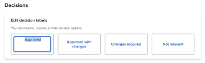

# 配置默认校对设置

这些设置允许您设置适用于用户创建的所有新验证的默认值。 但是，用户在创建验证时可以覆盖这些设置中的大多数。

## 访问要求

+++ 展开以查看本文中各项功能的访问要求。

您必须具有以下权限才能执行本文中的步骤：

<table style="table-layout:auto"> 
 <col> 
 <col> 
 <tbody> 
  <tr> 
   <td role="rowheader">Adobe Workfront计划*</td> 
   <td>任何</td> 
  </tr> 
  <tr> 
   <td role="rowheader">Adobe Workfront许可证*</td> 
   <td>
   
新增：标准

   或
   
当前：计划
</td> 
  </tr> 
  <tr> 
   <td role="rowheader">访问级别配置*</td> 
   <td> 
您必须是Workfront管理员。 有关Workfront管理员的信息，请参阅<a href="../../../administration-and-setup/add-users/configure-and-grant-access/grant-a-user-full-administrative-access.md" class="MCXref xref">授予用户完全管理访问权限</a>。
 </td> 
  </tr> 
 </tbody> 
</table>

&#42;要了解您拥有什么计划、许可证类型或访问权限，请与Workfront管理员联系。

+++

## 配置新验证默认设置

1. 单击Adobe Workfront右上角的&#x200B;**主菜单**&#x200B;图标，然后单击&#x200B;**设置**。
1. 在左侧面板中，单击&#x200B;**验证** > **验证设置**。
1. 在&#x200B;**新验证默认值**&#x200B;部分中，配置以下设置：

   <table style="table-layout:auto"> 
    <col> 
    <col> 
    <tbody> 
     <tr> 
      <td role="rowheader" colspan="2"><b>收件人</b></td> 
     </tr> 
     <tr> 
      <td role="rowheader">需要登录</td> 
      <td> 
审阅人必须使用他们的电子邮件和密码登录，然后才能查看在您组织的帐户中创建的验证。 启用后，用户无法与访客审阅人共享验证。
 
<b>重要信息</b>：启用时，所有新创建的验证都需要登录。
 </td> 
     </tr> 
     <tr> 
      <td role="rowheader">从新版本的原始校样中复制所有者</td> 
      <td> 
第一个版本验证的所有者同时也是所有连续版本验证的所有者，无论这些版本的创建者是谁。 默认情况下，此设置处于启用状态。
 </td> 
     </tr> 
     <tr> 
      <td role="rowheader">允许用户删除其验证注释</td> 
      <td>用户可以删除自己的评论。 默认情况下，此设置处于启用状态。</td> 
     </tr> 
     <tr> 
      <td role="rowheader">要求对决策进行电子签名 </td> 
      <td> 
当决策者在验证上做出决策时，系统会提示他们输入其Workfront登录凭据。
 
<b>重要信息</b>：启用后，用户无法与没有登录凭据的来宾审阅者共享校对。
 </td> 
     </tr> 
     <tr> 
      <td role="rowheader" colspan="2"><b>截止日期</b></td> 
     </tr> 
     <tr> 
      <td role="rowheader">设置默认截止日期</td> 
      <td> 
系统将此截止日期应用于您的帐户中没有自动工作流的所有新验证。
 </td> 
     </tr> 
     <tr> 
      <td role="rowheader">在证明存在风险之前通知收件人</td> 
      <td>根据以上指定的截止时间，在证明被视为有风险之前，收件人会通过电子邮件收到通知。</td> 
     </tr> 
     <tr> 
      <td role="rowheader" colspan="2"><b>电子邮件通知</b></td> 
     </tr> 
     <tr> 
      <td role="rowheader">当收件人被添加到证明中时通知他们</td> 
      <td>将收件人添加到验证时，会通过电子邮件通知他们。</td> 
     </tr> 
    </tbody> 
   </table>

1. 单击&#x200B;**保存**。

## 配置验证决策

用户可以在审阅后使用验证决策来指示验证状态。

>[!NOTE]
>
>如果存在多个不同级别的决策，则使用验证决策背后的逻辑来计算验证工作流的整体状态。 “已批准”和“已批准并更改”决策会触发自动工作流的下一个阶段。

要配置校对决策，请执行以下操作：

1. 单击Adobe Workfront右上角的&#x200B;**主菜单**&#x200B;图标，然后单击&#x200B;**设置**。
1. 在左侧面板中，单击&#x200B;**验证** > **验证设置**。
1. 在&#x200B;**决策**&#x200B;部分中，您可以

   1. **重命名决策**：单击决策框中的文本，然后开始键入新的决策标签。

      >[!TIP]
      >
      >在重命名决策时保留决策的逻辑。 例如，默认决策“被拒绝”可更改为&#x200B;*需要新版本*，但不应将其更改为&#x200B;*发送到打印机*。

      

   1. **重新排列决策顺序**：按您希望决策框在验证查看器中出现的顺序拖动决策框。

      

   1. **隐藏决策**：将鼠标悬停在决策框上，然后单击右上角的“隐藏”图标。

      

1. （可选）要返回到Workfront默认值，请单击&#x200B;**还原默认值**。
1. 单击&#x200B;**保存**。
