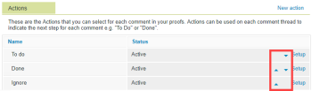

# 为贵组织配置校样设置

作为Adobe Workfront管理员或Workfront校样管理员，您可以自定义贵组织的默认校样设置。 这些设置包括默认共享选项、品牌等。

## 访问要求

您必须具备以下条件：

<table style="table-layout:auto"> 
 <col> 
 <col> 
 <tbody> 
  <tr> 
   <td role="rowheader">Adobe Workfront计划*</td> 
   <td> 
当前计划：Pro或更高版本
 
或
 
旧版计划：Premium或Select
 
有关使用不同计划校对访问权限的更多信息，请参阅 <a href="../../../administration-and-setup/manage-workfront/configure-proofing/access-to-proofing-functionality.md" class="MCXref xref">访问Workfront中的校对功能</a>.
 </td> 
  </tr> 
  <tr> 
   <td role="rowheader">Adobe Workfront许可证*</td> 
   <td> 
当前计划：工作或计划
 
旧版计划：任意（必须为用户启用校样）
 </td> 
  </tr> 
  <tr> 
   <td role="rowheader">访问级别配置*</td> 
   <td> 
您必须在校样权限配置文件中选择管理员。 有关更多信息，请参阅 <a href="../../../administration-and-setup/manage-workfront/configure-proofing/configure-a-users-proofing-access.md" class="MCXref xref">配置用户的校对访问权限</a>.
 </td> 
  </tr> 
 </tbody> 
</table>

&#42;要了解您拥有的计划、许可证类型或访问权限，请联系您的Workfront管理员。

## 配置操作

有关在校对查看器中使用操作的信息，请参阅 [对校样注释使用操作](../../../review-and-approve-work/proofing/reviewing-proofs-within-workfront/comment-on-a-proof/use-actions-on-comments-in-viewer.md).

您可以通过以下方式为贵组织配置操作：

* [添加或重命名操作](#add-or-rename-an-action)
* [停用或重新激活操作](#deactivate-or-reactivate-an-action)
* [重新排序操作](#reorder-actions)

### 添加或重命名操作 {#add-or-rename-an-action}

1. 在Workfront中，单击主菜单 ，然后单击校对  访问Workfront校样。

1. 单击 **设置** > **帐户设置** 在Workfront校样界面的右上角，单击 **设置** 选项卡。

1. 执行以下任一操作：

   * 要创建新操作，请在 **操作** ，单击 **新操作**.

      您可以在帐户中设置的操作数没有限制。

   * 要重命名现有操作，请单击 **设置** 操作旁边。

1. 键入操作的名称，然后单击 **保存**.
1. 单击 **保存。**

### 停用或重新激活操作 {#deactivate-or-reactivate-an-action}

1. 在Workfront中，单击主菜单 ，然后单击校对  访问Workfront校样。

1. 单击 **设置** > **帐户设置** 在Workfront校样界面的右上角，单击 **设置** 选项卡。

1. 单击 **设置** 要停用或重新激活的操作旁边。
1. 选择 **激活** 或 **停用**，然后单击 **保存**.

### 重新排序操作 {#reorder-actions}

1. 在Workfront中，单击主菜单 ，然后单击校对  访问Workfront校样。

1. 单击 **设置** > **帐户设置** 在Workfront校样界面的右上角，单击 **设置** 选项卡。

1. 单击旁边的蓝色向上和向下箭头 **设置** 重新排序操作。

   

## 配置自定义设备以进行校样

您可以向系统中添加任何自定义设备，从而允许用户查看交互式内容并模拟内容在特定设备上的显示方式。

有关用户在查看交互式内容时如何选择设备的信息，请参阅 [在校样查看器中更改交互式校样分辨率](../../../review-and-approve-work/proofing/reviewing-proofs-within-workfront/review-a-proof/view-interactive-content-as-it-appears-in-device.md)

要添加自定义设备，请执行以下操作：

1. 在Workfront中，单击主菜单 ，然后单击校对  访问Workfront校样。

1. 单击 **设置** > **帐户设置** 在Workfront校样界面的右上角，单击 **设置** 选项卡。

1. 在 **用于校样的自定义设备** ，单击 **添加新设备**.

1. 在 **添加新设备** 框中，指定以下信息：

   <table style="table-layout:auto"> 
    <col> 
    <col> 
    <tbody> 
     <tr> 
      <td role="rowheader">名称</td> 
      <td>用户在桌面校对查看器中选择设备时看到的名称，如 <a href="../../../review-and-approve-work/proofing/reviewing-proofs-within-workfront/review-a-proof/view-interactive-content-as-it-appears-in-device.md" class="MCXref xref">在校样查看器中更改交互式校样分辨率</a>.</td> 
     </tr> 
     <tr> 
      <td role="rowheader">Dimension</td> 
      <td>指定要用于此设备的维度。 用户会看到设备名称下方显示的维度。</td> 
     </tr> 
     <tr> 
      <td role="rowheader">比率</td> 
      <td>指定设备的比率。</td> 
     </tr> 
     <tr> 
      <td role="rowheader">类型</td> 
      <td>选择设备是移动设备、平板电脑还是桌面设备。</td> 
     </tr> 
     <tr> 
      <td role="rowheader">用户代理字符串</td> 
      <td>输入设备的用户代理，以提供使软件按照设备设计运行和显示的信息。
您可以通过转到 <a href="https://www.whatismybrowser.com/detect/what-is-my-user-agent">https://www.whatismybrowser.com/detect/what-is-my-user-agent</a> 设备中。
</td> 
     </tr> 
     <tr> 
      <td role="rowheader">已禁用</td> 
      <td>如果选中此选项，则用户在查看交互式校样时无法选择设备。</td> 
     </tr> 
    </tbody> 
   </table>

1. 单击&#x200B;**创建**。

## 配置用于校样的弹出消息

您可以配置校样上的弹出消息，以将常规信息传递给组织中的所有审阅人。

您可以将消息配置为在以下情况下显示：

* **加载消息时**:在校样首次打开时显示。 对于向用户解释如何查看证明或提供免责声明或其他法律文本非常有用。
* **论决策信息**:在用户选择校样决策时显示。 对于为用户提供品牌或法规合规性等内容的检查列表非常有用。 有关决策的信息，请参阅 [在校对查看器中对校样做出决策](../../../review-and-approve-work/proofing/reviewing-proofs-within-workfront/make-a-decision-on-a-proof/make-decisions-on-proof.md).

* **确认按钮文本**:上面介绍的“On load”弹出消息的按钮上显示的标签。

要创建校样的弹出消息，请执行以下操作：

1. 单击 **编辑** 的子菜单。
1. 指定消息并包含相应的格式，然后单击 **保存**.
1. （可选）如果您自定义了On加载消息，并且还希望自定义确认按钮标签，请单击 **编辑** 至 **确认按钮文本**，指定标签，然后单击 **保存**.

## 配置校样默认值

有关为组织配置校样默认值的信息，请参阅 [配置默认校样设置](../../../administration-and-setup/manage-workfront/configure-proofing/configure-default-proof-settings.md).

## 配置共享默认值

您可以指定可以与组织的校样共享对象、可供审阅人使用的版本，以及与给定阶段关联的用户能够看到自动工作流的校样时。

有关在Workfront校样中共享设置的更多详细信息，请参阅 [为用户配置共享设置](../../../administration-and-setup/manage-workfront/configure-proofing/configure-sharing-settings-users.md).

## 品牌Workfront Proof网站

如果您使用的是Workfront校样，则可以为网站的以下区域设置品牌策略：

* 加载校样时显示的启动页面
* 登录和注销屏幕
* 电子邮件通知

有关如何对Workfront校样网站进行品牌标识的详细信息，请参阅  [品牌Workfront Proof网站](../../../workfront-proof/wp-acct-admin/branding/brand-wp-site.md).

## 配置高级密码设置

>[!IMPORTANT]
>
>此选项仅适用于旧版Workfront计划。 如果您使用的是Pro、Business或Enterprise Workfront计划，则无法再配置高级密码设置。

在 **高级密码设置**，则可以增强用户的密码安全性。

1. 单击 **设置** 在要配置的设置的右侧：

   <table style="table-layout:auto"> 
    <col> 
    <col> 
    <tbody> 
     <tr> 
      <td role="rowheader">最小密码长度</td> 
      <td>默认的Workfront校样密码长度为6个字符。 您可能希望根据贵组织的策略增加数量。</td> 
     </tr> 
     <tr> 
      <td role="rowheader"><strong>字符混合</strong> </td> 
      <td>您可以强制用户在其密码中混合使用小写、大写、数字和符号。 您可以决定密码应包含多少个字符。</td> 
     </tr> 
     <tr> 
      <td role="rowheader"><strong>最大字符重复次数</strong> </td> 
      <td>您可以指定在每个用户的密码中可以重复多少个字符。</td> 
     </tr> 
     <tr> 
      <td role="rowheader">自动密码老化</td> 
      <td>强制用户定期更改其密码。 由你决定他们多久做一次。</td> 
     </tr> 
     <tr> 
      <td role="rowheader"><strong>不允许重复密码的次数</strong> </td> 
      <td>配置帐户中不允许的密码重复次数。</td> 
     </tr> 
     <tr> 
      <td role="rowheader"><strong>配置文件锁定</strong> </td> 
      <td>在您指定的多次登录尝试失败后，将用户锁定在帐户外。 您还可以指定用户需要等待多长时间才能再次访问其帐户。</td> 
     </tr> 
     <tr> 
      <td role="rowheader">如果密码在30天后未重置，则锁定用户</td> 
      <td>如果用户在配置文件激活后的30天内未更改其初始密码，则他们将被锁定在帐户外。 
帐户管理员可以解锁（重新激活）系统自动锁定的用户。 这将为他们提供七天时间来更改密码。
</td> 
     </tr> 
     <tr> 
      <td role="rowheader">锁定用户帐户（如果不活动）120天</td> 
      <td>如果用户120天未登录Workfront校样或需要登录的校样，则这些校样将被锁定在帐户之外。</td> 
     </tr> 
     <tr> 
      <td role="rowheader"><strong>首次登录后更改密码</strong> </td> 
      <td>要求用户在首次登录后更改其临时密码。
帐户管理员可以解锁（重新激活）系统自动锁定的用户。

或更多密码信息，请参阅 <a href="../../../workfront-proof/wp-getstarted/faqs/log-in-change-password.md" class="MCXref xref">登录并更改您的密码和电子邮件以用于Workfront校样</a>.
</td> 
     </tr> 
    </tbody> 
   </table>
