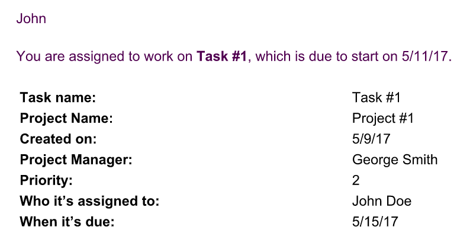

# 配置电子邮件模板

作为Adobe Workfront管理员，您可以配置电子邮件模板以支持提醒通知。

电子邮件模板包含在启动提醒通知时发送给用户的消息。\
如果没有电子邮件模板，提醒通知将作为空内容在电子邮件正文中发送。

电子邮件模板可与问题、任务、项目和时间表的提醒通知关联。 创建电子邮件模板时，Workfront管理员可以为电子邮件和主题行提供内容。

## 访问要求

您必须具有以下权限才能执行本文中的步骤：

<table style="table-layout:auto"> 
 <col> 
 <col> 
 <tbody> 
  <tr> 
   <td role="rowheader">Adobe Workfront计划</td> 
   <td>任何</td> 
  </tr> 
  <tr> 
   <td role="rowheader">Adobe Workfront许可证*</td> 
   <td><p>当前：计划</p>
   或
   <p>新增：标准</p></td> 
  </tr> 
  <tr> 
   <td role="rowheader">访问级别配置</td> 
   <td> <p>系统管理员</p> </td> 
  </tr> 
 </tbody> 
</table>

*有关访问要求的详细信息，请参见 [Workfront文档中的访问要求](/help/quicksilver/administration-and-setup/add-users/access-levels-and-object-permissions/access-level-requirements-in-documentation.md).

## 创建电子邮件模板 {#create-an-email-template}

{{step-1-to-setup}}

1. 在左侧面板中，单击 **电子邮件** > **通知**> **电子邮件模板**.

   

1. 单击 **新建电子邮件模板**.

1. 在 **新建电子邮件模板** 框中，指定以下信息：

   <table style="table-layout:auto"> 
    <col> 
    <col> 
    <tbody> 
     <tr> 
      <td role="rowheader">名称</td> 
      <td>为电子邮件模板添加标题。 这是必填字段。</td> 
     </tr> 
     <tr> 
      <td role="rowheader">对象类型</td> 
      <td>指定要与模板关联的对象类型。 从以下对象中选择：
      <ul>
      <li>项目</li>
      <li>任务</li>
      <li>问题</li>
      <li>时间表</li> </ul>

   这是必填字段，默认设置为“项目”。</td>
   </tr>
     <tr> 
      <td role="rowheader">描述</td> 
      <td>添加有关电子邮件模板、其用途和目标受众的更多信息。</td> 
     </tr>

   <tr> 
      <td role="rowheader">主题 </td> 
      <td>在发送模板生成的电子邮件时，添加显示在电子邮件主题行中的文本。 这是必填字段。</td> 
     </tr> 
     <tr> 
      <td role="rowheader">正文 </td> 
      <td> <p>为电子邮件的内容添加文本。</p> <p>您可以对电子邮件内容使用HTML格式，如一节中所述 <a href="#add-html-formatting-to-an-email-template" class="MCXref xref">将HTML格式添加到电子邮件模板</a> 本文章中。</p> </td> 
     </tr> 
    </tbody> 
   </table>

1. 单击&#x200B;**保存**。

## 将HTML格式添加到电子邮件模板 {#add-html-formatting-to-an-email-template}

您可以将HTML标签添加到电子邮件模板中以生成自定义通知。\
开始创建电子邮件模板，如中所述 [创建新电子邮件模板](#create-a-new-email-template).

HTML格式可以丰富您的电子邮件模板，如以下部分所示。

* [链接到Workfront对象](#link-to-workfront-objects)
* [链接到具有HTML的自定义字段](#link-to-custom-fields-with-html)
* [HTML电子邮件示例](#html-email-examples)

### 链接到Workfront对象 {#link-to-workfront-objects}

您可以使用包含指向Workfront字段的链接 `$$` 通配符，指示电子邮件生成器从与特定对象关联的数据库中查找值。

例如，电子邮件正文可遵循以下结构：用于通知任务接受者，任务即将开始：

```html
<html>
<p>$$assignedTo:firstName$$</p>
<p>You are assigned to work on <b><a href="https://<your domain>.my.workfront.com/task/view?ID=$$ID$$">$$name$$</a></b>, which is due to start on $$plannedStartDate$$.</p>
<table width="350" style="font-size:12px;">
<tr>
<td><b><strong>HEADING</b></td>
<td>$$WILDCARD$$</td>
</tr>
<tr>
<td><b>HEADING</b></td>
<td>$$WILDCARD$$</td>
</tr>
<tr>
<td><b>HEADING</b></td>
<td>$$WILDCARD$$</td></tr>
</table>
</html>
```

要获取对象的“通配符”值，请执行以下操作之一：

* 请参阅API资源管理器，并从任何对象的“字段”选项卡中选择对象名称。 有关API Explorer的详细信息，请参阅 [API资源管理器](/help/quicksilver/wf-api/general/api-explorer.md).

* 使用 `valuefield` 在报表的文本模式视图中找到的值。 有关文本模式值的详细信息，请参阅 [文本模式概述](../../../reports-and-dashboards/reports/text-mode/understand-text-mode.md).

此 `heading` value可以是您希望在电子邮件正文中显示的对象名称。

### 链接到具有HTML的自定义字段 {#link-to-custom-fields-with-html}

您可以使用包含指向用户和自定义字段的链接 `$$` 通配符，指示电子邮件生成器从与该对象关联的数据库中查找值。 它们必须位于数据库属性引用的两侧。

例如，将以下文本添加为HTML会将分配用户的名字添加到与任务关联的提醒通知中：

`assignedTo:firstName`

要使用相同格式添加自定义字段，您可以在电子邮件通知中添加以下内容：

`DE:Custom Field As It Appears in Workfront`

例如，这是一个电子邮件模板，其中包含对名为“Delivery Date”（投放日期）的自定义字段的引用，并假定字段“Delivery Date”（投放日期）属于任务。

替换 `<your domain>` （不含括号）的Workfront域：

```html
<html>
<p>$$assignedTo:firstName$$</p>
<p>You are assigned to work on <b><a href="https://<your domain>.my.workfront.com/task/view?ID=$$ID$$">$$name$$</a></b>, which has a Delivery Date of $$DE:Task:Delivery Date$$.</p>
<table width="350" style="font-size:12px;">
<tr>
<td><b>Project Name:</b></td>
<td>$$project:name$$</td>
</tr>
<tr>
<td><b>Description:</b></td>
<td>$$description$$</td>
<tr>
<td><b>Estimated Effort:</b></td>
<td>$$work$$ hours</td>
</tr>
<tr>
<td><b>Planned Completion Date:</b></td>
<td>$$plannedCompletionDate$$</td>
<td><b>Delivery Date:</b></td>
<td>$$DE:Task:Delivery Date$$</td>
</tr>
</table>
</html>
```

>[!NOTE]
>
>如果字段属于项目，请将任务替换为项目：
>
>`DE:Project:Delivery Date`

### HTML电子邮件示例 {#html-email-examples}

* [延迟项目提醒通知（示例）](#late-project-reminder-notification-example)
* [即将开始的任务或问题（示例）](#task-or-issue-about-to-start-reminder-example)

#### 延迟项目提醒通知（示例） {#late-project-reminder-notification-example}

要编辑用于延迟项目提醒的电子邮件模板，请考虑主题和内容字段中的此信息。

替换 `<your domain>` (包含您公司的Workfront域)，无中括号。

**主题：**

您管理的项目已延迟

**内容：**

```html
<html>
<p>The <b><a href="https://<your domain>.my.workfront.com/project/view?ID=$$ID$$">$$name$$</a></b> project you are assigned as the owner of just became late.</p>
<table width="350" style="font-size:12px;">
<tr>
<td><b>Project Name:</b></td>
<td>$$project:name$$</td>
</tr>
</tr>
<tr>
<td><b>Planned Completion Date:</b></td>
<td>$$plannedCompletionDate$$</td>
</tr>
</table>
<p>Please review the task plan and bring it up to date to reflect the progress made so far. If it is necessary to update the plan to bring it reflect reality going forward, be sure to speak to $$sponsor:name$$ for approval before make these changes to the work breakdown structure.</p>
</html>
```

这将生成类似于以下内容的电子邮件：


#### 即将开始提醒的任务或问题 {#task-or-issue-about-to-start-reminder-example}

您可能还希望为即将到来的任务或问题创建提醒通知。

以下代码可以包含在电子邮件模板中，用于任务和问题提醒通知，这些通知在任务或问题的计划开始日期之前的任意天数发送。

替换 `<your domain>` (包含您公司的Workfront域)，无中括号。

要将其用于问题电子邮件，请更改 `/task/view.` 的工作项链接中的值 `/issue/view`.

**主题：**

`$$name$$ to start on $$plannedStartDate$$`

**内容：**

```html
<html>
<p>$$assignedTo:firstName$$</p>
<p>You are assigned to work on <b><ahref=https://<your domain>.my.workfront.com/task/view?ID=$$ID$$">$$name$$</a></b>, which is due to start on $$plannedStartDate$$.</p>
<tablewidth=350"style=font-size:12px;">
<tr>
<td><b>Task Name:</b></td>
<td>$$name$$</td>
</tr>
<td><b>Project Name:</b></td>
<td>$$project:name$$</td>
</tr>
</tr>
<td><b>Created on:</b></td>
<td>$$entryDate$$</td>
</tr>
<tr>
<td><b>Project Manager:</b></td>
<td>$$project:owner:name$$</td>
<tr>
<td><b>Priority:</b></td>
<td>$$priority$$</td>
</tr>
<tr>
<td><b>Who is assigned to:</b></td>
<td>$$assignedTo:name$$</td>
</tr>
<tr>
<td><b>When it's due:</b></td>
<td>$$estCompletionDate$$</td>
</tr>
</table>
</html>
```



创建电子邮件模板后，用户可以将其与提醒通知关联，如中所述 [设置提醒通知](../../../administration-and-setup/manage-workfront/emails/set-up-reminder-notifications.md).
