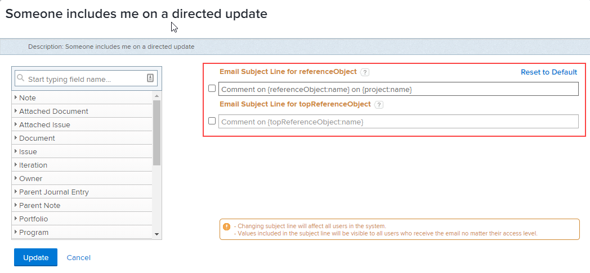

# 自定义事件通知的电子邮件主题

您可以自定义由事件通知触发的电子邮件主题行：

更改主题行会影响系统中的所有用户，而不管收件人的访问级别如何。 用户会看到电子邮件主题中包含的所有对象和字段。

某些事件通知具有多个主题行，这意味着这些事件通知根据其功能可以具有多个电子邮件主题。

>[!IMPORTANT]
>
>对于主题行引用多个对象的情况，在删除默认字段时请务必谨慎。 以下是包含此类主题行的事件通知列表：
>
>* 有人将我列入定向更新
>* 有人将我的团队列入定向更新
>* “工作项评论”到“主题参与者”
>* “工作项评论”到“工作项被分派人”
>

## 访问要求

您必须具有以下权限才能执行本文中的步骤：

<table style="table-layout:auto"> 
 <col> 
 </col> 
 <col> 
 </col> 
 <tbody> 
  <tr> 
   <td role="rowheader">Adobe Workfront计划*</td> 
   <td>任何</td> 
  </tr> 
  <tr> 
   <td role="rowheader">Adobe Workfront许可证*</td> 
   <td>计划</td> 
  </tr> 
  <tr> 
   <td role="rowheader">访问级别配置*</td> 
   <td> 
Planner或更高版本，具有提醒通知的管理访问权限
 
有关授予计划用户管理访问权限的信息，请参阅 <a href="../../../administration-and-setup/add-users/configure-and-grant-access/grant-users-admin-access-certain-areas.md" class="MCXref xref">授予用户对特定区域的管理访问权限</a>.
 </td> 
  </tr> 
 </tbody> 
</table>

&#42;要了解您拥有的计划、许可证类型或访问权限，请联系您的Workfront管理员。

## 自定义事件通知的电子邮件主题行 {#customize-email-subject-lines-for-event-notifications}

1. 单击 **主菜单** 图标  (在Adobe Workfront的右上角)，然后单击 **设置** .

1. 在左侧面板中，单击 **电子邮件** > **通知**.

1. 单击 **事件通知** 选项卡。
1. 单击要自定义的事件通知的名称以打开 **事件通知** 盒子。
1. 在 **电子邮件主题行** 框中，更改电子邮件主题中的文本和字段，包括自定义字段。

   添加的字段名称必须与我们数据库结构的驼峰式大小写语法匹配。 <!--For more information about how our objects and their fields are named in the Workfront database, see the [Adobe Workfront API](../../../wf-api/workfront-api.md).-->

1. 单击 **更新** 以保存您电子邮件中的新主题行。

## 自定义多对象电子邮件的电子邮件主题行

某些事件通知具有多个主题行，具体取决于它们触发的对象。

例如，“有人在定向更新中包含我”有两个不同的主题行：第一个主题行用于任务、问题、模板任务和文档（也称为“referenceObject”），第二个主题行用于允许用户进行注释的对象，如项目组合、项目群等（也称为“topReferenceObject”）。

如果某个用户包含在关于任务、问题、模板任务或文档的对话中，则会生成包含第一个主题行的电子邮件。 主题行包含“referenceObject：name”，系统定义对象并在主题字段显示适当的名称。 电子邮件主题行将类似于以下内容：“对项目ABC中的任务123的评论”。

如果添加到项目对话，将生成一封包含第二个主题的电子邮件。 在此处，主题行包含“topReferenceObject：name”，Workfront再次标识所引用的对象，并将返回该对象名称而不是主题中的“topReferenceObject：name”。 电子邮件主题行类似于：“对项目ABC的评论”。

要编辑电子邮件主题行并向任一主题行添加其他字段，请参阅 [自定义事件通知的电子邮件主题行](#customize-email-subject-lines-for-event-notifications) 本文章中。

## 自定义多操作电子邮件的电子邮件主题行

某些事件通知还具有多个电子邮件主题，可概述对对象执行的不同操作。

例如，请求将文档添加到问题是一个事件，该事件会触发两个不同的电子邮件：一个用于添加文档时，另一个用于编辑文档时。

要编辑电子邮件主题行并向任一主题行添加其他字段，请参阅 [自定义事件通知的电子邮件主题行](#customize-email-subject-lines-for-event-notifications) 本文章中。
