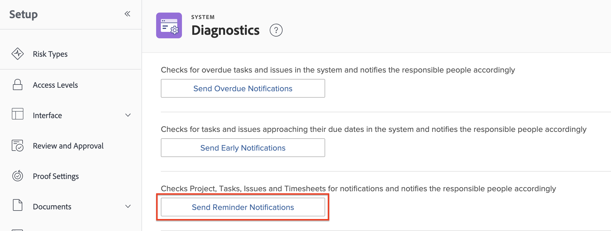

# 设置提醒通知

<!-- Audited: 1/2024 -->

提醒通知根据指定条件向收件人发送电子邮件。 您可以手动将提醒通知与工作项关联，如项目、任务、问题和时间表。

<!--
DRAFTED IN FLARE:
An example of how this can be used would be helpful here and/or in the section 
<a href="../../../workfront-basics/using-notifications/wf-notifications.md#reminder-notifications" class="MCXref xref">Reminder notifications</a>
 in 
<a href="../../../workfront-basics/using-notifications/wf-notifications.md" class="MCXref xref">Adobe Workfront notifications</a>

-->

## 访问要求

您必须具有以下权限才能执行本文中的步骤：

<table style="table-layout:auto"> 
 <col> 
 <col> 
 <tbody> 
  <tr> 
   <td role="rowheader">Adobe Workfront计划</td> 
   <td>任何</td> 
  </tr> 
  <tr> 
   <td role="rowheader">Adobe Workfront许可证</td> 
   <td> 
新增：标准 

 
或
 

当前：计划
 
</td> 
  </tr> 
  <tr> 
   <td role="rowheader">访问级别配置</td> 
   <td> 
Planner或更高版本，具有提醒通知的管理访问权限
</td> 
  </tr> 
 </tbody> 
</table>

有关此表中信息的更多详细信息，请参见 [Workfront文档中的访问要求](/help/quicksilver/administration-and-setup/add-users/access-levels-and-object-permissions/access-level-requirements-in-documentation.md).

## 自定义提醒电子邮件

您可以自定义提醒通知电子邮件中的主题、正文和HTML。

或者，您也可以使用提醒通知随附的默认电子邮件。 默认电子邮件使用提醒通知名称作为电子邮件主题，使用电子邮件正文中的对象名称，包括触发通知的事件。

如果要自定义提醒电子邮件，则需要创建电子邮件模板并将其附加到提醒通知。

有关如何创建电子邮件模板的信息，请参阅 [配置电子邮件模板](../../../administration-and-setup/manage-workfront/emails/configure-email-templates.md).

## 创建提醒通知

{{step-1-to-setup}}

1. 单击 **电子邮件** > **通知** > **提醒通知**.

   

1. 单击 **新建提醒通知**.

1. 在下拉列表中，单击要与提醒通知关联的对象类型。

   例如，如果要将提醒通知附加到时间表，请单击 **工时表**.

1. 在 **新建提醒通知** 框中，指定以下信息。

   <table style="table-layout:auto"> 
    <col> 
    <col> 
    <tbody> 
     <tr> 
      <td role="rowheader">提醒通知名称</td> 
      <td>指定提醒通知的名称。</td> 
     </tr> 
     <tr> 
      <td role="rowheader">资格期限</td> 
      <td> 
在中指定日期之前或之后的小时数、工作日数、天数（日历日）、周数或月数 <strong>计时</strong> 字段。
 
<b>注意</b>：  
        <ul> 
         <li> 
满足所有条件后，在指定日期的24小时后开始提醒通知。
 </li> 
         <li> 
项目、任务和问题的提醒通知在山地时间的每晚午夜触发。 当天起所有符合提醒通知条件的对象都会在该时间过后不久触发通知给指定用户。
 </li> 
         <li> 
在指定的时间（基于您的时区以及时间表的结束日期、开始日期或上次更新日期）发送时间表的提醒通知。
 </li> 
        </ul> 
 </td> 
     </tr> 
     <tr> 
      <td role="rowheader">计时</td> 
      <td> 
选择触发提醒通知进行安排的事件。
 
如果提醒通知适用于项目、任务或问题，则可用选项与完成日期或开始日期相关。 提醒通知会考虑项目、任务和问题的完成日期和开始日期上的时间戳。

   
如果提醒通知适用于时间表，则可用选项与结束日期、开始日期或上次更新日期相关。 时间表的提醒通知会考虑时间表结束、开始和上次更新日期的时间戳。 时间表从开始日期的午夜开始(12:00 AM)，并在结束日期的午夜之前结束(11:59 PM)。

   
<b>注释</b>

      
每24小时只分发一次时间表提醒通知。
 
当您在24小时内设置多个提醒通知时，Workfront会发送一封通知电子邮件，其中包含该通知中包含的所有提醒。

      
例如，如果将三个提醒通知配置为在到期日期前10小时、前2小时和前1小时触发，则如果这三个提醒均在同一天发生，它们将会合并到同一通知中。
 
但是，如果您设置的提醒通知在截止日期前26小时与另一个提醒通知在前1小时，则用户将收到两个单独的通知。 

   </td> 
     </tr> 
     <tr> 
      <td role="rowheader">标准</td> 
      <td> 
选择条件以限定要计划的提醒通知。 除非满足标准选择，否则不会计划提醒通知。
 
根据您在步骤4中选择的对象类型，可以使用以下标准选项：
 
       <ul> 
        <li><strong>当前项目中未完成的项目：</strong> <i>（可用于任务和问题提醒）</i> 仅当与提醒通知关联的对象状态不是“完成”并且项目状态是“当前”时，才会计划发送提醒通知。</li> 
        <li><strong>当前项目中的所有项目：</strong> <i>（可用于任务和问题提醒）</i> 提醒通知计划发送与对象状态无关，并且仅当与提醒通知关联的项目状态为“当前”时。</li> 
        <li><strong>未完成的项目：</strong> <i>（可用于项目提醒）</i> 提醒通知计划于项目状态不是“完成”时发送。</li> 
        <li><strong>所有项目：</strong> <i>（可用于项目提醒）</i> 无论项目状态如何，提醒通知都会按计划发送。</li> 
        <li><strong>未结工时表：</strong> <i>（可用于时间表提醒）</i> 提醒通知计划于时间表状态为“打开”时发送。</li> 
        <li><strong>已提交的工时表：</strong> <i>（可用于时间表提醒）</i> 提醒通知计划于时间表状态为“已提交”时发送。</li> 
        <li><strong>未结时间表或每周少于40小时：</strong> <i>（可用于时间表提醒）</i> 提醒通知计划于时间表状态为“打开”或时间表记录时间少于40小时时发送。</li> 
        <li><strong>电子邮件模板：</strong> 从下拉列表中，选择要附加到提醒的电子邮件模板。 有关如何构建电子邮件模板的信息，请参阅 <a href="../../../administration-and-setup/manage-workfront/emails/configure-email-templates.md" class="MCXref xref">配置电子邮件模板</a>.</li> 
       </ul> </td> 
     </tr> 
     <tr> 
      <td role="rowheader">收件人</td> 
      <td>选择要接收通知的用户类型。 从各种对象利益相关者中进行选择，例如所有者、批准者或任务接受者。</td> 
     </tr> 
    </tbody> 
   </table>

1. 单击&#x200B;**保存**。
1. 将提醒通知附加到工作项，如中所述 [将提醒通知附加到对象](../../../workfront-basics/using-notifications/attach-reminder-notification-object.md).

## 接收提醒通知

当附加了提醒通知的项目满足条件时，将向提醒通知中定义的用户触发电子邮件通知。

有关接收提醒通知的更多信息，请参见 [提醒通知](../../../workfront-basics/using-notifications/wf-notifications.md#reminder-notifications) 中的部分 [Adobe Workfront通知](../../../workfront-basics/using-notifications/wf-notifications.md).

## 测试提醒通知投放

提醒通知在山地时间每晚触发。 所有符合提醒通知条件的对象都会在收到提醒后不久触发通知给指定用户。

要手动触发提醒通知，必须首先满足提醒条件。\
例如，如果设置的提醒在项目的计划完成日期后一小时触发，则从设置提醒到现在，该时间必须已过。 任何在激活提醒前已超过计划完成日期的项目都不会触发通知。

手动触发提醒通知：

{{step-1-to-setup}}

1. 单击 **系统** > **诊断** 在Workfront的左下角。

1. 单击 **发送提醒通知** 然后等待屏幕顶部确认它们已发送。

   在提醒通知中指定的用户会收到一封电子邮件。

