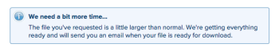

# 透過Kick-Starts從Adobe Workfront匯出資料

<!--

***DON'T DELETE, DRAFT OR HIDE THIS ARTICLE. IT IS LINKED TO THE PRODUCT, THROUGH THE CONTEXT SENSITIVE HELP LINKS. **

-->

身為Adobe Workfront管理員，您可以使用Kick-Starts資料匯出工具從Workfront匯出資料。 匯出後即可在其他應用程式中使用。

透過Kick-Starts匯出資料也有助於瞭解哪些欄位與每個物件相關聯、這些欄位的編碼方式，以及這些欄位的值在資料庫中的格式化。

## 存取需求

您必須具有下列存取權才能執行本文中的步驟：

<table style="table-layout:auto"> 
 <col> 
 <col> 
 <tbody> 
  <tr> 
   <td role="rowheader">Adobe Workfront計畫</td> 
   <td>任何</td> 
  </tr> 
  <tr> 
   <td role="rowheader">Adobe Workfront授權</td> 
   <td>计划</td> 
  </tr> 
  <tr> 
   <td role="rowheader">存取層級設定</td> 
   <td> 
您必須是Workfront管理員。
 
<b>注意</b>：如果您還是沒有存取權，請洽詢Workfront管理員，瞭解他們是否對您的存取層級設定其他限制。 如需有關Workfront管理員如何修改您的存取層級的資訊，請參閱 <a href="../../../administration-and-setup/add-users/configure-and-grant-access/create-modify-access-levels.md" class="MCXref xref">建立或修改自訂存取層級</a>.
 </td> 
  </tr> 
 </tbody> 
</table>

## 使用kick-start匯出資料的優缺點

在Workfront中匯出資料有兩種方式：

* 從報表或清單匯出資料

   如需從報表或清單匯出資料的詳細資訊，請參閱 [匯出資料](../../../reports-and-dashboards/reports/creating-and-managing-reports/export-data.md).

* 透過Kick-Start匯出資料

下表顯示每種方法的優缺點：

<table style="table-layout:auto"> 
 <col> 
 <col> 
 <col> 
 <thead> 
  <tr> 
   <th>  </th> 
   <th> 
匯出的資料包含物件和欄位值
 </th> 
   <th> 
可同時匯出多個物件型別周圍的資料
 </th> 
  </tr> 
 </thead> 
 <tbody> 
  <tr> 
   <td> 
<strong>從清單檢視匯出資料</strong> 
 
如需從清單匯出資料的詳細資訊，請參閱 <a href="../../../reports-and-dashboards/reports/creating-and-managing-reports/export-data.md" class="MCXref xref">匯出資料</a>
 </td> 
   <td> 
是
 
會匯出與物件相關聯的Workfront原生欄位和自訂欄位。
 </td> 
   <td> 
否
 </td> 
  </tr> 
  <tr> 
   <td> 
<strong>透過Kick-Start匯出資料</strong> 
 </td> 
   <td> 
是（受限）
 
大部分與物件相關聯的Workfront原生欄位都會匯出，但有些則不會。 例如，您無法透過專案快速啟動匯出來匯出排程、專案所有者或專案贊助者欄位。
 
在附加了自訂表單的專案中，在表單上的欄位中輸入的任何資料都不會匯出。
 
但您可以匯出自訂表單。 產生的檔案會列出表單中設定的欄位，例如文字方塊和選項按鈕。
 </td> 
   <td> 
是
 
使用Kick-Starts匯出Workfront資料可讓您在單一匯出中匯出與多個物件型別相關的資料。 例如，您可以在單一匯出中包含任務、問題和專案。
 </td> 
  </tr> 
 </tbody> 
</table>

## 匯出限制

透過Kick-starts匯出資料時，有下列限制（資料會以Excel檔案格式匯出）：

* **50,000列：** 檔案中允許的列數。
* **65,530個超連結：** 這是Excel對包含超過65,530個超連結的檔案所施加的限制。 這些檔案匯出後即無法開啟。 請注意，一個Excel檔案可能只有200列資料，但如果檔案中有超過65,530個連結，則檔案不會開啟。

## 透過Kick-Start匯出資料

1. 按一下 **主要功能表** 圖示  Adobe Workfront右上角，然後按一下 **設定** .

1. 按一下 **系統** > **Kick-Starts，** 然後按一下 **匯出資料。**

1. 選取要匯出的物件。
1. 按一下 **更多選項** 以檢視物件的完整清單。

   此處列出的所有物件也可用來將資料匯入Workfront。

   唯一的例外是 **存取層級** 物件。 匯出中包含的「存取層級」資料表僅供參考之用。 它可讓您依ID將存取層級指派給新的使用者帳戶。

   如需透過Kick-starts將資料匯入Workfront的詳細資訊，請參閱 [使用Kick-Start範本將資料匯入Adobe Workfront](../../../administration-and-setup/manage-workfront/using-kick-starts/import-data-via-kickstarts.md). 以下是可透過kick-start匯出的所有物件清單：

   <table style="table-layout:auto"> 
    <col> 
    <col> 
    <col> 
    <thead> 
     <tr> 
      <th> 
对象
 </th> 
      <th> 
Excel檔案的匯出工作表
 </th> 
      <th> 
匯出格式
 </th> 
     </tr> 
    </thead> 
    <tbody> 
     <tr> 
      <td scope="col" valign="top">访问级别</td> 
      <td scope="col" valign="top">存取層級 偏好設定</td> 
      <td scope="col" valign="top">Excel</td> 
     </tr> 
     <tr> 
      <td scope="col" valign="top">分配</td> 
      <td scope="col" valign="top">指定任務 偏好設定</td> 
      <td scope="col" valign="top">Excel</td> 
     </tr> 
     <tr> 
      <td scope="col" valign="top">公司</td> 
      <td scope="col" valign="top"> 公司 偏好設定 </td> 
      <td scope="col" valign="top">Excel</td> 
     </tr> 
     <tr> 
      <td scope="col" valign="top">电子邮件模板</td> 
      <td scope="col" valign="top"> 電子郵件範本 偏好設定 </td> 
      <td scope="col" valign="top">Excel</td> 
     </tr> 
     <tr> 
      <td scope="col" valign="top">费用</td> 
      <td valign="top"> 費用 偏好設定 </td> 
      <td scope="col" valign="top"> Excel</td> 
     </tr> 
     <tr> 
      <td valign="top">外部页面</td> 
      <td valign="top"> 外部頁面 偏好設定 </td> 
      <td scope="col" valign="top">Excel</td> 
     </tr> 
     <tr> 
      <td valign="top">筛选</td> 
      <td valign="top"> 篩選 偏好設定 </td> 
      <td valign="top">ZIP </td> 
     </tr> 
     <tr> 
      <td valign="top">组</td> 
      <td valign="top"> 群組 偏好設定  </td> 
      <td valign="top">Excel</td> 
     </tr> 
     <tr> 
      <td valign="top">分组</td> 
      <td valign="top"> 分組 偏好設定 </td> 
      <td valign="top">ZIP</td> 
     </tr> 
     <tr> 
      <td valign="top">小时</td> 
      <td valign="top"> 小時 偏好設定 </td> 
      <td valign="top">Excel</td> 
     </tr> 
     <tr> 
      <td valign="top">问题</td> 
      <td valign="top"> 問題 偏好設定 </td> 
      <td valign="top">Excel</td> 
     </tr> 
     <tr> 
      <td valign="top">工作角色</td> 
      <td valign="top"> 工作角色 偏好設定 </td> 
      <td valign="top">Excel</td> 
     </tr> 
     <tr> 
      <td valign="top">里程碑路径</td> 
      <td valign="top"> 里程碑 里程碑路徑 偏好設定 </td> 
      <td valign="top">Excel </td> 
     </tr> 
     <tr> 
      <td valign="top">注释</td> 
      <td valign="top"> 注意 偏好設定 </td> 
      <td valign="top">Excel</td> 
     </tr> 
     <tr> 
      <td valign="top">项目组合</td> 
      <td valign="top"> Portfolio 偏好設定  </td> 
      <td valign="top">Excel</td> 
     </tr> 
     <tr> 
      <td valign="top">项目</td> 
      <td valign="top"> 佇列 專案 路由規則 佇列主題 偏好設定 </td> 
      <td valign="top">Excel</td> 
     </tr> 
     <tr> 
      <td valign="top">资源评估</td> 
      <td valign="top"> 資源估計 偏好設定 </td> 
      <td valign="top">Excel</td> 
     </tr> 
     <tr> 
      <td valign="top">资源池</td> 
      <td valign="top"> 資源集區 偏好設定 </td> 
      <td valign="top">Excel</td> 
     </tr> 
     <tr> 
      <td valign="top">风险</td> 
      <td valign="top"> 風險 偏好設定  </td> 
      <td valign="top">Excel</td> 
     </tr> 
     <tr> 
      <td valign="top">风险类型</td> 
      <td valign="top"> 風險型別 偏好設定  </td> 
      <td valign="top">Excel </td> 
     </tr> 
     <tr> 
      <td valign="top">记分卡</td> 
      <td valign="top">計分卡問題 計分卡選項 計分卡 偏好設定 </td> 
      <td valign="top">Excel </td> 
     </tr> 
     <tr> 
      <td valign="top">任务</td> 
      <td valign="top"> 任務 偏好設定 </td> 
      <td valign="top">Excel </td> 
     </tr> 
     <tr> 
      <td valign="top">模板</td> 
      <td valign="top"> 佇列 範本 路由規則 佇列主題 偏好設定 </td> 
      <td valign="top">Excel  </td> 
     </tr> 
     <tr> 
      <td valign="top">模板分派</td> 
      <td valign="top"> 範本指派 偏好設定 </td> 
      <td valign="top">Excel </td> 
     </tr> 
     <tr> 
      <td valign="top">模板任务</td> 
      <td valign="top"> 範本任務 偏好設定 </td> 
      <td valign="top">Excel </td> 
     </tr> 
     <tr> 
      <td valign="top">时间表</td> 
      <td valign="top"> 週期性時程表 時間表 偏好設定 </td> 
      <td valign="top">Excel  </td> 
     </tr> 
     <tr> 
      <td valign="top"> 查看 </td> 
      <td valign="top"> 檢視 偏好設定  </td> 
      <td valign="top">ZIP</td> 
     </tr> 
    </tbody> 
   </table>

1. 按一下 **下載。**

   匯出的kick-start檔案會以Excel檔案或下載至您的電腦。 包含多個Excel和屬性檔案的zip檔案。 每個Excel檔案都是工作表的集合，其中每個工作表代表與所選物件相關聯的欄位。 有一個 **屬性** 與每次匯出相關聯的頁面。

   此 **儀表板** 和 **報告** 選項可讓您選取要包含在下載中的特定儀表板和報表。 您只能匯出在整個系統內共用的儀表板。

   您無法匯出矩陣報表。 如需矩陣報表的詳細資訊，請參閱 [建立矩陣報表](../../../reports-and-dashboards/reports/creating-and-managing-reports/create-matrix-report.md).

   在單一匯出中，您最多可以選取100個儀表板和100個報表。

   

   您可以一次匯出多個物件。

   依預設，下列物件會顯示在 **要包含的內容** 標籤（按一下之前） **更多選項**)：

   <table style="table-layout:auto"> 
    <col> 
    <col> 
    <col> 
    <thead> 
     <tr> 
      <th> 
<strong>对象</strong> 
 </th> 
      <th> 
<strong>Excel檔案的匯出工作表</strong> 
 </th> 
      <th> 
 <strong>匯出格式</strong>
 </th> 
     </tr> 
    </thead> 
    <tbody> 
     <tr> 
      <td scope="col" valign="top"> 
仪表板
 
 
 
 
 </td> 
      <td scope="col" valign="top"> 
引數 引數選項 引數群組 類別引數 類別 報告 入口網站頁簽區段 儀表板 偏好設定
 </td> 
      <td scope="col" valign="top"> ZIP</td> 
     </tr> 
     <tr> 
      <td scope="col" valign="top"> 
报告
 
 
 
 
 </td> 
      <td scope="col" valign="top">引數 引數選項 引數群組 類別引數 類別 報告 偏好設定</td> 
      <td scope="col" valign="top"> ZIP </td> 
     </tr> 
     <tr> 
      <td scope="col" valign="top"> 
审批
 </td> 
      <td scope="col" valign="top"> 
步驟核准者 核准步驟 核准 核准流程 偏好設定
 </td> 
      <td scope="col" valign="top"> 
 Excel
 </td> 
     </tr> 
     <tr> 
      <td scope="col" valign="top"> 
自定义数据
 </td> 
      <td scope="col" valign="top"> 
引數 引數選項 引數群組 類別引數 類別 偏好設定
 </td> 
      <td scope="col" valign="top"> 
 Excel
 </td> 
     </tr> 
     <tr> 
      <td scope="col" valign="top"> 
费用类型
 </td> 
      <td valign="top"> 
費用型別 偏好設定
 </td> 
      <td scope="col" valign="top"> 
Excel
 </td> 
     </tr> 
     <tr> 
      <td valign="top"> 
小时数类型
 </td> 
      <td valign="top"> 
小時型別 偏好設定
 </td> 
      <td scope="col" valign="top"> 
Excel
 </td> 
     </tr> 
     <tr> 
      <td valign="top"> 
团队
 </td> 
      <td valign="top"> 團隊成員 團隊 偏好設定 </td> 
      <td scope="col" valign="top"> 
 Excel
 </td> 
     </tr> 
     <tr> 
      <td valign="top"> 
用户
 </td> 
      <td valign="top"> 
使用者 偏好設定
 </td> 
      <td valign="top"> 
 Excel
 </td> 
     </tr> 
    </tbody> 
   </table>

   <table style="table-layout:auto"> 
    <col> 
    <col> 
    <col> 
    <thead> 
     <tr> 
      <th> 
<strong></strong> 
 </th> 
      <th> 
<strong>Excel檔案的匯出工作表</strong> 
 </th> 
      <th> 
 <strong>匯出格式</strong>
 </th> 
     </tr> 
    </thead> 
    <tbody> 
     <tr> 
      <td scope="col" valign="top"> 
仪表板
 
 
 
 
 </td> 
      <td scope="col" valign="top"> 
引數 引數選項 引數群組 類別引數 類別 報告 入口網站頁簽區段 儀表板 偏好設定
 </td> 
      <td scope="col" valign="top"> ZIP</td> 
     </tr> 
     <tr> 
      <td scope="col" valign="top"> 
报告
 
 
 
 
 </td> 
      <td scope="col" valign="top">引數 引數選項 引數群組 類別引數 類別 報告 偏好設定</td> 
      <td scope="col" valign="top"> ZIP </td> 
     </tr> 
     <tr> 
      <td scope="col" valign="top"> 
审批
 </td> 
      <td scope="col" valign="top"> 
步驟核准者 核准步驟 核准 核准流程 偏好設定
 </td> 
      <td scope="col" valign="top"> 
 Excel
 </td> 
     </tr> 
     <tr> 
      <td scope="col" valign="top"> 
自定义数据
 </td> 
      <td scope="col" valign="top"> 
引數 引數選項 引數群組 類別引數 類別 偏好設定
 </td> 
      <td scope="col" valign="top"> 
 Excel
 </td> 
     </tr> 
     <tr> 
      <td scope="col" valign="top"> 
费用类型
 </td> 
      <td valign="top"> 
費用型別 偏好設定
 </td> 
      <td scope="col" valign="top"> 
Excel
 </td> 
     </tr> 
     <tr> 
      <td valign="top"> 
小时数类型
 </td> 
      <td valign="top"> 
小時型別 偏好設定
 </td> 
      <td scope="col" valign="top"> 
Excel
 </td> 
     </tr> 
     <tr> 
      <td valign="top"> 
团队
 </td> 
      <td valign="top"> 團隊成員 團隊 偏好設定 </td> 
      <td scope="col" valign="top"> 
 Excel
 </td> 
     </tr> 
     <tr> 
      <td valign="top"> 
用户
 </td> 
      <td valign="top"> 
使用者 偏好設定
 </td> 
      <td valign="top"> 
Excel
 </td> 
     </tr> 
    </tbody> 
   </table>

1. （建議）分析匯出的資料，以確保已匯出您預期看到的所有資訊。

   對於大型匯出，Workfront會在背景工作以產生Excel檔案，並會向您提供有關延遲的警告訊息。 下載完成後，系統會將kick-start檔案透過電子郵件傳送給您。

   
