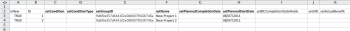

# 使用“启动”模板将数据导入Adobe Workfront

Kick-Starts是特殊格式的Excel工作簿，您可以使用要导入到Workfront中的数据填充这些工作簿。 Adobe Workfront提供了一个可用于执行此操作的启动模板，如 [启动数据导入程序](../../../administration-and-setup/manage-workfront/using-kick-starts/kick-starts-data-importer.md).

此过程分为3项主要任务：

* 首先，将“启动”模板导出为电子表格文件
* 然后，您使用数据填充电子表格
* 最后，您将填充的电子表格导入Workfront

本条按适当顺序概述了这些程序。

## 访问要求

您必须具有以下访问权限才能执行本文中的步骤：

<table style="table-layout:auto"> 
 <col> 
 <col> 
 <tbody> 
  <tr> 
   <td role="rowheader">Adobe Workfront计划</td> 
   <td>任意</td> 
  </tr> 
  <tr> 
   <td role="rowheader">Adobe Workfront许可证</td> 
   <td>计划</td> 
  </tr> 
  <tr> 
   <td role="rowheader">访问级别配置</td> 
   <td> 
您必须是Workfront管理员。
 
<b>注意</b>:如果您仍然没有访问权限，请咨询Workfront管理员，他们是否在您的访问级别设置了其他限制。 有关Workfront管理员如何修改访问级别的信息，请参阅 <a href="../../../administration-and-setup/add-users/configure-and-grant-access/create-modify-access-levels.md" class="MCXref xref">创建或修改自定义访问级别</a>.
 </td> 
  </tr> 
 </tbody> 
</table>

## 限制

您可以使用“启动”模板将大量对象导入Workfront。 但是，请考虑以下限制：

* 以这种方式导入数据不会更新Workfront中已存在记录的信息
* 您只能导入新记录及其信息
* 每次导入不超过2,000条记录，以确保导入不会超时

## 将“启动”模板导出为电子表格文件

导出“启动”模板时，您会收到空白的Excel电子表格工作簿。 在本文的后续步骤中，您将使用您的信息填充工作簿，然后将其导入回Workfront。

要导出“启动”模板，请执行以下操作：

1. 单击 **主菜单** 图标  在Adobe Workfront的右上角，单击 **设置** .

1. 单击 **系统** > **导出数据（启动）**.

1. 单击 **更多选项**，然后选择要包含的信息类型。

   您选择的每个选项都表示导出电子表格中多个选项卡的集合。 例如，如果选择“报表”选项，则创建报表的所有必需对象都将包含在电子表格中（视图、过滤器、分组、报表）。

   您可以使用下面列出的所有对象类型将数据导入Workfront。 (唯一的例外是访问级别选项。 导出中的“访问级别”数据表供参考，它允许您按ID为新用户帐户分配访问级别。)

   每种对象类型的模板可以以下列文件格式导出，并包含以下工作表：

   <table style="table-layout:auto"> 
    <col> 
    <col> 
    <col> 
    <thead> 
     <tr> 
      <th> 
<strong>对象</strong> 
 </th> 
      <th> 
<strong>导出为</strong> 
 </th> 
      <th> 
<strong>导出的电子表格中的工作表</strong> 
 </th> 
     </tr> 
    </thead> 
    <tbody> 
     <tr> 
      <td scope="col"> 
仪表板
 
系统中的所有功能板都可导出。 您在一次导出中最多可以选择100个特定功能板。
 </td> 
      <td scope="col">导出为ZIP文件</td> 
      <td scope="col"> 
参数
 
参数选项
 
参数组
 
类别参数
 
类别
 
报告
 
门户选项卡部分
 
仪表板
 
首选项
 </td> 
     </tr> 
     <tr> 
      <td scope="col"> 
报告
 
系统中的所有报表都可导出。 在一次导出中，您最多可以选择100个特定报表。
 </td> 
      <td scope="col">导出为ZIP文件 </td> 
      <td scope="col"> 
参数
 
参数选项
 
参数组
 
类别参数
 
类别
 
报告
 
首选项
 </td> 
     </tr> 
     <tr> 
      <td scope="col"> 
审批
 </td> 
      <td scope="col"> 
导出为Excel文件
 </td> 
      <td scope="col"> 
步骤审批者
 
批准步骤
 
审批
 
批准流程
 
首选项
 </td> 
     </tr> 
     <tr> 
      <td scope="col"> 
自定义数据
 </td> 
      <td scope="col"> 
导出为Excel文件
 </td> 
      <td scope="col"> 
参数
 
参数选项
 
参数组
 
类别参数
 
类别
 
首选项
 </td> 
     </tr> 
     <tr> 
      <td scope="col"> 
费用类型
 </td> 
      <td scope="col"> 
导出为Excel文件
 </td> 
      <td> 
费用类型
 
首选项
 </td> 
     </tr> 
     <tr> 
      <td> 
小时数类型
 </td> 
      <td scope="col"> 
导出为Excel文件
 </td> 
      <td> 
小时数类型
 
首选项
 </td> 
     </tr> 
     <tr> 
      <td> 
团队
 </td> 
      <td scope="col"> 
导出为Excel文件
 </td> 
      <td> 
 团队成员
 
团队
 
首选项 
 </td> 
     </tr> 
     <tr> 
      <td> 
用户
 </td> 
      <td> 
导出为Excel文件。 要查看选项的完整列表，请单击 <strong>更多选项</strong>.
 </td> 
      <td> 
用户
 
首选项
 </td> 
     </tr> 
     <tr> 
      <td>访问级别</td> 
      <td>导出为Excel文件</td> 
      <td> 
访问级别
 
首选项
 </td> 
     </tr> 
     <tr> 
      <td>分配</td> 
      <td>导出为Excel文件</td> 
      <td> 
分配
 
首选项
 </td> 
     </tr> 
     <tr> 
      <td>公司</td> 
      <td>导出为Excel文件</td> 
      <td> 
 公司
 
首选项 
 </td> 
     </tr> 
     <tr> 
      <td>电子邮件模板</td> 
      <td>导出为Excel文件</td> 
      <td> 
电子邮件模板
 
首选项 
 </td> 
     </tr> 
     <tr> 
      <td>费用</td> 
      <td>导出为Excel文件</td> 
      <td> 
 费用'
 
首选项 
 </td> 
     </tr> 
     <tr> 
      <td>外部页面</td> 
      <td>导出为Excel文件</td> 
      <td> 
 外部页面
 
首选项 
 </td> 
     </tr> 
     <tr> 
      <td>筛选</td> 
      <td>导出为ZIP文件</td> 
      <td> 
 筛选
 
首选项 
 </td> 
     </tr> 
     <tr> 
      <td>组</td> 
      <td>导出为Excel文件</td> 
      <td> 
 组
 
首选项 
 </td> 
     </tr> 
     <tr> 
      <td>分组</td> 
      <td>导出为ZIP文件</td> 
      <td> 
 分组
 
首选项 
 </td> 
     </tr> 
     <tr> 
      <td>小时</td> 
      <td>导出为Excel文件</td> 
      <td> 
 小时
 
首选项 
 </td> 
     </tr> 
     <tr> 
      <td>问题</td> 
      <td>导出为Excel文件</td> 
      <td> 
 问题
 
首选项 
 </td> 
     </tr> 
     <tr> 
      <td>工作角色</td> 
      <td>导出为Excel文件</td> 
      <td> 
 作业角色
 
首选项 
 </td> 
     </tr> 
     <tr> 
      <td>里程碑路径</td> 
      <td> 导出为Excel文件</td> 
      <td> 
 里程碑
 
里程碑路径
 
首选项 
 </td> 
     </tr> 
     <tr> 
      <td>注释</td> 
      <td>导出为Excel文件</td> 
      <td> 
 注释
 
首选项 
 </td> 
     </tr> 
     <tr> 
      <td>项目组合</td> 
      <td>导出为Excel文件</td> 
      <td> 
 项目组合
 
首选项 
 </td> 
     </tr> 
     <tr> 
      <td>项目</td> 
      <td>导出为Excel文件</td> 
      <td> 
 队列
 
项目
 
路由规则
 
队列主题
 
首选项 
 </td> 
     </tr> 
     <tr> 
      <td>资源评估</td> 
      <td>导出为Excel文件</td> 
      <td> 
 资源评估
 
首选项 
 </td> 
     </tr> 
     <tr> 
      <td>资源池</td> 
      <td>导出为Excel文件</td> 
      <td> 
 资源池
 
首选项 
 </td> 
     </tr> 
     <tr> 
      <td>风险</td> 
      <td>导出为Excel文件</td> 
      <td> 
 风险
 
首选项 
 </td> 
     </tr> 
     <tr> 
      <td>风险类型</td> 
      <td> 导出为Excel文件</td> 
      <td> 
 风险类型
 
首选项
 </td> 
     </tr> 
     <tr> 
      <td>记分卡</td> 
      <td>导出为Excel文件</td> 
      <td> 
记分卡问题
 
计分卡选项
 
记分卡
 
首选项 
 </td> 
     </tr> 
     <tr> 
      <td>任务</td> 
      <td>导出为Excel文件</td> 
      <td> 
 任务
 
首选项 
 </td> 
     </tr> 
     <tr> 
      <td>模板</td> 
      <td> 导出为Excel文件</td> 
      <td> 
 队列
 
模板
 
路由规则
 
队列主题
 
首选项 
 </td> 
     </tr> 
     <tr> 
      <td>模板分派</td> 
      <td>导出为Excel文件</td> 
      <td> 
 模板分派
 
首选项 
 </td> 
     </tr> 
     <tr> 
      <td>模板任务</td> 
      <td>导出为Excel文件</td> 
      <td> 
 模板任务
 
首选项 
 </td> 
     </tr> 
     <tr> 
      <td>时间表</td> 
      <td> 导出为Excel文件</td> 
      <td> 
 时间表配置文件
 
时间表
 
首选项 
 </td> 
     </tr> 
     <tr> 
      <td>查看 </td> 
      <td> 
导出为ZIP文件
 </td> 
      <td> 
 查看
 
首选项 
 </td> 
     </tr> 
    </tbody> 
   </table>

1. 单击 **下载**.
1. 继续 [使用您的数据填充电子表格模板](#populate-the-spreadsheet-template-with-your-data) 来填充模板。

## 使用您的数据填充电子表格模板 {#populate-the-spreadsheet-template-with-your-data}

* [关于电子表格中包含的选项卡（数据表）](#about-the-tabs-data-sheets-included-in-the-spreadsheet)
* [导入记录](#import-a-record)
* [包含日期](#include-dates)
* [使用通配符](#use-wildcards)
* [ID的属性名称替换](#attribute-name-substitution-for-ids)

### 关于电子表格中包含的选项卡（数据表） {#about-the-tabs-data-sheets-included-in-the-spreadsheet}

>[!TIP]
>
>为了更好地了解在填充“Kick-Start”模板时，您需要如何格式化每列中的信息，请考虑通过在您尝试导入的对象上使用现有的Workfront数据导出Kick-Start来执行一项练习。 有关说明，请参阅 [通过Kick-Starts从Adobe Workfront导出数据](../../../administration-and-setup/manage-workfront/using-kick-starts/export-data-from-wf-via-kick-starts.md).

当您打开空白的“启动”模板时，会提供许多选项卡（数据表）。 它们取决于您选择下载的对象。 每个对象表示应用程序中的一个对象，如项目、任务、小时、功能板和用户：

打开其中一个选项卡时，第2行会显示每个对象的字段，这些字段可在导入过程中设置。 在列标题中，单词“set”后，字段的名称会像在数据库中一样显示。 这些字段用作列标题。

>[!IMPORTANT]
>
>要避免出现错误，请确保：
>
>* 请勿以任何方式删除或修改这些字段。 例如，不要更改其顺序或名称。
>* 用以粗体显示的列标题填充每个字段。 这些字段表示必填字段。
>
>  但是，如果必填字段包含在系统首选项中设置的默认值，则无需填充该值。
>
>  例如，在 **PROJ项目** 选项卡 **setCondition** 和 **setConditionType** 字段可以留空，但 **setGroupID** 和 **setName** 列不能。

### 导入记录  {#import-a-record}

工作表的每一行都对应一个唯一的对象。

1. 填写 **isNew** 列：

   * 如果要导入的对象是新对象，请键入 **TRUE** 导入行中的数据。
   * 如果对象已在Workfront中，请键入 **FALSE** 以忽略行。

1. 填写 **ID** 列中显示的内容（如下所示）：

   * 如果要导入的对象是新对象(并且您键入了&#x200B;**TRUE** 在 **isNew** 列)，为ID指定任意数字。 此数字在电子表格中必须唯一。

   * 如果要导入的对象已存在于Workfront系统中(并且您键入了&#x200B;**FALSE** 在 **isNew** 列)，则ID必须是Workfront中存在于该对象的字母数字GUID。

      **示例：** 对于项目， **setGroupID** 列必须满足以下条件之一：

      * Workfront实例中现有组的GUID
      * 在 **群组** 工作表（如果在导入期间创建新组）

         

1. 必填字段以及要在导入期间填充的任何其他字段的输入值。
1. （可选）要添加自定义数据，请执行以下操作：

   * 为要包含在导入过程中的每个自定义字段创建新列。
   * 为其相应自定义字段的每个新列命名，如下所示： **DE:[自定义字段的名称，显示在Workfront中]**.
   * 在列中 **setCategoryID**，键入此自定义字段所在的现有自定义表单的GUID。 导入自定义数据时，需要填写此字段。
   * 如果需要在自定义字段中添加多个数据值（如单选按钮、复选框或列表），请使用“首选项”选项卡中列出的垂直条自定义数据分隔符“|”来分隔这些值。

      **示例：** 在“DE:Departments”列下键入A|D，以在自定义表单中填充部门A和部门D。

### 包含日期  {#include-dates}

Workfront可以处理大多数日期格式。 但是，您必须确保电子表格中的日期列的格式为日期。 如果列的格式为常规、数字或文本，则导入会失败。

>[!TIP]
>
>大多数人认为最简单的格式是使用YYYY/MM/DD格式(例如：07/10/2022)。

Workfront还接受将时间值作为日期的一部分(例如：07/10/2022 01:30或07/10/2022 1:00)。

如果在日期中省略时间，Workfront会执行以下操作之一：

* 假定在半夜12点。 要查看预期的日期结果，系统时区必须与您的时区匹配。
* 如果它位于与计划关联的对象上，则时间将默认为计划允许的最早时间。

>[!NOTE]
>
>使用UNIX时间戳时，必须在值末尾额外包含三个零。
>
>例如，如果您的时间戳为7336899000，则您会在单元格中输入7336899000000。

### 使用通配符 {#use-wildcards}

在填充Kick-Start模板电子表格时，可以使用以下通配符：

<table style="table-layout:auto"> 
 <col> 
 <col> 
 <thead> 
  <tr> 
   <th> 
<strong>通配符</strong> 
 </th> 
   <th> 
<strong>行为</strong> 
 </th> 
  </tr> 
 </thead> 
 <tbody> 
  <tr> 
   <td> 
今天$
 </td> 
   <td> 
在 <strong>setDate</strong> 字段中，此通配符会将日期设置为导入“开始”之日的午夜。
 
您可以使用过滤器上带通配符的标准语法来修改通配符。
 
Example: </b>"><b>示例： </b>如果您希望某个项目在导入日期的星期一开始，而不考虑您实际执行导入的日期，则可以使用 <strong>$$TODAYbw</strong>. 这会将您项目的计划开始日期设置为星期日的凌晨12:00。 由于项目计划可能当时不允许工作，因此将于周一上午9点开始。
 </td> 
  </tr> 
  <tr> 
   <td> 
$NOW
 </td> 
   <td> 
在 <strong>setDate</strong> 字段，此通配符会根据您在“启动”导入期间创建记录的时间来设置日期。
 
您可以使用过滤器上带通配符的标准语法来修改通配符。
 
Example: </b>"><b>示例： </b>如果您希望项目在导入后3小时内开始，则可以使用 <strong>$$NOW+3小时</strong>.
 </td> 
  </tr> 
  <tr> 
   <td> 
$USER.ID
 </td> 
   <td> 
在 <strong>setAssignedToID</strong> 或其他基于用户ID的字段，此通配符可分配工作或将记录与执行导入的个人关联。
 </td> 
  </tr> 
  <tr> 
   <td> 
$$客户
 </td> 
   <td> 
此通配符专门用于Kick-Start用户导入。 创建Workfront帐户后，将创建具有系统管理员访问级别的用户。 在帐户中创建其他用户时，分配给默认管理员的用户名可用作前缀。
 
由于用户名在所有客户中必须是唯一的，因此当您有多个用户名非常常用的个人（如John Smith），他们可能具有用户名“jsmith”时，此功能非常有用。 通过在默认管理员用户名前预置用户名分配，您可以保证每个用户名都是唯一的(例如： <strong>$CUSTOMER.jsmith</strong>)。
 
提示：要确保用户名在系统范围内是唯一的，则更加优雅的方法是在 <strong>setUsername</strong> 字段。
 </td> 
  </tr> 
 </tbody> 
</table>

### ID的属性名称替换  {#attribute-name-substitution-for-ids}

尽管尽可能使用ID是最佳做法，但有时在设置 **setAttributeID** 值。 只需更改列标题，即可按名称引用值。

**示例:**

* **（项目导入）**

   导入项目时，请设置 **setGroupID** 通过 **群组** 工作表，记下相应的组ID，并将它们粘贴到正确的单元格(**setGroupID** 列) **PROJ项目** 。

   当仅与几个组和项目合作时，这是可行的，但如果您正在与其中的几个组和项目合作，则这并不现实。

   要对上述示例执行属性名称替换，请更改 **setGroupID** 列标题至 **#setGroupID GROUP****name**. 然后，您可以按名称引用每个项目的组。

   >[!NOTE]
   >
   >使用“属性名称替换”的选项仅限于对现有记录的引用。 不能对在同一导入中创建的对象使用名称替换。

* **（用户导入）**

   导入用户时，填写 **setRoleID** 从 **角色** 选项卡。

   某些角色ID用于帐户中已存在的记录，而其他ID则在导入期间创建。

   对于分配给现有角色的新用户记录，您可以使用名称替换。 对于分配给新导入角色的新用户记录，您无法。

   以下是如何在同一导入文件中使用这两种方法：

   * 在 **setRoleID** 列。
   * 命名新列 **#setRoleID角色名称**.
   * 对于现有记录的角色分配，请在 **#setRoleID角色名称** 列。

      对于新角色记录的角色分配，请在setRoleID的“角色”工作表中输入您分配的ID。

      

## 将电子表格数据导入Workfront

使用数据填充Excel模板后，可以将其数据上传到Workfront。

Kick-Start导入支持以下文件类型：

* 基于XML的Excel(&#42;.xlsx)
* 旧版Excel(&#42;.xls)
* 压缩(&#42;ZIP)xlsx或xls文件

   >[!NOTE]
   >
   >在导入引用报表、文档、头像的 Excel 电子表格或视图、过滤器或分组属性文件时，必须使用 ZIP 文件。使用压缩的导入文件时， &#42;ZIP文件必须与 &#42;.xlsx或 &#42;.xls文件，且所有内容必须位于同一文件结构级别（无文件夹）。

要将模板电子表格数据导入Workfront，请执行以下操作：

1. 单击 **主菜单** 图标  在Adobe Workfront的右上角，单击 **设置** .

1. 单击 **系统** >**导入数据（启动）**.

1. 在 **使用Kick-Start电子表格上传数据** ，单击 **选择文件**，然后浏览并选择填充的电子表格。

1. 单击 **上传。**

   如果Excel文件上传到Workfront需要超过5分钟，则应用程序会超时，并且无法上传文件。

   尝试在较小的对象批次中导入数据。

1. （视情况而定）如果您使用的是Workfront Fusion，则现在可以打开FLO或方案。
