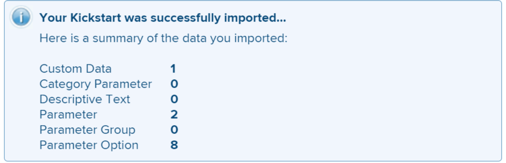

# Kick-Starts场景：将多个选项自定义字段导入Workfront

您可以使用Kick-Start功能在Adobe Workfront中导入具有多个选项的自定义字段。

带多个选项的自定义字段的示例包括：

* 多选下拉框
* 下拉
* 复选框
* 单选按钮

这些字段有时可能有许多（有时数百个）选项。 使用“快速启动”功能导入这些插件可为您节省作为Workfront管理员的大量时间，并确保避免出现错误。

>[!IMPORTANT]
>
>您必须按照以下各节中概述的步骤进行操作，以便使用kick-start导入具有多个选项的自定义字段：
>
>1. 从Workfront导出现有自定义数据（可选步骤）
>1. 导出自定义数据的快速启动模板
>1. 填充Excel Kick-Start电子表格
>1. 将Excel电子表格上传到Workfront

## 从Workfront导出现有自定义数据（可选步骤）

如果您不熟悉Workfront数据库结构，或者您不熟悉Workfront导入信息所需的快速启动文件，我们建议您首先从Workfront导出一个包含现有信息的快速启动文件，导出信息类似于您要导入的字段的信息。

例如，如果要导入自定义表单或自定义字段，则必须先导出一个包含现有自定义数据的快速启动文件。

首先导出现有数据可让您扫描该数据并查看新数据的格式需求。

如果您熟悉Workfront数据库对象和结构，则可以继续阅读以下部分。

要从Workfront导出现有数据，请执行以下操作：

{{step-1-to-setup}}

1. 展开左侧菜单中的&#x200B;**系统**，然后单击&#x200B;**导出数据(Kick-Starts)**。

   

1. 在&#x200B;**要包含的内容**&#x200B;部分中选择&#x200B;**自定义数据**。

   

1. 在&#x200B;**下载格式**&#x200B;部分中选择&#x200B;**.xlsx文件**。

   >[!TIP]
   >
   >    根据系统中有多少自定义数据，此操作可能需要较长时间。

   

1. 单击&#x200B;**下载**。 将.xlsx文件下载到您的计算机。 导航到并将其打开。

   

1. 检查下载的文件，并记下以下详细信息：

   * 文件包含几张工作表。 您可能不需要了解每个工作表中的信息，但您将使用某些工作表来导入信息。 请花一些时间熟悉其内容，尤其是每张纸中内容的格式。
   * 请特别注意列名以及每列数据显示的格式。
   * 不得更改任何页面中的列名或列顺序。 列标题指示每行中需要填写信息的字段。 如果列标题以粗体显示，则它是必填字段，因此该列中必须具有信息。

   >[!IMPORTANT]
   >
   >某些列标题可能未以粗体显示，但仍可能需要它们。

   * 保留下载的文件以供将来参考，并转到以下部分。

## 导出自定义数据的快速启动模板

在扫描系统中现有自定义字段的信息后，您可以下载新的快速启动模板用于导入。

{{step-1-to-setup}}

1. 在左侧菜单中展开&#x200B;**系统**。

1. 单击&#x200B;**导入数据(Kick-Starts)**。

   

1. 在&#x200B;**下载空白的快速启动电子表格**&#x200B;区域，选择&#x200B;**自定义数据**&#x200B;复选框，然后单击&#x200B;**下载**。

   

   将空白的快速启动文件下载到您的计算机。

   >[!NOTE]
   >
   >文件中的工作表数、工作表名称、以及每个工作表中的列数和列名应与上节中下载的kick-start中的相同，该节包含您现有的自定义数据。

## 填充Excel Kick-Start电子表格

在填充Excel电子表格之前，请下载快速启动模板，如上节所述。

>[!IMPORTANT]
>
>请勿尝试使用临时Excel电子表格导入信息。 所有用于使用快速启动功能将信息导入Workfront的电子表格都必须与您从Workfront下载的本文中所述文件的内容匹配。

要用新自定义字段的信息填充Excel电子表格，请执行以下操作：

1. 打开您在上一部分下载的Excel电子表格，并注意一些工作表。 每个工作表都表示应用程序中的一个对象。

   >[!INFO]
   >
   >例如，**Parameter**（引用自定义字段）、**Parameter Option**（引用自定义字段选项）、**Category**（引用自定义表单）。
   >
   >必须使用Workfront数据库支持的格式编写对象名称及其属性。
   >
   >有关这些对象含义的信息，请参阅 [!DNL Adobe Workfront] 术语](../../../workfront-basics/navigate-workfront/workfront-navigation/workfront-terminology-glossary.md)的[术语表。
   >
   >有关Workfront数据库中对象名称的信息，请参阅[API资源管理器](../../../wf-api/general/api-explorer.md)。
   >
   >

1. 确保以下信息的格式正确：

   * 每个页面的第一行必须保持为空，否则导入将生成错误。
   * 每个工作表中的列标题表示可在导入期间设置的对象的属性。 在导出工作表时，所有列标题必须保持与找到它们相同的顺序，并且不能重命名它们。
   * 以粗体显示的列标题是必填字段，它们必须具有值。

     >[!TIP]
     >
     >某些列虽然不是粗体的，但还是需要它们的。 例如，`isNew`和`ID`列不是粗体，但它们是必填字段。

1. 选择**0}工作表并在以下必填列中添加有关新自定义字段的信息：`**PARAM Parameter`

   * **`isNew`** =在此列中为每个代表新自定义字段的行输入&#x200B;**`TRUE`**。 这表示该字段是新字段，在Workfront中不存在。

     >[!TIP]
     >
     >    如果某行代表Workfront中已存在的字段，则应输入&#x200B;**`isNew`** = **`FALSE`**。

   * **`ID`** =对于表示新字段的每一行必须是唯一数字。 您可以使用以1开头的任意数字，但前提是每个新字段具有唯一数字。
   * **`setDataType`** =对于表示新字段的每一行，输入该字段支持的数据类型。 必须按数据库中显示的数据类型输入。 从以下数据类型中选择：
      * 数字&#x200B;**`NMBR`**
      * **`CURC`**&#x200B;货币
      * 文本的&#x200B;**`TEXT`**
   * `**setDisplaySize**`=任意多个选项自定义字段的显示大小(&#39;**setDisplaySize**&#39;)始终为0。
   * **`setDisplayType`** =对于表示新字段的每一行，输入该字段的显示类型。 必须按数据库中显示的形式输入显示类型。

     对于多选项自定义字段，请从以下选项中选择：

      * 多选下拉列表的&#x200B;**`MULT`**
      * 下拉列表的&#x200B;**`SLCT`**
      * 单选按钮的&#x200B;**`RDIO`**
      * 复选框的&#x200B;**`CHCK`**

     >[!TIP]
     >
     >要查找数据类型和显示类型信息，请参阅[API Explorer](../../../wf-api/general/api-explorer.md)，展开&#x200B;**Parameter**&#x200B;对象，然后在&#x200B;**字段**&#x200B;选项卡下查找这些属性。

   * **`setName`** =输入您希望在Workfront中显示的自定义字段的名称。

     >[!INFO]
     >
     >例如，我们可能会导入两个自定义字段，名为&#x200B;_Brand_（复选框字段）和&#x200B;_Media_（单选按钮字段）。

   * **`setName`**&#x200B;和&#x200B;**`setValue`**&#x200B;列通常包含相同的信息，它们应该反映新字段的Workfront界面中所需的名称。

   字段的值是报表中显示的名称，例如，而名称显示在附加到对象的自定义表单中。

   有关详细信息，请参阅[使用表单设计器设计表单](/help/quicksilver/administration-and-setup/customize-workfront/create-manage-custom-forms/form-designer/design-a-form/design-a-form.md)。

   

1. 选择&#x200B;**`POPT Parameter Options`**&#x200B;工作表并在以下必填列中添加有关每个自定义字段选项的信息：

   * **`isNew`** =在此列中为每个代表新字段选项的行输入&#x200B;**`TRUE`**。

     >[!TIP]
     >
     >    如果某行表示现有选项，则应当输入&#x200B;**`isNew`** = **`FALSE`**。

   * **`ID`** =表示新选项的每行必须是唯一数字。 您可以使用以1开头的任意数字，但前提是每个新选项具有唯一的数字。
   * **`setIsDefault`** =为每个字段输入要默认显示的选项的`TRUE`，并为所有其他选项输入`FALSE`。  例如，我们希望&#x200B;_Nike_&#x200B;是&#x200B;_Brand_&#x200B;的默认选项，而&#x200B;_Print_&#x200B;是&#x200B;_Media_&#x200B;的默认选项。

     >[!TIP]
     >
     >每个字段只能有一个默认选项。

   * **`setParameterID`** =与&#x200B;_品牌_&#x200B;自定义字段对应的选项的&#x200B;**`setParameterID`**&#x200B;为1，与&#x200B;_媒体_&#x200B;对应的选项的**`setParameterID`**为2。 `PARAM`和`POPT`工作表相互交叉引用，以指示哪些选项属于哪个自定义字段。
   * **`setDisplayOrder`**=显示顺序列指示选项在自定义字段中的显示顺序。 您可以从1开始并按升序继续所有选项，无论它们属于哪个字段。 这里的重要事项是为每个选项设置唯一的数字。
   * **`setLabel`**&#x200B;和**1}列通常包含相同的信息，它们应反映Workfront UI中所需的名称。 `**setValue`选项的值是报表中显示的名称，例如，而标签在附加到对象时显示在自定义表单中。 有关详细信息，请参阅[使用表单设计器设计表单](/help/quicksilver/administration-and-setup/customize-workfront/create-manage-custom-forms/form-designer/design-a-form/design-a-form.md)。
   * **`setIsHidden`** =如果您希望隐藏任何选项，请输入`TRUE`。

   

1. （可选）如果您还想创建一个自定义表单，以便稍后在其中添加新字段，请选择&#x200B;**`CTGY Category`**&#x200B;工作表并更新自定义表单信息的以下必填列：

   * **`isNew`** =在此列中为每个代表新自定义表单的行输入&#x200B;**`TRUE`**。
   * **`ID`** =为表示新表单的每一行输入一个唯一数字。 您可以使用以1开头的任意数字，但前提是每个新选项或行具有唯一的数字。
   * **`setGroupID`** =添加主组，或系统中您希望其成员访问此表单的任何其他组的组ID。 这是必填字段。

   要查找组的`ID`，您可以生成组报告并在视图中添加`ID`字段，或者导航到组并查找组的URL。 组ID将位于组页面的URL中。 例如，如果组的URL是`https://companyName.my.workfront.com/group/575b000800467a6f66e747932c807464/members`，则组ID是`575b000800467a6f66e747932c807464`。

   * **`setCatObjCode` **=这是您希望为其创建表单的对象类型的对象代码。 从以下选项输入代码：
      * 公司&#x200B;**`CMPY`**
      * 任务&#x200B;**`TASK`**
      * 项目&#x200B;**`PROJ`**
      * 用于Portfolio的&#x200B;**`PORT`**
      * 项目群&#x200B;**`PRGM`**
      * 用户&#x200B;**`USER`**
      * 文档&#x200B;**`DOCU`**
      * 问题&#x200B;**`OPTASK`**
      * 费用&#x200B;**`EXPNS`**
      * 迭代的&#x200B;**`ITRN`**
      * 用于开票记录的&#x200B;**`BILL`**
      * 组&#x200B;**`GROUP`**

     >[!NOTE]
     >
     >对于多对象表单，请输入在UI中创建表单时将选择的第一个对象。 例如，将`setCatObjCode`设置为`TASK`，如果您要在Workfront界面中选择“任务”，然后选择“问题”、“Portfolio”等，但不希望将表单用于“项目”。

   * **`setName`** =这是您希望在Workfront界面中显示的自定义表单的名称。

     

1. 将电子表格另存为.xls或.xlsx文件。 您的Excel电子表格已填写，现在可以导入到Workfront中。

## 将Excel电子表格上传到Workfront

执行前面部分中描述的步骤后，继续执行以下操作以将新字段和表单上传到Workfront：

{{step-1-to-setup}}

1. 单击&#x200B;**系统>导入数据(Kick-Starts)**。

1. 单击&#x200B;**使用Kick-Start电子表格上载数据**&#x200B;部分下的&#x200B;**选择文件**。

1. 在计算机上浏览您准备的Excel电子表格，并在找到时选择它。  当Workfront识别文件时，“上传”按钮将变为蓝色。
1. 单击&#x200B;**上传。**

   

1. 此时将显示已成功导入的通知。 根据您导入的信息量，此步骤可能需要几秒钟到一分钟的时间。

   

   新的自定义字段和表单现在包含在Workfront系统中。 您可以在“设置”的自定义Forms区域中找到它们。

   >[!NOTE]
   >
   >您导入的新表单和字段尚未连接。 表单导入时没有自定义字段。 您必须手动将字段添加到新自定义表单或其他现有自定义表单。

   有关向自定义表单添加字段的信息，请参阅[使用表单设计器设计表单](/help/quicksilver/administration-and-setup/customize-workfront/create-manage-custom-forms/form-designer/design-a-form/design-a-form.md)。

1. （视情况而定）如果导入失败，您将收到一条错误消息，说明问题所在。 尝试确定问题所在的字段、工作表和行号，并更正Excel文件中的信息，然后再次尝试导入文件。

   

1. （视情况而定）根据错误消息中所述问题的性质，某些信息可能已导入。 必须执行下列操作之一，才能再次导入工作表：

   * 从自定义Forms区域删除成功从Workfront导入的信息，然后进行错误消息所指示的更正。
   * 指示系统中已经存在字段或表单，用于已导入的字段或表单，然后进行更正。
要指示Workfront中已存在某个字段或自定义表单，您必须确保在包含有关表单(`CTGY`)或快速启动导入工作表中的字段(`PARAM`)的信息的工作表中将`inNew`字段标记为`FALSE`。
