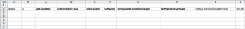

# “启动”方案：简单项目和任务导入准备

详细介绍使用“启动”方法导入基本项目和任务的可用设置和控件。

## 方案

实施小组宁可为活动项目导入项目和任务信息，也不愿手动将此数据输入系统。

* [项目](#projects)
* [任务列表](#task-list)

### 项目 {#projects}

下表显示了四个项目及其基本详细信息，需要映射为Kick Start文件格式。

此方案假定用户已导入Adobe Workfront。 如果用户不在Workfront中，请在此方案之前替换不同的名称或与用户完成“启动”方案。

1. 实施Workfront。

   | 计划开始日期 | 今天 |
   |---|---|
   | 项目经理 | 珍妮弗·坎贝尔 |
   | 项目赞助者 | 马克·刘易斯 |
   | 组 | 营销 |
   | 公司 | *YourCompany* |

   {style=&quot;table-layout:auto&quot;}

1. 实施人力资源系统。

   | 计划开始日期 | 20XX年7月14日 |
   |---|---|
   | 项目经理 | 帕姆·雷诺兹 |
   | 项目赞助者 | 马克·刘易斯 |
   | 组 | 营销 |
   | 公司 | *YourCompany* |

   {style=&quot;table-layout:auto&quot;}

1. 实施文档管理系统。

   | 计划开始日期 | 20XX年8月22日 |
   |---|---|
   | 项目经理 | 珍妮弗·坎贝尔 |
   | 项目赞助者 | 雷·安德鲁斯 |
   | 组 | IT |
   | 公司 | *YourCompany* |

   {style=&quot;table-layout:auto&quot;}

1. 实施新的日历系统。

   | 计划开始日期 | 20XX年9月6日 |
   |---|---|
   | 项目经理 | 帕姆·雷诺兹 |
   | 项目赞助者 | 雷·安德鲁斯 |
   | 组 | IT |
   | 公司 | *YourCompany* |

   {style=&quot;table-layout:auto&quot;}

### 任务列表 {#task-list}

下面的任务列表显示了项目过于简化的任务列表。 项目之间的唯一区别是每个项目的开始日期和进度。

父任务将继承子任务的“持续时间”、“工作”和“完成百分比”。 无需为其设置这些值，这些值将成为摘要任务。

>[!NOTE]
>
>此方案中提供的说明没有中提供的分步说明那样明确 [启动方案：公司、组、角色和用户启动准备](../../../administration-and-setup/manage-workfront/using-kick-starts/kick-starts-scenario-company-group-role-user-prep.md). 假设您已经学习了如何从公司和群组工作表中查找和复制值，因此将提及这些步骤，但并未具体说明。

1. 配置.
1. 导入用户。

   <table style="table-layout:auto"> 
    <col width="50%"> 
    <col width="50%"> 
    <tbody> 
     <tr> 
      <td role="rowheader">任务负责人</td> 
      <td>雷·安德鲁斯</td> 
     </tr> 
     <tr> 
      <td role="rowheader">父任务</td> 
      <td>1</td> 
     </tr> 
     <tr> 
      <td role="rowheader">持续时间</td> 
      <td>1 小时</td> 
     </tr> 
     <tr> 
      <td role="rowheader">工作</td> 
      <td>1 小时</td> 
     </tr> 
     <tr> 
      <td role="rowheader">完成百分比</td> 
      <td> 
Workfront:0%
 
HR:100%
 
文档：100%
 
日历：100%
 </td> 
     </tr> 
    </tbody> 
   </table>

1. 设置权限。

   <table style="table-layout:auto"> 
    <col width="50%"> 
    <col width="50%"> 
    <tbody> 
     <tr> 
      <td role="rowheader">任务负责人</td> 
      <td>雷·安德鲁斯</td> 
     </tr> 
     <tr> 
      <td role="rowheader">父任务</td> 
      <td>1</td> 
     </tr> 
     <tr> 
      <td role="rowheader">前置任务</td> 
      <td>2</td> 
     </tr> 
     <tr> 
      <td role="rowheader">持续时间</td> 
      <td>1 小时</td> 
     </tr> 
     <tr> 
      <td role="rowheader">工作</td> 
      <td>1 小时</td> 
     </tr> 
     <tr> 
      <td role="rowheader">完成百分比</td> 
      <td> 
Workfront:0%
 
HR:100%
 
文档：100%
 
日历：100%
 </td> 
     </tr> 
    </tbody> 
   </table>

1. 构建组。

   <table style="table-layout:auto"> 
    <col width="50%"> 
    <col width="50%"> 
    <tbody> 
     <tr> 
      <td role="rowheader">任务负责人</td> 
      <td>雷·安德鲁斯</td> 
     </tr> 
     <tr> 
      <td role="rowheader">父任务</td> 
      <td>1</td> 
     </tr> 
     <tr> 
      <td role="rowheader">前置任务</td> 
      <td>4</td> 
     </tr> 
     <tr> 
      <td role="rowheader">持续时间</td> 
      <td>2 天</td> 
     </tr> 
     <tr> 
      <td role="rowheader">工作</td> 
      <td>4 小时</td> 
     </tr> 
     <tr> 
      <td role="rowheader">完成百分比</td> 
      <td> 
Workfront:0%
 
HR:100%
 
文档：100%
 
日历：25%
 </td> 
     </tr> 
    </tbody> 
   </table>

1. 准备培训。

   <table style="table-layout:auto"> 
    <col width="50%"> 
    <col width="50%"> 
    <tbody> 
     <tr> 
      <td role="rowheader">任务负责人</td> 
      <td>克里斯·曼宁</td> 
     </tr> 
     <tr> 
      <td role="rowheader">持续时间</td> 
      <td>2 天</td> 
     </tr> 
     <tr> 
      <td role="rowheader">工作</td> 
      <td>4 小时</td> 
     </tr> 
     <tr> 
      <td role="rowheader">完成百分比</td> 
      <td> 
Workfront:0%
 
HR:100%
 
文档：50%
 
日历：100%
 </td> 
     </tr> 
    </tbody> 
   </table>

1. 构建持续的支持策略。

   <table style="table-layout:auto"> 
    <col width="50%"> 
    <col width="50%"> 
    <tbody> 
     <tr> 
      <td role="rowheader">任务负责人</td> 
      <td>克里斯·曼宁</td> 
     </tr> 
     <tr> 
      <td role="rowheader">持续时间</td> 
      <td>2 天</td> 
     </tr> 
     <tr> 
      <td role="rowheader">工作</td> 
      <td>4 小时</td> 
     </tr> 
     <tr> 
      <td role="rowheader">完成百分比</td> 
      <td> 
Workfront:0%
 
HR:100%
 
文档：50%
 
日历：0%
 </td> 
     </tr> 
    </tbody> 
   </table>

1. 滚出去。

   | 前置任务 | 1, 6, 7 |
   |---|---|

   {style=&quot;table-layout:auto&quot;}

1. 培训用户。

   <table style="table-layout:auto"> 
    <col width="50%"> 
    <col width="50%"> 
    <tbody> 
     <tr> 
      <td role="rowheader">任务负责人</td> 
      <td>克里斯·曼宁</td> 
     </tr> 
     <tr> 
      <td role="rowheader">父任务</td> 
      <td>8</td> 
     </tr> 
     <tr> 
      <td role="rowheader">持续时间</td> 
      <td>1 天</td> 
     </tr> 
     <tr> 
      <td role="rowheader">工作</td> 
      <td>2 小时</td> 
     </tr> 
     <tr> 
      <td role="rowheader">完成百分比</td> 
      <td> 
Workfront:0%
 
HR:0%
 
文档：0%
 
日历：0%
 </td> 
     </tr> 
    </tbody> 
   </table>

## 下载模板

转到“启动”页面。 选择公司、组、项目、任务和用户对象。 选中包括现有数据复选框（执行此操作可快速引用公司、组和用户ID）。 单击“Download（下载）”按钮。

## 输入项目详细信息

打开刚刚下载的Workfront.xlsx文件。 转到“PROJ项目”工作表。

\
除非您已在Workfront中创建项目，否则它应为空。\

>[!NOTE]
>
>考虑使用电子表格的“冻结窗格”工具和/或隐藏或移除不需要的列，使工作表更易于使用。 但是，请务必注意不要删除任何以后使用的必需列或列。

为以下项目字段设置值：

* **Set isNew列**
对于isNew列，在行3到行6中输入TRUE。
* **设置唯一ID**
在ID列的每行中输入一个唯一ID — 通常，从1开始的整数在创建新记录时很有效。
* **设置项目名称**
将每个项目的名称输入到setName列中。
* **设置项目计划**

   在setScheduleID字段中输入您希望项目使用的计划ID

* **设置项目计划起始日期**

   在setPlanedStartDate列中输入日期和时间，以及您希望项目开始的时间和日期。 如果留空，Workfront将根据浏览器的时区导入包含当天日期和当天午夜时间戳的项目。

* **设置任务编号**
将值输入setTaskNumber列，以控制任务在项目计划中的显示顺序。
* **提供项目日期。**
在setPlannedStartDate列中输入每个项目的计划开始日期。
* **设置其他需要的详细信息。**
根据需要填写其他详细信息，如描述或当前状态。 在“组组”工作表中查找每个项目的组ID，并将它们输入到相应项目的setGroupID列中。 在“CMPY公司”工作表上查找项目的公司ID，并将其输入到setCompanyID列中。 在“用户用户”工作表上查找每个项目所有者的用户ID，并将其输入到setOwnerID列中。 在“用户”用户表中查找每个项目赞助商的用户ID，并将其输入到setPonsorID列中。

>[!NOTE]
>
>通过在Workfront的“工作流设置”区域中查看每个对象的状态和优先级首选项，可以找到状态和优先级字段的可接受值。

## 输入任务详细信息

在使用启动项导入项目时，您可以添加有关项目中任务的信息。

打开刚刚下载的Workfront.xlsx文件。 **转到“任务”任务表。**

除非您已在Workfront中创建任务，否则此工作表应为空。

映射任务的最简单方法是一次映射一个项目（尤其是当每个项目的任务相同时）。 然后，您可以复制第一个项目的任务计划，并对后续项目的任务计划进行小幅调整。 其余步骤将假定您仅为实施Workfront项目创建任务。 根据此方案，您将为每个项目导入9个任务，因此在isNew列的第3行到第11行中输入TRUE。

为以下任务字段设置值：

* **设置ID**
在ID列的每行中输入一个唯一ID。
* **设置名称**
将任务名称输入到setName列中。
* **确认项目ID**
输入您为实施Workfront项目设置的ID;查看PROJ项目工作表，确保它是正确的ID。
* **设置用户**
转到“用户用户”工作表，查找分配给每个任务的用户的ID，并在setAssignedToID列的相应单元格中输入这些值。
* **确定任务关系**
对于任务2至5，在setParentID列中输入1。 对于任务9，在setParentID列中输入8。 在setPrepasyString列中，输入每个前置任务的任务编号。 如果某个任务具有多个前置任务（如此方案中的任务8），则需要使用逗号来分隔每个前置任务ID。 使用创建前置关系文章中描述的简写，可以在非完成开始关系上定义前置关系，并在其中添加滞后。
* **设置持续时间**
在setDuration字段中输入任务的小时、天、周或月数，以设置每个任务的持续时间。 然后，在setDurationUnit字段中输入持续时间单位。

   |  | 可接受值 |
   |---|---|
   | 分钟 | 一 |
   | 小时 | H |
   | 天数 | D |
   | 周 | 三 |
   | 月 | 二 |

   分钟数也可以表示为一小时的零头（例如，分钟= 5小时）

* 在setWorkRequired字段中设置每个任务的工作量。 然后，在setWorkUnit字段中输入工作单元。 如果“所需工作”值与持续时间不同，则还需要在setDurationType字段中输入A。

   | 持续时间类型 | 可接受值 |
   |---|---|
   | 计算的分配量 | A |
   | 计算的工作量 | 三 |
   | 投入比导向 | D |
   | 简单 | 日 |

* 在setPercentComplete字段中输入每个任务的完成百分比的整数表示形式。 此值不应包含百分比符号(%)。
* 根据需要，为要创建的每个任务包括说明和其他详细信息。

   

* setPlanedStartDate和setTaskConstraint列不用于构建此项目的时间轴，因为我们依赖于前置关系。 您可以为每个任务输入日期。 如果这样做，请确保在setTaskConstraint列中也提供有效的任务约束。 有关此字段有效值的详细信息，请查看任务约束和相关文章。

   在这种情况下，为要导入的其他项目构建任务的最简单方法是，从第12行开始，复制刚刚定义的任务并将其粘贴到下面。 然后，您将：

   1. 对ID列中的值重新编号。
   1. 将setProjectID列更新为您为下一个项目设置的值。
   1. 更新setParentID和setPrepisantString值，以反映分配给此项目任务的新ID。
   1. 更新任务分配和完成百分比。
   1. 对下一个项目的任务重复这些步骤。

* **导入Excel文件**

   按照 [使用“启动”模板将数据导入Adobe Workfront](../../../administration-and-setup/manage-workfront/using-kick-starts/import-data-via-kickstarts.md).
