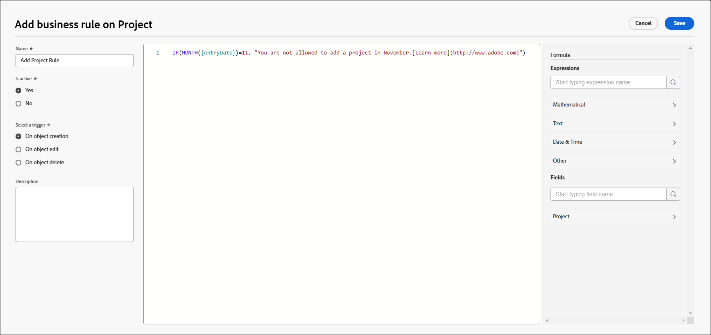

# 创建和编辑业务规则

业务规则允许您对Workfront对象应用验证，并阻止用户在满足某些条件时创建、编辑或删除对象。 业务规则通过防止可能会损害数据完整性的操作，帮助提高数据质量和运营效率。

单个业务规则只能分配给一个对象。 例如，如果创建业务规则以在某些条件下不编辑项目，则无法将相同的规则应用于任务。 您必须为任务创建具有相同条件的单独业务规则。

当用户与对象交互时，访问级别和对象共享具有比业务规则更高的优先级。 例如，如果用户具有不允许编辑项目的访问级别或权限，则这些权限将优先于允许在特定条件下编辑项目的业务规则。

当多个业务规则应用于对象时，规则全部遵循，但不会按特定顺序应用。 例如，您有两个业务规则。 其中一项限制在2月份创建费用。 第二个阻止在项目状态为完成时编辑项目。 如果用户尝试在6月将费用添加到已完成的项目，则无法添加该费用，因为它触发了第二个规则。

业务规则适用于通过API以及在Workfront界面中创建、编辑和删除对象。

>[!NOTE]
>
>由于业务规则会阻止某些操作，因此您应始终首先在沙盒或预览环境中配置业务规则，并在在生产环境中启用它们之前对其进行彻底测试。

## 访问要求

+++ 展开以查看本文中各项功能的访问要求。

您必须具有以下权限才能执行本文中的步骤：

<table style="table-layout:auto"> 
 <col> 
 <col> 
 <tbody> 
  <tr> 
   <td>Adobe Workfront计划</td> 
   <td>Ultimate</td> 
  </tr> 
  <tr> 
   <td>Adobe Workfront许可证</td> 
   <td>标准</td> 
  </tr> 
  <tr> 
   <td>访问级别配置</td> 
   <td>系统管理员</td> 
  </tr>  
 </tbody> 
</table>

有关此表中信息的更多详细信息，请参阅Workfront文档中的[访问要求](/help/quicksilver/administration-and-setup/add-users/access-levels-and-object-permissions/access-level-requirements-in-documentation.md)。

+++

## 业务规则方案

业务规则的格式为“如果满足定义的条件，则禁止用户对该对象执行操作，并显示消息。”

业务规则中属性和其他函数的语法与自定义表单中计算字段的语法相同。 有关语法的详细信息，请参阅[使用表单设计器添加计算字段](/help/quicksilver/administration-and-setup/customize-workfront/create-manage-custom-forms/form-designer/design-a-form/add-a-calculated-field.md)。

有关IF语句的信息，请参阅计算自定义字段中的[&quot;IF&quot;语句概述](/help/quicksilver/reports-and-dashboards/reports/calc-cstm-data-reports/if-statements-overview.md)和[条件运算符](/help/quicksilver/reports-and-dashboards/reports/calc-cstm-data-reports/condition-operators-calculated-custom-expressions.md)。

有关基于用户的通配符的信息，请参阅[使用基于用户的通配符来泛化报表](/help/quicksilver/reports-and-dashboards/reports/reporting-elements/use-user-based-wildcards-generalize-reports.md)。

有关基于日期的通配符的信息，请参阅[使用基于日期的通配符来泛化报表](/help/quicksilver/reports-and-dashboards/reports/reporting-elements/use-date-based-wildcards-generalize-reports.md)。

业务规则中还提供了API通配符。 使用`$$ISAPI`仅在API中触发规则。 使用`!$$ISAPI`仅在用户界面中强制实施规则，并允许用户通过API绕过规则。

* 例如，此规则禁止用户通过API编辑已完成的项目。 如果未使用通配符，则规则将同时阻止用户界面和API中的操作。

  ```
  IF({status} = "CPL" && $$ISAPI, "You cannot edit completed projects through the API.")
  ```

表达式中使用了`$$BEFORE_STATE`和`$$AFTER_STATE`通配符，以在任何编辑之前和之后访问对象的字段值。

* 这两个通配符均可用于编辑触发器。 编辑触发器的默认状态（如果表达式中未包含任何状态）为`$$AFTER_STATE`。
* 对象创建触发器仅允许`$$AFTER_STATE`，因为before状态不存在。
* 对象删除触发器仅允许`$$BEFORE_STATE`，因为after状态不存在。

一些简单的业务规则方案包括：

* 用户无法在2月的最后一周添加新费用。 该公式可表述为：

  ```
  IF(MONTH($$TODAY) = 2 && DAYOFMONTH($$TODAY) >= 22, "You cannot add new expenses during the last week of February.")
  ```

* 用户无法编辑处于完成状态的项目的项目名称。 该公式可表述为：

  ```
  IF({status} = "CPL" && {name} != $$BEFORE_STATE.{name}, "You cannot edit the project name.")
  ```

具有嵌套IF语句的情形是：

用户无法编辑已完成的项目，也无法编辑计划完成日期为3月的项目。 该公式可表述为：

```
IF(
    $$AFTER_STATE.{status}="CPL",
    "You cannot edit a completed project",
    IF(
        MONTH({plannedCompletionDate})=3,
        "You cannot edit a project with a planned completion date in March")
)
```

## 添加新业务规则

{{step-1-to-setup}}

1. 单击左侧面板中的&#x200B;**业务规则**。
1. 单击&#x200B;**新建业务规则**。
1. 选择要为其分配业务规则的对象类型，然后单击&#x200B;**继续**。

   

1. 键入业务规则的&#x200B;**名称**。
1. 在&#x200B;**处于活动状态**&#x200B;字段中，选择保存规则时该规则是否应处于活动状态。

   如果您选择&#x200B;**否**，则规则将保存为非活动，您可以稍后激活它。

1. 为业务规则选择&#x200B;**触发器**。 选项包括：

   * **创建对象时：**&#x200B;用户尝试创建对象时应用该规则。
   * **在对象编辑时：**&#x200B;当用户尝试编辑对象时，将应用规则。
   * **对象删除时：**&#x200B;用户尝试删除对象时应用该规则。

1. （可选）输入业务规则的&#x200B;**描述**&#x200B;以及应用时会发生什么情况。
1. 在业务规则对话框中心的公式编辑器中构建公式。

   业务规则的格式为“如果满足定义的条件，则禁止用户对该对象执行操作，并显示消息。”

   在公式区域中，您构建的业务规则的部分是条件，以及在满足条件时在Workfront中显示的消息。

   * “对象”是您在创建业务规则时选择的对象类型。 它显示在对话框的标题中。
   * “action”是您为规则选择的触发器：创建、编辑或删除对象。
   * 由于对象和操作已定义，因此不要将它们包含在公式中。
   * 当用户触发业务规则时，向用户显示自定义错误消息。 它应就出现什么问题以及如何纠正问题提供明确的说明。

     您可以在错误消息中包含静态URL，以链接到文档或其他有用页面，引导用户如何在规则的限制中修改其操作。

     在此示例中，“了解详情”将链接到URL。 `"You are not allowed to add a new project in November.[Learn more](http://url)"` URL必须位于括号中，但不需要使用括号中的链接文本。 您可以显示完整URL，它将是可单击的链接。

   

   此示例是项目的业务规则。 如果当前月份是11月，则不允许用户创建新项目，并且消息将对此进行说明。

   有关业务规则的更多示例，请参阅本文中的[业务规则的方案](#scenarios-for-business-rules)。

1. （可选）使用右侧面板中的公式&#x200B;**表达式**&#x200B;和&#x200B;**字段**&#x200B;帮助构建规则。

   搜索表达式或字段以缩小可用项列表。

   可用字段列表仅限于与业务规则对象类型相关的字段。

1. 完成业务规则构建后，单击&#x200B;**保存**。

>[!NOTE]
>
>添加业务规则后，应通过添加、编辑或删除关联对象对其进行测试，以确保正确应用该规则。

## 激活业务规则

当业务规则处于非活动状态时，业务规则列表中的活动字段显示为False。 您不能更新列表视图中规则的状态。

要激活业务规则，请执行以下操作：

1. 在规则列表中选择业务规则并单击编辑图标。
1. 在业务规则对话框中，为&#x200B;**处于活动状态**&#x200B;选择&#x200B;**是**。
1. 单击&#x200B;**保存**。
