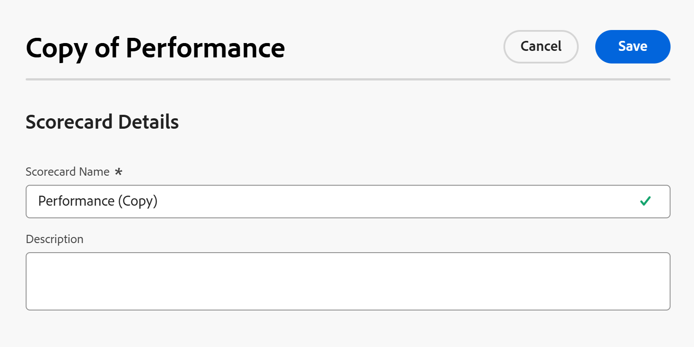

# 创建新的记分卡

<!--Audited: 05/2025-->

<!--DON'T DELETE, DRAFT OR HIDE THIS ARTICLE. IT IS LINKED TO THE PRODUCT, THROUGH THE CONTEXT SENSITIVE HELP LINKS.-->

<!--The highlighted information on this page refers to functionality not yet generally available. It is available only in the Preview environment for all customers. The same features will also be available in the Production environment for all customers after a week from the Preview release.    

For more information, see [Interface modernization](/help/quicksilver/product-announcements/product-releases/interface-modernization/interface-modernization.md). -->

记分卡衡量项目与项目组合中以前建立的标准的匹配程度。 记分卡通常反映了组织的使命、价值观和战略目标。

作为项目组合经理，您可以定义记分卡问题和答案，以确保它们在项目优先级和选择期间具有意义和价值。

作为[!DNL Adobe Workfront]管理员，您可以根据项目组合经理的建议创建记分卡。

为记分卡选择的问题和答案必须可量化，以便提供用于比较不同项目的对齐值。

您可以通过以下方式创建记分卡：

* 从头开始
* 通过复制现有的一个

## 访问要求

+++ 展开以查看本文中各项功能的访问要求。

<table style="table-layout:auto"> 
 <col> 
 <col> 
 <tbody> 
  <tr> 
   <td role="rowheader">[!DNL Adobe Workfront] 计划*</td> 
   <td> 
新增功能：Ultimate

   
当前： [！UICONTROL Business]或更高版本
 
   </td> 
  </tr> 
  <tr> 
   <td role="rowheader">[!DNL Adobe Workfront] 许可证*</td> 
   <td>
新文档： [！UICONTROL Standard]

   
当前： [！UICONTROL计划]

   </td> 
  </tr> 
   <tr> 
   <td role="rowheader">
访问级别
</td> 
   <td>
系统管理员

   </td> 
  </tr>
 </tbody> 
</table>

*有关信息，请参阅Workfront文档中的[访问要求](/help/quicksilver/administration-and-setup/add-users/access-levels-and-object-permissions/access-level-requirements-in-documentation.md)。

+++

## 从头开始创建记分卡

{{step-1-to-setup}}

1. 单击&#x200B;**[!UICONTROL 记分卡]**，然后单击&#x200B;**[!UICONTROL 新建记分卡]**。

   将打开&#x200B;**新记分卡**&#x200B;框。

   

1. 指定&#x200B;**[!UICONTROL 记分卡名称]**&#x200B;和&#x200B;**[!UICONTROL 描述]**。

   将记分卡与项目关联时，将显示名称。 描述显示在记分卡列表中的记分卡名称旁边。

1. 单击&#x200B;**[!UICONTROL 添加问题]**&#x200B;下拉菜单以打开[!UICONTROL 记分卡问题]部分，然后为问题指定以下信息：

   <table style="table-layout:auto"> 
    <col> 
    <col> 
    <tbody> 
     <tr> 
      <td role="rowheader">[！UICONTROL Question]</td> 
      <td>键入要包含在记分卡中的问题。</td> 
     </tr> 
     <tr> 
      <td role="rowheader">[！UICONTROL点]</td> 
      <td>键入此问题的最大分数。</td> 
     </tr> 
     <tr> 
      <td role="rowheader">[！UICONTROL负点]</td> 
      <td>选择此选项以指示[!DNL Workfront]应减去总可能分数。 无法将负分添加到记分卡的最大可能点数。</td> 
     </tr> 
     <tr> 
      <td role="rowheader">[！UICONTROL显示类型]</td> 
      <td>如果要显示记分卡中的数字字段，且用户可以指定介于0-100之间的任何值，请选择<strong>[！UICONTROL Value(0-100)]</strong>。
或者，选择<strong>[！UICONTROL下拉列表]</strong>或<strong>[！UICONTROL单选按钮]</strong>，以创建用户可以使用该控件指定的答案。 单击<strong>[！UICONTROL添加答案]</strong>，然后为该答案键入以百分比表示的<strong>[！UICONTROL值]</strong>（如果已完成）。 如果选择100%，则完全达到为该问题分配的点数。 如果要指明此答案仅包含分配给此问题的总点数的一部分，请选择一个较低的百分比值。 例如，如果问题的值是10点，而您希望此答案携带其中5点，则选择50%作为值。

      
如果要指定此答案为默认答案，请选择<strong>[！UICONTROL默认值]</strong>。</strong>

     </tr> 
    </tbody> 
   </table>

1. 单击&#x200B;**[!UICONTROL 添加问题]**，按照相同的步骤向记分卡添加更多问题和答案。

   >[!NOTE]
   >
   >您可以按照正确的顺序拖放问题，对记分卡中的问题重新排序。

1. 单击&#x200B;**[!UICONTROL 保存]**。

   这将创建记分卡，项目经理现在可以将其附加到他们的项目业务案例。

## 复制现有记分卡

您可以通过复制和编辑现有记分卡来创建记分卡。

{{step-1-to-setup}}

1. 单击左侧面板中的&#x200B;**[!UICONTROL 记分卡]**。
1. 在列表中选择记分卡，然后单击记分卡列表顶部的&#x200B;**复制**&#x200B;图标。

   将打开&#x200B;**复制记分卡**&#x200B;框。

   

1. 指定以下信息：

   * **记分卡**：更新记分卡的名称。  默认情况下，名称会根据以下格式自动更新：

     `Original scorecard name (Copy)`
   * **描述**：键入有关记分卡的其他信息。
1. 单击&#x200B;**保存**。

   这会创建一个与原始记分卡具有相同信息的新记分卡。 项目经理现在可以将其附加到其项目业务案例中。

## 将记分卡应用到项目

对项目具有[!UICONTROL 管理]权限的用户可以在[!DNL Workfront]管理员创建记分卡后将记分卡应用到项目。

记分卡会作为为项目创建业务案例的一部分添加到项目中。 有关将记分卡添加到项目的详细信息，请参阅[将记分卡应用到项目并生成一致性分数](../../../manage-work/projects/define-a-business-case/apply-scorecard-to-project-to-generate-alignment-score.md)。

有关项目权限的详细信息，请参阅[在 [!DNL Adobe Workfront]](../../../workfront-basics/grant-and-request-access-to-objects/share-a-project.md)中共享项目。

