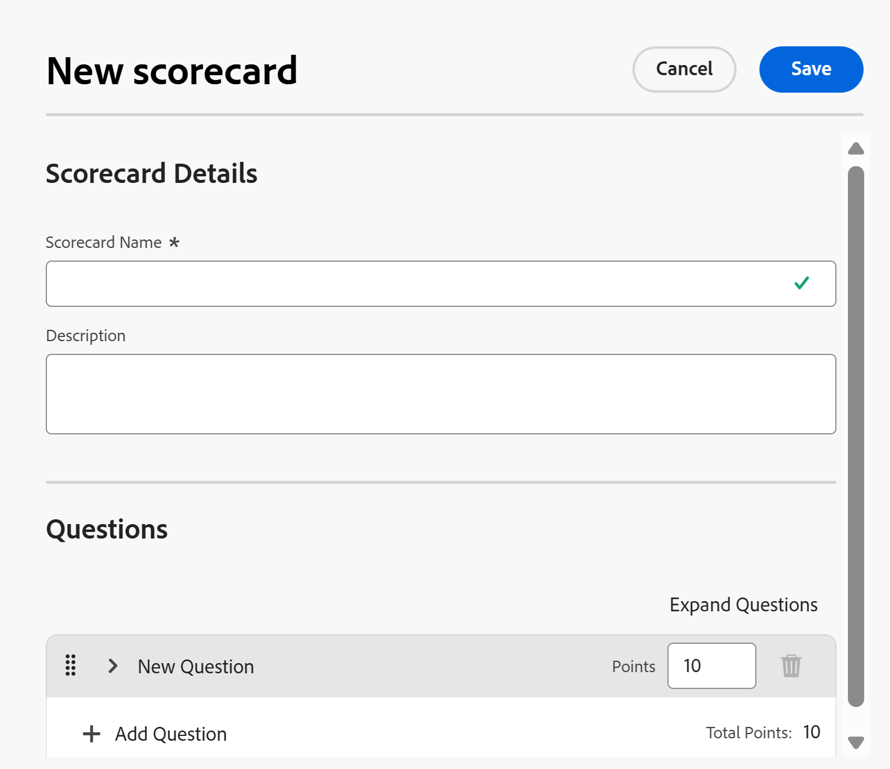
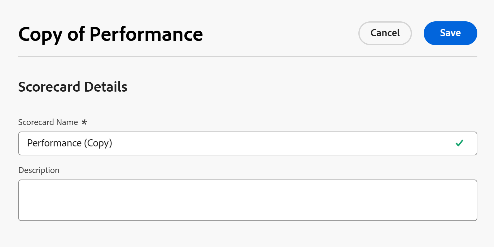

# 创建新的记分卡

<!--Audited: 11/2025-->

<!--DON'T DELETE, DRAFT OR HIDE THIS ARTICLE. IT IS LINKED TO THE PRODUCT, THROUGH THE CONTEXT SENSITIVE HELP LINKS.-->

此页面上高亮显示的信息引用了尚未公开的功能。 它仅在“预览”环境中对所有客户可用。 在发布到“预览”版之后，启用了“快速发布”的客户的生产环境中每月还会提供相同的功能。

有关快速发布的信息，请参阅[为您的组织启用或禁用快速发布](/help/quicksilver/administration-and-setup/set-up-workfront/configure-system-defaults/enable-fast-release-process.md)。

记分卡衡量项目与项目组合中以前建立的标准的匹配程度。 记分卡通常反映了组织的使命、价值观和战略目标。

作为项目组合经理，您可以定义记分卡问题和答案，以确保它们在项目优先级和选择期间具有意义和价值。

作为[!DNL Adobe Workfront]管理员，您可以根据项目组合经理的建议创建记分卡。

为记分卡选择的问题和答案必须可量化，以便提供用于比较不同项目的对齐值。

您可以通过以下方式创建记分卡：

* 从头开始
* 通过复制现有的一个

## 访问权限要求

+++ 展开可查看本文所述功能的访问权限要求。

<table style="table-layout:auto"> 
 <col> 
 <col> 
 <tbody> 
  <tr> 
   <td role="rowheader">Workfront包</td> 
   <td>
Workfront或工作流Prime或更高版本
</td> 
  </tr> 
  <tr> 
   <td role="rowheader">Adobe Workfront许可证</td> 
   <td>
标准
 
规划
</td> 
  </tr> 
  <tr> 
   <td role="rowheader">访问级别配置</td> 
   <td>您必须是Workfront管理员。 </td> 
  </tr> 
 </tbody> 
</table>

有关信息，请参阅Workfront文档中的[访问要求](/help/quicksilver/administration-and-setup/add-users/access-levels-and-object-permissions/access-level-requirements-in-documentation.md)。

+++

## 从头开始创建记分卡

{{step-1-to-setup}}

1. 单击&#x200B;**[!UICONTROL 记分卡]**，然后单击&#x200B;**[!UICONTROL 新建记分卡]**。

   将打开&#x200B;**新记分卡**&#x200B;框。

   

1. 指定&#x200B;**[!UICONTROL 记分卡名称]**&#x200B;和&#x200B;**[!UICONTROL 描述]**。

   将记分卡与项目关联时，将显示名称。 描述显示在记分卡列表中的记分卡名称旁边。

1. 单击&#x200B;**[!UICONTROL 添加问题]**&#x200B;下拉菜单以打开[!UICONTROL 记分卡问题]部分，然后为问题指定以下信息：

   <table style="table-layout:auto"> 
    <col> 
    <col> 
    <tbody> 
     <tr> 
      <td role="rowheader">[!UICONTROL Question]</td> 
      <td>键入要包含在记分卡中的问题。</td> 
     </tr> 
     <tr> 
      <td role="rowheader">[!UICONTROL 点]</td> 
      <td>键入此问题的最大分数。</td> 
     </tr> 
     <tr> 
      <td role="rowheader">[!UICONTROL 负点]</td> 
      <td>选择此选项以指示[!DNL Workfront]应减去总可能分数。 无法将负分添加到记分卡的最大可能点数。</td> 
     </tr> 
     <tr> 
      <td role="rowheader">[!UICONTROL 显示类型]</td> 
      <td>如果要显示记分卡中的数字字段，且用户可以指定介于0-100之间的任何值，请选择<strong>[!UICONTROL Value(0-100)]</strong>。
或者，选择<strong>[!UICONTROL 下拉列表]</strong>或<strong>[!UICONTROL 单选按钮]</strong>，以创建用户可以使用该控件指定的答案。 单击<strong>[!UICONTROL 添加答案]</strong>，然后为该答案键入以百分比表示的<strong>[!UICONTROL 值]</strong>（如果已完成）。 如果选择100%，则完全达到为该问题分配的点数。 如果要指明此答案仅包含分配给此问题的总点数的一部分，请选择一个较低的百分比值。 例如，如果问题的值是10点，而您希望此答案携带其中5点，则选择50%作为值。

      
如果要指定此答案为默认答案，请选择<strong>[!UICONTROL 默认值]</strong>。</strong>

     </tr> 
    </tbody> 
   </table>

1. 单击&#x200B;**[!UICONTROL 添加问题]**，按照相同的步骤向记分卡添加更多问题和答案。

   >[!NOTE]
   >
   >您可以按照正确的顺序拖放问题，对记分卡中的问题重新排序。

1. 单击&#x200B;**[!UICONTROL 保存]**。

   这将创建记分卡，项目经理现在可以将其附加到他们的项目业务案例。

1. （可选）要编辑记分卡，请在记分卡列表中选择记分卡，然后单击列表底部的&#x200B;**编辑** 。

1. （可选）要删除记分卡，请在记分卡列表中选择记分卡，然后单击列表底部的&#x200B;**删除** 。

## 复制现有记分卡

您可以通过复制和编辑现有记分卡来创建记分卡。

{{step-1-to-setup}}

1. 单击左侧面板中的&#x200B;**[!UICONTROL 记分卡]**。
1. 在列表中选择记分卡，然后单击记分卡列表顶部的&#x200B;**复制**&#x200B;或单击列表底部的&#x200B;**复制**。

   将打开&#x200B;**复制**&#x200B;记分卡框。

   

   >[!TIP]
   >
   >记分卡的名称将显示在框的标题中。

1. 指定以下信息：

   * **记分卡**：更新记分卡的名称。  默认情况下，名称会根据以下格式自动更新：

     `Original scorecard name (Copy)`
   * **描述**：键入有关记分卡的其他信息。
1. 单击&#x200B;**保存**。

   这会创建一个与原始记分卡具有相同信息的新记分卡。 项目经理现在可以将其附加到其项目业务案例中。

## 将记分卡应用到项目

对项目具有[!UICONTROL 管理]权限的用户可以在[!DNL Workfront]管理员创建记分卡后将记分卡应用到项目。

记分卡会作为为项目创建业务案例的一部分添加到项目中。 有关将记分卡添加到项目的详细信息，请参阅[将记分卡应用到项目并生成一致性分数](../../../manage-work/projects/define-a-business-case/apply-scorecard-to-project-to-generate-alignment-score.md)。

有关项目权限的详细信息，请参阅[在 [!DNL Adobe Workfront]](../../../workfront-basics/grant-and-request-access-to-objects/share-a-project.md)中共享项目。

